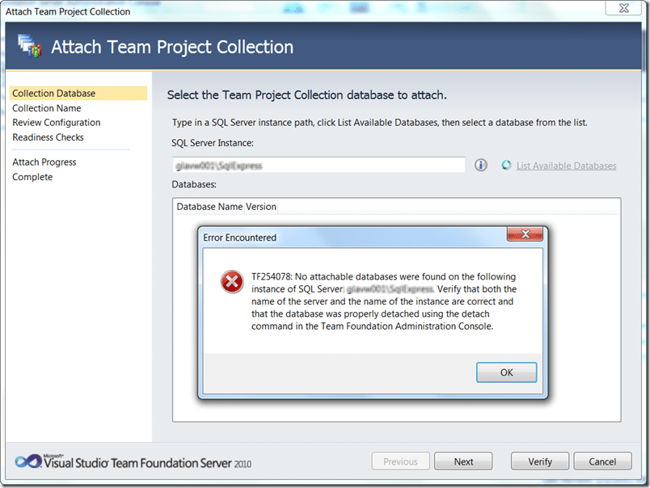
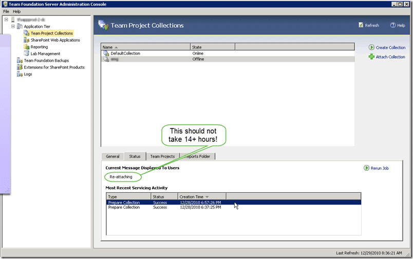
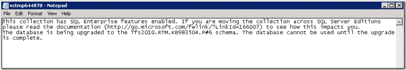
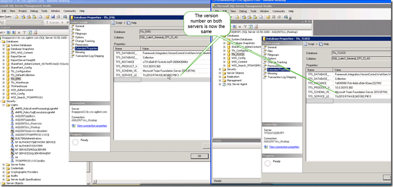

What do you do if you run a couple of hotfixes against your [TFS](http://msdn2.microsoft.com/en-us/teamsystem/aa718934.aspx "Team Foundation Server") 2010 server and you start to see seem odd behaviour?
{ .post-img }

A customer of mine encountered that very problem, but they could not just, or at least not easily, go back a version.

---

You see, around the time of the TFS 2010 launch this company decided to upgrade their entire 250+ development team from TFS 2008 to TFS 2010. They encountered a few problems, owing mainly to the size of their TFS deployment, and the way they were using TFS. They were not doing anything wrong, but when you have the largest deployment of TFS outside of Microsoft you tend to run into problems that most people will never encounter. We are talking half a terabyte of source control in TFS with over 80 proxy servers. Its certainly the largest deployment I have ever heard of.

When they did their upgrade way back in April, they found two major flaws in the product that meant that they had to back out of the upgrade and wait for a couple of hotfixes.

- KB983504 – Hotfix
- KB983578 – Patch
- KB2401992 -Hotfix

In the time since they got the hotfixes they have run 6 successful trial migrations, but we are not talking minutes or hours here. When you have 400+ GB of data it takes time to copy it around. It takes time to do the upgrade and it takes time to do a backup.

Well, last week it was crunch time with their developers off for Christmas they had a window of opportunity to complete the upgrade.

Now these guys are good, but they wanted Northwest Cadence to be available “just in case”. They did not expect any problems as they already had 6 successful trial upgrades.

The problems surfaced around 20 hours in after the first set of hotfixes had been applied. The new Team Project Collection, the only thing of importance, had disappeared from the Team Foundation Server Administration console.

The collection would not reattach either. It would not even list the new collection as attachable!

  
{ .post-img }
**Figure: We know there is a database there, but it does not**

This was a dire situation as 20+ hours to repeat would leave the customer over time with 250+ developers sitting around doing nothing.

We tried everything, and then we stumbled upon the command of last resort.

> _TFSConfig Recover /ConfigurationDB:SQLServerInstanceName;TFS_ConfigurationDBName /CollectionDB:SQLServerinstanceName;"Collection Name"  
> \-[http://msdn.microsoft.com/en-us/library/ff407077.aspx](http://msdn.microsoft.com/en-us/library/ff407077.aspx)  
> _

**WARNING: Never run this command!**

Now this command does something a little nasty. It assumes that there really should not be anything wrong and sets about fixing it. It ignores any servicing levels in the Team Project Collection database and forcibly applies the latest version of the schema.

I am sure you can imagine the types of problems this may cause when the schema is updated leaving the data behind.

That said, as far as we could see this collection looked good, and we were even able to find and attach the team project collection to the Configuration database.

  
{ .post-img }
**Figure: After attaching the TPC it enters a servicing mode**

After reattaching the team project collection we found the message “Re-Attaching”. Well, fair enough that sounds like something that may need to happen, and after checking that there was disk IO we left it to it.

14+ hours later, it was still not done so the customer raised a priority support call with MSFT and an engineer helped them out.

  
{ .post-img }
**Figure: Everything looks good, it is just offline.**  
Tip: Did you know that these logs are not represented in the ~/Logs/\* folder until they are opened once?

The engineer dug around a bit and listened to our situation. He knew that we had run the dreaded “tfsconfig restore”, but was not phased.

  
{ .post-img }
**Figure: This message looks suspiciously like the wrong servicing version**

As it turns out, the servicing version was slightly out of sync with the schema.

<table border="0" cellspacing="0" cellpadding="2" width="400"><tbody><tr><td valign="top" width="100"><strong>KB</strong></td><td valign="top" width="100"><strong>Schema</strong></td><td valign="top" width="100"><strong>Successful</strong></td><td valign="top" width="100">&nbsp;</td></tr><tr><td valign="top" width="100">&nbsp;</td><td valign="top" width="100">&nbsp;</td><td valign="top" width="100">&nbsp;</td><td valign="top" width="100">&nbsp;</td></tr><tr><td valign="top" width="100">
<strong>KB983504</strong>
</td><td valign="top" width="100">341</td><td valign="top" width="100">Yes</td><td valign="top" width="100">&nbsp;</td></tr><tr><td valign="top" width="100">
<strong>KB983578</strong>
</td><td valign="top" width="100">344</td><td valign="top" width="100">sort of</td><td valign="top" width="100">&nbsp;</td></tr><tr><td valign="top" width="100">
<strong>KB2401992</strong>
</td><td valign="top" width="100">360</td><td valign="top" width="100">nope</td><td valign="top" width="100">&nbsp;</td></tr></tbody></table>

**Figure: KB, Schema table with notation to its success**

The Schema version above represents the final end of run version for that hotfix or patch.

## The only way forward

The problem was that the version was somewhere between 341 and 344. This is not a nice place to be in and the engineer give us the  only way forward as the removal of the servicing number from the database so that the re-attach process would apply the latest schema. if his sounds a little like the “tfsconfig recover” command then you are exactly right.

  
{ .post-img }
**Figure: Sneakily changing that 3 to a 1 should do the trick**

  
{ .post-img }
**Figure: Changing the status and dropping the version should do it**

Now that we have done that we should be able to safely reattach and enable the Team Project Collection.

  
{ .post-img }
**Figure: The TPC is now all attached and running**

You may think that this is the end of the story, but it is not. After a while of mulling and seeking expert advice we came to the opinion that the database was, for want of a better term, “hosed”.

There could well be orphaned data in there and the likelihood that we would have problems later down the line is pretty high. We contacted the customer back and made them aware that in all likelihood the repaired database was more like a “[cut and shut](<http://en.wikipedia.org/wiki/Lemon_(automobile)>)” than anything else, and at the first sign of trouble later down the line was likely to split in two.

So with 40+ hours invested in getting this new database ready the customer threw it away and started again.

- What would you do?
- Would you take the “cut and shut” to production and hope for the best?
