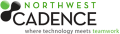

{ .post-img }

Northwest Cadence is looking for our next great consultant! At Northwest Cadence, we have created a work environment that emphasizes excellence, integrity, and out-of-the-box thinking.  Our customers have high expectations (rightfully so) and we wouldn’t have it any other way!

---

Northwest Cadence has some of the most exciting customers I have ever worked with and even though I have only been here just over a month I have already:

- Provided training/consulting for 3 government departments
- Created and taught courseware for delivering Scrum to teams within a high profile multinational company
- Started presenting [Microsoft's ALM Engagement Program](http://blog.hinshelwood.com/archive/2011/01/04/free-training-at-northwest-cadence.aspx)

So if you are interested in helping companies build better software more efficiently, then..

[![We-Need-You1-324x500[1]](images/Do-you-want-to-be-an-ALM-Consultant_A55E-We-Need-You1-324x5001_thumb1-2-2.jpg)](http://blog.hinshelwood.com/files/2011/05/GWB-Windows-Live-Writer-Do-you-want-to-be-an-ALM-Consultant_A55E-We-Need-You1-324x5001_2.jpg)
{ .post-img }

Enquire at [careers@nwcadence.com](mailto:careers@nwcadence.com)

### **Application Lifecycle Management (ALM) Consultant**

An ALM Consultant with a minimum of 8 years of relevant experience with Application Lifecycle Management, Visual Studio (including Visual Studio Team System) and software design is needed. Must provide thought leadership on best practices for enterprise architecture, understand the Microsoft technology solution stack, and have a thorough understanding of enterprise application integration. The ALM Practice Lead will play a central role in designing and implementing the overall ALM Practice strategy, including creating, updating, and delivering ALM courseware and consultancy engagements. This person will also provide project support, deliverables, and quality solutions on VSTS that exceed client expectations. Engagements will vary and will involve providing expert training, consulting, mentoring, formulating technical strategies and policies and acting as a “trusted advisor” to customers and internal teams. Sound sense of business and technical strategy required. Strong interpersonal skills as well as solid strategic thinking are key.

The ideal candidate will be capable of envisioning the solution based on the early client requirements, communicating the vision to both technical and business stakeholders, leading teams through implementation, as well as training, mentoring, and hands-on software development. The ideal candidate will demonstrate successful use of both agile and formal software development methods, enterprise application patterns, and effective leadership on prior projects.

#### **_Job Requirements_**

_Minimum Education_: Bachelor’s Degree (computer science, engineering, or math preferred).

_Locale / Travel:_ The Practice Lead position requires estimated 50% travel, most of which will be in the Continental US (a valid national Passport must be maintained).  This is a full time position and will be based in the Kirkland office.

_Preferred Education_: Master’s Degree in Information Technology or Software Engineering; Premium Microsoft Certifications on .NET (MCSD) or MCPD or relevant experience; Microsoft Certified Trainer (MCT) or relevant experience.

_Minimum Experience and Skills_: 7+ years experience with business information systems integration or custom business application design and development in a professional technology consulting, corporate MIS or software development environment.

_Essential Duties & Responsibilities_: Provide training, consulting, and mentoring to organizations on topics that include Visual Studio Team Foundation Server and ALM. Create content, including labs and demonstrations, to be delivered as training classes by Northwest Cadence employees. Lead development teams through the complete ALM and/or Visual Studio solution. Be able to communicate in detail how a solution will integrate into the larger technical problem space for large, complex enterprises. Define technical solution requirements. Provide guidance to the customer and project team with respect to technical feasibility, complexity, and level of effort required to deliver a custom solution. Ensure that the solution is designed, developed and deployed in accordance with the agreed upon development work plan. Create and deliver weekly status reports of training and/or consulting progress.

_Engagement Responsibilities:_

· Provide a strong desire to provide thought leadership related to technology and to help grow the business.

· Work effectively and professionally with employees at all levels of a customer’s organization.

· Have strong verbal and written communication skills.

· Have effective presentation, organizational and planning skills.

· Have effective interpersonal skills and ability to work in a team environment.

Enquire at [careers@nwcadence.com](mailto:careers@nwcadence.com)
