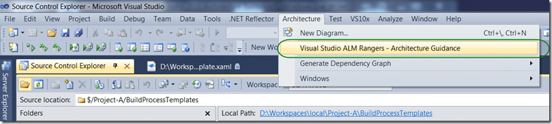

{ .post-img }

If you have not seen the Visual Studio 2010 Architectural Guidance from the Visual Studio ALM Rangers then you are missing out.

---

I have been spelunking the TFS Guidance recently and I discovered the Visual Studio 2010 Architectural Guidance. This is not an in-depth look at the capabilities of the architectural tools that shipped with Visual Studio 2010 Ultimate, but is instead a set of samples that lead you by example through real world scenarios. There is practical guidance and checklists to help guide lead developers and architects through the common challenges in understanding both existing and new applications. The content concentrates on practical guidance for Visual Studio 2010 Ultimate and is focused on modelling tools.

There is integration into Visual Studio so all you need to do to access it is select “**Architecture | Visual Studio ALM Rangers – Architecture Guidance**”.

  
{ .post-img }
**Figure: Accessing the Architecture guidance is easy**

This brings up an inline version of the documentation and a kind of Explorer that lets you pick the tasks you want to perform and takes you strait to that part of the Guidance.

  
{ .post-img }
**Figure: Access the Guidance from right within Visual Studio 2010**

This is a big help when you just want to figure out how to do something and can’t be bothered searching for and through the content in the provided Word documents. The Question and Answer section is full of useful content and there are six Hands-On-Labs to sink your teeth into:

- Creating extensions with the feature extension
- Explore an Existing System Scenario
- Extensibility Layer Diagrams
- New Solution Scenario
- Reusable Architecture Scenario
- Validation an Architecture Scenario

I’m sold! Where can i get my hands on this fantastic content?

Download the [Visual Studio 2010 Architecture Tooling Guidance](http://vsarchitectureguide.codeplex.com/) and if you like it don’t forget to [add a review](http://vsarchitectureguide.codeplex.com/releases/view/47828?RateReview=true) to make the team that put it together in their spare time feel all the mere loved.
