[](http://blog.hinshelwood.com/files/2011/05/GWB-Windows-Live-Writer-Deep-traceability-in-Team-Foundation-Ser_7737-vs2010AuditLogo_2.png)
{ .post-img }

One of the things that makes Team Foundation Server (TFS) the most powerful Application Lifecycle Management (ALM) platform is the traceability it provides to those that use it. This traceability is crucial to enable many companies to adhere to many of the Compliance regulations to which they are bound (e.g. [CFR 21 Part 11](http://en.wikipedia.org/wiki/Title_21_CFR_Part_11) or [Sarbanes–Oxley](http://en.wikipedia.org/wiki/Sarbanes%E2%80%93Oxley_Act).)

---

From something as simple as relating Tasks to Check-in’s or being able to see the top 10 files in your codebase that are causing the most Bugs, to identifying which Bugs and Requirements are in which Release. All that information is available and more in TFS.

Although all of this tradability is available within TFS you do need to understand that it is not for free. Well… I say that, but if you are using TFS properly you will have this information with no additional work except for firing up the reporting.

Using Visual Studio ALM and Team Foundation Server you can relate every line of code changes all the way up to requirements and back down through Test Cases to the Test Results.

[](http://blog.hinshelwood.com/files/2011/05/GWB-Windows-Live-Writer-Deep-traceability-in-Team-Foundation-Ser_7737-image_74.png)  
{ .post-img }
**Figure: The only thing missing is Build**

In order to build the relationship model below we need to examine how each of the relationships get there. Each member of your team from programmer to tester and Business Analyst to Business have their roll to play to knit this together.

[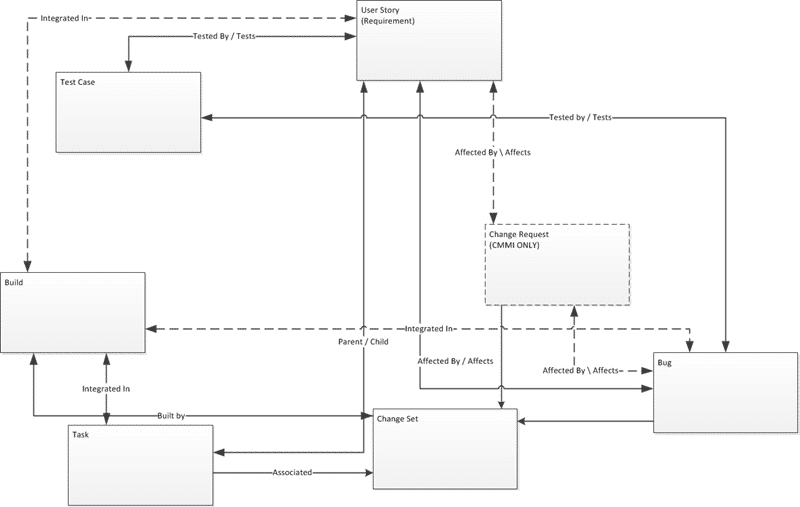](http://blog.hinshelwood.com/files/2011/05/GWB-Windows-Live-Writer-Deep-traceability-in-Team-Foundation-Ser_7737-image_96.png)  
{ .post-img }
**Figure: The relationships required to make this work can get a little confusing**

If Build is added to this to relate Work Items to Builds and with knowledge of which builds are in which environments you can easily identify what is contained within a Release.

[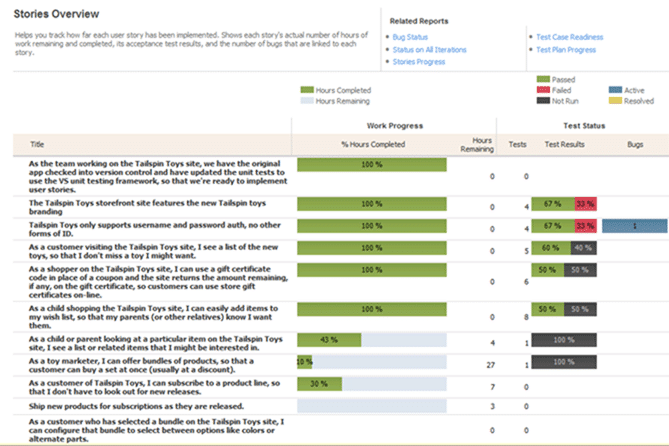](http://blog.hinshelwood.com/files/2011/05/GWB-Windows-Live-Writer-Deep-traceability-in-Team-Foundation-Ser_7737-image_88.png)  
{ .post-img }
**Figure: How are things progressing**

Along with the ability to produce the progress and trend reports the tractability that is built into TFS can be used to fulfil most audit requirements out of the box, and augmented to fulfil the rest.

In order to understand the relationships, lets look at each of the important Artifacts and how they are associated with each other…

### Requirements – The root of all knowledge

Requirements are the thing that the business cares about delivering. These could be derived as User Stories or Business Requirements Documents (BRD’s) but they should be what the Business asks for.

Requirements can be related to many of the Artifacts in TFS, so lets look at the model:

[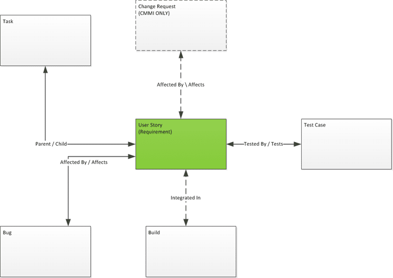](http://blog.hinshelwood.com/files/2011/05/GWB-Windows-Live-Writer-Deep-traceability-in-Team-Foundation-Ser_7737-image_4.png)  
{ .post-img }
**Figure: If the centre of the world was a requirement**

We can track which releases Requirements were scheduled in, but this can change over time as more details come to light.

[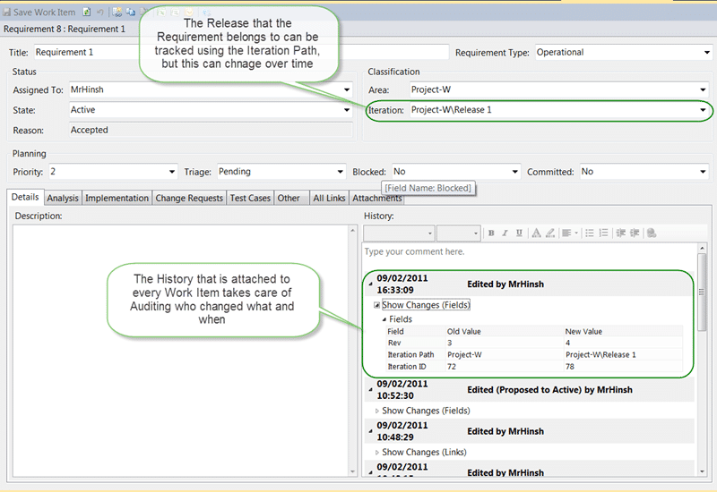](http://blog.hinshelwood.com/files/2011/05/GWB-Windows-Live-Writer-Deep-traceability-in-Team-Foundation-Ser_7737-image_28.png)  
{ .post-img }
**Figure: Who edited the Requirement and when**

There is also the ability to query Work Items based on the History of changed that were made to it. This is particularly important with Requirements. It might not be enough to say what Requirements were completed in a given but also to know which Requirements were ever assigned to a particular release.

[](http://blog.hinshelwood.com/files/2011/05/GWB-Windows-Live-Writer-Deep-traceability-in-Team-Foundation-Ser_7737-image_30.png)  
{ .post-img }
**Figure: Some magic required, but result still achieved**

As an augmentation to this it is also possible to run a query that shows results from the past, just as if we had a time machine. You can take any Query in the system and add a “Asof” clause at the end to query historical data in the operational store for TFS.

```
select  from WorkItems [where ] [order by ] [asof ]
```

**Figure: Work Item Query Language (WIQL) format**

In order to achieve this you do need to save the query as a \*.wiql file to your local computer and edit it in notepad, but one imported into TFS you run it any time you want.

[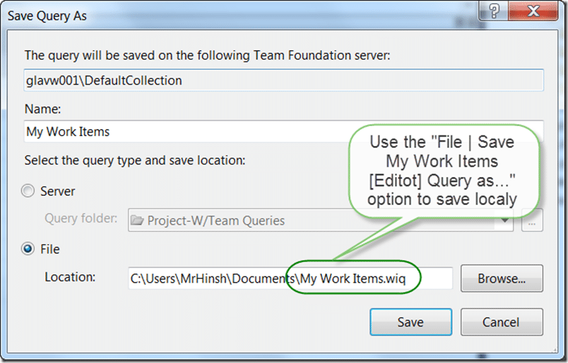](http://blog.hinshelwood.com/files/2011/05/GWB-Windows-Live-Writer-Deep-traceability-in-Team-Foundation-Ser_7737-SNAGHTML21c2556.png)
{ .post-img }

**Figure: Saving Queries locally can be useful**

All of these Audit features are available throughout the Work Item Tracking (WIT) system within TFS.

### Tasks – Where the real work gets done

Tasks are the work horse of the development team, but they only as useful as Excel if you do not relate them properly to other Artifacts.

[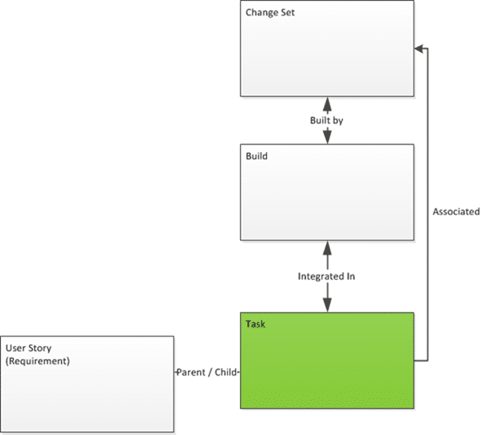](http://blog.hinshelwood.com/files/2011/05/GWB-Windows-Live-Writer-Deep-traceability-in-Team-Foundation-Ser_7737-image_98.png)
{ .post-img }

**Figure: The Task Work Item Type has its own relationships**

Requirements should be broken down into Tasks that the development team work from to build what is required by the business. This may be done by a small dedicated group or by everyone that will be working on the software team but however it happens all of the Tasks create should be a Child of a Requirement Work Item Type.

[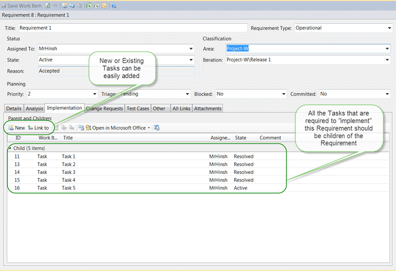](http://blog.hinshelwood.com/files/2011/05/GWB-Windows-Live-Writer-Deep-traceability-in-Team-Foundation-Ser_7737-image_26.png)
{ .post-img }

**Figure: Tasks are related to the Requirement**

Tasks should be used to track the day-to-day activities of the team working to complete the software and as such they should be kept simple and short lest developers think they are more trouble than they are worth.

[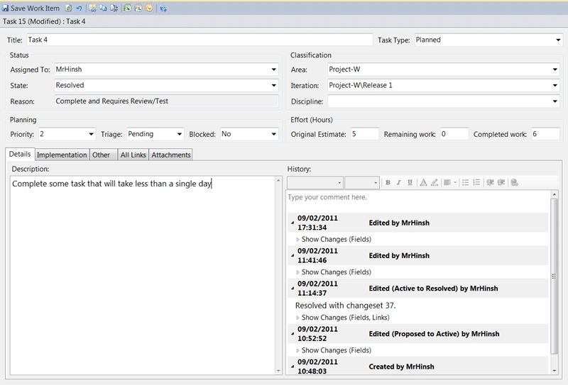](http://blog.hinshelwood.com/files/2011/05/GWB-Windows-Live-Writer-Deep-traceability-in-Team-Foundation-Ser_7737-image_46.png)
{ .post-img }

**Figure: Task Work Item Type has a narrower purpose**

Although the Task Work Item Type describes the work that will be done the actual development work involves making changes to files that are under Source Control. These changes are bundled together in a single atomic unit called a Changeset which is committed to TFS in a single operation. During this operation developers can associate Work Item with the Changeset.

[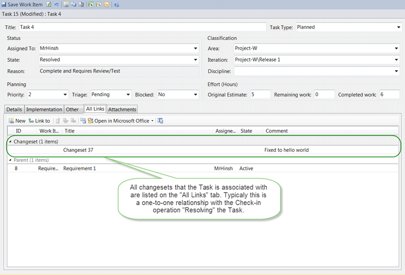](http://blog.hinshelwood.com/files/2011/05/GWB-Windows-Live-Writer-Deep-traceability-in-Team-Foundation-Ser_7737-image_48.png)
{ .post-img }

**Figure: Tasks are associated with Changesets**

### Changesets – Who wrote this crap

Changesets themselves are just an inventory of the changes that were made to a number of files to complete a Task.

[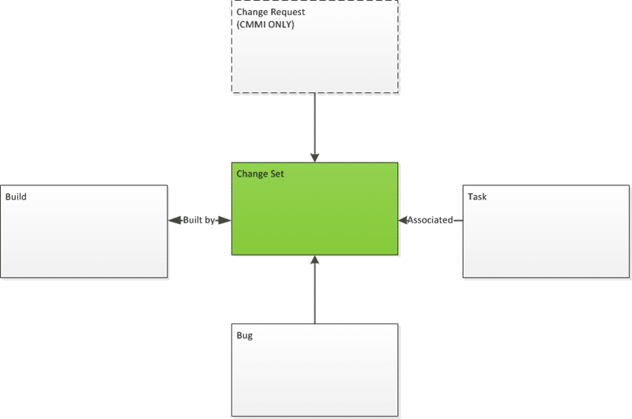](http://blog.hinshelwood.com/files/2011/05/GWB-Windows-Live-Writer-Deep-traceability-in-Team-Foundation-Ser_7737-image_100.png)
{ .post-img }

**Figure: Changesets are linked by Tasks and Builds**

[](http://blog.hinshelwood.com/files/2011/05/GWB-Windows-Live-Writer-Deep-traceability-in-Team-Foundation-Ser_7737-SNAGHTML23775c6.png)
{ .post-img }

**Figure: Changesets tell us what happened to the files in Version Control**

Although comments can be changed after the fact, the inventory and Work Item associations are permanent which allows us to Audit all the way down to the individual change level.

[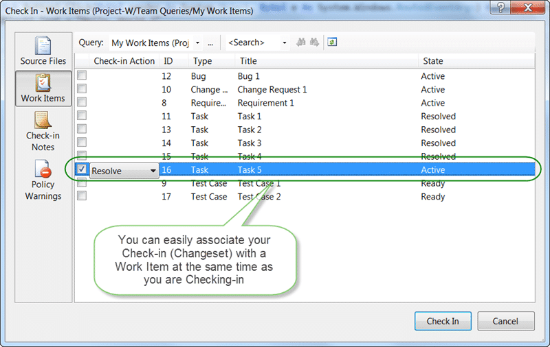](http://blog.hinshelwood.com/files/2011/05/GWB-Windows-Live-Writer-Deep-traceability-in-Team-Foundation-Ser_7737-SNAGHTMLf71e0f_1.png)
{ .post-img }

**Figure: On Check-in you can resolve a Task which automatically associates it**

Because of this we can view the history on any file within the system and see how many changes have been made and what Changesets they belong to.

[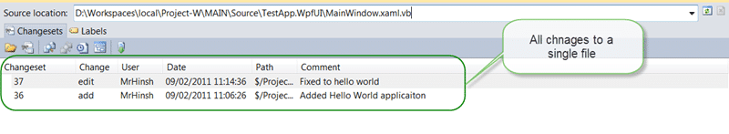](http://blog.hinshelwood.com/files/2011/05/GWB-Windows-Live-Writer-Deep-traceability-in-Team-Foundation-Ser_7737-image_50.png)
{ .post-img }

**Figure: Changes are tracked at the File level**

What would be even more powerful would be if we could view these changes super imposed over the top of the lines of code. Some people call this a blame tool because it is commonly used to find out which of the developers introduced a bug, but it can also be used as another method of Auditing changes to the system.

[](http://blog.hinshelwood.com/files/2011/05/GWB-Windows-Live-Writer-Deep-traceability-in-Team-Foundation-Ser_7737-image_52.png)
{ .post-img }

**Figure: Annotate shows the lines**

the Annotate functionality allows us to visualise the relationship between the individual lines of code and the Changesets. In addition to this you can create a Label and apply it to a version of your version control. The problem with Label’s is that they can be changed after they have been created with no tractability. This makes them practically useless for any sort of compliance audit. So what do you use?

### Branches – And why we need them

Branches are a really powerful tool for development and release management, but they are most important for audits.

[](http://blog.hinshelwood.com/files/2011/05/GWB-Windows-Live-Writer-Deep-traceability-in-Team-Foundation-Ser_7737-SNAGHTML253a011.png)
{ .post-img }

**Figure: One way to Audit releases**

The R1.0 branch can be created from the Label that the Build creates on the R1 line when a Release build was created. It can be created as soon as the Build has been signed of for release. However it is still possible that someone changed the Label between this time and its creation. Another better method can be to explicitly link the Build output to the Build.

### Builds – Lets tie some more of this together

Builds are the glue that helps us enable the next level of tractability by tying everything together.

[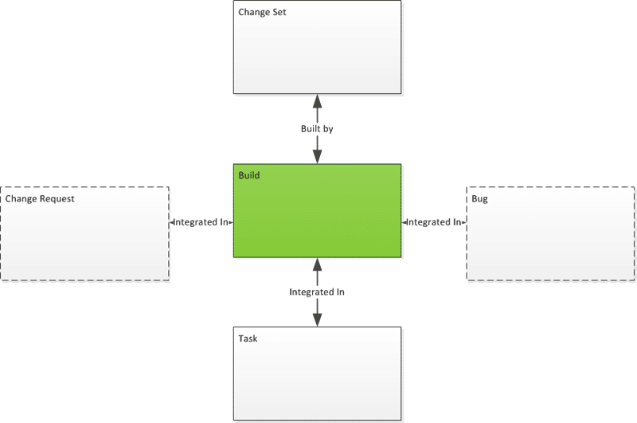](http://blog.hinshelwood.com/files/2011/05/GWB-Windows-Live-Writer-Deep-traceability-in-Team-Foundation-Ser_7737-image_102.png)
{ .post-img }

**Figure: The dashed pieces are not out of the box but can be enabled**

When the Build is called and starts it looks at what it has been asked to build and determines what code it is going to get and build.

[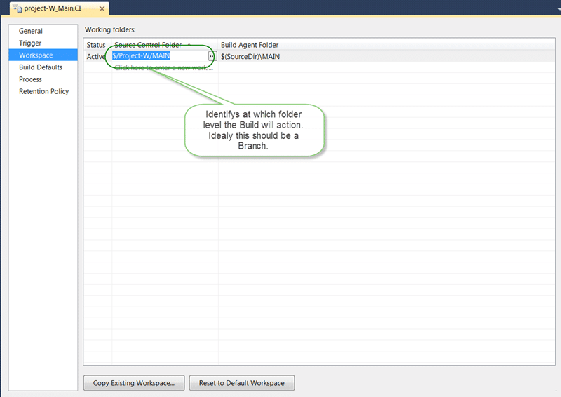](http://blog.hinshelwood.com/files/2011/05/GWB-Windows-Live-Writer-Deep-traceability-in-Team-Foundation-Ser_7737-image_60.png)
{ .post-img }

**Figure: The folder identifies what changes are included in the build**

The Build sets a Label on the Source with the same name as the Build, but the Build itself also includes the latest Changeset ID that it will be building.

At the end of the Build the Build Agent identifies the new Changesets it is building by looking at the Check-ins that have occurred since the last Build.

[](http://blog.hinshelwood.com/files/2011/05/GWB-Windows-Live-Writer-Deep-traceability-in-Team-Foundation-Ser_7737-image_63.png)
{ .post-img }

**Figure: What changes have been made since the last successful Build**

It will then use that information to identify the Work Items that are associated with all of the Changesets

Changesets are associated with Build and change the “Integrated In” field of those Work Items .

[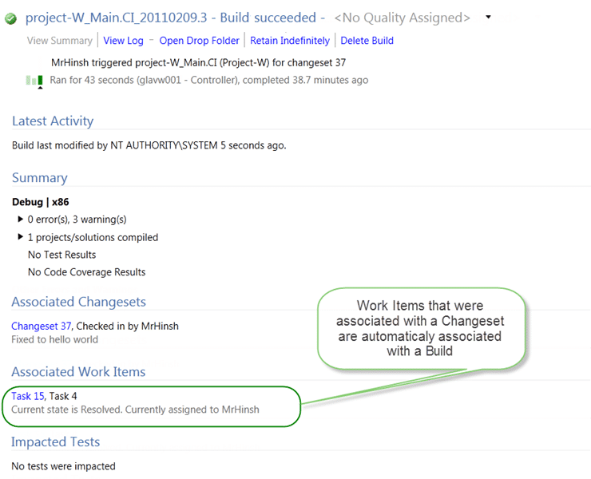](http://blog.hinshelwood.com/files/2011/05/GWB-Windows-Live-Writer-Deep-traceability-in-Team-Foundation-Ser_7737-image_66.png)
{ .post-img }

**Figure: Find all of the Work Items to associate with**

The “Integrated In” field of all of the Work Items identified by the Build Agent as being integrated into the completed Build are updated to reflect the Build number that successfully integrated that change.[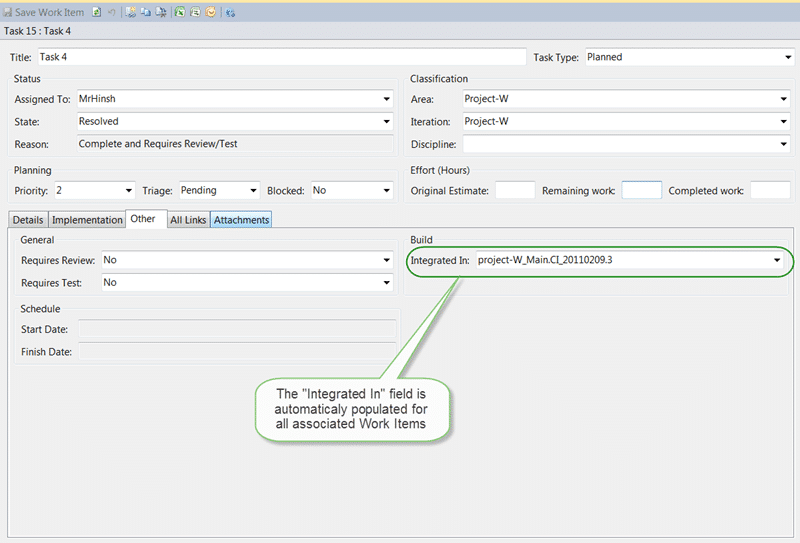](http://blog.hinshelwood.com/files/2011/05/GWB-Windows-Live-Writer-Deep-traceability-in-Team-Foundation-Ser_7737-image_69.png)
{ .post-img }

**Figure: Now we know which Work Items were completed in a build**

Now that we can link a single line of code changed all the way back through the Task that initiated the action to the Requirement that started the whole thing and back down to the Build that contains the finished Requirement.

But how do we know wither that Requirement has been fully tested or even meets the original Requirements?

### Test Cases – How we know we are done

The only way we can know wither a Requirement has been completed to the required specification is to Test that Requirement. In TFS there is a Work Item type called a Test Case

[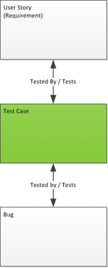](http://blog.hinshelwood.com/files/2011/05/GWB-Windows-Live-Writer-Deep-traceability-in-Team-Foundation-Ser_7737-image_71.png)
{ .post-img }

Test Cases enable two scenarios. The first scenario is the ability to track and validate Acceptance Criteria in the form of a Test Case. If you agree with the Business a set of goals that must be met for a Requirement to be accepted by them it makes it both difficult for them to reject a Requirement when it passes all of the tests, but also provides a level of traceable and validation for audit that a feature has been built and tested to order.

[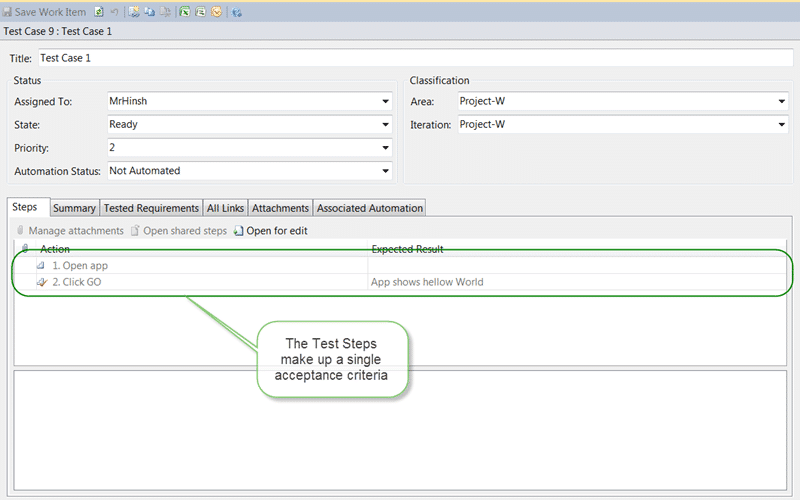](http://blog.hinshelwood.com/files/2011/05/GWB-Windows-Live-Writer-Deep-traceability-in-Team-Foundation-Ser_7737-image_80.png)
{ .post-img }

**Figure: You can have many Acceptance Criteria for a single Requirement**

It is crucial for this to work that someone from the Business has to sign-off on the Test Case moving from the  “Design” to “Ready” states.

The Second is the ability to associate an MS Test test with the Test Case thereby tracking the automated test. This is useful in the circumstance when you want to Track a test and the test results of a Unit Test designed to test the existence of and then re-existence of a a Bug.

[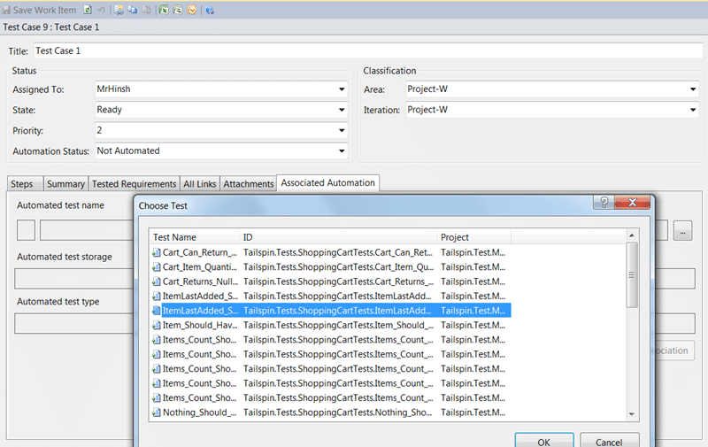](http://blog.hinshelwood.com/files/2011/05/GWB-Windows-Live-Writer-Deep-traceability-in-Team-Foundation-Ser_7737-image_842.png)
{ .post-img }

**Figure: Associating a Test Case with an automated Test**

Although it is possible it may not make sense to track the execution of every Unit Test in your system, there are many Integration and Regression tests that may be automated that it would make sense to track in this way.

### Bug – Lets not have regressions

In order to know wither a Bug in the application has been fixed and to make sure that it does not reoccur it needs to be tracked.

[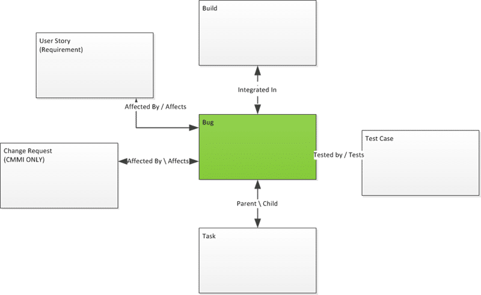](http://blog.hinshelwood.com/files/2011/05/GWB-Windows-Live-Writer-Deep-traceability-in-Team-Foundation-Ser_7737-image_86.png)
{ .post-img }

**Figure: Bugs are the centre of their own world**

If the fix to a Bug is big enough to require that it is broken down into Tasks then it is probably a Requirement. You can associate a check-in with a Bug and have it tracked against a Build. You would also have one or more Test Cases to prove the fix for the Bug.

[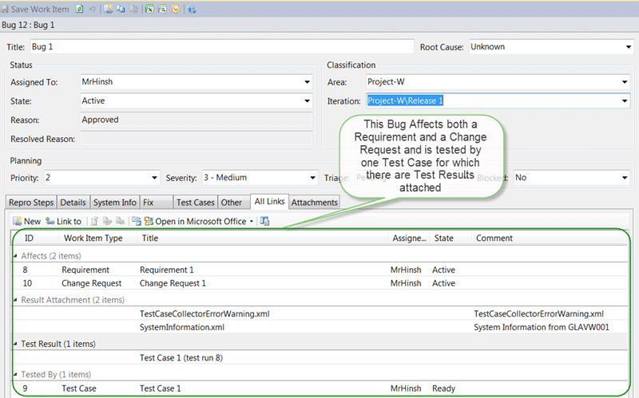](http://blog.hinshelwood.com/files/2011/05/GWB-Windows-Live-Writer-Deep-traceability-in-Team-Foundation-Ser_7737-image_92.png)
{ .post-img }

**Figure: Bugs have many associations**

This allows you to track Bugs / Defects in your system effectively and report on them.

### Change Request – I am not a feature

In the CMMI Process template Change Requests can also be easily tracked through the system. In some cases it can be very important to track Change Requests separately as an Auditor may want to know what was changed and who authorised it.

Again and similar to Bugs, if the Change Request is big enough that it would require to be broken down into Tasks it is in reality a new feature and should be tracked as a Requirement.

[](http://blog.hinshelwood.com/files/2011/05/GWB-Windows-Live-Writer-Deep-traceability-in-Team-Foundation-Ser_7737-image_104.png)
{ .post-img }

**Figure: Make sure your Change Requests only Affect Requirements and not rewrite them**

### Conclusion

Visual Studio 2010 and Team Foundation Server together provide an exceptional Application Lifecycle Management platform that can help your team comply with even the harshest of Compliance requirements while still enabling them to be Agile. Most Audits are heavy on required documentation but most of that information is captured for you as long a you do it right. You don’t even need every team member to understand it all as each of the Artifacts are relevant to a different type of team member.

- Business Analysts manage Requirements and Change Requests
- Programmers manage Tasks and check-in against Change Requests and Bugs
- Testers manage Bugs and Test Cases
- Build Masters manage Builds

Although there is some crossover there are still rolls or “hats” that are worn.

- **Do you thing this is all achievable?**
- **Have I missed anything that you think should be there?**
