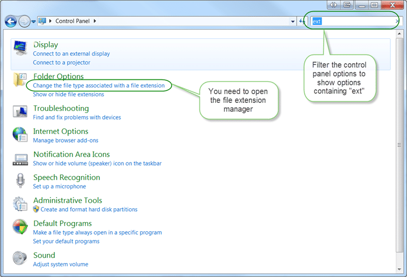

{ .post-img }

A number of out customers have asked if there are any problems in installing and running multiple versions of Microsoft Project on a single client. Although this is a case of Caveat utilitor (Let the user beware), as long as the user understands and accepts the issues that can occur then they can do this.

---

Although Microsoft provide the ability to leave old versions of Office products (except Outlook) on your client when you are installing a new version of the product they certainly do not endorse doing so.

  
{ .post-img }
**Figure: For Project you can choose to keep the old stuff**

That being the case I would have preferred that they put a “(NOT RECOMMENDED)” after the options to impart that knowledge to the rest of us, but they did not. The default and recommended behaviour is for the newer version installer to remove the older versions. Of course this does not apply in the revers. There are no forward compatibility packs for Office.

There are a number of negative behaviours (or bugs) that can occur in this configuration:

- **There is only one MS Project**
  In Windows a file extension can only be associated with a single program.  In this case, MPP files can be associated with only one version of winproj.exe.  The executables are in different folders so if a user double-clicks a Project file on the desktop, file explorer, or Outlook email, Windows will launch the winproj.exe associated with MPP and then load the MPP file.  There are problems associated with this situation and in some cases workarounds.
  The user double-clicks on a Project 2010 file, Project 2007 launches but is unable to open the file because it is a newer version.  The workaround is for the user to launch Project 2010 from the Start menu then open the file.  If the file is attached to an email they will need to first drag the file to the desktop.
- **All your linked MS Project files need to be of the same version**
  There are a number of problems that occur when people use on Microsoft’s Object Linking and Embedding (OLE) technology.  The three common uses of OLE are:
  - for inserted projects where a Master project contains sub-projects and each sub-project resides in its own MPP file
  - shared resource pools where multiple MPP files share a common resource pool kept in a single MPP file
  - cross-project links where a task or milestone in one MPP file has a  predecessor/successor relationship with a task or milestone in a different MPP file
    > What I’ve seen happen before is that if you are running in a version of Project that is not associated with the MPP extension and then try and activate an OLE link then Project tries to launch the other version of Project.  Things start getting very confused since different MPP files are being controlled by different versions of Project running at the same time.  I haven’t tried this in awhile so I can’t give you exact symptoms but I suspect that if Project 2010 is involved the symptoms will be different then in a Project 2003/2007 scenario.  I’ve noticed that Project 2010 gives different error messages for the exact same problem when it occurs in Project 2003 or 2007.   
    > \-Anonymous
    > The recommendation would be either not to use this feature if you have to have multiple versions of Project installed or to use only a single version of Project.

You may get unexpected negative behaviours if you are using shared resource pools or resource pools even when you are not running multiple versions as I have found that they can get broken very easily. If you need these thing then it is probably best to use Project Server as it was created to solve many of these specific issues.

Note: I would not even allow multiple people to access a network copy of a Project file because of the way Windows locks files in write mode. This can cause write-locks that get so bad a server restart is required I’ve seen user’s files get write-locked to the point where the only resolution is to reboot the server.

### Changing the default version to run for an extension

So what if you want to change the default association from Project 2007 to Project 2010?

  
{ .post-img }
**Figure: “Control Panel | Folder Options | Change the file associated with a file extension”**

Windows normally only lists the last version installed for a particular extension. You can select a specific version by selecting the program you want to change and clicking “Change program… | Browse…” and then selecting the .exe you want to use on the file system.

  
{ .post-img }
**Figure: You will need to select the exact version of “winproj.exe” that you want to run**

### Conclusion

Although it is possible to run multiple versions of Project on one system in the main it does not really make sense.
