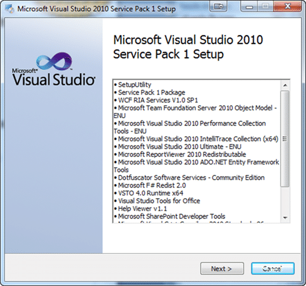
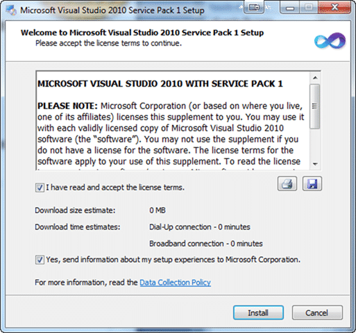

[![vs2010logo_thumb[1]](images/Installing-Visual-Studio-2010-Service-Pa_77C9-vs2010logo_thumb1_thumb-11-11.png)](http://blog.hinshelwood.com/files/2011/05/GWB-Windows-Live-Writer-Installing-Visual-Studio-2010-Service-Pa_77C9-vs2010logo_thumb1_2.png)As has become customary when the product team releases a new patch, SP or version I like to document the install. This post seams almost redundant as I had no problems, but I think that is as valuable to other thinking of installing the Service Pack as all the problems that we sometimes get.
{ .post-img }

---

As per [Brian's post](http://blogs.msdn.com/b/bharry/archive/2011/03/09/installing-all-the-new-stuff.aspx) I am [Installing Visual Studio Team Foundation Server Service Pack 1](http://blog.hinshelwood.com/archive/2011/03/10/installing-visual-studio-team-foundation-server-service-pack-1.aspx) first and indeed as this is a single server local deployment I need to install both. If I only install one it will leave the other product broken.

  
{ .post-img }
**Figure: Hopefully this will be more uneventful**
{ .post-img }

It takes a little while for your system to be checked to see what components need updating. On my main computer this was pretty quick, but on the laptop it took some time.

  
{ .post-img }
**Figure: There are a lot of components to update**

With this update also comes an update to .NET as well as many other components.

  
{ .post-img }
**Figure: I downloaded the full 1.5GB’s, but you could do a web install**

It depends on how good you internet connection is to how long it would take to download, but as I am now in the US I decided not to trust the internet connection speeds. It took around 30-40 minutes to download the full thing which is a little slow.

  
{ .post-img }
**Figure: I did not need to download, but that would increase the install time**
{ .post-img }

So on my main computer again this was fast, but again on my netbook this took a little while.

  
{ .post-img }
**Figure: The actual install took around 30-40 minutes (2 hours on netbook)**
{ .post-img }

I was pretty impressed with the speed of the install, and as Team Explore is now out of the box with Visual Studio 2010 I don’t get the problem of the SP being installed before Team Explorer and having a disjointed experience 
{ .post-img }

  
{ .post-img }
**Figure: As I suspected, no problems with the install**

  
{ .post-img }
**Figure: Checking in Visual Studio shows that all the servicing points were successful**

This was an easy experience even if the SP was over 1.5GB’s to download  Hopefully I will be discovering things that work better for a good while to come, as well as not seeing holes in the product that I had no encountered yet.
{ .post-img }

**What were your experiences of installing Visual Studio 2010 Service pack 1?**

