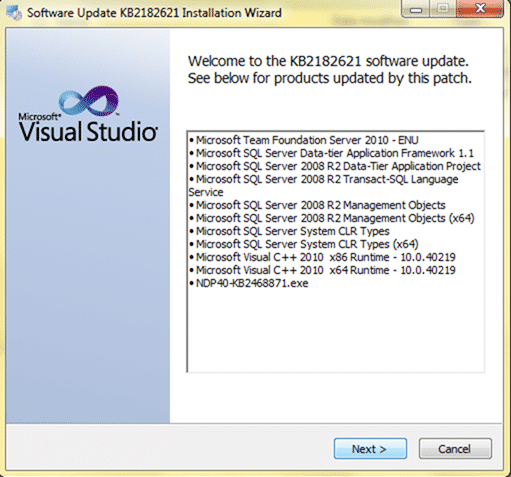
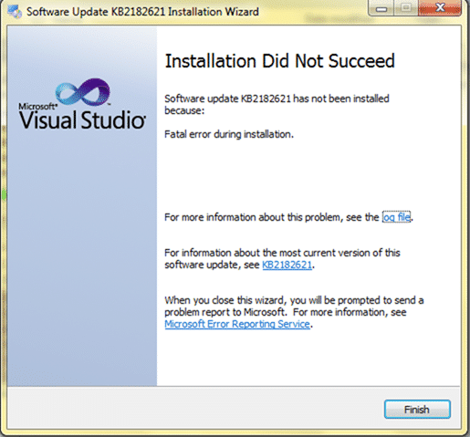
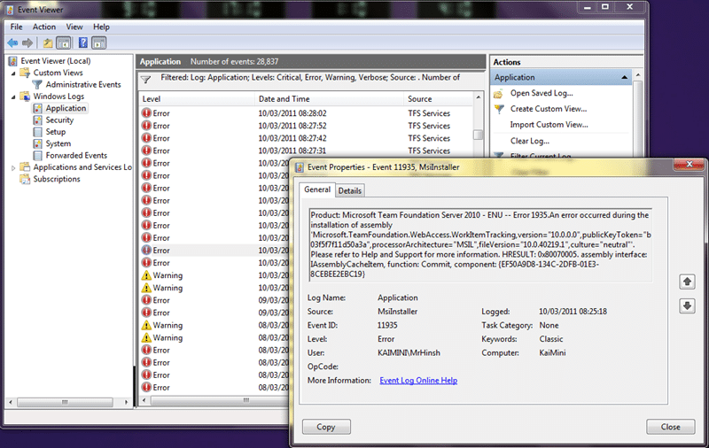
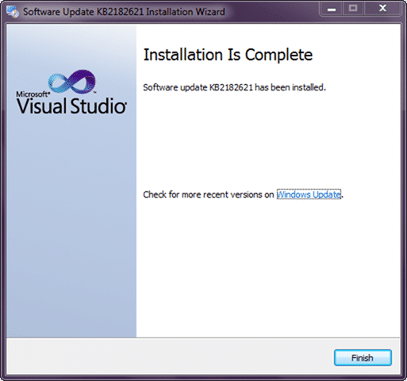

[](http://blog.hinshelwood.com/files/2011/05/GWB-Windows-Live-Writer-Installing-Visual-Studio-Team-Foundatio_6DBD-vs2010logo_2.png)As has become customary when the product team releases a new patch, SP or version I like to document the install. Although I had no errors on my main computer, my netbook did have problems. Although I am not ready to call it a Service Pack problem just yet!
{ .post-img }

- Update 2011-03-10 – Running the Team Foundation Server 2010 Service Pack 1 install a second time worked

---

As per [Brian's post](http://blogs.msdn.com/b/bharry/archive/2011/03/09/installing-all-the-new-stuff.aspx) I am installing the Team Foundation Server Service Pack first and indeed as this is a single server local deployment I need to install both. If I only install one it will leave the other product broken.

This however does not affect you if you are running Visual Studio and Team Foundation Server on separate computers as is normal in a production deployment.

### Main workhorse

I will be installing the service pack first on my main computer as I want to actually use it here.

[](http://blog.hinshelwood.com/files/2011/05/GWB-Windows-Live-Writer-Installing-Visual-Studio-Team-Foundatio_6DBD-SNAGHTML1065c18.png)  
{ .post-img }
**Figure: My main workhorse**

I will also be installing this on my netbook which is obviously of significantly lower spec, but I will do that one after. Although, as always I had my fingers crossed, I was not really worried.

[](http://blog.hinshelwood.com/files/2011/05/GWB-Windows-Live-Writer-Installing-Visual-Studio-Team-Foundatio_6DBD-SNAGHTMLf88846.png)  
{ .post-img }
**Figure: KB2182621**

Compared to Visual Studio there are not really a lot of components to update.

[](http://blog.hinshelwood.com/files/2011/05/GWB-Windows-Live-Writer-Installing-Visual-Studio-Team-Foundatio_6DBD-image_2.png)  
{ .post-img }
**Figure: TFS 2010 and SQL 2008 are the main things to update**

There is no “web” installer for the Team Foundation Server 2010 Service Pack, but that is ok as most people will be installing it on a production server and will want to have everything local. I would have liked a Web installer, but the added complexity for the product team is not work the capability for a 500mb patch.

[](http://blog.hinshelwood.com/files/2011/05/GWB-Windows-Live-Writer-Installing-Visual-Studio-Team-Foundatio_6DBD-SNAGHTMLf9823e.png)  
{ .post-img }
**Figure: There is currently no way to roll SP1 and RTM together**

[](http://blog.hinshelwood.com/files/2011/05/GWB-Windows-Live-Writer-Installing-Visual-Studio-Team-Foundatio_6DBD-SNAGHTMLf9ac69.png)  
{ .post-img }
**Figure: No problems with the file verification, phew[](http://blog.hinshelwood.com/files/2011/05/GWB-Windows-Live-Writer-Installing-Visual-Studio-Team-Foundatio_6DBD-coffee-cup_5.jpg)**
{ .post-img }

[](http://blog.hinshelwood.com/files/2011/05/GWB-Windows-Live-Writer-Installing-Visual-Studio-Team-Foundatio_6DBD-SNAGHTMLf9e46a.png)  
{ .post-img }
**Figure: Although the install took a while, it progressed smoothly[](http://blog.hinshelwood.com/files/2011/05/GWB-Windows-Live-Writer-Installing-Visual-Studio-Team-Foundatio_6DBD-coffee-cup_2.jpg)**
{ .post-img }

[](http://blog.hinshelwood.com/files/2011/05/GWB-Windows-Live-Writer-Installing-Visual-Studio-Team-Foundatio_6DBD-SNAGHTMLfa11b1.png)  
{ .post-img }
**Figure: I always like a success screen**

Well, as far as the install is concerned everything is OK, but what about TFS? Can I still connect and can I still administer it.

[](http://blog.hinshelwood.com/files/2011/05/GWB-Windows-Live-Writer-Installing-Visual-Studio-Team-Foundatio_6DBD-SNAGHTMLfdde61.png)  
{ .post-img }
**Figure: Service Pack 1 is reflected correctly in the Administration Console**

I am confident that there are no major problems with TFS on my system and that it has been updated to SP1. I can do all of the things that I used before with ease, and with the new features detailed by [Brian](http://blogs.msdn.com/b/bharry/archive/2011/03/09/installing-all-the-new-stuff.aspx) I think I will be happy.

### Netbook

The great god Murphy has stuck, and my poor wee laptop spat the Team Foundation Server 2010 Service Pack 1 out so fast it hit me on the back of the head. That will teach me for not looking…

[](http://blog.hinshelwood.com/files/2011/05/GWB-Windows-Live-Writer-Installing-Visual-Studio-Team-Foundatio_6DBD-image_4.png)  
{ .post-img }
**Figure: “Installation did not succeed” I am pretty sure should not be all caps!**

On examining the file I found that everything worked, except the actual Team Foundation Server 2010 serving step.

```
Action: System Requirement Checks...
Action complete
Action: Downloading and/or Verifying Items
c:757fe6efe9f065130d4838081911VS10-KB2182621.msp: Verifying signature for VS10-KB2182621.msp
c:757fe6efe9f065130d4838081911VS10-KB2182621.msp Signature verified successfully for VS10-KB2182621.msp
c:757fe6efe9f065130d4838081911DACFramework_enu.msi: Verifying signature for DACFramework_enu.msi
c:757fe6efe9f065130d4838081911DACFramework_enu.msi Signature verified successfully for DACFramework_enu.msi
c:757fe6efe9f065130d4838081911DACProjectSystemSetup_enu.msi: Verifying signature for DACProjectSystemSetup_enu.msi
Exists: evaluating
Exists evaluated to false
c:757fe6efe9f065130d4838081911DACProjectSystemSetup_enu.msi Signature verified successfully for DACProjectSystemSetup_enu.msi
c:757fe6efe9f065130d4838081911TSqlLanguageService_enu.msi: Verifying signature for TSqlLanguageService_enu.msi
c:757fe6efe9f065130d4838081911TSqlLanguageService_enu.msi Signature verified successfully for TSqlLanguageService_enu.msi
c:757fe6efe9f065130d4838081911SharedManagementObjects_x86_enu.msi: Verifying signature for SharedManagementObjects_x86_enu.msi
c:757fe6efe9f065130d4838081911SharedManagementObjects_x86_enu.msi Signature verified successfully for SharedManagementObjects_x86_enu.msi
c:757fe6efe9f065130d4838081911SharedManagementObjects_amd64_enu.msi: Verifying signature for SharedManagementObjects_amd64_enu.msi
c:757fe6efe9f065130d4838081911SharedManagementObjects_amd64_enu.msi Signature verified successfully for SharedManagementObjects_amd64_enu.msi
c:757fe6efe9f065130d4838081911SQLSysClrTypes_x86_enu.msi: Verifying signature for SQLSysClrTypes_x86_enu.msi
c:757fe6efe9f065130d4838081911SQLSysClrTypes_x86_enu.msi Signature verified successfully for SQLSysClrTypes_x86_enu.msi
c:757fe6efe9f065130d4838081911SQLSysClrTypes_amd64_enu.msi: Verifying signature for SQLSysClrTypes_amd64_enu.msi
c:757fe6efe9f065130d4838081911SQLSysClrTypes_amd64_enu.msi Signature verified successfully for SQLSysClrTypes_amd64_enu.msi
c:757fe6efe9f065130d4838081911vcruntimeVc_runtime_x86.cab: Verifying signature for vcruntimeVc_runtime_x86.cab
c:757fe6efe9f065130d4838081911vcruntimeVc_runtime_x86.cab Signature verified successfully for vcruntimeVc_runtime_x86.cab
c:757fe6efe9f065130d4838081911vcruntimeVc_runtime_x86.msi: Verifying signature for vcruntimeVc_runtime_x86.msi
c:757fe6efe9f065130d4838081911vcruntimeVc_runtime_x86.msi Signature verified successfully for vcruntimeVc_runtime_x86.msi
c:757fe6efe9f065130d4838081911SetupUtility.exe: Verifying signature for SetupUtility.exe
c:757fe6efe9f065130d4838081911SetupUtility.exe Signature verified successfully for SetupUtility.exe
c:757fe6efe9f065130d4838081911vcruntimeVc_runtime_x64.cab: Verifying signature for vcruntimeVc_runtime_x64.cab
c:757fe6efe9f065130d4838081911vcruntimeVc_runtime_x64.cab Signature verified successfully for vcruntimeVc_runtime_x64.cab
c:757fe6efe9f065130d4838081911vcruntimeVc_runtime_x64.msi: Verifying signature for vcruntimeVc_runtime_x64.msi
c:757fe6efe9f065130d4838081911vcruntimeVc_runtime_x64.msi Signature verified successfully for vcruntimeVc_runtime_x64.msi
c:757fe6efe9f065130d4838081911NDP40-KB2468871.exe: Verifying signature for NDP40-KB2468871.exe
c:757fe6efe9f065130d4838081911NDP40-KB2468871.exe Signature verified successfully for NDP40-KB2468871.exe
Action complete
Action: Performing actions on all Items
Entering Function: BaseMspInstallerT >::PerformAction
Action: Performing Install on MSP: c:757fe6efe9f065130d4838081911VS10-KB2182621.msp targetting Product: Microsoft Team Foundation Server 2010 - ENU
Returning IDOK. INSTALLMESSAGE_ERROR [Error 1935.An error occurred during the installation of assembly 'Microsoft.TeamFoundation.WebAccess.WorkItemTracking,version="10.0.0.0",publicKeyToken="b03f5f7f11d50a3a",processorArchitecture="MSIL",fileVersion="10.0.40219.1",culture="neutral"'. Please refer to Help and Support for more information. HRESULT: 0x80070005. ]
Returning IDOK. INSTALLMESSAGE_ERROR [Error 1712.One or more of the files required to restore your computer to its previous state could not be found. Restoration will not be possible.]
Patch (c:757fe6efe9f065130d4838081911VS10-KB2182621.msp) Install failed on product (Microsoft Team Foundation Server 2010 - ENU). Msi Log:
MSI returned 0x643
Entering Function: MspInstallerT >::Rollback

Action Rollback changes
PerformMsiOperation returned 0x643
PerformMsiOperation returned 0x643
OnFailureBehavior for this item is to Rollback.
Action complete
Final Result: Installation failed with error code: (0x80070643), "Fatal error during installation. " (Elapsed time: 0 00:14:09).
```

**Figure: Error log for Team Foundation Server 2010 install shows a failure**

As there is really no information in this log as to why the installation failed so I checked the event log on that box.

[](http://blog.hinshelwood.com/files/2011/05/GWB-Windows-Live-Writer-Installing-Visual-Studio-Team-Foundatio_6DBD-image_9.png)
{ .post-img }

**Figure: There are hundreds of errors and it actually looks like there are more problems than a failed Service Pack**

I am going to just run it again and see if it was because the netbook was slow to catch on to the update. Hears hoping, but even if it fails, I would question the installation of Windows (PDC laptop original install) before I question the Service Pack 
{ .post-img }

[](http://blog.hinshelwood.com/files/2011/05/GWB-Windows-Live-Writer-Installing-Visual-Studio-Team-Foundatio_6DBD-SNAGHTML1874adc.png)
{ .post-img }

**Figure: Second run through was successful**

I don’t know if the laptop was just slow, or what…

**Did you get this error?**

If you did I will push this to the product team as a problem, but unless more people have this sort of error, I will just look to write this off as a corrupted install of Windows and reinstall.
