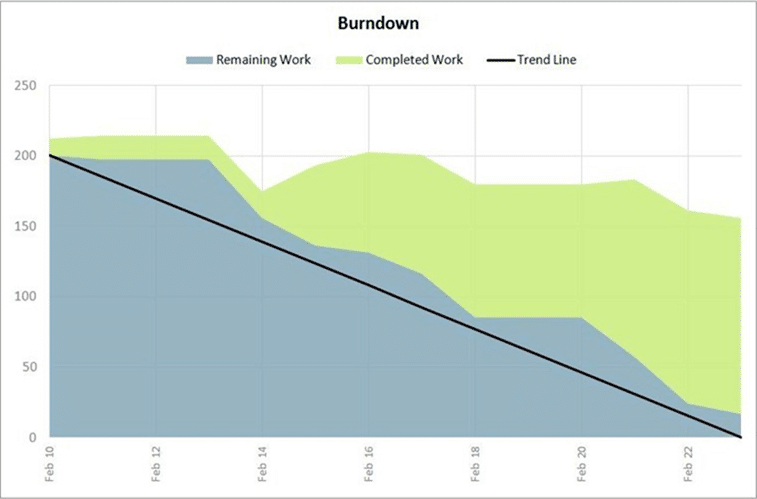

Over the last year I have invested a lot in Scrum. A few months ago I was assigned to teach a two day Scrum course for which I had to build and deliver the material. The team that received the _beta_ of the course has now just finished their first sprint!
{ .post-img }

---

Although I was unable to be the teams Scrum Coach (paperwork relating to citizenship issues) one of my very experienced colleagues (Rennie Araucto) took up the challenge. This was Rennie’s first foray into serious Scrum and he attended the same training course; well I honestly could not have asked for a better person to take this team through its first sprint.

  
{ .post-img }
**Figure: Pretty much the best sprint 1 burn down I have ever seen**

This is probably the very best Sprint 1 burndown I have ever seen. Usually a team will over commit on at least the first, second and third sprints as well as having a tendency to remain oblivious to the _opportunities_ they have in the Scrum process to correct their mistakes. This is usually through no fault of the individuals, but of a IT industry that has consistently taught and rewarded people for anti-patterns to delivering better software.

The data show above is the difference that can be achieve by both having a Scrum Coach and listening to their advice. Most teams fall down on the latter even when the former is satisfied, but I can only applaud the openness of The Scrum Team and their management in adopting both the action and the theory of Scrum in addition to the verbiage. I am sure once they are passed their 10th sprint there will be many changes that they want to make to the process they will have achieved, but _sticking to their guns_ at this stage will serve them well. The trap that they could still fall into is complacency on having such a good sprint. I do worry that their second sprint could be a disaster if they fall back on unhealthy anti-patterns.

Here are a few of the questions that came up during the course of the sprint:

### When are Story Points added and updated?

When used correctly Story Points are a fantastic way of doing estimation. Once you accept that we humans generally suck at estimating things far in the future as well as things we will not be doing ourselves things can get a lot better.

If we take estimation as a team effort and make sure that there is consensus within a team for how _complicated_ something is in relation to the previous complexity estimates we should at least know which _stories_ are more complicated to implement than the previous one. I always urge teams to reach an agreement as a whole, but not to the point of arguing over wither something is a 8 or and 8.5 (or even a 2 or a 3). When it gets to that level I always recommend an average and move on.

Back to the question, I believe that Story Points are ONLY added or changed at the Sprint Planning meeting. Rough order of events:

- **Backlog Creation**: - Product Owner created the backlog and prioritises based on business value
- **Release Planning**: - _The Team_ helps the Product Owner flesh out the user stories by making sure that the Description and Acceptance Criteria are understood and that there is enough information for Test Cases to be built and development to commence. Obviously large User Stories may be broken down at this point. The Team’s initial Definition of Done may also be devised at this time.
- **Backlog Reprioritisation**: - The Product Owner re-prioritises the backlog based the new information that came out of the Release Planning
- **Sprint Planning (Part 1)**: - The Team with the assistance of the Product Owner works through the Product Backlog in Stack Rank order to estimate in Story Points roughly 2-3 times the number of User Stories that they think they can deliver during the Sprint. The Product Owner can now roughly predict what will be delivered from the next 2-3 Sprints. All User Stories that can’t be delivered in a single Spring need to be broken down into smaller User Stories
- **Backlog Reprioritisation: -** The Product Owner re-prioritises the backlog based the new information that came out of the Release Planning
- **Sprint Planning (Part 2): -** _The Team_ pulls the highest priority User Story from the Product Backlog and breaks it down into Tasks that are added to the Sprint Backlog. These Tasks are sized in Hours and the Team decides if they are able to commit to delivering that User Story. They then repeat the process with the next User Story.

In reality the _pruning_ of the Product Backlog by the Product Owner happens all the time and anyone is able to add new User Stories to the **end** of the Product Backlog at any time.

### We will end up eventually breaking things down into hours, so why bother doing story points at all?

This is a really common questions and is pretty easy to explain. First lets assume again that we are totally crap at estimating. If that is the case, we want to spend a minimal amount of time estimating things that we will do in the future, or even not end up doing at all. When we do a complexity estimate we let the Product Owner know that we think _that_ things are only so big. This gives them a chance to reprioritise the things that they thought were quick wins, but which are hard, and visa-a-versa.

Now, in  Sprint Planning (Part 2) we can concentrate on only doing the hard work of breaking the top story down into fine grained tasks without the need to worry that we are doing this unnecessarily. Yes, at the start we will have say two User Stories at 12 points that end up being 80 hours and 120 hours respectively, but once you get around to your next Sprint Planning (Part 1) session you will have a better idea of how much complexity you have in your application. This knowledge can only increase over time.

### When should the team activate a User Story?  At the beginning of the sprint or when they start working on it?

I love easy ones: When you start working on it.

In order to understand the relationship between the amount of work that you committed to and the amount of work that you got done it can be handy to see exactly what you did not even have time to start.

### What do you do with stories that are not finished in a single sprint?

There is a lot of debate on this one. If you are using physical cards then that physical card just goes onto the backlog and all of the outstanding tasks go into the bin. I like to follow that with my data as well. Just move the incomplete User Stories back to the Backlog and Close it indicating that is was not done (Using the Visual Studio Scrum template you mark it as _**Removed**_ with a reason of _**Removed from the backlog**_.

  
{ .post-img }
**Figure: Agile 5.0 Task removed from the sprint backlog**

  
{ .post-img }
**Figure: Visual Studio Scrum 1.0 Task removed from sprint backlog**

The User Story may then be added to the next Sprint if it is prioritised by the Product Owner. It would be up to the team to pitch its completeness or otherwise to the Product Owner in order to prioritise it.

Rule: Never leave uncompleted work in a sprint. Its untidy and causes confusion

### Conclusion

This team has made some fantastic efforts for their first sprint, but should not get complacent. I am very impressed of the work that Rennie has put in and I really enjoyed our long Scrum conversations 
{ .post-img }
