I had a particularly complicated upgrade this time that required me to do two things:
{ .post-img }

- In-Place upgrade of TFS 2008 to TFS 2010
- Move new TFS 2010 server from one domain to another

I followed [Vasu Sankaran](http://blogs.msdn.com/b/vasu_sankaran/)’s post on [Guidance for upgrading to TFS 2010 along with domain move](http://blogs.msdn.com/b/vasu_sankaran/archive/2010/05/11/guidance-for-upgrading-to-tfs-2010-along-with-domain-move.aspx) to make sure I did not fall into any of the known pitfalls, but unfortunately everything went screwy when we tried to move domain.

WARNING: Do not install Team Foundation Server SP1 as part of your Upgrade and domain migration; Do it after!

UPDATE: 2012-02-28 - Microsoft re-released the Service Pack to fix a bunch of issues with this!

---

There are a number of things we need to accomplish:

1. In-place Upgrade of Team Foundation Server 2008 to Team Foundation Server 2010
2. In-place upgrade of Team Foundation Build 2008 to Team Foundation Build 2010
3. Move Team Foundation Server 2010 Team Project Collection to a new Domain

### #1 In-place Upgrade of Team Foundation Server 2008 to Team Foundation Server 2010

The best way to do a domain migration of TFS 2008 and upgrade to TFS 2010 is to do the upgrade first. The [**Identities Change**](http://msdn.microsoft.com/en-us/library/ms253054.aspx) commands required to do the migration are much more stable under TFS 2010.

1.  Run Best Practice Analyser for Team Foundation Server 2008 and fix all problems found[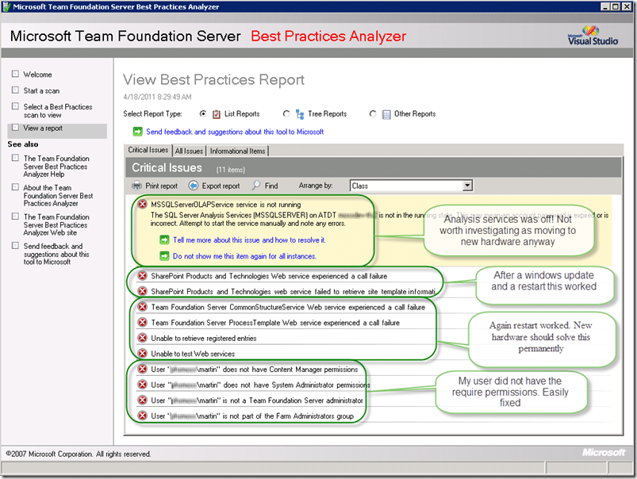](http://blog.hinshelwood.com/files/2011/05/GWB-Windows-Live-WriterIn-Place-upgrade-of-TFS-2008-to-TFS-2010_A159image_8.png)  
    { .post-img }
    **Figure: There are always things highlighted in the BPA. Luckily these were all easily fixed**
2.  Backup all TFS 2008 databases*note: Make sure you remember to take the Reporting Services Key*   
    { .post-img }
    **Figure: With TFS 2008 there are a lot of databases to backup.  
     **
3.  Uninstall Team Foundation Server 2008It is a LOT easier to uninstall TFS 2008 than it ever was to install it 
    { .post-img }
4.  Install Team Foundation Server 2010 (But do not configure)
5.  Install Team Foundation Server 2010 Service Pack 1 – Do not do this!
6.  Configure Team Foundation Server 2010Select the “Upgrade”  option to upgrade the exiting TFS 2008 databases to TFS 2010. The wizard will find all of the valid databases on any instance of SQL you specify.  
    { .post-img }
    **Figure: The Upgrade process took around 30 minutes for ~3GB of data**
7.  Configure Team Foundation Build 2010 Controller[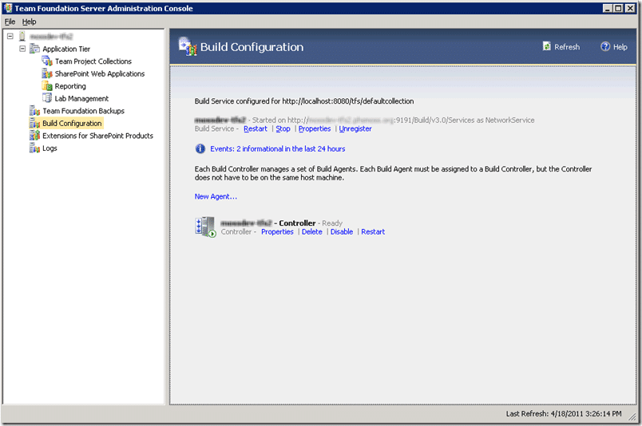](http://blog.hinshelwood.com/files/2011/05/GWB-Windows-Live-WriterIn-Place-upgrade-of-TFS-2008-to-TFS-2010_A159image_10.png)  
    { .post-img }
    **Figure: I am running the Team Foundation Build Controller on the TFS Server**
    In cases of low load I always run the Team Foundation Build Controller on the same server as Team Foundation Server. This allows for less servers under low load and simplifies the topology.
8.  Install Visual Studio 2010 Team Explorer
9.  Install Visual Studio 2010 Service Pack 1
10. Test new environment (Create Team Project | Connect to Source Control | Connect to Work Item Tracking | Run a Build)[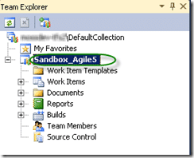](http://blog.hinshelwood.com/files/2011/05/GWB-Windows-Live-WriterIn-Place-upgrade-of-TFS-2008-to-TFS-2010_A159image_12.png)  
    { .post-img }
    **Figure: Agile 5 sandbox**
11. ## Backup Team Project Collection\*This is just a precautionary backup so I can get back to this point if I need to. I also have backups for the Team Foundation Server 2008 databases.
12. Run Best Practices Analyser 2010  
    { .post-img }
    **Figure: Acceptable errors**
    I am OK with these errors as they will not impact the domain move.

### #2 In-place upgrade of Team Foundation Build 2008 to Team Foundation Build 2010

Upgrading Team Foundation Build is even simpler than upgrading Team Foundation Server. Make sure however that you clean up all of the old build details as the upgrade will create “controllers” for all of the Build servers that you currently have.

1. Uninstall Team Build 2008
2. Install Team Build 2010
3. Configure Team Build 2010
4. Connect to Controller on TFS 2010 Server
5. Test Build servers  
      
   { .post-img }
   **Figure: Woot, a build just runs**This is an Upgraded project so all of the builds are just wrapped “TFSBuild.proj” files.
6. Test All existing build definitions still run  
   { .post-img }
   **Figure: Its even better when ALL of the builds work**
7. Clean off all old Build Servers

I was very surprised that all of the builds still worked, but there is currently limited validation as part of these existing builds.

At this point the system works perfectly. I am able to connect to TFS, detach and reattach the collection as well as do builds and work with code. Little did I know that there was a gremlin hidden in the mix.

### #3 Move Team Foundation Server 2010 Team Project Collection to a new Domain

It is now time to follow the documentation for [Moving Team Foundation Server from One Environment to Another](<http://msdn.microsoft.com/en-us/library/ms404883(v=VS.100).aspx>), but with the caveat that we are only migrating the Team Project Collection and not changing the domain of the old Team Foundation Server.

1.  Remove all accounts from new Team Foundation Server 2010  
     Why you might ask! [Guidance for upgrading to TFS 2010 along with domain move](http://blogs.msdn.com/b/vasu_sankaran/archive/2010/05/11/guidance-for-upgrading-to-tfs-2010-along-with-domain-move.aspx)
    
    { .post-img }
    **Figure: make sure there are no groups with the same users**
2.  Install Team Foundation Server 2010 (But do not configure)
3.  Install Team Foundation Server 2010 SP1 – Do not do this!
4.  Install Team Explorer 2010
5.  Install Visual Studio 2010 SP1 – Do not do this!
6.  Install SQL Server 2008 R2 Client toolsYou need this to connect to Analysis Services on a remote computer[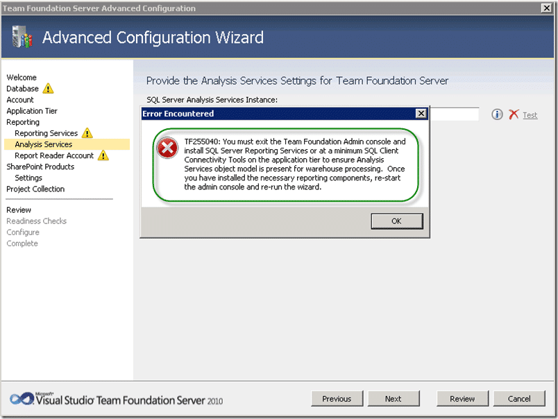](http://blog.hinshelwood.com/files/2011/05/GWB-Windows-Live-WriterIn-Place-upgrade-of-TFS-2008-to-TFS-2010_A159image_20.png)  
    { .post-img }
    **Figure: You get TF255040 if you don’t have the client tools installed**
7.  DBA Installed SQL Server (Database Engine | Analysis Services | Reporting Services)[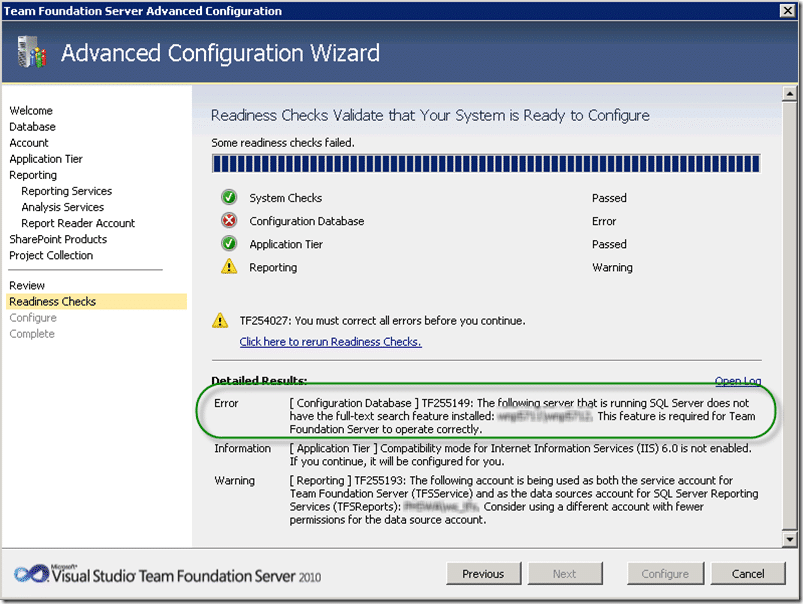](http://blog.hinshelwood.com/files/2011/05/GWB-Windows-Live-WriterIn-Place-upgrade-of-TFS-2008-to-TFS-2010_A159image_30.png)  
    { .post-img }
    **Figure: I always get caught by this one**
    Make sure that you install Reporting Services in “Default” configuration and not “SharePoint Integrated”. As the team I am Woking with usually works with reporting services integrated with SharePoint their default was naturally “SharePoint Integrated”. Luckily Reporting Services is easy to reinstall.

        For some reason I always forget to install “Fill-test search” and get a TF254027. Because I always forget I neglected to tell the DBA to install also. In this case all parts of SQL are remote to the TFS server which is a configuration that I know is supported, but this is the first time I have used it.

8.  Configure TFS selecting “Advanced”  to set the Database, Cube and Reporting to use another server. At this point we are NOT installing or integrating with SharePoint.[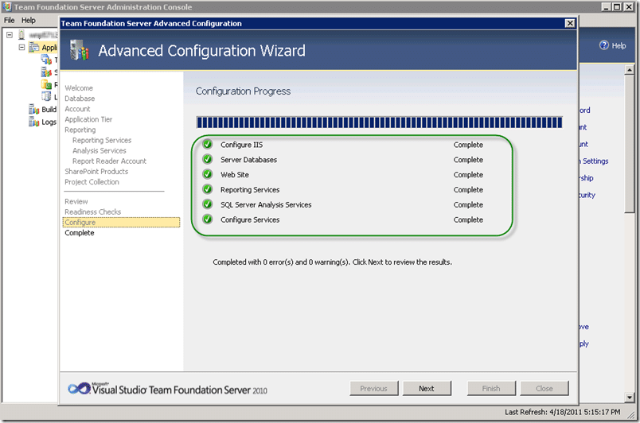](http://blog.hinshelwood.com/files/2011/05/GWB-Windows-Live-WriterIn-Place-upgrade-of-TFS-2008-to-TFS-2010_A159image_28.png)  
    { .post-img }
    **Figure: I do love green ticks**
    If we want to Integrate _[SharePoint 2010 with Team Foundation Server 2010](http://geekswithblogs.net/hinshelm/archive/2010/05/03/integrate-sharepoint-2010-with-team-foundation-server-2010.aspx)_ at a later date we can
9.  Add any Admin users you need[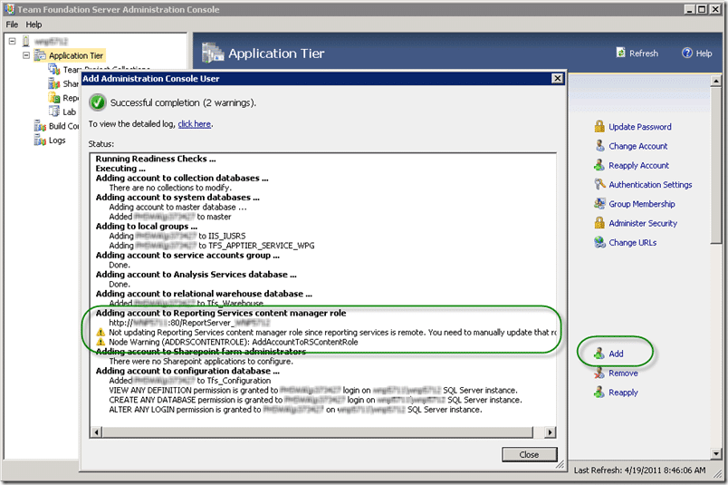](http://blog.hinshelwood.com/files/2011/05/GWB-Windows-Live-WriterIn-Place-upgrade-of-TFS-2008-to-TFS-2010_A159image_48.png)  
    { .post-img }
    **Figure: Remembering that Reporting Services in Remote**
10. Detach Team Project Collection from OLD server  
    { .post-img }
    **Figure: Detach before backup as changes are made to the collection**
    if you do not detach the collection prior to backup and move to the new server you may encounter problems trying to get the collection back up.
11. Backup Collection and Restore to Team Foundation Server in new Domain  
    { .post-img }
    **Figure: You get a chance to change the name when you restore**
    I would recommend this as “DefaultCollection” does not really sound good. I prefer “\[CompanyName\]Collection” as it will make everyone feel that it is more important.
12. Make sure that your account has permission to the databases[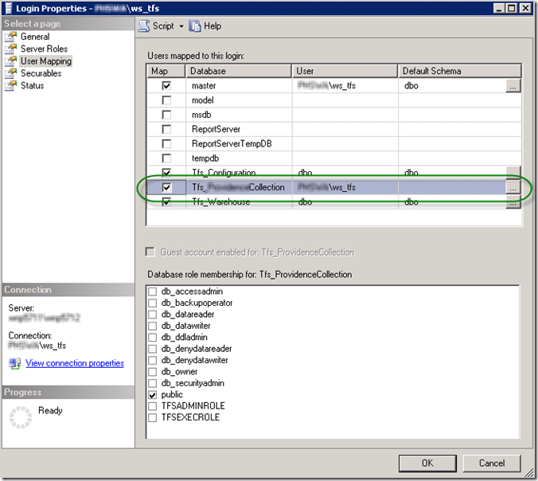](http://blog.hinshelwood.com/files/2011/05/GWB-Windows-Live-WriterIn-Place-upgrade-of-TFS-2008-to-TFS-2010_A159image_66.png)  
    { .post-img }
    **Figure: Permission to the database is required**
13. Attach the collection[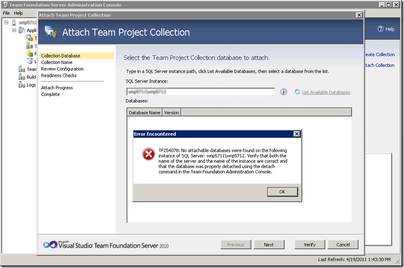](http://blog.hinshelwood.com/files/2011/05/GWB-Windows-Live-WriterIn-Place-upgrade-of-TFS-2008-to-TFS-2010_A159image_52.png)  
    { .post-img }
    **Figure: Oh, why do I get a TF254078?**
14. Lets try that again through the command line[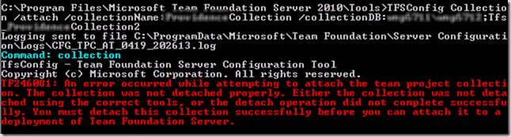](http://blog.hinshelwood.com/files/2011/05/GWB-Windows-Live-WriterIn-Place-upgrade-of-TFS-2008-to-TFS-2010_A159image_54.png)  
    { .post-img }
    **Figure: Oh, so really its a TF246081! That's nice.  
     **  
     note: [Make sure that you run the command prompt in elevated permissions](http://geekswithblogs.net/hinshelm/archive/2010/03/04/microsoft-please-help-me-diagnose-tfs-administration-permission-issues.aspx)
15. Rerun all previous steps without installing SP1 (the long shot)[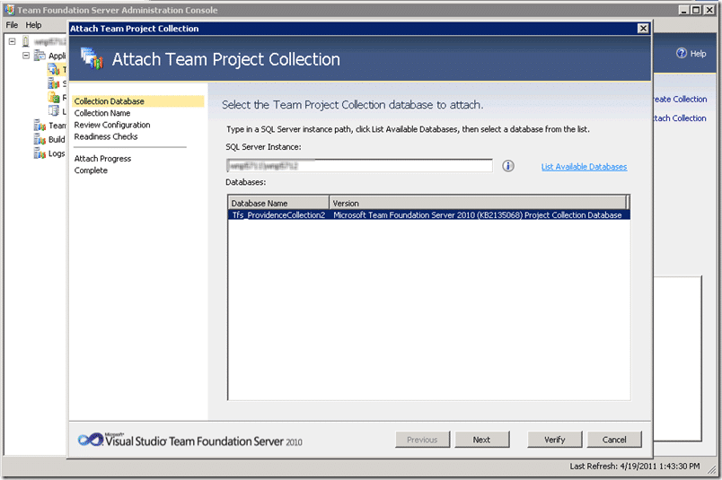](http://blog.hinshelwood.com/files/2011/05/GWB-Windows-Live-WriterIn-Place-upgrade-of-TFS-2008-to-TFS-2010_A159image_56.png)  
    { .post-img }
    **Figure: Would you believe it!**
    \*\*[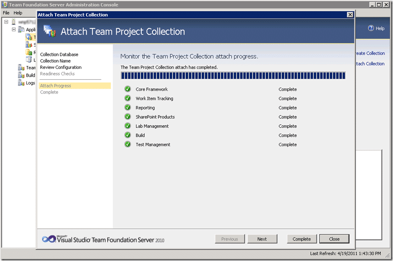](http://blog.hinshelwood.com/files/2011/05/GWB-Windows-Live-WriterIn-Place-upgrade-of-TFS-2008-to-TFS-2010_A159image_60.png)
    { .post-img }
    Figure: Woooohooooo!\*\*
16. Change all of the Identities ([**Identities Change**](http://msdn.microsoft.com/en-us/library/ms253054.aspx))Well, it looks like this server is now on its 4th domain! That's right, the company has had this server since TFS 2005 and has kept it moving around. As TFS only recently gained the ability to migrate accounts I was only able to migrate some of the accounts.
17. Create user account groups  
    { .post-img }
    **Figure: Adding users can be done through the project or at the TPC level  
     **
18. Connect up build serversAs these build server do not yet have all of the components installed to run the build I was unable to get the build running on the day. To be installed for my next visit is:
    - SharePoint 2007 – The developers are creating SharePoint apps
    - Visual Studio 2008 – you always need to add VS to a build server

### Conclusion

After trying a while bunch of options including re-running everything from scratch without installing Service Pack 1. With the success of running without SP1 installed I am inclined to think that the product team broke something in the Attach Team Project Collection command.

### References

- [Move Team Foundation Server from One Environment to Another](http://msdn.microsoft.com/en-us/library/ms404883.aspx)
- [TF30040: The database is not correctly configured - After applying SP1](http://social.msdn.microsoft.com/forums/en-US/tfssetup/thread/f4357f08-2839-4ddd-a23c-6e9ccc1e8639)
- [Moving TFS project collection that wasn't detached](http://stackoverflow.com/questions/2589886/moving-tfs-project-collection-that-wasnt-detached)
- [Team Project Collections – Upgrade from TFS2010 beta2 to TFS2010 RC](http://www.dailyworkaround.com/tag/rror-tf254078-no-attachable-databases-were-found-on-the-following-instance-of-sql-server-server-name/)
- [Guidance for upgrading to TFS 2010 along with domain move](http://blogs.msdn.com/b/vasu_sankaran/archive/2010/05/11/guidance-for-upgrading-to-tfs-2010-along-with-domain-move.aspx)
- [Move Team Foundation Server from One Environment to Another](<http://msdn.microsoft.com/en-us/library/ms404883(v=VS.100).aspx>)

BNX4P3AT2EP3
