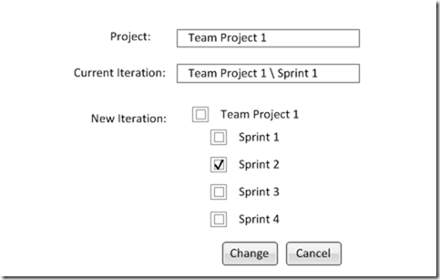

If you can’t wait for the Tfs Automation Platform, but you still want to eventually deploy your extensions using it, what can you do?
{ .post-img }

We would really like for you to still be able to build out automations without the Automation Platform, but you would not have the delivery and management aspects. Hopefully this post will guide you on how you can integrate your work with the Tfs Automation Platform later.

## Updates (in purple)

- **2011-06-09 - [Mattias Sköld](http://mskold.blogspot.com/)** – Mattias had a bunch of questions, and I want to provide answers. You will find the questions and answers inline at the relevant sections.
- **2011-06-10 - [Michael Ockie Fourie](http://mikefourie.wordpress.com/)** – Mike had some very good questions and we are starting to get into specifics and implementation details. This is good as we need to get moving.

_note: This product is still under development and this document is subject to change. There is also the strong possibility that these are just rambling fantasies of a mad programmer with an architect complex._

---

Well, we will be integrating integrating with many of the TFS elements as proxies so that we can leverage existing code without having to rewrite things. For a rough understanding of the architecture and where you can start building things now lets look at the generic scenario:

1. **Installation**

   Assemblies and other supporting files are dropped into the correct Plugins folder on the server

2. **Configuration**

   There is some settings stored somewhere that will control how the process runs

3. **Action  
   **There are three types of action:

   1. User Action - The user deliberately setts a process running
   2. Event – An event is raised on the server (e.g. WorkItemChangedEvent)
   3. Schedule – A particular time is reached

   > Will User actions trigger events or simply queue an TFS job directly ? Will the automations framework handle Events and simply queue TFS jobs ?  
   > **\-Mattias Sköld**

   User Actions and Events will simply trigger a TFS job :)

4. **Processing**

   Some amount of work is done

  
{ .post-img }
**Figure: Simple diagram showing how an automation gets to run from source**

## Installation

There are a number of places that you need to put files on the TFS Server to have them loaded effectively:

- Event Handlers (ISubscribers) – C:Program FilesMicrosoft Team Foundation Server 2010Application TierWeb ServicesbinPlugins
- TFS Jobs (ITeamFoundationJobExtension) - C:Program FilesMicrosoft Team Foundation Server 2010Application TierTFSJobAgentplugins\*

> Are the two listed above all of them? What about loaded at all? Any specific requirements or is it just basic .net loading?  
> \- [Michael Ockie Fourie](http://mikefourie.wordpress.com/)

This is not all of them, bit this is the main places that we will be using for Release 1. For example if you want TFS to load an Event Handler you need to place a .NET 4.0 Assembly into the “~Application TierWeb ServicesbinPlugins” folder above with one or more classes that implement the ISubscribers interface. Something to beware of is that TFS will unload any plugins that produce errors, so everything needs to be handled properly.

Our installation will be two fold. First is the download of the ".zip” archive containing all of the require files and unpacking them, probably to:

> c:Program FilesTeam Foundation Server Automation PlatformAutomations\[Automationname\]

**Figure: Example location of an Automation**

> Manually?  
> \- [Michael Ockie Fourie](http://mikefourie.wordpress.com/)

I would expect that you would select an “Automation” from a provided list and you would click an “Install” button that would automatically download and unpack the .zip file for you. The user would not be required to do this manually and no access to the server would be required.

> What if two people create the same automation name? any issues? I assume the folder name means nothing and is just a container?  
> \- [Michael Ockie Fourie](http://mikefourie.wordpress.com/)

This is one of the reasons that we really need a central store or repository that serves up the automations. It would be responsible for telling a user that they have a duplicate name and need to choose another. I would expect the file to download from [http://downloads.tfsautomationplatform.com/automations/\[automationname\].zip](http://downloads.tfsautomationplatform.com/automations/[automationname].zip) so it would need to be unique.

> - Anything to consider for x86 vs x64 platforms? Will TFS just load plugins build to anycpu ok or do we need specific bits? I’m thinking anycpu will be ok
> - We will have to drop the Microsoft in the path ie, just c:Program Files Team Foundation Server Automation PlatformAutomations\[Automationname\]
> - What will actually create that path? Sounds like we will also deliver an installer to lay some groundwork?\]
>
> \- [Michael Ockie Fourie](http://mikefourie.wordpress.com/)

I think you are right that x86 vs x64 will not be a problem and I have always used “anycpu”. The “Microsoft” in the title was a copy-o (as in copy paste error) and I agree should not be there…

Yes, We will have an installer that installs the base hooks we need to get onto the system including whatever add in we need to add an extra Tab to Team Web Access and maybe the “Admin Console”. We may want to separate out the “Server Admin” from the “User Admin”.

The second stage will occur when an administrator “activates” the plugin for your server. This will look for a manifest file in the Automation folder that will tell it what components are part of the Automation. The installer will know where on the server the files need to go and deploy them to that location.

> How? With what? What installer? Would this be something installed by the installer that lays the groundwork? By location do you mean one of the plugins folders you mention above?  
> \- [Michael Ockie Fourie](http://mikefourie.wordpress.com/)

I think I confused Mike. It all makes sense in my head… honestly. Let me try again…

The Administrator will be able to “Activate” any of the Automations that have been “Installed” in the previous step by opening the Administration UI and selecting to “Activate” an Automation. The Activation process consists of the system automatically deploying, according to a manifest or other method, each of the relevant Assemblies and other files to the location it needs to be in to run. It may be that we can “proxy” some of the loads so we do not have to physically move the file, but I am not relaying on that in my architecture. We may need to physically copy Assemblies into a specific folder for TFS to load it correctly. This process would be conducted on the TFS server by something that we have installed there. I am being deliberately vague as we have no POC yet to know what that might be.

## Configuration

For configuration we are probably going to have a class that holds the settings that is serialised and stored in TFS as Property's. This will allow us to have both static and instance config, but I would not worry about were these are currently stored as you will probably need to have your own storage mechanism for now. There are really two sorts of automations. Ones that can only have one instance, and those that can be configured multiple times with multiple settings. If an automation is if the multiple flavour then there will likely me more than once instance of the configuration.  If you are curious on the current thinking:

<table border="0" cellspacing="0" cellpadding="2" width="654"><tbody><tr><td valign="top" width="241"><strong>Category</strong></td><td valign="top" width="159"><strong>Name</strong></td><td valign="top" width="252"><strong>Value</strong></td></tr><tr><td valign="top" width="241">TfsAutomationPlatform</td><td valign="top" width="159">Generic</td><td valign="top" width="252">Generic Automation Platform settings and configuration</td></tr><tr><td valign="top" width="241">TfsAutomationPlatform</td><td valign="top" width="159">Plugins</td><td valign="top" width="252">List of installed plugins and their current status</td></tr><tr><td valign="top" width="241">TfsAutomationPlatform</td><td valign="top" width="159">Mappings</td><td valign="top" width="252">List of TFS objects and which plugins are mapped to each one</td></tr><tr><td valign="top" width="241">TfsAutomationPlatform -[Automation]</td><td valign="top" width="159">Default</td><td valign="top" width="252">Default and single instance settings</td></tr><tr><td valign="top" width="241">TfsAutomationPlatform -[Automation]</td><td valign="top" width="159">[Instance]</td><td valign="top" width="252">Settings that pertain to an individual configured instance of an automation</td></tr><tr><td valign="top" width="241">&nbsp;</td><td valign="top" width="159">&nbsp;</td><td valign="top" width="252">&nbsp;</td></tr></tbody></table>

**Figure: Where will the data be stored**

> So help me clarify, does an administrator install these automations at the TFS instance level or Collection level or Project Level? If we are targeting Project level granularity, then we need to be able to isolate different versions of automations as some Projects may require a diff version. Also, some projects may not want the automation to even be available.. Also, we should discover automations in a bubble down manner. So if we have n instance with 1000s projects, we can install once at the instance level and all TPCs / projects get it. Then a selective few can get different version / other automations. Am I making sense?  
> \- [Michael Ockie Fourie](http://mikefourie.wordpress.com/)

Kind of… All Automations are installed and activated at the Server level. this would then make them “available”. Some Automations would require some “Admin” configuration to be set while others would not. Now that we have an automation installed and any high level configuration set (like “domain” or “server URL”, or some other thing that does not vary) we can consider where we would like to have it running.

Automations should be able to target Server, Collections, Team Projects, Areas, Iterations, Branches or some combination. The mapping data above, stored in “Mappings” was likely to store a list of “targets” (TPC, TP, Branch), the Automation and the “instance”. This should give us enough information to configure and run in any of your combinations above.

As Automations can be set at any level they need to be evaluated from the top down and can only be configures by someone with permission at that level. I had planned to query the TFS servers own security to work out who has permission.

With the scaling issue above we will probably need to come up with a seriously efficient way of managing that data. I am not opposed to having a database “Tfs_Automation” like the Integration Platform does if it makes more sense.

Any UI required to edit the plugin data will need to be included in the package and we have not yet decided how this should happen. With .NET it is a little more difficult to inject UI and it will probably end up being Silverlight.

  
{ .post-img }
**Figure: Injecting UI in Silverlight is easy**

> Sounds like you have some thoughts on this already ? Will the UI download Action specific UI to inject ?  
> **\-Mattias Sköld**

That is the idea. Probably need to look at what plugin options are available for Silverlight as that is currently the most likely Admin delivery medium.

> oh wow, so we need to deliver a generic UI engine too? Is that easy? Not tried it.  
> Yeah, invest in the future ;-). Seriously though, not a WPF form? Found this: [http://www.tanguay.info/web/index.php?pg=codeExamples&id=186](http://www.tanguay.info/web/index.php?pg=codeExamples&id=186)\]  
> \- [Michael Ockie Fourie](http://mikefourie.wordpress.com/)

In fact I had though of it not being “generic”, but more like providing a “Panel” that is a template location for the user to inject their own UI. We would provide the static UI for all plugins and then they can have us load whatever they set. I have done this a little before and while a little fiddly to setup and interact with it beats trying to recreate the WIT forms!

> ok cool I’ll take your word for it. I never thought much of UI’s for this project. Hope they don’t complicate things  
> \- [Michael Ockie Fourie](http://mikefourie.wordpress.com/)

Did you expect user to have to edit XML to apply settings?

## Action

Although there are a number of types of action, the goal is the same; to add a Job to the Job Queue in TFS that will do the processing. The action can be triggered either by the user or when an event is fired in TFS.

### Server Side Actions

If it is a user interaction that caused the action then there was probably a Silverlight UI assembly or package stored within the installable Automation Package. When it was unpacked the new UI became available.

It it was a server event driven action then an assembly with a class that implements ISubscriber was installed to the Plugins folder of the website where it was loaded into the pipeline for events.

The result is that configuration will be added to “TfsIntegrationPlatform-\[Automation\]” that will be loaded by the TFS Job next time it is run.

**_NOTE: If you build normal server side event handlers then we will try to allow you to wrap them later with minimal code changes_**

### Client Side Actions

If the action was based on a Check-In Event on the client or server then the assembly that contained the Check-In Policy was loaded into the correct place and the correct registry entries added. There was previously some progress in this direction with the Power Tools, but it was difficult to implement and little known.

> huh? Are these events raised on client and server?  
> \- [Michael Ockie Fourie](http://mikefourie.wordpress.com/)

While Check-In Policy integration is WAY out of scope for Release 1, we do need a client install to inject some menu options into Visual Studio at the appropriate place. This also lays the groundwork for getting onto the client.

**_NOTE: If you build normal CheckIn Policies we will try to allow you to wrap them later and deploy as part of an Automation package without having to change the code._**

## Processing

The processing is where the magic happens and in order to provided some level of robustness this should be run on the  TFS Job Agent (ITeamFoundationJobExtension) that can be restarted when the server is rebooted. Once the “Action” has updated the correct settings for the Automation the Job will queued. When the Job runs it will load its settings from at “TfsIntegrationPlatform-\[Automation\]” and run through each configured instance as needed.

The only communication between the outside world and the Job is through the settings stored as TFS Properties.

> _V1?  
> \- [Michael Ockie Fourie](http://mikefourie.wordpress.com/)_

Indeed it would be a v1 feature as we need somewhere to run the processing. Think of it like some triggers and then an engine. The trigger just makes sure that the engine is run so all our Tfs Event or User Event gas to do is add a job to the job queue. Scheduling can also be taken care of by the Job Queue.

**_NOTE: If you build a ITeamFoundationJobExtension then we will try to allow you to wrap it later with minimal code changes_**

## Conclusion

It should be possible for you to create iSubscribers, ITeamFoundationJobExtension and PolicyBase classes that perform your needs and we will allow you to package them separately or together with space for a UI and other functionality later.

There is no reason not to extend TFS now and once the TFS Automation Platform releases there will be no need to ever install another extension again  apart from the TFS Automation Platform itself…
{ .post-img }

