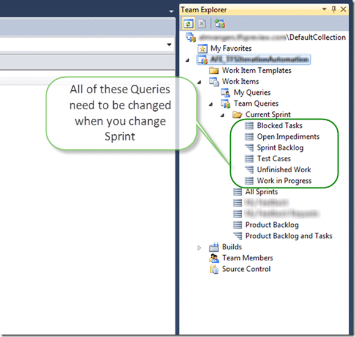
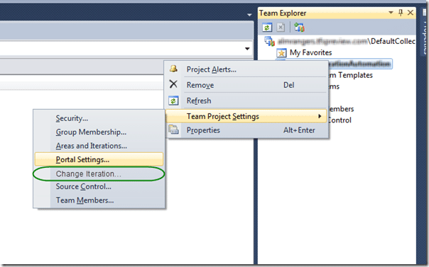

{ .post-img }

As we get organised to start development on the Tfs Automation Platform there is the need to do in-depth investigations into the way things are going to work.

> “Epic 1: As Dave or Gary I want WIQL queries to be automatically updated when I move from iteration to iteration+1 or sprint to sprint+1”

## Updates (in purple)

- **2011-06-10 - [Michael Ockie Fourie](http://mikefourie.wordpress.com/)** – Although Mike called these out as “a few random thoughts” I think that they are still things that need answered around capacity planning and resilience.

**note: This product is still under development and this document is subject to change. There is also the strong possibility that these are just rambling fantasies of a mad programmer with an architect complex.**

---

This story revolves around on of the most common iteration issues. When I progress from working on “\[Team Project\]R1Sprint 1” to working on “\[Team Project\]R1Sprint 2” I have to go through all of the queries that I created in the “Current Iteration” folder and update each of the Queries to reflect the new Sprint.

  
{ .post-img }
**Figure: All the “Current Sprint” queries need changed**

Although in this example there are only 6 queries I have worked with teams that have many many queries in this list. I have worked with still more teams that keep creating “Sprint \[X\]” folders and duplicating queries, but that tis another storey.

If there are many queries (15+) it may take more than a minute to edit them. That is enough time for a user doing this manually to get distracted and forget where they are in the list. Not good… on top of that this job is just plain boring and is what computers were made to do.

> Is it not possible to just run a sql script which does this?  
> \-[Michael Ockie Fourie](http://mikefourie.wordpress.com/)

Any use of SQL against the TFS Database would result in your TFS database being in an unserviceable state. Even the Integration Platform is not allowed to do any database work 
{ .post-img }

Enter the TFS Automation Platform and one of the core automations of the TFS Iteration Automation project. What we need is a “Change Iteration” option on the menu of Team Explorer…

  
{ .post-img }
**Figure: Changing the Iteration should be obvious and easy**

I can now only apologise for my diagrams  I am not the best drawer. There will likely be some sort of configuration screen where you can select options for enabling this Automation. For example, are you using Area’s as sub projects? If you are then a whole new dimension opens up for having multiple nested queries.
{ .post-img }

You would also need to be able to select, for each of your Projects (wither they be Team Projects or Area Projects) which folder to use as your “Current Sprint” folder so the system knows which queries to change.

  
{ .post-img }
**Figure: Setting the new values for Current Iteration**

When the user selects the “Change” option the application will queue the TfsAutomation.Iteration.ChangeIterationJob on the TFS Job Service for execution.

> What sort of processing times are we looking at for these queued jobs to be executed?  
> \-[Michael Ockie Fourie](http://mikefourie.wordpress.com/)

I would expect the job to start almost instantly, but it would depend on the server load. I certainly would not expect this job to take any longer than a few seconds to run with minimal lag.

This will provide some level of resilience in case of the server being restarted during the process.

> Is this a realistic concern? I’m guessing our automation will run in < 10seconds. TFS uptime should be 99% + in organisations  
> \-[Michael Ockie Fourie](http://mikefourie.wordpress.com/)

Although it is not likely for this type of collision to happen for this to happen and for this automation it would not really matter, there will be other automation where it will. We need to be consistent in our deployment and implementation between Automations in order to be able to automatically deploy and manage effectively.

It will also provide an easy way to protect ourselves from 2 users trying to achieve the same task at the same time.

> Is this a realistic concern? Even in large organisations, how many people would (and have permission) to change the active iterations for example  
> \-[Michael Ockie Fourie](http://mikefourie.wordpress.com/)

Only likely to be “Project Administrator”, but if there were 1000 projects… So for this automation I agree, not likely, and how much of a big deal is it anyway. I can however imagine occupancies where is does matter.

We can check to see if the Job is already running before starting it and prevent another from starting.

> I fear over complexity here. What am I missing  
> \-[Michael Ockie Fourie](http://mikefourie.wordpress.com/)

This particular automation is a very short run thing, but there may be others that take much longer to run. I may want to add rollup to my process template, send emails to everyone that has something checked out for longer than 5 days or delete all workspaces that have not been accessed in 3 months. There are many things that could take time and the Platform needs to be considerate of that.

This process will be a welcome first addition to the TFS Automation Platform and it looks like it is going to exercise at least the UI, Configuration and TFS Job Service sections that we plan on building.

I am really looking forward to getting started on this…
