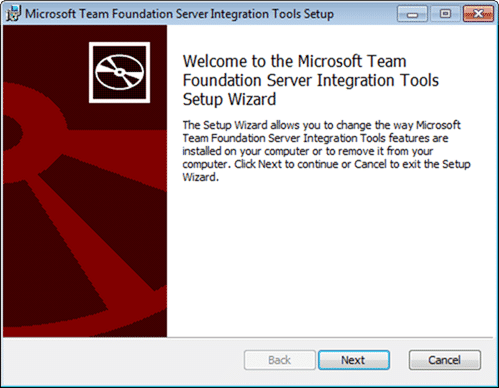

[](http://blog.hinshelwood.com/files/2011/06/image.png)I have recently been working on a TFS Integration Platform Adapter for integrating with Test Track Pro. The problem with TTP is that it does not contain any history.
{ .post-img }

- **_Update 2011-06-03_** – Found the problem with the “index” and I can now migrate new work items again.

---

Although I have had my Test Track Pro Tip Adapter working for quite some time, the customer came back and asked if they could have a rolling migration. i.e. Shipping changes on a regular basis, but only the TIP each time.

```
<?xml version="1.0" encoding="utf-16"?>
<Configuration xmlns:xsi="http://www.w3.org/2001/XMLSchema-instance"
               xmlns:xsd="http://www.w3.org/2001/XMLSchema"
               UniqueId="ADD2D39C-C44A-4046-93AC-03A4970B2312"
               FriendlyName="(3)Northwest Cadence Test Track Pro to TFS">
  <Providers>
    <Provider ReferenceName="c0e63c2b-e06c-48bb-8698-243a82bb950e" FriendlyName="TestTrackPro TIP Adapter" />
    <Provider ReferenceName="04201d39-6e47-416f-98b2-07f0013f8455" FriendlyName="TFS 2010 Migration WIT Provider" />
  </Providers>
  <Addins>
    <Addin ReferenceName="cdde6b6b-72fc-43b6-bbd1-b8a89a788c6f"
          FriendlyName="TFS Active Directory User Id Lookup Service Addin" />
  </Addins>
  <SessionGroup CreationTime="2011-04-14T14:59:58.72-07:00"
                FriendlyName="(3)Northwest Cadence Test Track Pro to TFS"
                SessionGroupGUID="FECE4D93-8498-4ED4-87D2-22599336A07D"
                Creator="martinhinshelwood"
                SyncIntervalInSeconds="0"
                SyncDurationInMinutes="0">
    <MigrationSources>
      <MigrationSource InternalUniqueId="C513F930-2602-400D-A0BF-A2A3AB434DF5"
                       FriendlyName="TestTrackPro source"
                       ServerIdentifier="ttpDatabase@http://ttpserver.domain.com:80"
                       ServerUrl="http://10.191.164.95:80"
                       SourceIdentifier="ttpDatabase"
                       ProviderReferenceName="c0e63c2b-e06c-48bb-8698-243a82bb950e">
        <Settings>
          <Addins />
          <UserIdentityLookup>

            <LookupAddin Precedence="1" ReferenceName="cdde6b6b-72fc-43b6-bbd1-b8a89a788c6f" />

          </UserIdentityLookup>

          <DefaultUserIdProperty UserIdPropertyName="DisplayName" />
        </Settings>
        <CustomSettings>
          <CustomSetting SettingKey="Username" SettingValue="mhinshelwood" />
          <CustomSetting SettingKey="Password" SettingValue="password" />
          <!--<CustomSetting SettingKey="OverrideHWM" SettingValue="2011-05-5T14:59:58.72-07:00" />-->
        </CustomSettings>
        <StoredCredential />
      </MigrationSource>
      <MigrationSource InternalUniqueId="6E3BDF70-F1AE-4CD5-8EE4-133C8AEE0857"
                       FriendlyName="tfs01.nwcadence.com (WIT)"
                       ServerIdentifier="346dd524-18b0-4eda-ba05-0f4d6b14e076"
                       ServerUrl="http://tfs01.nwcadence.com:8080/tfs/defaultcollection"
                       SourceIdentifier="ttpImportTest"
                       ProviderReferenceName="04201d39-6e47-416f-98b2-07f0013f8455">
        <Settings>
          <Addins />
          <UserIdentityLookup>

            <LookupAddin Precedence="1" ReferenceName="cdde6b6b-72fc-43b6-bbd1-b8a89a788c6f" />

          </UserIdentityLookup>

          <DefaultUserIdProperty UserIdPropertyName="DisplayName" />
        </Settings>
        <CustomSettings>
          <CustomSetting SettingKey="EnableBypassRuleDataSubmission" SettingValue="True" />
          <CustomSetting SettingKey="DisableAreaPathAutoCreation" SettingValue="False" />
          <CustomSetting SettingKey="DisableIterationPathAutoCreation" SettingValue="False" />
        </CustomSettings>
        <StoredCredential />
      </MigrationSource>
    </MigrationSources>
    <Sessions>
      <Session CreationTime="2011-04-14T14:59:58.703-07:00"
               SessionUniqueId="adea805d-51df-489a-b2fd-9717b4af3703"
               FriendlyName="Work Item Tracking Session"
               LeftMigrationSourceUniqueId="C513F930-2602-400D-A0BF-A2A3AB434DF5"
               RightMigrationSourceUniqueId="6E3BDF70-F1AE-4CD5-8EE4-133C8AEE0857"
               SessionType="WorkItemTracking">
        <EventSinks />
        <CustomSettings>
          <SettingXml>
            <WITSessionCustomSetting>
              <WorkItemTypes>
                <WorkItemType LeftWorkItemTypeName="Defect" RightWorkItemTypeName="Bug" fieldMap="Defect2BugFieldMap" />
              </WorkItemTypes>
              <FieldMaps>
                <FieldMap name="Defect2BugFieldMap">
                  <MappedFields>
                    <MappedField LeftName="Summary" RightName="System.Title" MapFromSide="Left" valueMap="" />
                    <MappedField LeftName="Description" RightName="System.Description" MapFromSide="Left" valueMap="" />
                    <MappedField LeftName="Severity" RightName="Microsoft.VSTS.Common.Severity" MapFromSide="Left" valueMap="SeverityMapTTP2TFS" />
                    <MappedField LeftName="Status" RightName="System.State" MapFromSide="Left" valueMap="StatusMapTTP2TFS" />
                    <MappedField LeftName="Reason" RightName="System.Reason" MapFromSide="Left" valueMap="ReasonMapTTP2TFS" />
                    <MappedField LeftName="Priority" RightName="Microsoft.VSTS.Common.Priority" MapFromSide="Left" valueMap="PriorityMapTTP2TFS" />
                    <MappedField LeftName="Steps to Reproduce" RightName="Microsoft.VSTS.TCM.ReproSteps" MapFromSide="Left" />
                    <MappedField LeftName="History" RightName="System.History" MapFromSide="Left" />
                    <MappedField LeftName="Assigned To User" RightName="System.AssignedTo" MapFromSide="Left" valueMap="UserMapTTP2TFS" />
                    <MappedField LeftName="Date Created" RightName="Microsoft.VSTS.Common.CreatedDate" MapFromSide="Left"  />
                    <MappedField LeftName="Found by" RightName="Microsoft.VSTS.Common.HowFoundCategory" MapFromSide="Left"  valueMap="HowFoundCategoryTFS" />
                    <!-- WORKAROUND using unused field: Manual Testing -->
                    <!--
                    <MappedField LeftName="@@MISSINGFIELD@@" RightName="Microsoft.VSTS.Common.Triage" MapFromSide="Left" valueMap="TfsTriageMapping" />
                    <MappedField LeftName="@@MISSINGFIELD@@" RightName="Microsoft.VSTS.Common.Regression" MapFromSide="Left" valueMap="TfsRegressionMapping" />
                    <MappedField LeftName="@@MISSINGFIELD@@" RightName="Microsoft.VSTS.Build.Changelist" MapFromSide="Left" valueMap="TfsChangelistMapping" />
                    -->
                    <MappedField LeftName="Date Modified" RightName="System.ChangedDate" MapFromSide="Left" />
                    <!--<MappedField LeftName="Modified By" RightName="System.ChangedBy" MapFromSide="Left" valueMap="StatusMapTTP2TFS" /-->
                    <MappedField LeftName="Verify Version" RightName="Microsoft.VSTS.Build.FoundIn" MapFromSide="Left" valueMap="VerifyVersionMapTTP2TFS" />
                  </MappedFields>
                  <AggregatedFields>
                    <FieldsAggregationGroup   MapFromSide="Left" TargetFieldName="System.AreaPath" Format="TestTrackProImport{0}{1}">
                      <SourceField Index="0" SourceFieldName="Component" valueMap="ComponentMapTTP2TFS" />
                      <SourceField Index="1" SourceFieldName="Functional Area" valueMap="FunctionalAreaMapTTP2TFS" />
                    </FieldsAggregationGroup>
                    <FieldsAggregationGroup   MapFromSide="Left" TargetFieldName="System.IterationPath" Format="TestTrackProImport{0}">
                      <SourceField Index="0" SourceFieldName="Version Found" valueMap="VerifyVersionMapTTP2TFS"/>
                    </FieldsAggregationGroup>
                  </AggregatedFields>
                  <UserIdentityFields>
                    <LeftUserIdentityFields />
                    <RightUserIdentityFields>
                      <UserIdField FieldReferenceName="System.AssignedTo" UserIdPropertyName="DisplayName" />
                    </RightUserIdentityFields>
                  </UserIdentityFields>
                </FieldMap>
              </FieldMaps>
              <ValueMaps>
                <ValueMap name="HowFoundCategoryTFS">
                  <Value LeftValue="*" RightValue="Manual Testing">
                  </Value>
                </ValueMap>
                <ValueMap name="SeverityMapTTP2TFS">
                  <Value LeftValue="" RightValue="2" />
                  <Value LeftValue="3-Usability" RightValue="3" />
                  <Value LeftValue="4-Cosmetic" RightValue="4" />
                  <Value LeftValue="2-Feature not functioning" RightValue="2" />
                  <Value LeftValue="1-Critical, Crash" RightValue="1" />
                  <Value LeftValue="5-Security" RightValue="4" />
                </ValueMap>
                 <ValueMap name="TfsChangelistMapping">
                  <Value LeftValue="" RightValue="Unknown" />
                  <Value LeftValue="*" RightValue="*" />
                </ValueMap>
                <ValueMap name="TfsTriageMapping">
                  <!-- Approved Rejected Submitted -->
                  <Value LeftValue="" RightValue="Approved">
                    <When ConditionalSrcFieldName="Status" ConditionalSrcFieldValue="Submitted" />
                  </Value>
                  <Value LeftValue="" RightValue="Rejected">
                    <When ConditionalSrcFieldName="Status" ConditionalSrcFieldValue="Verify Failed" />
                  </Value>
                </ValueMap>
                <ValueMap name="TfsRegressionMapping">
                  <!-- No Yes -->
                  <Value LeftValue="" RightValue="Yes">
                    <When ConditionalSrcFieldName="Status" ConditionalSrcFieldValue="New (Re-Opened)" />
                  </Value>
                  <Value LeftValue="" RightValue="Yes">
                    <When ConditionalSrcFieldName="Status" ConditionalSrcFieldValue="Verify Failed" />
                  </Value>
                </ValueMap>
                <ValueMap name="StatusMapTTP2TFS">
                  <!-- STRIP ALL AFTER THE "," -->
                  <Value LeftValue="" RightValue="Proposed" />
                  <Value LeftValue="*" RightValue="Proposed" />
                  <Value LeftValue="Verified" RightValue="Validated" />
                  <Value LeftValue="Closed" RightValue="Closed" />
                  <Value LeftValue="Fixed" RightValue="Resolved" />
                  <Value LeftValue="Release to Testing" RightValue="Resolved" />
                  <Value LeftValue="Verify Failed" RightValue="Resolved" />
                  <Value LeftValue="New (Re-Opened)" RightValue="Proposed" />
                  <Value LeftValue="Deferred" RightValue="Resolved" />
                </ValueMap>
                <ValueMap name="ReasonMapTTP2TFS">
                  <Value LeftValue="" RightValue="New">
                    <When ConditionalSrcFieldName="Status" ConditionalSrcFieldValue="New (Re-Opened)" />
                  </Value>
                  <Value LeftValue="" RightValue="Resolved">
                    <When ConditionalSrcFieldName="Status" ConditionalSrcFieldValue="Release to Testing" />
                  </Value>
                  <Value LeftValue="" RightValue="Verification Rejected">
                    <When ConditionalSrcFieldName="Status" ConditionalSrcFieldValue="Verify Failed" />
                  </Value>
                  <Value LeftValue="" RightValue="Resolved">
                    <When ConditionalSrcFieldName="Status" ConditionalSrcFieldValue="Fixed" />
                  </Value>
                  <Value LeftValue="" RightValue="Verified">
                    <When ConditionalSrcFieldName="Status" ConditionalSrcFieldValue="Validated" />
                  </Value>
                  <Value LeftValue="" RightValue="Cut">
                    <When ConditionalSrcFieldName="Status" ConditionalSrcFieldValue="Deferred" />
                  </Value>
                  <Value LeftValue="Duplicate" RightValue="Duplicate" />
                  <Value LeftValue="Not a bug" RightValue="Not a bug" />
                  <Value LeftValue="Not reproducible" RightValue="Not reproducible" />
                  <Value LeftValue="Deprecated Functionality" RightValue="Deprecated Functionality" />
                  <Value LeftValue="Functions as Designed" RightValue="Functions as Designed" />
                </ValueMap>
                <ValueMap name="ComponentMapTTP2TFS">
                  <Value LeftValue="*" RightValue="*" />
                  <Value LeftValue="" RightValue="None" />

                </ValueMap>
                <ValueMap name="FunctionalAreaMapTTP2TFS">
                  <Value LeftValue="*" RightValue="*" />
                  <Value LeftValue="" RightValue="None" />

                </ValueMap>
                <ValueMap name="VerifyVersionMapTTP2TFS">
                  <Value LeftValue="*" RightValue="*" />
                  <Value LeftValue="" RightValue="None" />

                </ValueMap>
                <ValueMap name="PriorityMapTTP2TFS">
                  <Value LeftValue="*" RightValue="2" />
                  <Value LeftValue="4-Low" RightValue="3" />
                  <Value LeftValue="3-Medium" RightValue="3" />
                  <Value LeftValue="2-High" RightValue="2" />
                  <Value LeftValue="1-Must Be Fixed" RightValue="1" />
                  <Value LeftValue="Highest (QA)" RightValue="0" />
                </ValueMap>
                <ValueMap name="UserMapTTP2TFS">
                  <Value LeftValue="*" RightValue="*" />
                  <Value LeftValue="" RightValue="Triage">
                    <When ConditionalSrcFieldName="Status" ConditionalSrcFieldValue="New" />
                  </Value>

                </ValueMap>

                <ValueMap name="TypeofCRMapTTP2TFS">
                  <Value LeftValue="*" RightValue="*" />
                </ValueMap>

              </ValueMaps>
            </WITSessionCustomSetting>
          </SettingXml>
          <SettingXmlSchema />
        </CustomSettings>
        <Filters>
          <FilterPair Neglect="false">
            <FilterItem MigrationSourceUniqueId="C513F930-2602-400D-A0BF-A2A3AB434DF5" FilterString="NWC_Test" />
            <FilterItem MigrationSourceUniqueId="6E3BDF70-F1AE-4CD5-8EE4-133C8AEE0857" FilterString="[System.Id] = 0" />
          </FilterPair>
        </Filters>
      </Session>
    </Sessions>
    <Linking>
      <CustomSettings />
      <LinkTypeMappings />
    </Linking>
    <WorkFlowType Frequency="ContinuousManual" DirectionOfFlow="Unidirectional" SyncContext="Disabled" />
    <CustomSettings />
    <UserIdentityMappings EnableValidation="false">
      <UserIdentityLookupAddins />
    </UserIdentityMappings>
    <ErrorManagement>
      <ErrorRouters />
      <ReportingSettings />
    </ErrorManagement>
  </SessionGroup>
</Configuration>
```

The problem I ran into was that as all of the example Adapters are TIP adapters they do not take into account history at all. Here is the code for my first run through that was heavily based on [Robert MacLean’s](http://www.sadev.co.za) code from [How to create an adapter for the TFS Integration Platform](http://www.sadev.co.za/content/how-create-adapter-tfs-integration-platform-series-index "http://www.sadev.co.za/content/how-create-adapter-tfs-integration-platform-series-index"):

```
Imports Microsoft.TeamFoundation.Migration.Toolkit
Imports System.ComponentModel.Design
Imports System.Collections.ObjectModel
Imports Microsoft.TeamFoundation.Migration.Toolkit.Services
Imports Microsoft.TeamFoundation.Migration.BusinessModel
Imports Microsoft.TeamFoundation.Migration.Toolkit.ErrorManagement
Imports System.Globalization
Imports System.Xml
Imports Microsoft.TeamFoundation.Migration.Toolkit.SyncOrchestrator
Imports System.Net
Imports System.IO
Imports System.ServiceModel
Imports System.ServiceModel.Security
Imports NorthwestCadence.TtpTipAdapter.TtpSoapSdk
Imports NorthwestCadence.TtpTipAdapter.TtpSoapSdk.api

Public Class TtpAnalysisProvider
    Inherits AnalysisProviderBase

    ' Fields
    Private _analysisServiceContainer As IServiceContainer
    Private _changeGroupService As ChangeGroupService
    Private _configurationService As ConfigurationService
    Private _conflictManagerService As ConflictManager
    Private _highWaterMarkDelta As HighWaterMark(Of DateTime)
    Private _highWaterMarkChangeSet As HighWaterMark(Of Integer)
    Private _supportedChangeActions As Dictionary(Of Guid, ChangeActionHandler)
    Private _supportedContentTypes As Collection(Of ContentType)
    Private _dataSourceConfig As TtpMigrationDataSource

    ' Properties
    Public Overrides ReadOnly Property SupportedChangeActions As Dictionary(Of Guid, ChangeActionHandler)
        Get
            Return Me._supportedChangeActions
        End Get
    End Property

    Public Overrides ReadOnly Property SupportedContentTypes As Collection(Of ContentType)
        Get
            Return Me._supportedContentTypes
        End Get
    End Property

    ' Methods
    Private Function CreateChangeGroup(ByVal changeset As Integer, ByVal executionOrder As Long) As ChangeGroup
        Dim group As ChangeGroup = Me._changeGroupService.CreateChangeGroupForDeltaTable(changeset.ToString(CultureInfo.CurrentCulture))
        group.Owner = Nothing
        group.Comment = String.Format(CultureInfo.CurrentCulture, "Changeset {0}", New Object() {changeset})
        group.ChangeTimeUtc = DateTime.UtcNow
        group.Status = ChangeStatus.Delta
        group.ExecutionOrder = executionOrder
        Return group
    End Function

    Private Shared Function CreateFieldRevisionDescriptionDoc(row As TtpDefectMigrationItem) As XmlDocument
        Dim columns As New XElement("Columns", New Object() {New XElement("Column", New Object() {New XAttribute("DisplayName", "Author"), New XAttribute("ReferenceName", "Author"), New XAttribute("Type", "String"), New XElement("Value", row.AuthorId)}), New XElement("Column", New Object() {New XAttribute("DisplayName", "DisplayName"), New XAttribute("ReferenceName", "DisplayName"), New XAttribute("Type", "String"), New XElement("Value", row.DisplayName)}), New XElement("Column", New Object() {New XAttribute("DisplayName", "Id"), New XAttribute("ReferenceName", "Id"), New XAttribute("Type", "String"), New XElement("Value", row.Id.ToString)})})
        Dim column As KeyValuePair(Of String, Object)
        For Each column In row.Columns
            If Not String.IsNullOrEmpty(column.Value) Then
                columns.Add(New XElement("Column", New Object() {New XAttribute("DisplayName", column.Key), New XAttribute("ReferenceName", column.Key), New XAttribute("Type", "String"), New XElement("Value", column.Value)}))
            End If
        Next
        Dim descriptionDoc As New XElement("WorkItemChanges", New Object() {New XAttribute("Revision", "0"), New XAttribute("WorkItemType", row.WorItemType), New XAttribute("Author", IIf(String.IsNullOrEmpty(row.AuthorId), "", row.AuthorId)), New XAttribute("ChangeDate", row.ModifiedOn.ToString(CultureInfo.CurrentCulture)), New XAttribute("WorkItemID", row.Id.ToString), columns})
        Dim doc As New XmlDocument
        doc.LoadXml(descriptionDoc.ToString)
        Return doc
    End Function

    Public Overrides Sub GenerateDeltaTable()
        Dim viewName As String = Me._configurationService.Filters.Item(0).Path
        TraceManager.TraceInformation("TtpWIT:AP:GenerateDeltaTable:View - {0}", New Object() {viewName})
        Me._highWaterMarkDelta.Reload()
        Me.GetTtpUpdates(viewName)
        Me._highWaterMarkDelta.Update(DateTime.Now)
        Me._changeGroupService.PromoteDeltaToPending()
    End Sub

    Public Overrides Sub InitializeClient()
        TraceManager.TraceInformation("TtpWIT:AP:InitializeClient")
    End Sub

    Private Shared Function InitializeMigrationDataSource() As TtpMigrationDataSource
        Return New TtpMigrationDataSource
    End Function

    Public Overrides Sub InitializeServices(ByVal analysisService As IServiceContainer)
        TraceManager.TraceInformation("TtpWIT:AP:InitializeServices")
        If (analysisService Is Nothing) Then
            Throw New ArgumentNullException("analysisService")
        End If
        Me._analysisServiceContainer = analysisService
        Me._configurationService = DirectCast(analysisService.GetService(GetType(ConfigurationService)), ConfigurationService)
        Dim migrationSourceConfiguration As MigrationSource = Me._configurationService.MigrationSource
        _dataSourceConfig = TtpAnalysisProvider.InitializeMigrationDataSource
        Dim customSetting As CustomSetting
        Dim username As String = ""
        Dim password As String = ""
        For Each customSetting In Me._configurationService.MigrationSource.CustomSettings.CustomSetting
            If customSetting.SettingKey.Equals("Username", StringComparison.OrdinalIgnoreCase) Then
                username = customSetting.SettingValue
            End If
            If customSetting.SettingKey.Equals("Password", StringComparison.OrdinalIgnoreCase) Then
                password = customSetting.SettingValue
            End If
        Next

        _dataSourceConfig.Credentials = New NetworkCredential(username, password)
        _dataSourceConfig.DatabaseName = migrationSourceConfiguration.SourceIdentifier
        _dataSourceConfig.FilterName = IIf(migrationSourceConfiguration.ServerIdentifier = "[enterFiltername]", "", migrationSourceConfiguration.ServerIdentifier)
        _dataSourceConfig.Url = migrationSourceConfiguration.ServerUrl

        Me._supportedContentTypes = New Collection(Of ContentType)
        Me.SupportedContentTypes.Add(WellKnownContentType.WorkItem)

        Dim handler As New TtpChangeActionHandlers(Me)

        Me._supportedChangeActions = New Dictionary(Of Guid, ChangeActionHandler)
        Me.SupportedChangeActions.Add(WellKnownChangeActionId.Add, New ChangeActionHandler(AddressOf handler.BasicActionHandler))
        Me.SupportedChangeActions.Add(WellKnownChangeActionId.Edit, New ChangeActionHandler(AddressOf handler.BasicActionHandler))
        Me.SupportedChangeActions.Add(WellKnownChangeActionId.Delete, New ChangeActionHandler(AddressOf handler.BasicActionHandler))
        Me._highWaterMarkDelta = New HighWaterMark(Of DateTime)("HWMDelta")
        Me._highWaterMarkChangeSet = New HighWaterMark(Of Integer)("LastChangeSet")

        Me._configurationService.RegisterHighWaterMarkWithSession(Me._highWaterMarkDelta)
        Me._configurationService.RegisterHighWaterMarkWithSession(Me._highWaterMarkChangeSet)

        Me._changeGroupService = DirectCast(Me._analysisServiceContainer.GetService(GetType(ChangeGroupService)), ChangeGroupService)

        Me._changeGroupService.RegisterDefaultSourceSerializer(New TtpDefectMigrationItemSerializer)
    End Sub

    Public Overrides Sub RegisterConflictTypes(ByVal conflictManager As ConflictManager)
        TraceManager.TraceInformation("TtpWIT:AP:RegisterConflictTypes")
        Me._conflictManagerService = DirectCast(Me._analysisServiceContainer.GetService(GetType(ConflictManager)), ConflictManager)
        Me._conflictManagerService.RegisterConflictType(New GenericConflictType)
        Me._conflictManagerService.RegisterConflictType(New TtpGeneralConflictType, ConflictsSyncOrchOptions.Continue)
    End Sub

    Public Overrides Sub RegisterSupportedChangeActions(ByVal changeActionRegistrationService As ChangeActionRegistrationService)
        TraceManager.TraceInformation("TtpWIT:AP:RegisterSupportedChangeActions")
        changeActionRegistrationService = DirectCast(Me._analysisServiceContainer.GetService(GetType(ChangeActionRegistrationService)), ChangeActionRegistrationService)
        Dim supportedChangeAction As KeyValuePair(Of Guid, ChangeActionHandler)
        For Each supportedChangeAction In Me.SupportedChangeActions
            Dim contentType As ContentType
            For Each contentType In Me.SupportedContentTypes
                changeActionRegistrationService.RegisterChangeAction(supportedChangeAction.Key, contentType.ReferenceName, supportedChangeAction.Value)
            Next
        Next
    End Sub

    Public Overrides Sub RegisterSupportedContentTypes(contentTypeRegistrationService As Microsoft.TeamFoundation.Migration.Toolkit.Services.ContentTypeRegistrationService)

    End Sub

    Private Sub GetTtpUpdates(ByVal viewName As String)
        TraceManager.TraceInformation("TtpWIT:AP:GetTtpDefectUpdates")
        Dim TtpServer As Uri = New Uri(String.Format("{0}/scripts/ttsoapcgi.exe", _dataSourceConfig.Url))

        TraceManager.TraceInformation(ChrW(9) & "TtpWIT:AP:Loading Ttp  {0}", New Object() {TtpServer})
        Try

            Dim _ttpsoapclient = New TtpSoapSdkApi(TtpServer)
            Dim _sourceProject As CProject = Nothing
            TraceManager.TraceInformation("TTP:AP:GetTtpDefectsAsDeltaFromSource:GetProjectList")
            Dim projects() As CProject = _ttpsoapclient.getProjectList(_dataSourceConfig.Credentials.UserName, _dataSourceConfig.Credentials.Password)
            TraceManager.TraceInformation("TTP:AP:GetTtpDefectsAsDeltaFromSource:FindSourceProject")
            For Each project In projects
                If project.database.name.ToLower = _dataSourceConfig.DatabaseName.ToLower Then
                    _sourceProject = project
                    TraceManager.TraceInformation("TTP:AP:GetTtpDefectsAsDeltaFromSource:SourceProjectFound")
                    Exit For
                End If
            Next

            If _sourceProject Is Nothing Then
                TraceManager.TraceInformation("TTP:AP:GetTtpDefectsAsDeltaFromSource:Project Not Found")
                Exit Sub
            End If

            TraceManager.TraceInformation("TTP:AP:InitializeClient:GetSessionId")
            Dim _lSession = _ttpsoapclient.ProjectLogon(_sourceProject, _dataSourceConfig.Credentials.UserName, _dataSourceConfig.Credentials.Password)
            TraceManager.TraceInformation("TTP:AP:InitializeClient:Logged onto {0}", _sourceProject.database.name)
            Dim _deltaTableStartTime As DateTime = DateTime.Now

            ' Dim atc() As CTableColumn = {New CTableColumn With {.name = "Number"}, New CTableColumn With {.name = "Date Modified"}}
            Dim atc() As CTableColumn = _ttpsoapclient.getColumnsForTable(_lSession, "Defect")
            Dim tstart As DateTime = Now
            TraceManager.TraceInformation("TTP:AP:InitializeClient:Atempting get on all data")
            Dim rows As CRecordListSoap = _ttpsoapclient.getRecordListForTable(_lSession, "Defect", viewName, atc)
            TraceManager.TraceInformation("TTP:AP:InitializeClient:Found {0} records in {1} seconds", rows.records.Count, Now.Subtract(tstart).TotalSeconds)
            Dim currentRecord As Integer = 1
            Dim countRecords = rows.records.Count
            For Each record In rows.records
                ' item has been modified since HWM & before deltra table start time
                Try
                    Dim DefectMI As TtpDefectMigrationItem = TtpDefectMigrationItem.ConvertCDefectToTtpDefectMigrationItem(atc, record)
                    ' Dim Modified As DateTime = DateTime.Parse(record.row(1).value)

                    If DefectMI.ModifiedOn.CompareTo(_highWaterMarkDelta.Value) > 0 And DefectMI.ModifiedOn.CompareTo(_deltaTableStartTime) Then
                        ' Atempt to import additional data from objects
                        DefectMI.ImportDefectData(_ttpsoapclient, _lSession)

                        ' Create and add acction group
                        Dim actionGuid As Guid = WellKnownChangeActionId.Add
                        If ((Not _highWaterMarkDelta.Value = DateTime.MinValue) AndAlso (DefectMI.ModifiedOn.CompareTo(_highWaterMarkDelta.Value) > 0)) Then
                            actionGuid = WellKnownChangeActionId.Edit
                        Else
                            actionGuid = WellKnownChangeActionId.Add
                        End If
                        Dim changeGroup As ChangeGroup = Me.CreateChangeGroup(_highWaterMarkChangeSet.Value, 0)
                        changeGroup.CreateAction(actionGuid, DefectMI, String.Empty, _dataSourceConfig.DatabaseName, String.Empty, String.Empty, WellKnownContentType.WorkItem.ReferenceName, TtpAnalysisProvider.CreateFieldRevisionDescriptionDoc(delta))
                        changeGroup.Save()
                        _highWaterMarkChangeSet.Update((_highWaterMarkChangeSet.Value + 1))
                        ' DONE
                        TraceManager.TraceInformation("  {0} of {1} - '{2}' Number '{3}' has {4} processing in {5} seconds", currentRecord, countRecords, DefectMI.WorItemType, DefectMI.Id, "passed", Now.Subtract(tstart).TotalSeconds)
                    Else
                        TraceManager.TraceInformation("  {0} of {1} - '{2}' Number '{3}' has {4} processing in {5} seconds", currentRecord, countRecords, DefectMI.WorItemType, DefectMI.Id, "skipped", Now.Subtract(tstart).TotalSeconds)
                    End If

                Catch ex As Exception
                    TraceManager.TraceError("  {0} of {1} - '{2}' Number '{3}' has {4} processing in {5} seconds", currentRecord, countRecords, "unknown", "unknown", "failed", Now.Subtract(tstart).TotalSeconds)
                    TraceManager.TraceException(ex)
                End Try
                currentRecord = currentRecord + 1

            Next

        Catch ex As Exception
            TraceManager.TraceException(ex)
        End Try

    End Sub

End Class
```

**Figure: Full source for the Analysis Provider v1**

```
Dim changeGroup As ChangeGroup = Me.CreateChangeGroup(_highWaterMarkChangeSet.Value, 0)
changeGroup.CreateAction(actionGuid, DefectMI, String.Empty, _dataSourceConfig.DatabaseName, String.Empty, String.Empty, WellKnownContentType.WorkItem.ReferenceName, TtpAnalysisProvider.CreateFieldRevisionDescriptionDoc(delta))
changeGroup.Save()
```

**Figure: Snipit of the Analysis Provider v1**

The problem that I have encountered is that although it adds new Work Items that come into scope, it does not do any updates to those work item. Now, I can understand this if there had been any updates on the TFS side, but I can guarantee that there has not. So I sought help:

> - **Action** == **Edit** when pushing changes and == **Add** for a new one is correct.
> - **Version** … without debugging the consensus is that the lack of version information is causing the TIP type migration, rather than auctioning the history (edits).
> - **Version Merge** property … for VC only.
> - Ideas for Version property:
>   - **Option 1** - Create fake version numbers for the TTP side and using a single incrementing integer watermark across all of the TTP items.
>   - **Option 1** - Create fake version numbers for the TTP side and just copy the ChangeAction’s ChangeActionId value for this.
>
> \-**_Willy-Peter Schaub_**, VSALM Ranger Mother

So I changed my code so that when the create action occurred it passed in a version (work item revision) number. As my source system does not have revisions, and does not even keep track of edits I just have to make up the number as long as it is greater than the one before. I went for **Option 1** provided by Willy.

```
Imports Microsoft.TeamFoundation.Migration.Toolkit
Imports System.ComponentModel.Design
Imports System.Collections.ObjectModel
Imports Microsoft.TeamFoundation.Migration.Toolkit.Services
Imports Microsoft.TeamFoundation.Migration.BusinessModel
Imports Microsoft.TeamFoundation.Migration.Toolkit.ErrorManagement
Imports System.Globalization
Imports System.Xml
Imports Microsoft.TeamFoundation.Migration.Toolkit.SyncOrchestrator
Imports System.Net
Imports System.IO
Imports System.ServiceModel
Imports System.ServiceModel.Security
Imports NorthwestCadence.TtpTipAdapter.TtpSoapSdk
Imports NorthwestCadence.TtpTipAdapter.TtpSoapSdk.api

Public Class TtpAnalysisProvider
    Inherits AnalysisProviderBase

    ' Fields
    Private _analysisServiceContainer As IServiceContainer
    Private _changeGroupService As ChangeGroupService
    Private _configurationService As ConfigurationService
    Private _conflictManagerService As ConflictManager
    Private _highWaterMarkDelta As HighWaterMark(Of DateTime)
    Private _highWaterMarkChangeSet As HighWaterMark(Of Integer)
    Private _highWaterMarkRevision As HighWaterMark(Of Integer)
    Private _supportedChangeActions As Dictionary(Of Guid, ChangeActionHandler)
    Private _supportedContentTypes As Collection(Of ContentType)
    Private _dataSourceConfig As TtpMigrationDataSource

    ' Properties
    Public Overrides ReadOnly Property SupportedChangeActions As Dictionary(Of Guid, ChangeActionHandler)
        Get
            Return Me._supportedChangeActions
        End Get
    End Property

    Public Overrides ReadOnly Property SupportedContentTypes As Collection(Of ContentType)
        Get
            Return Me._supportedContentTypes
        End Get
    End Property

    Private Shared Function CreateFieldRevisionDescriptionDoc(row As TtpDefectMigrationItem) As XmlDocument
        Dim columns As New XElement("Columns", New Object() {New XElement("Column", New Object() {New XAttribute("DisplayName", "Author"), New XAttribute("ReferenceName", "Author"), New XAttribute("Type", "String"), New XElement("Value", row.AuthorId)}), New XElement("Column", New Object() {New XAttribute("DisplayName", "DisplayName"), New XAttribute("ReferenceName", "DisplayName"), New XAttribute("Type", "String"), New XElement("Value", row.DisplayName)}), New XElement("Column", New Object() {New XAttribute("DisplayName", "Id"), New XAttribute("ReferenceName", "Id"), New XAttribute("Type", "String"), New XElement("Value", row.Id.ToString)})})
        Dim column As KeyValuePair(Of String, Object)
        For Each column In row.Columns
            If Not String.IsNullOrEmpty(column.Value) Then
                columns.Add(New XElement("Column", New Object() {New XAttribute("DisplayName", column.Key), New XAttribute("ReferenceName", column.Key), New XAttribute("Type", "String"), New XElement("Value", column.Value)}))
            End If
        Next
        Dim descriptionDoc As New XElement("WorkItemChanges", New Object() {New XAttribute("Revision", row.Revision), New XAttribute("WorkItemType", row.WorItemType), New XAttribute("Author", IIf(String.IsNullOrEmpty(row.AuthorId), "", row.AuthorId)), New XAttribute("ChangeDate", row.ModifiedOn.ToString(CultureInfo.CurrentCulture)), New XAttribute("WorkItemID", row.Id.ToString), columns})
        Dim doc As New XmlDocument
        doc.LoadXml(descriptionDoc.ToString)
        Return doc
    End Function

    Public Overrides Sub GenerateDeltaTable()
        Dim viewName As String = Me._configurationService.Filters.Item(0).Path
        TraceManager.TraceInformation("TtpWIT:AP:GenerateDeltaTable:View - {0}", New Object() {viewName})
        Me._highWaterMarkDelta.Reload()
        Me.GetTtpUpdates(viewName)
        Me._highWaterMarkDelta.Update(DateTime.Now)
        Me._changeGroupService.PromoteDeltaToPending()
    End Sub

    Public Overrides Sub InitializeClient()
        TraceManager.TraceInformation("TtpWIT:AP:InitializeClient")
    End Sub

    Private Shared Function InitializeMigrationDataSource() As TtpMigrationDataSource
        Return New TtpMigrationDataSource
    End Function

    Public Overrides Sub InitializeServices(ByVal analysisService As IServiceContainer)
        TraceManager.TraceInformation("TtpWIT:AP:InitializeServices")
        If (analysisService Is Nothing) Then
            Throw New ArgumentNullException("analysisService")
        End If
        Me._analysisServiceContainer = analysisService
        Me._configurationService = DirectCast(analysisService.GetService(GetType(ConfigurationService)), ConfigurationService)
        Dim migrationSourceConfiguration As MigrationSource = Me._configurationService.MigrationSource
        _dataSourceConfig = TtpAnalysisProvider.InitializeMigrationDataSource
        Dim customSetting As CustomSetting
        Dim username As String = ""
        Dim password As String = ""
        Dim hwmDateOveride As DateTime = DateTime.MinValue
        For Each customSetting In Me._configurationService.MigrationSource.CustomSettings.CustomSetting
            If customSetting.SettingKey.Equals("Username", StringComparison.OrdinalIgnoreCase) Then
                username = customSetting.SettingValue
            End If
            If customSetting.SettingKey.Equals("Password", StringComparison.OrdinalIgnoreCase) Then
                password = customSetting.SettingValue
            End If
            If customSetting.SettingKey.Equals("OverrideHWM", StringComparison.OrdinalIgnoreCase) Then
                If Not DateTime.TryParse(customSetting.SettingValue, hwmDateOveride) Then
                    Throw New InvalidCastException("Date is not in the correct format: OverrideHWM")
                End If
            End If
        Next

        _dataSourceConfig.Credentials = New NetworkCredential(username, password)
        _dataSourceConfig.DatabaseName = migrationSourceConfiguration.SourceIdentifier
        _dataSourceConfig.FilterName = IIf(migrationSourceConfiguration.ServerIdentifier = "[enterFiltername]", "", migrationSourceConfiguration.ServerIdentifier)
        _dataSourceConfig.Url = migrationSourceConfiguration.ServerUrl

        Me._supportedContentTypes = New Collection(Of ContentType)
        Me.SupportedContentTypes.Add(WellKnownContentType.WorkItem)

        Dim handler As New TtpChangeActionHandlers(Me)

        Me._supportedChangeActions = New Dictionary(Of Guid, ChangeActionHandler)
        Me.SupportedChangeActions.Add(WellKnownChangeActionId.Add, New ChangeActionHandler(AddressOf handler.BasicActionHandler))
        Me.SupportedChangeActions.Add(WellKnownChangeActionId.Edit, New ChangeActionHandler(AddressOf handler.BasicActionHandler))
        Me.SupportedChangeActions.Add(WellKnownChangeActionId.Delete, New ChangeActionHandler(AddressOf handler.BasicActionHandler))
        Me._highWaterMarkDelta = New HighWaterMark(Of DateTime)("HWMDelta")
        Me._highWaterMarkChangeSet = New HighWaterMark(Of Integer)("LastChangeSet")
        _highWaterMarkRevision = New HighWaterMark(Of Integer)("Revision")

        Me._configurationService.RegisterHighWaterMarkWithSession(Me._highWaterMarkDelta)
        Me._configurationService.RegisterHighWaterMarkWithSession(Me._highWaterMarkChangeSet)
        Me._configurationService.RegisterHighWaterMarkWithSession(Me._highWaterMarkRevision)

        If hwmDateOveride > DateTime.MinValue Then
            _highWaterMarkDelta.Update(hwmDateOveride)
        End If

        Me._changeGroupService = DirectCast(Me._analysisServiceContainer.GetService(GetType(ChangeGroupService)), ChangeGroupService)

        Me._changeGroupService.RegisterDefaultSourceSerializer(New TtpDefectMigrationItemSerializer)
    End Sub

    Public Overrides Sub RegisterConflictTypes(ByVal conflictManager As ConflictManager)
        TraceManager.TraceInformation("TtpWIT:AP:RegisterConflictTypes")
        Me._conflictManagerService = DirectCast(Me._analysisServiceContainer.GetService(GetType(ConflictManager)), ConflictManager)
        Me._conflictManagerService.RegisterConflictType(New GenericConflictType)
        Me._conflictManagerService.RegisterConflictType(New TtpGeneralConflictType, ConflictsSyncOrchOptions.Continue)
    End Sub

    Public Overrides Sub RegisterSupportedChangeActions(ByVal changeActionRegistrationService As ChangeActionRegistrationService)
        TraceManager.TraceInformation("TtpWIT:AP:RegisterSupportedChangeActions")
        changeActionRegistrationService = DirectCast(Me._analysisServiceContainer.GetService(GetType(ChangeActionRegistrationService)), ChangeActionRegistrationService)
        Dim supportedChangeAction As KeyValuePair(Of Guid, ChangeActionHandler)
        For Each supportedChangeAction In Me.SupportedChangeActions
            Dim contentType As ContentType
            For Each contentType In Me.SupportedContentTypes
                changeActionRegistrationService.RegisterChangeAction(supportedChangeAction.Key, contentType.ReferenceName, supportedChangeAction.Value)
            Next
        Next
    End Sub

    Public Overrides Sub RegisterSupportedContentTypes(contentTypeRegistrationService As Microsoft.TeamFoundation.Migration.Toolkit.Services.ContentTypeRegistrationService)

    End Sub

    Private Sub GetTtpUpdates(ByVal viewName As String)
        TraceManager.TraceInformation("TtpWIT:AP:GetTtpDefectUpdates")
        Dim TtpServer As Uri = New Uri(String.Format("{0}/scripts/ttsoapcgi.exe", _dataSourceConfig.Url))

        TraceManager.TraceInformation(ChrW(9) & "TtpWIT:AP:Loading Ttp  {0}", New Object() {TtpServer})
        Try

            Dim _ttpsoapclient = New TtpSoapSdkApi(TtpServer)
            Dim _sourceProject As CProject = Nothing
            TraceManager.TraceInformation("TTP:AP:GetTtpDefectsAsDeltaFromSource:GetProjectList")
            Dim projects() As CProject = _ttpsoapclient.getProjectList(_dataSourceConfig.Credentials.UserName, _dataSourceConfig.Credentials.Password)
            TraceManager.TraceInformation("TTP:AP:GetTtpDefectsAsDeltaFromSource:FindSourceProject")
            For Each project In projects
                If project.database.name.ToLower = _dataSourceConfig.DatabaseName.ToLower Then
                    _sourceProject = project
                    TraceManager.TraceInformation("TTP:AP:GetTtpDefectsAsDeltaFromSource:SourceProjectFound")
                    Exit For
                End If
            Next

            If _sourceProject Is Nothing Then
                TraceManager.TraceInformation("TTP:AP:GetTtpDefectsAsDeltaFromSource:Project Not Found")
                Exit Sub
            End If

            TraceManager.TraceInformation("TTP:AP:InitializeClient:GetSessionId")
            Dim _lSession = _ttpsoapclient.ProjectLogon(_sourceProject, _dataSourceConfig.Credentials.UserName, _dataSourceConfig.Credentials.Password)
            TraceManager.TraceInformation("TTP:AP:InitializeClient:Logged onto {0}", _sourceProject.database.name)
            Dim _deltaTableStartTime As DateTime = DateTime.Now

            ' Dim atc() As CTableColumn = {New CTableColumn With {.name = "Number"}, New CTableColumn With {.name = "Date Modified"}}
            Dim atc() As CTableColumn = _ttpsoapclient.getColumnsForTable(_lSession, "Defect")
            Dim tstart As DateTime = Now
            TraceManager.TraceInformation("TTP:AP:InitializeClient:Atempting get on all data")
            Dim rows As CRecordListSoap = _ttpsoapclient.getRecordListForTable(_lSession, "Defect", viewName, atc)
            TraceManager.TraceInformation("TTP:AP:InitializeClient:Found {0} records in {1} seconds", rows.records.Count, Now.Subtract(tstart).TotalSeconds)

            _highWaterMarkRevision.Reload()
            _highWaterMarkRevision.Update(_highWaterMarkRevision.Value + 1)

            Dim currentRecord As Integer = 1
            Dim countRecords = rows.records.Count
            For Each record In rows.records
                ' item has been modified since HWM & before deltra table start time
                Try
                    Dim DefectMI As TtpDefectMigrationItem = TtpDefectMigrationItem.ConvertCDefectToTtpDefectMigrationItem(atc, record)
                    ' Dim Modified As DateTime = DateTime.Parse(record.row(1).value)

                    If DefectMI.ModifiedOn.CompareTo(_highWaterMarkDelta.Value) > 0 And DefectMI.ModifiedOn.CompareTo(_deltaTableStartTime) Then
                        ' Atempt to import additional data from objects
                        DefectMI.ImportDefectData(_ttpsoapclient, _lSession)

                        ' Create and add acction group
                        Dim actionGuid As Guid = WellKnownChangeActionId.Add
                        If ((Not _highWaterMarkDelta.Value = DateTime.MinValue) AndAlso (DefectMI.CreatedOn.CompareTo(_highWaterMarkDelta.Value) > 0)) Then
                            actionGuid = WellKnownChangeActionId.Add
                            TraceManager.TraceInformation("  {0} of {1} - '{2}' Number '{3}' has {4} processing revision {5} as add in {6} seconds", currentRecord, countRecords, DefectMI.WorItemType, DefectMI.Id, "passed", _highWaterMarkRevision.Value, Now.Subtract(tstart).TotalSeconds)
                        ElseIf ((Not _highWaterMarkDelta.Value = DateTime.MinValue) AndAlso (DefectMI.ModifiedOn.CompareTo(_highWaterMarkDelta.Value) > 0)) Then
                            actionGuid = WellKnownChangeActionId.Edit
                            TraceManager.TraceInformation("  {0} of {1} - '{2}' Number '{3}' has {4} processing revision {5} as edit in {6} seconds", currentRecord, countRecords, DefectMI.WorItemType, DefectMI.Id, "passed", _highWaterMarkRevision.Value, Now.Subtract(tstart).TotalSeconds)
                        Else
                            TraceManager.TraceInformation("  {0} of {1} - '{2}' Number '{3}' has {4} processing revision {5} as edit in {6} seconds", currentRecord, countRecords, DefectMI.WorItemType, DefectMI.Id, "skipped", _highWaterMarkRevision.Value, Now.Subtract(tstart).TotalSeconds)
                        End If

                        ' Add revision to obejct
                        DefectMI.Revision = _highWaterMarkRevision.Value

                        Dim changeGroup As ChangeGroup = Me._changeGroupService.CreateChangeGroupForDeltaTable(String.Format("{0}:{1}", DefectMI.Id, DefectMI.Revision))
                        changeGroup.CreateAction(actionGuid, DefectMI, DefectMI.Id, "", _highWaterMarkRevision.Value, "", WellKnownContentType.WorkItem.ReferenceName, TtpAnalysisProvider.CreateFieldRevisionDescriptionDoc(DefectMI))
                        TraceManager.TraceInformation("  {0} of {1} - '{2}' Number '{3}' CreateAction: action={4};sourceItem={5};fromPath={5};version={6};mergeVersionTo=;itemTypeRefName={7};actionDetails=[xml]", currentRecord, countRecords, DefectMI.WorItemType, DefectMI.Id, actionGuid, DefectMI.Id, _highWaterMarkRevision.Value, WellKnownContentType.WorkItem.ReferenceName)
                        changeGroup.Save()

                        _highWaterMarkChangeSet.Update((_highWaterMarkChangeSet.Value + 1))
                        ' DONE

                    Else
                        TraceManager.TraceInformation("  {0} of {1} - '{2}' Number '{3}' has {4} processing in {5} seconds", currentRecord, countRecords, DefectMI.WorItemType, DefectMI.Id, "skipped", Now.Subtract(tstart).TotalSeconds)
                    End If

                Catch ex As Exception
                    TraceManager.TraceError("  {0} of {1} - '{2}' Number '{3}' has {4} processing in {5} seconds", currentRecord, countRecords, "unknown", "unknown", "failed", Now.Subtract(tstart).TotalSeconds)
                    TraceManager.TraceException(ex)
                End Try
                currentRecord = currentRecord + 1

            Next

        Catch ex As Exception
            TraceManager.TraceException(ex)
        End Try

    End Sub

End Class
```

**Figure: Full source code for new Analysis Provider v2**

```
Dim changeGroup As ChangeGroup = Me._changeGroupService.CreateChangeGroupForDeltaTable(String.Format("{0}:{1}", DefectMI.Id, DefectMI.Revision))
changeGroup.CreateAction(actionGuid, DefectMI, DefectMI.Id, "", _highWaterMarkRevision.Value, "", WellKnownContentType.WorkItem.ReferenceName, TtpAnalysisProvider.CreateFieldRevisionDescriptionDoc(DefectMI))
TraceManager.TraceInformation("  {0} of {1} - '{2}' Number '{3}' CreateAction: action={4};sourceItem={5};fromPath={5};version={6};mergeVersionTo=;itemTypeRefName={7};actionDetails=[xml]", currentRecord, countRecords, DefectMI.WorItemType, DefectMI.Id, actionGuid, DefectMI.Id, _highWaterMarkRevision.Value, WellKnownContentType.WorkItem.ReferenceName)
changeGroup.Save()
```

**Figure: Snipit of the Analysis Provider v2**

You can see in the full source for v2 of the Analysis Provider that I have added a new high watermark for the revision that should stay in sync with the number of runs of the migration there have been. This way, all of the edit’s  that happen on the third run will have a revision number of 3.

[](http://blog.hinshelwood.com/files/2011/06/image1.png)
{ .post-img }

**Figure: None of the originally imported data has a revision.**

The problem now is that no matter how many times I run the import in my test environment I can’t get it to perform an edit. I am hoping that someone will be able to spot a silly mistake on my code that will solve this problem. it is one of those “stare at it for hours hoping it will just work” problems.

And it gets worse, now when I try to run the code I get an “Index was out of range” exception for the TFS server that I just can’t track down. I have even backed all my code back to a known working version and I still get the error. I have even gone so far as to restart the Target TFS server and try another one. Here is the log I keep getting:

```
[02/06/2011 18:14:15] MigrationConsole started...
[02/06/2011 18:14:29] MigrationConsole.exe Information: 0 : ConfigurationChangeTracker did not detect any non-transient changes. No cached data will be deleted for session group '00000000-0000-0000-0000-000000000000'
[02/06/2011 18:14:29] MigrationConsole.exe Information: 0 : : StartSessionGroup: Enter with sessionGroupUniqueId: a69d4175-24ad-4f12-8fb5-4edd33f40ada
[02/06/2011 18:14:29] MigrationConsole.exe Information: 0 : : StartSessionGroup: Creating new SyncOrchestrator
[02/06/2011 18:14:30] MigrationConsole.exe Information: 0 : : Provider ChangeGroup Label AnalysisAddin Provider a4f53905-25b6-4311-ac0c-637da6688f2b is available
[02/06/2011 18:14:30] MigrationConsole.exe Information: 0 : : Provider ClearQuest Adapter d9637401-7385-4643-9c64-31585d77ed16 is available
[02/06/2011 18:14:30] MigrationConsole.exe Information: 0 : : Provider Northwest Cadence CSV Adapter 06a2457f-ebba-4979-bc5f-0f5006b8b4e6 is available
[02/06/2011 18:14:30] MigrationConsole.exe Information: 0 : : Provider TFS 2008 User Identity Lookup Add-In Provider eecc0227-8006-45f0-888d-10ab03019ad5 is available
[02/06/2011 18:14:30] MigrationConsole.exe Information: 0 : : Provider Semaphore File Analysis Addin Provider e8cec3c5-5848-4b83-904f-4324094c3f78 is available
[02/06/2011 18:14:30] MigrationConsole.exe Information: 0 : : Provider TFS 2010 Migration VC Provider febc091f-82a2-449e-aed8-133e5896c47a is available
[02/06/2011 18:14:31] MigrationConsole.exe Information: 0 : : Provider TFS 2010 Migration WIT Provider 04201d39-6e47-416f-98b2-07f0013f8455 is available
[02/06/2011 18:14:31] MigrationConsole.exe Information: 0 : : Provider TestTrackPro TIP Adapter c0e63c2b-e06c-48bb-8698-243a82bb950e is available
[02/06/2011 18:14:31] MigrationConsole.exe Information: 0 : : CsvAdapter:GetService - Microsoft.TeamFoundation.Migration.Toolkit.IAddin
[02/06/2011 18:14:31] MigrationConsole.exe Information: 0 : : Provider TFS 2010 Migration WIT Provider 04201d39-6e47-416f-98b2-07f0013f8455 is loaded
[02/06/2011 18:14:31] MigrationConsole.exe Information: 0 : : TtpAdapter:GetService - Microsoft.TeamFoundation.Migration.Toolkit.IAddin
[02/06/2011 18:14:31] MigrationConsole.exe Information: 0 : : TtpAdapter:GetService - Cant find--
[02/06/2011 18:14:31] MigrationConsole.exe Information: 0 : : Provider TestTrackPro TIP Adapter c0e63c2b-e06c-48bb-8698-243a82bb950e is loaded
[02/06/2011 18:14:31] MigrationConsole.exe Information: 0 : : 2 Adapter instance(s) loaded
[02/06/2011 18:14:31] MigrationConsole.exe Information: 0 : : 5 Add-Ins loaded
[02/06/2011 18:14:35] MigrationConsole.exe Information: 0 : : Active Directory lookup will be used for this end point.
[02/06/2011 18:14:39] MigrationConsole.exe Information: 0 : : TtpAdapter:GetService - Microsoft.TeamFoundation.Migration.Toolkit.IAnalysisProvider
[02/06/2011 18:14:39] MigrationConsole.exe Information: 0 : : TtpAdapter:GetService Creating - TtpAnalysisProvider
[02/06/2011 18:14:39] MigrationConsole.exe Information: 0 : : TtpAdapter:GetService Returning - NorthwestCadence.TtpTipAdapter.TtpAnalysisProvider
[02/06/2011 18:14:39] MigrationConsole.exe Information: 0 : : TtpWIT:AP:InitializeServices
[02/06/2011 18:14:39] MigrationConsole.exe Information: 0 : : TtpWIT:AP:RegisterSupportedChangeActions
[02/06/2011 18:14:39] MigrationConsole.exe Information: 0 : : TtpWIT:AP:RegisterConflictTypes
[02/06/2011 18:14:39] MigrationConsole.exe Information: 0 : : TtpAdapter:GetService - Microsoft.TeamFoundation.Migration.Toolkit.Services.IServerPathTranslationService
[02/06/2011 18:14:39] MigrationConsole.exe Information: 0 : : TtpAdapter:GetService - Cant find--
[02/06/2011 18:14:39] MigrationConsole.exe Information: 0 : : TtpAdapter:GetService - Microsoft.TeamFoundation.Migration.Toolkit.IMigrationProvider
[02/06/2011 18:14:39] MigrationConsole.exe Information: 0 : : TtpAdapter:GetService Creating - TtpMigrationProvider
[02/06/2011 18:14:39] MigrationConsole.exe Information: 0 : : TtpAdapter:GetService Returning - NorthwestCadence.TtpTipAdapter.TtpAnalysisProvider
[02/06/2011 18:14:39] MigrationConsole.exe Information: 0 : : TtpWIT:AP:RegisterConflictTypes
[02/06/2011 18:14:39] MigrationConsole.exe Information: 0 : : TtpAdapter:GetService - Microsoft.TeamFoundation.Migration.Toolkit.ILinkProvider
[02/06/2011 18:14:39] MigrationConsole.exe Information: 0 : : TtpAdapter:GetService - Cant find--
[02/06/2011 18:14:39] MigrationConsole.exe Information: 0 : : Connecting to 'http://tfs01.nwcadence.com:8080/tfs/sandbox'
[02/06/2011 18:14:41] MigrationConsole.exe Information: 0 : : Connected to 'http://tfs01.nwcadence.com:8080/tfs/sandbox'
[02/06/2011 18:14:42] MigrationConsole.exe Information: 0 : : Connecting to 'http://tfs01.nwcadence.com:8080/tfs/sandbox'
[02/06/2011 18:14:42] MigrationConsole.exe Information: 0 : : Connected to 'http://tfs01.nwcadence.com:8080/tfs/sandbox'
[02/06/2011 18:14:42] MigrationConsole.exe Information: 0 : : TtpWIT:AP:InitializeClient
[02/06/2011 18:14:42] MigrationConsole.exe Information: 0 : : Connecting to 'http://tfs01.nwcadence.com:8080/tfs/sandbox'
[02/06/2011 18:14:42] MigrationConsole.exe Information: 0 : : Connected to 'http://tfs01.nwcadence.com:8080/tfs/sandbox'
[02/06/2011 18:14:43] MigrationConsole.exe Information: 0 : : Connecting to 'http://tfs01.nwcadence.com:8080/tfs/sandbox'
[02/06/2011 18:14:43] MigrationConsole.exe Information: 0 : : Connected to 'http://tfs01.nwcadence.com:8080/tfs/sandbox'
[02/06/2011 18:14:44] MigrationConsole.exe Information: 0 : : StartSessionGroup: Starting SyncOrchestrator; now 0 running sessions
[02/06/2011 18:14:44] MigrationConsole.exe Information: 0 : WorkItemTracking: Session worker thread [WorkItemTracking] started
[02/06/2011 18:14:44] MigrationConsole.exe Information: 0 : WorkItemTracking: Pipeline flow from bcf2ef19-dbaf-48a3-bbd1-82424ef9d7f2 to 90acdef5-e512-4df5-a680-cb2f386b08fd
[02/06/2011 18:14:44] MigrationConsole.exe Information: 0 : WorkItemTracking: Generating delta tables for the migration source bcf2ef19-dbaf-48a3-bbd1-82424ef9d7f2
[02/06/2011 18:14:44] MigrationConsole.exe Information: 0 : WorkItemTracking: TtpWIT:AP:GenerateDeltaTable:View - NWC_Test
[02/06/2011 18:14:44] MigrationConsole.exe Information: 0 : WorkItemTracking: TtpWIT:AP:GetTtpDefectUpdates
[02/06/2011 18:14:44] MigrationConsole.exe Information: 0 : WorkItemTracking:     TtpWIT:AP:Loading Ttp  http://ttp01.nwcadence.com/scripts/ttsoapcgi.exe
[02/06/2011 18:14:45] MigrationConsole.exe Information: 0 : WorkItemTracking: TTP:AP:GetTtpDefectsAsDeltaFromSource:GetProjectList
[02/06/2011 18:14:47] MigrationConsole.exe Information: 0 : WorkItemTracking: TTP:AP:GetTtpDefectsAsDeltaFromSource:FindSourceProject
[02/06/2011 18:14:47] MigrationConsole.exe Information: 0 : WorkItemTracking: TTP:AP:GetTtpDefectsAsDeltaFromSource:SourceProjectFound
[02/06/2011 18:14:47] MigrationConsole.exe Information: 0 : WorkItemTracking: TTP:AP:InitializeClient:GetSessionId
[02/06/2011 18:14:48] MigrationConsole.exe Information: 0 : WorkItemTracking: TTP:AP:InitializeClient:Logged onto expreSSO_Vergence
[02/06/2011 18:14:49] MigrationConsole.exe Information: 0 : WorkItemTracking: TTP:AP:InitializeClient:Atempting get on all data
[02/06/2011 18:14:51] MigrationConsole.exe Information: 0 : WorkItemTracking: TTP:AP:InitializeClient:Found 3 records in 1.9663932 seconds
[02/06/2011 18:14:52] MigrationConsole.exe Information: 0 : WorkItemTracking:   1 of 3 - 'Defect' Number '3284' has skipped processing revision 1 as edit in 3.2796558 seconds
[02/06/2011 18:14:52] MigrationConsole.exe Information: 0 : WorkItemTracking:   1 of 3 - 'Defect' Number '3284' CreateAction: action=cb71d043-bede-4092-aa87-cf0f14586625;sourceItem=3284;fromPath=3284;version=0;mergeVersionTo=;itemTypeRefName=Microsoft.TeamFoundation.Migration.Toolkit.WorkItem;actionDetails=[xml]
[02/06/2011 18:14:54] MigrationConsole.exe Information: 0 : WorkItemTracking:   2 of 3 - 'Defect' Number '3285' has skipped processing revision 1 as edit in 4.8739746 seconds
[02/06/2011 18:14:54] MigrationConsole.exe Information: 0 : WorkItemTracking:   2 of 3 - 'Defect' Number '3285' CreateAction: action=cb71d043-bede-4092-aa87-cf0f14586625;sourceItem=3285;fromPath=3285;version=0;mergeVersionTo=;itemTypeRefName=Microsoft.TeamFoundation.Migration.Toolkit.WorkItem;actionDetails=[xml]
[02/06/2011 18:14:55] MigrationConsole.exe Information: 0 : WorkItemTracking:   3 of 3 - 'Defect' Number '3243' has skipped processing revision 1 as edit in 6.1952388 seconds
[02/06/2011 18:14:55] MigrationConsole.exe Information: 0 : WorkItemTracking:   3 of 3 - 'Defect' Number '3243' CreateAction: action=cb71d043-bede-4092-aa87-cf0f14586625;sourceItem=3243;fromPath=3243;version=0;mergeVersionTo=;itemTypeRefName=Microsoft.TeamFoundation.Migration.Toolkit.WorkItem;actionDetails=[xml]
[02/06/2011 18:14:55] MigrationConsole.exe Information: 0 : WorkItemTracking: Generating linking delta for the migration source bcf2ef19-dbaf-48a3-bbd1-82424ef9d7f2
[02/06/2011 18:14:55] MigrationConsole.exe Information: 0 : WorkItemTracking: Generating delta tables for the migration source 90acdef5-e512-4df5-a680-cb2f386b08fd
[02/06/2011 18:14:55] MigrationConsole.exe Information: 0 : WorkItemTracking: Getting modified items from '90acdef5-e512-4df5-a680-cb2f386b08fd!http://tfs01.nwcadence.com:8080/tfs/sandbox (TestTrackPro)'
[02/06/2011 18:14:55] MigrationConsole.exe Information: 0 : WorkItemTracking: Connecting to 'http://tfs01.nwcadence.com:8080/tfs/sandbox'
[02/06/2011 18:14:55] MigrationConsole.exe Information: 0 : WorkItemTracking: Connected to 'http://tfs01.nwcadence.com:8080/tfs/sandbox'
[02/06/2011 18:14:55] MigrationConsole.exe Information: 0 : WorkItemTracking: TFS Query: SELECT [System.Id], [System.Rev] FROM WorkItems WHERE ([System.TeamProject]=@project AND ([System.Id] = 0)) ORDER BY [System.Id]
[02/06/2011 18:14:56] MigrationConsole.exe Information: 0 : WorkItemTracking: TFS Query: returned 0 item(s)
[02/06/2011 18:14:56] MigrationConsole.exe Information: 0 : WorkItemTracking: Received modified items from '90acdef5-e512-4df5-a680-cb2f386b08fd!http://tfs01.nwcadence.com:8080/tfs/sandbox (TestTrackPro)'
[02/06/2011 18:14:56] MigrationConsole.exe Information: 0 : WorkItemTracking: Persisted WIT HWM: HWMDeltaWit
[02/06/2011 18:14:56] MigrationConsole.exe Information: 0 : WorkItemTracking: Updated high watermark to '06/02/2011 22:14:55'
[02/06/2011 18:14:56] MigrationConsole.exe Information: 0 : WorkItemTracking: Generating migration instructions for the migration source 90acdef5-e512-4df5-a680-cb2f386b08fd
[02/06/2011 18:14:56] MigrationConsole.exe Information: 0 : WorkItemTracking: TtpDefectMigrationItemSerializer:LoadItem
[02/06/2011 18:14:57] MigrationConsole.exe Information: 0 : WorkItemTracking: TtpDefectMigrationItemSerializer:LoadItem
[02/06/2011 18:14:57] MigrationConsole.exe Information: 0 : WorkItemTracking: TtpDefectMigrationItemSerializer:LoadItem
[02/06/2011 18:14:57] MigrationConsole.exe Information: 0 : WorkItemTracking: Generating migration instruction for ChangeGroup 4382
[02/06/2011 18:14:57] MigrationConsole.exe Information: 0 : WorkItemTracking: Generating migration instruction for ChangeGroup 4383
[02/06/2011 18:14:58] MigrationConsole.exe Information: 0 : WorkItemTracking: Generating migration instruction for ChangeGroup 4384
[02/06/2011 18:14:58] MigrationConsole.exe Information: 0 : WorkItemTracking: Starting basic conflict detection
[02/06/2011 18:14:58] MigrationConsole.exe Information: 0 : WorkItemTracking: Finishing basic conflict detection
[02/06/2011 18:14:58] MigrationConsole.exe Information: 0 : WorkItemTracking: Loading 50 ChangeGroup(s)
[02/06/2011 18:14:58] MigrationConsole.exe Information: 0 : WorkItemTracking: TtpDefectMigrationItemSerializer:LoadItem
[02/06/2011 18:14:58] MigrationConsole.exe Information: 0 : WorkItemTracking: TtpDefectMigrationItemSerializer:LoadItem
[02/06/2011 18:14:58] MigrationConsole.exe Information: 0 : WorkItemTracking: TtpDefectMigrationItemSerializer:LoadItem
[02/06/2011 18:14:58] MigrationConsole.exe Information: 0 : WorkItemTracking: Target AnalysisProvider detecting conflicts in ChangeGroup #4385
[02/06/2011 18:14:58] MigrationConsole.exe Information: 0 : WorkItemTracking: Target AnalysisProvider detecting conflicts in ChangeGroup #4386
[02/06/2011 18:14:58] MigrationConsole.exe Information: 0 : WorkItemTracking: Target AnalysisProvider detecting conflicts in ChangeGroup #4387
[02/06/2011 18:14:58] MigrationConsole.exe Information: 0 : WorkItemTracking: Post-processing delta table entries from the migration source 90acdef5-e512-4df5-a680-cb2f386b08fd
[02/06/2011 18:14:58] MigrationConsole.exe Information: 0 : WorkItemTracking: Marking as 'DeltaComplete' the target-side delta table for uni-directional session
[02/06/2011 18:14:58] MigrationConsole.exe Information: 0 : WorkItemTracking: Migrating to the migration source 90acdef5-e512-4df5-a680-cb2f386b08fd
[02/06/2011 18:14:58] MigrationConsole.exe Information: 0 : WorkItemTracking: Loading 50 ChangeGroup(s)
[02/06/2011 18:14:58] MigrationConsole.exe Information: 0 : WorkItemTracking: TtpDefectMigrationItemSerializer:LoadItem
[02/06/2011 18:14:58] MigrationConsole.exe Information: 0 : WorkItemTracking: TtpDefectMigrationItemSerializer:LoadItem
[02/06/2011 18:14:58] MigrationConsole.exe Information: 0 : WorkItemTracking: TtpDefectMigrationItemSerializer:LoadItem
[02/06/2011 18:14:58] MigrationConsole.exe Information: 0 : WorkItemTracking: Processing ChangeGroup #4385, change 3284:0
[02/06/2011 18:14:58] MigrationConsole.exe Information: 0 : WorkItemTracking: Connecting to 'http://tfs01.nwcadence.com:8080/tfs/sandbox'
[02/06/2011 18:14:58] MigrationConsole.exe Information: 0 : WorkItemTracking: Connected to 'http://tfs01.nwcadence.com:8080/tfs/sandbox'
[02/06/2011 18:14:59] MigrationConsole.exe Information: 0 : WorkItemTracking: Area 'TestTrackProTestTrackProImportAdministrators DesktopInstallation' does not exist in the TFS work item store 'http://tfs01.nwcadence.com:8080/tfs/sandbox (TestTrackPro)' or access is denied.
[02/06/2011 18:15:00] MigrationConsole.exe Information: 0 : WorkItemTracking: Wake up from 100 millisec sleep for polling CSS node Id
[02/06/2011 18:15:01] MigrationConsole.exe Information: 0 : WorkItemTracking: Wake up from 500 millisec sleep for polling CSS node Id
[02/06/2011 18:15:01] MigrationConsole.exe Information: 0 : WorkItemTracking: Created path 'TestTrackProTestTrackProImportAdministrators DesktopInstallation'(Id: 605) in the TFS Work Item store 'http://tfs01.nwcadence.com:8080/tfs/sandbox (TestTrackPro)'
[02/06/2011 18:15:01] MigrationConsole.exe Information: 0 : WorkItemTracking: Iteration 'TestTrackProTestTrackProImportexpreSSO 2.5 SP3 CD5' does not exist in the TFS work item store 'http://tfs01.nwcadence.com:8080/tfs/sandbox (TestTrackPro)' or access is denied.
[02/06/2011 18:15:02] MigrationConsole.exe Information: 0 : WorkItemTracking: Wake up from 100 millisec sleep for polling CSS node Id
[02/06/2011 18:15:03] MigrationConsole.exe Information: 0 : WorkItemTracking: Wake up from 500 millisec sleep for polling CSS node Id
[02/06/2011 18:15:03] MigrationConsole.exe Information: 0 : WorkItemTracking: Wake up from 500 millisec sleep for polling CSS node Id
[02/06/2011 18:15:04] MigrationConsole.exe Information: 0 : WorkItemTracking: Created path 'TestTrackProTestTrackProImportexpreSSO 2.5 SP3 CD5'(Id: 607) in the TFS Work Item store 'http://tfs01.nwcadence.com:8080/tfs/sandbox (TestTrackPro)'
[02/06/2011 18:15:04] MigrationConsole.exe Information: 0 : WorkItemTracking: WorkItem type 'Bug' does not contain field 'TfsMigrationTool.ReflectedWorkItemId'. Writing source item Id will be skipped.
[02/06/2011 18:15:04] MigrationConsole.exe Information: 0 : WorkItemTracking: Connecting to 'http://tfs01.nwcadence.com:8080/tfs/sandbox'
[02/06/2011 18:15:04] MigrationConsole.exe Information: 0 : WorkItemTracking: Connected to 'http://tfs01.nwcadence.com:8080/tfs/sandbox'
[02/06/2011 18:15:04] MigrationConsole.exe Error: 0 : WorkItemTracking: System.Web.Services.Protocols.SoapException: Index was out of range. Must be non-negative and less than the size of the collection.
[02/06/2011 18:15:04] Parameter name: index ---> Index was out of range. Must be non-negative and less than the size of the collection.
[02/06/2011 18:15:04] Parameter name: index
[02/06/2011 18:15:04]    at Microsoft.TeamFoundation.WorkItemTracking.Proxy.RetryHandler.HandleSoapException(SoapException se)
[02/06/2011 18:15:04]    at Microsoft.TeamFoundation.WorkItemTracking.Proxy.WorkItemServer.Update(String requestId, XmlElement package, XmlElement& result, MetadataTableHaveEntry[] metadataHave, String& dbStamp, IMetadataRowSets& metadata)
[02/06/2011 18:15:04]    at Microsoft.TeamFoundation.Migration.Tfs2010WitAdapter.Tfs2010WorkItemServer.Update(String requestId, XmlElement package, XmlElement& result, MetadataTableHaveEntry[] metadataHave, String& dbStamp, IMetadataRowSets& metadata)
[02/06/2011 18:15:04]    at Microsoft.TeamFoundation.Migration.Tfs2010WitAdapter.TfsBatchUpdateHelper.Submit(Int32 firstItem, Int32 lastItem)
[02/06/2011 18:15:05] MigrationConsole.exe Information: 0 : WorkItemTracking: Unresolved conflict:
[02/06/2011 18:15:05]   Session: 1c1faa2a-0d43-4381-b877-2df1d232694c
[02/06/2011 18:15:05]   Source: 90acdef5-e512-4df5-a680-cb2f386b08fd
[02/06/2011 18:15:05]   Message: Cannot find applicable resolution rule.
[02/06/2011 18:15:05]   Conflict Type: TFS WIT invalid submission conflict type
[02/06/2011 18:15:05]   Conflict Type Reference Name: c9d80b52-bb8a-4f7b-a40c-f8f63d6fd374
[02/06/2011 18:15:05]   Conflict Details: <?xml version="1.0"?>
[02/06/2011 18:15:05] <InvalidSubmissionConflictDetails xmlns:xsi="http://www.w3.org/2001/XMLSchema-instance" xmlns:xsd="http://www.w3.org/2001/XMLSchema">
[02/06/2011 18:15:05]   <ExceptionType>System.Web.Services.Protocols.SoapException</ExceptionType>
[02/06/2011 18:15:05]   <ExceptionMessage>Index was out of range. Must be non-negative and less than the size of the collection.
[02/06/2011 18:15:05] Parameter name: index ---&gt; Index was out of range. Must be non-negative and less than the size of the collection.
[02/06/2011 18:15:05] Parameter name: index</ExceptionMessage>
[02/06/2011 18:15:05]   <InnerExceptionType />
[02/06/2011 18:15:05]   <InnerExceptionMessage />
[02/06/2011 18:15:05]   <ActionData />
[02/06/2011 18:15:05]   <SourceItemId>3284</SourceItemId>
[02/06/2011 18:15:05]   <SourceItemRevision>0</SourceItemRevision>
[02/06/2011 18:15:05] </InvalidSubmissionConflictDetails>
[02/06/2011 18:15:05]
[02/06/2011 18:15:05]
[02/06/2011 18:15:05] MigrationConsole.exe Information: 0 : WorkItemTracking: Processing ChangeGroup #4386, change 3285:0
[02/06/2011 18:15:05] MigrationConsole.exe Information: 0 : WorkItemTracking: Area 'TestTrackProTestTrackProImportAdministrators DesktopBridges' does not exist in the TFS work item store 'http://tfs01.nwcadence.com:8080/tfs/sandbox (TestTrackPro)' or access is denied.
[02/06/2011 18:15:06] MigrationConsole.exe Information: 0 : WorkItemTracking: Wake up from 100 millisec sleep for polling CSS node Id
[02/06/2011 18:15:06] MigrationConsole.exe Information: 0 : WorkItemTracking: Wake up from 500 millisec sleep for polling CSS node Id
[02/06/2011 18:15:07] MigrationConsole.exe Information: 0 : WorkItemTracking: Created path 'TestTrackProTestTrackProImportAdministrators DesktopBridges'(Id: 608) in the TFS Work Item store 'http://tfs01.nwcadence.com:8080/tfs/sandbox (TestTrackPro)'
[02/06/2011 18:15:07] MigrationConsole.exe Information: 0 : WorkItemTracking: WorkItem type 'Bug' does not contain field 'TfsMigrationTool.ReflectedWorkItemId'. Writing source item Id will be skipped.
[02/06/2011 18:15:07] MigrationConsole.exe Error: 0 : WorkItemTracking: System.Web.Services.Protocols.SoapException: Index was out of range. Must be non-negative and less than the size of the collection.
[02/06/2011 18:15:07] Parameter name: index ---> Index was out of range. Must be non-negative and less than the size of the collection.
[02/06/2011 18:15:07] Parameter name: index
[02/06/2011 18:15:07]    at Microsoft.TeamFoundation.WorkItemTracking.Proxy.RetryHandler.HandleSoapException(SoapException se)
[02/06/2011 18:15:07]    at Microsoft.TeamFoundation.WorkItemTracking.Proxy.WorkItemServer.Update(String requestId, XmlElement package, XmlElement& result, MetadataTableHaveEntry[] metadataHave, String& dbStamp, IMetadataRowSets& metadata)
[02/06/2011 18:15:07]    at Microsoft.TeamFoundation.Migration.Tfs2010WitAdapter.Tfs2010WorkItemServer.Update(String requestId, XmlElement package, XmlElement& result, MetadataTableHaveEntry[] metadataHave, String& dbStamp, IMetadataRowSets& metadata)
[02/06/2011 18:15:07]    at Microsoft.TeamFoundation.Migration.Tfs2010WitAdapter.TfsBatchUpdateHelper.Submit(Int32 firstItem, Int32 lastItem)
[02/06/2011 18:15:07] MigrationConsole.exe Information: 0 : WorkItemTracking: Unresolved conflict:
[02/06/2011 18:15:07]   Session: 1c1faa2a-0d43-4381-b877-2df1d232694c
[02/06/2011 18:15:07]   Source: 90acdef5-e512-4df5-a680-cb2f386b08fd
[02/06/2011 18:15:07]   Message: Cannot find applicable resolution rule.
[02/06/2011 18:15:07]   Conflict Type: TFS WIT invalid submission conflict type
[02/06/2011 18:15:07]   Conflict Type Reference Name: c9d80b52-bb8a-4f7b-a40c-f8f63d6fd374
[02/06/2011 18:15:07]   Conflict Details: <?xml version="1.0"?>
[02/06/2011 18:15:07] <InvalidSubmissionConflictDetails xmlns:xsi="http://www.w3.org/2001/XMLSchema-instance" xmlns:xsd="http://www.w3.org/2001/XMLSchema">
[02/06/2011 18:15:07]   <ExceptionType>System.Web.Services.Protocols.SoapException</ExceptionType>
[02/06/2011 18:15:07]   <ExceptionMessage>Index was out of range. Must be non-negative and less than the size of the collection.
[02/06/2011 18:15:07] Parameter name: index ---&gt; Index was out of range. Must be non-negative and less than the size of the collection.
[02/06/2011 18:15:07] Parameter name: index</ExceptionMessage>
[02/06/2011 18:15:07]   <InnerExceptionType />
[02/06/2011 18:15:07]   <InnerExceptionMessage />
[02/06/2011 18:15:07]   <ActionData />
[02/06/2011 18:15:07]   <SourceItemId>3285</SourceItemId>
[02/06/2011 18:15:07]   <SourceItemRevision>0</SourceItemRevision>
[02/06/2011 18:15:07] </InvalidSubmissionConflictDetails>
[02/06/2011 18:15:07]
[02/06/2011 18:15:07]
[02/06/2011 18:15:07] MigrationConsole.exe Information: 0 : WorkItemTracking: Processing ChangeGroup #4387, change 3243:0
[02/06/2011 18:15:07] MigrationConsole.exe Error: 0 : WorkItemTracking: System.FormatException: String was not recognized as a valid DateTime.
[02/06/2011 18:15:07]    at System.DateTimeParse.Parse(String s, DateTimeFormatInfo dtfi, DateTimeStyles styles)
[02/06/2011 18:15:07]    at System.DateTime.Parse(String s, IFormatProvider provider)
[02/06/2011 18:15:07]    at System.Convert.ToDateTime(String value)
[02/06/2011 18:15:07]    at Microsoft.TeamFoundation.Migration.Tfs2010WitAdapter.TfsUpdateDocument.AddColumn(XmlElement cs, String workItemType, String fieldName, String fieldReferenceName, String stringVal)
[02/06/2011 18:15:07]    at Microsoft.TeamFoundation.Migration.Tfs2010WitAdapter.TfsUpdateDocument.AddFields(IMigrationAction action, String workItemType, String author, String changedTime, Boolean insertWorkItem)
[02/06/2011 18:15:07]    at Microsoft.TeamFoundation.Migration.Tfs2010WitAdapter.TfsMigrationWorkItemStore.CreateNewWorkItemOperation(IMigrationAction action, ConflictManager conflictMgrService)
[02/06/2011 18:15:07]    at Microsoft.TeamFoundation.Migration.Tfs2010WitAdapter.TfsMigrationWorkItemStore.CreateUpdateOperationDoc(IMigrationAction action)
[02/06/2011 18:15:07]    at Microsoft.TeamFoundation.Migration.Tfs2010WitAdapter.TfsMigrationWorkItemStore.SubmitChangesWithUpdateDoc(ChangeGroup changeGroup, ConversionResult changeResult, Guid sourceSideSourceId)
[02/06/2011 18:15:08] MigrationConsole.exe Information: 0 : WorkItemTracking: Unresolved conflict:
[02/06/2011 18:15:08]   Session: 1c1faa2a-0d43-4381-b877-2df1d232694c
[02/06/2011 18:15:08]   Source: 90acdef5-e512-4df5-a680-cb2f386b08fd
[02/06/2011 18:15:08]   Message: Cannot find applicable resolution rule.
[02/06/2011 18:15:08]   Conflict Type: TFS WIT invalid submission conflict type
[02/06/2011 18:15:08]   Conflict Type Reference Name: c9d80b52-bb8a-4f7b-a40c-f8f63d6fd374
[02/06/2011 18:15:08]   Conflict Details: <?xml version="1.0"?>
[02/06/2011 18:15:08] <InvalidSubmissionConflictDetails xmlns:xsi="http://www.w3.org/2001/XMLSchema-instance" xmlns:xsd="http://www.w3.org/2001/XMLSchema">
[02/06/2011 18:15:08]   <ExceptionType>System.FormatException</ExceptionType>
[02/06/2011 18:15:08]   <ExceptionMessage>String was not recognized as a valid DateTime.</ExceptionMessage>
[02/06/2011 18:15:08]   <InnerExceptionType />
[02/06/2011 18:15:08]   <InnerExceptionMessage />
[02/06/2011 18:15:08]   <ActionData />
[02/06/2011 18:15:08]   <SourceItemId>3243</SourceItemId>
[02/06/2011 18:15:08]   <SourceItemRevision>0</SourceItemRevision>
[02/06/2011 18:15:08] </InvalidSubmissionConflictDetails>
[02/06/2011 18:15:08]
[02/06/2011 18:15:08]
[02/06/2011 18:15:08] MigrationConsole.exe Information: 0 : WorkItemTracking: Processing linking delta
[02/06/2011 18:15:08] MigrationConsole.exe Information: 0 : WorkItemTracking: Migrating links to the migration source 90acdef5-e512-4df5-a680-cb2f386b08fd
[02/06/2011 18:15:08] MigrationConsole.exe Warning: 0 : WorkItemTracking: Unable to record sync point for migration source bcf2ef19-dbaf-48a3-bbd1-82424ef9d7f2 of session 1c1faa2a-0d43-4381-b877-2df1d232694c because lastMigratedTargetItem.ItemId is null or empty
[02/06/2011 18:15:08] MigrationConsole.exe Information: 0 : WorkItemTracking:
[02/06/2011 18:15:08] MigrationConsole.exe Information: 0 : WorkItemTracking: WorkItemTracking: Migration is done!
[02/06/2011 18:15:08] MigrationConsole.exe Information: 0 : WorkItemTracking: Session worker thread [WorkItemTracking] completed
```

**Figure: Index was out of range. Must be non-negative and less than the size of the collection**

My last and only hope is that in all the development and debugging the I broke the TFS Integration Platform install, so I am going to:

1. Uninstall TFS Integration Platform

2. Clean “C:Program Files (x86)Microsoft Team Foundation Server Integration Tools” of all files

3. Check all locations where files are stored after the craziness that is getting the source for the TFS Integration Platform to build

[](http://blog.hinshelwood.com/files/2011/06/SNAGHTML219c74f.png)
{ .post-img }

**Figure: Reinstalling the TFS Integration Platform is thankfully quick**

So, that did not help and I am now getting two error messages for the data that I am parsing. Both of which are coming from TFS and are realy confusing me. The first is a “Index was out of range” error, which is just beyond me as I am not even passing any arrays.

```
[02/06/2011 21:47:22] MigrationConsole.exe Information: 0 : WorkItemTracking: Processing ChangeGroup #511, change 3270:1
[02/06/2011 21:47:22] MigrationConsole.exe Information: 0 : WorkItemTracking: WorkItem type 'Bug' does not contain field 'TfsMigrationTool.ReflectedWorkItemId'. Writing source item Id will be skipped.
[02/06/2011 21:47:22] MigrationConsole.exe Error: 0 : WorkItemTracking: System.Web.Services.Protocols.SoapException: Index was out of range. Must be non-negative and less than the size of the collection.
[02/06/2011 21:47:22] Parameter name: index ---> Index was out of range. Must be non-negative and less than the size of the collection.
[02/06/2011 21:47:22] Parameter name: index
[02/06/2011 21:47:22]    at Microsoft.TeamFoundation.WorkItemTracking.Proxy.RetryHandler.HandleSoapException(SoapException se)
[02/06/2011 21:47:22]    at Microsoft.TeamFoundation.WorkItemTracking.Proxy.WorkItemServer.Update(String requestId, XmlElement package, XmlElement& result, MetadataTableHaveEntry[] metadataHave, String& dbStamp, IMetadataRowSets& metadata)
[02/06/2011 21:47:22]    at Microsoft.TeamFoundation.Migration.Tfs2010WitAdapter.Tfs2010WorkItemServer.Update(String requestId, XmlElement package, XmlElement& result, MetadataTableHaveEntry[] metadataHave, String& dbStamp, IMetadataRowSets& metadata)
[02/06/2011 21:47:22]    at Microsoft.TeamFoundation.Migration.Tfs2010WitAdapter.TfsBatchUpdateHelper.Submit(Int32 firstItem, Int32 lastItem)
[02/06/2011 21:47:23] MigrationConsole.exe Information: 0 : WorkItemTracking: Unresolved conflict:
[02/06/2011 21:47:23]   Session: 583c945a-b2b8-4de3-8090-4a3126506984
[02/06/2011 21:47:23]   Source: 3e1cfab9-910a-4a92-8c7a-25ff05ac5f48
[02/06/2011 21:47:23]   Message: Cannot find applicable resolution rule.
[02/06/2011 21:47:23]   Conflict Type: TFS WIT invalid submission conflict type
[02/06/2011 21:47:23]   Conflict Type Reference Name: c9d80b52-bb8a-4f7b-a40c-f8f63d6fd374
[02/06/2011 21:47:23]   Conflict Details: <?xml version="1.0"?>
[02/06/2011 21:47:23] <InvalidSubmissionConflictDetails xmlns:xsi="http://www.w3.org/2001/XMLSchema-instance" xmlns:xsd="http://www.w3.org/2001/XMLSchema">
[02/06/2011 21:47:23]   <ExceptionType>System.Web.Services.Protocols.SoapException</ExceptionType>
[02/06/2011 21:47:23]   <ExceptionMessage>Index was out of range. Must be non-negative and less than the size of the collection.
[02/06/2011 21:47:23] Parameter name: index ---&gt; Index was out of range. Must be non-negative and less than the size of the collection.
[02/06/2011 21:47:23] Parameter name: index</ExceptionMessage>
[02/06/2011 21:47:23]   <InnerExceptionType />
[02/06/2011 21:47:23]   <InnerExceptionMessage />
[02/06/2011 21:47:23]   <ActionData />
[02/06/2011 21:47:23]   <SourceItemId>3270</SourceItemId>
[02/06/2011 21:47:23]   <SourceItemRevision>1</SourceItemRevision>
[02/06/2011 21:47:23] </InvalidSubmissionConflictDetails>
```

**Figure: Index was out of range. Must be non-negative and less than the size of the collection**

The second is a date format exception that I would have thought should be taken care of by the Integration Platform and not wait until it gets to TFS.

```
[02/06/2011 21:47:23] MigrationConsole.exe Information: 0 : WorkItemTracking: Processing ChangeGroup #512, change 3173:1
[02/06/2011 21:47:23] MigrationConsole.exe Error: 0 : WorkItemTracking: System.FormatException: String was not recognized as a valid DateTime.
[02/06/2011 21:47:23]    at System.DateTimeParse.Parse(String s, DateTimeFormatInfo dtfi, DateTimeStyles styles)
[02/06/2011 21:47:23]    at System.DateTime.Parse(String s, IFormatProvider provider)
[02/06/2011 21:47:23]    at System.Convert.ToDateTime(String value)
[02/06/2011 21:47:23]    at Microsoft.TeamFoundation.Migration.Tfs2010WitAdapter.TfsUpdateDocument.AddColumn(XmlElement cs, String workItemType, String fieldName, String fieldReferenceName, String stringVal)
[02/06/2011 21:47:23]    at Microsoft.TeamFoundation.Migration.Tfs2010WitAdapter.TfsUpdateDocument.AddFields(IMigrationAction action, String workItemType, String author, String changedTime, Boolean insertWorkItem)
[02/06/2011 21:47:23]    at Microsoft.TeamFoundation.Migration.Tfs2010WitAdapter.TfsMigrationWorkItemStore.CreateNewWorkItemOperation(IMigrationAction action, ConflictManager conflictMgrService)
[02/06/2011 21:47:23]    at Microsoft.TeamFoundation.Migration.Tfs2010WitAdapter.TfsMigrationWorkItemStore.CreateUpdateOperationDoc(IMigrationAction action)
[02/06/2011 21:47:23]    at Microsoft.TeamFoundation.Migration.Tfs2010WitAdapter.TfsMigrationWorkItemStore.SubmitChangesWithUpdateDoc(ChangeGroup changeGroup, ConversionResult changeResult, Guid sourceSideSourceId)
[02/06/2011 21:47:23] MigrationConsole.exe Information: 0 : WorkItemTracking: Unresolved conflict:
[02/06/2011 21:47:23]   Session: 583c945a-b2b8-4de3-8090-4a3126506984
[02/06/2011 21:47:23]   Source: 3e1cfab9-910a-4a92-8c7a-25ff05ac5f48
[02/06/2011 21:47:23]   Message: Cannot find applicable resolution rule.
[02/06/2011 21:47:23]   Conflict Type: TFS WIT invalid submission conflict type
[02/06/2011 21:47:23]   Conflict Type Reference Name: c9d80b52-bb8a-4f7b-a40c-f8f63d6fd374
[02/06/2011 21:47:23]   Conflict Details: <?xml version="1.0"?>
[02/06/2011 21:47:23] <InvalidSubmissionConflictDetails xmlns:xsi="http://www.w3.org/2001/XMLSchema-instance" xmlns:xsd="http://www.w3.org/2001/XMLSchema">
[02/06/2011 21:47:23]   <ExceptionType>System.FormatException</ExceptionType>
[02/06/2011 21:47:23]   <ExceptionMessage>String was not recognized as a valid DateTime.</ExceptionMessage>
[02/06/2011 21:47:23]   <InnerExceptionType />
[02/06/2011 21:47:23]   <InnerExceptionMessage />
[02/06/2011 21:47:23]   <ActionData />
[02/06/2011 21:47:23]   <SourceItemId>3173</SourceItemId>
[02/06/2011 21:47:23]   <SourceItemRevision>1</SourceItemRevision>
[02/06/2011 21:47:23] </InvalidSubmissionConflictDetails>
```

**Figure: String was not recognized as a valid DateTime**

I have even checked the output that is sent to the TFS web service and I can’t see anything that jumps out as a problem…

```
<?xml version="1.0" encoding="utf-8"?>
<InsertWorkItem ObjectType="WorkItem" BypassRules="1">
  <Columns>
    <Column Column="System.Title">
      <Value>There is a typing mistake in Product Diagnostic logging status messge</Value>
    </Column>
    <Column Column="Microsoft.VSTS.Common.Priority" Type="Number">
      <Value>3</Value>
    </Column>
    <Column Column="System.State">
      <Value>Proposed</Value>
    </Column>
    <Column Column="Microsoft.VSTS.Common.HowFoundCategory">
      <Value>Manual Testing</Value>
    </Column>
    <Column Column="Microsoft.VSTS.Common.Severity">
      <Value>4</Value>
    </Column>
    <Column Column="System.ChangedDate" Type="DateTime">
      <Value>2011-02-06T20:34:00</Value>
    </Column>
    <Column Column="Microsoft.VSTS.Common.CreatedDate" Type="DateTime">
      <Value>2011-02-06T20:34:00</Value>
    </Column>
    <Column Column="System.AssignedTo">
      <Value>Hinshelwood, Martin; Borg, Steven</Value>
    </Column>
    <Column Column="System.AreaId" Type="Number">
      <Value>108</Value>
    </Column>
    <Column Column="System.IterationId" Type="Number">
      <Value>212</Value>
    </Column>
    <Column Column="System.WorkItemType">
      <Value>Bug</Value>
    </Column>
    <Column Column="System.CreatedDate" Type="ServerDateTime">
      <Value></Value>
    </Column>
    <Column Column="System.CreatedBy">
      <Value>Hinshelwood, Martin</Value>
    </Column>
    <Column Column="System.ChangedBy">
      <Value>Hinshelwood, Martin</Value>
    </Column>
    <Column Column="System.Reason">
      <Value>Unknown</Value>
    </Column>
  </Columns>
  <InsertText FieldName="System.Description" FieldDisplayName="Description">Lorem ipsum dolor sit amet, consectetur adipiscing elit. Aliquam at massa sem. Sed elementum, nisl sed bibendum consequat, justo libero sodales elit, a vehicula orci lorem et dui. Lorem ipsum dolor sit amet, consectetur adipiscing elit. Vestibulum sit amet metus orci. Aenean vulputate condimentum lectus, vel vulputate sem aliquam quis.‏</InsertText>
  <InsertText FieldName="Microsoft.VSTS.TCM.ReproSteps" FieldDisplayName="Repro Steps">Nullam in risus sed diam tincidunt fermentum sit amet non enim. Vestibulum tempus nibh eget nulla viverra iaculis. In a dolor ligula. Sed eget sem tellus, in tempor nisi. Maecenas venenatis cursus eros id rutrum. Nulla tristique, lectus a imperdiet vehicula, metus sapien mattis urna, a bibendum ligula nunc et nibh. Curabitur adipiscing hendrerit odio vel ornare.‏</InsertText>
  <InsertText FieldName="System.History" FieldDisplayName="History">
    &lt;p&gt;This is a dump of the original TTP data&lt;/p&gt;
    &lt;p&gt;Imported by http://nwcadence.com&lt;/p&gt;

    &lt;p&gt;(TFS Integration from 'TestTrackPro source' Id: 3280 (rev 1);)&lt;/p&gt;
  </InsertText>
</InsertWorkItem>
```

In order to find out what is happening with the data (ChangeGroups) you can run the following query against your tfs_IntegrationPlatform database:

```
SELECT grp.Name
    ,grp.Status
    ,[ChangeActionId]
    ,[ActionId]
    ,[SourceItem]
    ,[FromPath]
    ,[Version]
    ,[ActionData]
    ,[Backlogged]
FROM [Tfs_IntegrationPlatform].[dbo].[RUNTIME_CHANGE_ACTION] as act
JOIN [Tfs_IntegrationPlatform].[dbo].[RUNTIME_CHANGE_GROUPS] as grp on act.ChangeGroupId = grp.Id
WHERE grp.Id = '3251' or grp.Id = '3255'
```

This will show you the actual data that is stored in the middle tier and allow you to maybe debug it. The result?

```
<WorkItemChanges Revision="1" WorkItemType="Bug" Author="Hinshelwood, Martin" ChangeDate="02/06/2011 13:03:00" WorkItemID="3268">
  <Columns>
    <Column DisplayName="Summary" ReferenceName="System.Title" Type="String">
      <Value>Some long text</Value>
    </Column>
    <Column DisplayName="Priority" ReferenceName="Microsoft.VSTS.Common.Priority" Type="String">
      <Value>1</Value>
    </Column>
    <Column DisplayName="Status" ReferenceName="System.State" Type="String">
      <Value>Proposed</Value>
    </Column>
    <Column DisplayName="Found by" ReferenceName="Microsoft.VSTS.Common.HowFoundCategory" Type="String">
      <Value>Manual Testing</Value>
    </Column>
    <Column DisplayName="Severity" ReferenceName="Microsoft.VSTS.Common.Severity" Type="String">
      <Value>1</Value>
    </Column>
    <Column DisplayName="Date Modified" ReferenceName="System.ChangedDate" Type="String">
      <Value>6/2/2011 1:03 PM</Value>
    </Column>
    <Column DisplayName="Date Created" ReferenceName="Microsoft.VSTS.Common.CreatedDate" Type="String">
      <Value>6/1/2011 11:38 AM</Value>
    </Column>
    <Column DisplayName="Description" ReferenceName="System.Description" Type="String">
      <Value>Some long text</Value>
    </Column>
    <Column DisplayName="Steps to Reproduce" ReferenceName="Microsoft.VSTS.TCM.ReproSteps" Type="String">
      <Value>Some long text</Value>
    </Column>
    <Column DisplayName="Assigned To User" ReferenceName="System.AssignedTo" Type="String">
      <Value>Dann, Ron</Value>
    </Column>
    <Column DisplayName="History" ReferenceName="System.History" Type="String">
      <Value>Long histry that has been trunkated...
</Value>
    </Column>
    <Column ReferenceName="System.AreaPath" Type="" DisplayName="">
      <Value>TestTrackProImportGlobalizationReporting</Value>
    </Column>
    <Column ReferenceName="System.IterationPath" Type="" DisplayName="">
      <Value>TestTrackProImportProduct 2.5</Value>
    </Column>
  </Columns>
</WorkItemChanges>
```

This data is what is actually produced as a change to be saved to TFS. I am a little concerned that the dates are in a variety of formats, but it was one of the ones that resulted in the “index” error:

```
[02/06/2011 21:47:22] MigrationConsole.exe Error: 0 : WorkItemTracking: System.Web.Services.Protocols.SoapException: Index was out of range. Must be non-negative and less than the size of the collection.
[02/06/2011 21:47:22] Parameter name: index ---> Index was out of range. Must be non-negative and less than the size of the collection.
[02/06/2011 21:47:22] Parameter name: index
[02/06/2011 21:47:22]    at Microsoft.TeamFoundation.WorkItemTracking.Proxy.RetryHandler.HandleSoapException(SoapException se)
[02/06/2011 21:47:22]    at Microsoft.TeamFoundation.WorkItemTracking.Proxy.WorkItemServer.Update(String requestId, XmlElement package, XmlElement& result, MetadataTableHaveEntry[] metadataHave, String& dbStamp, IMetadataRowSets& metadata)
[02/06/2011 21:47:22]    at Microsoft.TeamFoundation.Migration.Tfs2010WitAdapter.Tfs2010WorkItemServer.Update(String requestId, XmlElement package, XmlElement& result, MetadataTableHaveEntry[] metadataHave, String& dbStamp, IMetadataRowSets& metadata)
[02/06/2011 21:47:22]    at Microsoft.TeamFoundation.Migration.Tfs2010WitAdapter.TfsBatchUpdateHelper.Submit(Int32 firstItem, Int32 lastItem)
[02/06/2011 21:47:22] MigrationConsole.exe Information: 0 : WorkItemTracking: Unresolved conflict:
[02/06/2011 21:47:22]   Session: 583c945a-b2b8-4de3-8090-4a3126506984
[02/06/2011 21:47:22]   Source: 3e1cfab9-910a-4a92-8c7a-25ff05ac5f48
[02/06/2011 21:47:22]   Message: Cannot find applicable resolution rule.
[02/06/2011 21:47:22]   Conflict Type: TFS WIT invalid submission conflict type
[02/06/2011 21:47:22]   Conflict Type Reference Name: c9d80b52-bb8a-4f7b-a40c-f8f63d6fd374
[02/06/2011 21:47:22]   Conflict Details: <?xml version="1.0"?>
[02/06/2011 21:47:22] <InvalidSubmissionConflictDetails xmlns:xsi="http://www.w3.org/2001/XMLSchema-instance" xmlns:xsd="http://www.w3.org/2001/XMLSchema">
[02/06/2011 21:47:22]   <ExceptionType>System.Web.Services.Protocols.SoapException</ExceptionType>
[02/06/2011 21:47:22]   <ExceptionMessage>Index was out of range. Must be non-negative and less than the size of the collection.
[02/06/2011 21:47:22] Parameter name: index ---&gt; Index was out of range. Must be non-negative and less than the size of the collection.
[02/06/2011 21:47:22] Parameter name: index</ExceptionMessage>
[02/06/2011 21:47:22]   <InnerExceptionType />
[02/06/2011 21:47:22]   <InnerExceptionMessage />
[02/06/2011 21:47:22]   <ActionData />
[02/06/2011 21:47:22]   <SourceItemId>3268</SourceItemId>
[02/06/2011 21:47:22]   <SourceItemRevision>1</SourceItemRevision>
[02/06/2011 21:47:22] </InvalidSubmissionConflictDetails>
```

Hopefully someone on the team will be able to help me out, but so far I have not been able to get this running…

On an whim I decided that the Dates might be  the problem all along and that the “Index was out of range” issue was a red hearing. So I commented out all of the date fields in the configuration file and what do you know… the “Index was out of range” errors went way…

So I dutifully check all of the date input and redo it so that everything is in the correct time zone and that

```
Dim d As Date
If DateTime.TryParseExact(record.row(i).value, "g", dateProvider, DateTimeStyles.None, d) Then
' TODO: Timezone should not be hard coded
d = TimeZoneInfo.ConvertTimeToUtc(d, TimeZoneInfo.FindSystemTimeZoneById("Eastern Standard Time"))
' This is a date but lets get some specific values
Select Case atc(i).name
    Case "Date Modified"
        newMigIt.ModifiedOn = d
    Case "Date Created"
        newMigIt.CreatedOn = d
End Select
' Then add it to columns
newMigIt.Columns.Add(atc(i).name, d.ToString("o")) ' TODO: Output format needs to be good
```

**Figure: Refactored code to process the dates to the correct timezone**

This did nothing! What I eventually had to do was to remove that mapping from the file. So no dates…

```
<MappedFields>
  <MappedField LeftName="Summary" RightName="System.Title" MapFromSide="Left" valueMap="" />
  <MappedField LeftName="Description" RightName="System.Description" MapFromSide="Left" valueMap="" />
  <MappedField LeftName="Severity" RightName="Microsoft.VSTS.Common.Severity" MapFromSide="Left" valueMap="SeverityMapTTP2TFS" />
  <MappedField LeftName="Status" RightName="System.State" MapFromSide="Left" valueMap="StatusMapTTP2TFS" />
  <MappedField LeftName="Reason" RightName="System.Reason" MapFromSide="Left" valueMap="ReasonMapTTP2TFS" />
  <MappedField LeftName="Priority" RightName="Microsoft.VSTS.Common.Priority" MapFromSide="Left" valueMap="PriorityMapTTP2TFS" />
  <MappedField LeftName="Steps to Reproduce" RightName="Microsoft.VSTS.TCM.ReproSteps" MapFromSide="Left" />
  <MappedField LeftName="History" RightName="System.History" MapFromSide="Left" />
  <MappedField LeftName="Assigned To User" RightName="System.AssignedTo" MapFromSide="Left" valueMap="UserMapTTP2TFS" />
  <MappedField LeftName="Verify Version" RightName="Microsoft.VSTS.Build.FoundIn" MapFromSide="Left" valueMap="VerifyVersionMapTTP2TFS" />
  <MappedField LeftName="Closed By" RightName="System.ClosedBy" MapFromSide="Left" />
  <MappedField LeftName="Found by" RightName="Microsoft.VSTS.Common.HowFoundCategory" MapFromSide="Left"  valueMap="HowFoundCategoryTFS" />
  <!--<MappedField LeftName="Date Modified" RightName="System.ChangedDate" MapFromSide="Left" />-->
  <!--<MappedField LeftName="Date Created" RightName="Microsoft.VSTS.Common.CreatedDate" MapFromSide="Left"  />-->
  <!--<MappedField LeftName="Closed Date" RightName="System.ClosedDate" MapFromSide="Left" />-->
  <!-- WORKAROUND using unused field: Manual Testing -->
  <!--
  <MappedField LeftName="@@MISSINGFIELD@@" RightName="Microsoft.VSTS.Common.Triage" MapFromSide="Left" valueMap="TfsTriageMapping" />
  <MappedField LeftName="@@MISSINGFIELD@@" RightName="Microsoft.VSTS.Common.Regression" MapFromSide="Left" valueMap="TfsRegressionMapping" />
  <MappedField LeftName="@@MISSINGFIELD@@" RightName="Microsoft.VSTS.Build.Changelist" MapFromSide="Left" valueMap="TfsChangelistMapping" />
  <MappedField LeftName="Modified By" RightName="System.ChangedBy" MapFromSide="Left" />
  <MappedField LeftName="Created By" RightName="System.CreatedBy" MapFromSide="Left" valueMap="" />
  -->
</MappedFields>
```

**Figure: New mapping for Bugs**

There are a number of things to note on the new mapping. After removing all of the Date fields I found that due to coning changes in the Adapter to achieve the “on behalf of” capability I have to remove both the “Modified By” and the “Created By” fields from the mapping otherwise I get a TF223001 error during the mapping.

[](http://blog.hinshelwood.com/files/2011/06/image2.png)
{ .post-img }

**Figure: Editing on behalf of**

During the production run the “Created by \[account\]” will be the service account that Team Foundation Server runs under so it will be a little cleaner than having my name plastered all over it. Although it is OK to have the company name there 
{ .post-img }

```
[03/06/2011 16:57:12] MigrationConsole.exe Information: 0 : WorkItemTracking: Processing ChangeGroup #1003, change 3206:1
[03/06/2011 16:57:13] MigrationConsole.exe Information: 0 : WorkItemTracking: WorkItem type 'Bug' does not contain field 'TfsMigrationTool.ReflectedWorkItemId'. Writing source item Id will be skipped.
[03/06/2011 16:57:13] MigrationConsole.exe Error: 0 : WorkItemTracking: System.Web.Services.Protocols.SoapException: TF223001: The update package contains more than one entry that sets the value of field System.ChangedBy for work item 1391. ---> TF223001: The update package contains more than one entry that sets the value of field System.ChangedBy for work item 1391.
[03/06/2011 16:57:13]    at Microsoft.TeamFoundation.WorkItemTracking.Proxy.RetryHandler.HandleSoapException(SoapException se)
[03/06/2011 16:57:13]    at Microsoft.TeamFoundation.WorkItemTracking.Proxy.WorkItemServer.Update(String requestId, XmlElement package, XmlElement& result, MetadataTableHaveEntry[] metadataHave, String& dbStamp, IMetadataRowSets& metadata)
[03/06/2011 16:57:13]    at Microsoft.TeamFoundation.Migration.Tfs2010WitAdapter.Tfs2010WorkItemServer.Update(String requestId, XmlElement package, XmlElement& result, MetadataTableHaveEntry[] metadataHave, String& dbStamp, IMetadataRowSets& metadata)
[03/06/2011 16:57:13]    at Microsoft.TeamFoundation.Migration.Tfs2010WitAdapter.TfsBatchUpdateHelper.Submit(Int32 firstItem, Int32 lastItem)
[03/06/2011 16:57:13] MigrationConsole.exe Information: 0 : WorkItemTracking: Unresolved conflict:
[03/06/2011 16:57:13]   Session: adea805d-51df-489a-b2fd-9717b4af3703
[03/06/2011 16:57:13]   Source: 6e3bdf70-f1ae-4cd5-8ee4-133c8aee0857
[03/06/2011 16:57:13]   Message: Cannot find applicable resolution rule.
[03/06/2011 16:57:13]   Conflict Type: TFS WIT invalid submission conflict type
[03/06/2011 16:57:13]   Conflict Type Reference Name: c9d80b52-bb8a-4f7b-a40c-f8f63d6fd374
[03/06/2011 16:57:13]   Conflict Details: <?xml version="1.0"?>
[03/06/2011 16:57:13] <InvalidSubmissionConflictDetails xmlns:xsi="http://www.w3.org/2001/XMLSchema-instance" xmlns:xsd="http://www.w3.org/2001/XMLSchema">
[03/06/2011 16:57:13]   <ExceptionType>System.Web.Services.Protocols.SoapException</ExceptionType>
[03/06/2011 16:57:13]   <ExceptionMessage>TF223001: The update package contains more than one entry that sets the value of field System.ChangedBy for work item 1391. ---&gt; TF223001: The update package contains more than one entry that sets the value of field System.ChangedBy for work item 1391.</ExceptionMessage>
[03/06/2011 16:57:13]   <InnerExceptionType />
[03/06/2011 16:57:13]   <InnerExceptionMessage />
[03/06/2011 16:57:13]   <ActionData />
[03/06/2011 16:57:13]   <SourceItemId>3206</SourceItemId>
[03/06/2011 16:57:13]   <SourceItemRevision>1</SourceItemRevision>
[03/06/2011 16:57:13] </InvalidSubmissionConflictDetails>
```

**Figure: When there are duplicate entries you get a TF223001**

Once I got rid of the duplicate mappings I started getting data through and I can now get back to the route problem of “Edit” now that “Add” is working again.

Woot…
