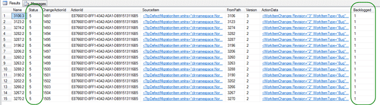

{ .post-img }

If you have no history in the system you are migrating to TFS, you may have problems when you try to do a continuous unidirectional sink due to your system not having a “revision” of the work item.

_WARNING: I have currently no answer for this issue and I will update this post when I get a resolution.  
_

### Updates

- **2011-06-12 15:25** – All fixed :) Check out [A working Test Track Pro Adapter for the TFS Integration Platform](http://blog.hinshelwood.com/a-working-test-track-pro-adapter-for-the-tfs-integration-platform/)

---

You will have seen my previous [post](http://blog.hinshelwood.com/creating-a-wit-adapter-for-the-tfs-integration-platform-for-a-source-with-no-history/) on the trial and tribulations with a custom Integration Platform Adapter, but Now, after the first successful run-through if I have edits that have happened since the last run and pass a history ID. Even if you take the latest version of the TFS Integration Platform (May) you will find that unless you can pass a consecutive revision number for each work item you will get a history not found error:

```
[03/06/2011 14:58:50] MigrationConsole.exe Information: 0 : WorkItemTracking: Processing ChangeGroup #1225, change 3267:3
[03/06/2011 14:58:50] MigrationConsole.exe Information: 0 : WorkItemTracking: Unresolved conflict:
[03/06/2011 14:58:50]   Session: adea805d-51df-489a-b2fd-9717b4af3703
[03/06/2011 14:58:50]   Source: 6e3bdf70-f1ae-4cd5-8ee4-133c8aee0857
[03/06/2011 14:58:50]   Message: Cannot find applicable resolution rule.
[03/06/2011 14:58:50]   Conflict Type: TFS WIT history not found conflict type
[03/06/2011 14:58:50]   Conflict Type Reference Name: 1722df87-ab61-4ad0-8b41-531d3d804089
[03/06/2011 14:58:50]   Conflict Details: <?xml version="1.0"?>
[03/06/2011 14:58:50] <WorkItemHistoryNotFoundConflictTypeDetails xmlns:xsi="http://www.w3.org/2001/XMLSchema-instance" xmlns:xsd="http://www.w3.org/2001/XMLSchema">
[03/06/2011 14:58:50]   <SourceWorkItemID>3267</SourceWorkItemID>
[03/06/2011 14:58:50]   <SourceWorkItemRevision>3</SourceWorkItemRevision>
[03/06/2011 14:58:50]   <SourceMigrationSourceId>c513f930-2602-400d-a0bf-a2a3ab434df5</SourceMigrationSourceId>
[03/06/2011 14:58:50]   <TargetMigrationSourceId>6e3bdf70-f1ae-4cd5-8ee4-133c8aee0857</TargetMigrationSourceId>
[03/06/2011 14:58:50] </WorkItemHistoryNotFoundConflictTypeDetails>
```

**Figure: TFS WIT history not found conflict type**

I needed to simulate the revision and as you say in my previous post the idea was posited that I could have a single counter that applied the revision to all the work items. The belief was that revisions did not need to be consecutive.

This does not seam to be the case as I always get a WorkItemHistoryNotFoundConflictTypeDetails exception when they are not consecutive. This seams to happen when you try to save revision 3 after you have saved revision 1 for a work item. I am skipping revision 2 as it never happen.

```
[03/06/2011 15:48:43] MigrationConsole started...
[03/06/2011 15:48:59] MigrationConsole.exe Information: 0 : ConfigurationChangeTracker did not detect any non-transient changes. No cached data will be deleted for session group '00000000-0000-0000-0000-000000000000'
[03/06/2011 15:48:59] MigrationConsole.exe Information: 0 : : StartSessionGroup: Enter with sessionGroupUniqueId: 9dd3ca16-d443-454a-8351-783c85c37b83
[03/06/2011 15:48:59] MigrationConsole.exe Information: 0 : : StartSessionGroup: Creating new SyncOrchestrator
[03/06/2011 15:49:00] MigrationConsole.exe Information: 0 : : Provider ChangeGroup Label AnalysisAddin Provider a4f53905-25b6-4311-ac0c-637da6688f2b is available
[03/06/2011 15:49:00] MigrationConsole.exe Information: 0 : : Provider Northwest Cadence CSV Adapter 06a2457f-ebba-4979-bc5f-0f5006b8b4e6 is available
[03/06/2011 15:49:00] MigrationConsole.exe Information: 0 : : Provider TFS 2008 User Identity Lookup Add-In Provider eecc0227-8006-45f0-888d-10ab03019ad5 is available
[03/06/2011 15:49:00] MigrationConsole.exe Information: 0 : : Provider File System Provider for TFS 2008 3a27f4de-8637-483c-945d-d2b20541df7c is available
[03/06/2011 15:49:00] MigrationConsole.exe Information: 0 : : Provider File System Provider for TFS 2010 43b0d301-9b38-4caa-a754-61e854a71c78 is available
[03/06/2011 15:49:00] MigrationConsole.exe Information: 0 : : Provider Semaphore File Analysis Addin Provider e8cec3c5-5848-4b83-904f-4324094c3f78 is available
[03/06/2011 15:49:00] MigrationConsole.exe Information: 0 : : Provider TFS 2008 Migration VC Provider 2f82c6c4-bbee-42fb-b3d0-4799cabcf00e is available
[03/06/2011 15:49:00] MigrationConsole.exe Information: 0 : : Provider TFS 2008 Migration WIT Provider 663a8b36-7852-4750-87fc-d189b0640fc1 is available
[03/06/2011 15:49:00] MigrationConsole.exe Information: 0 : : Provider TFS 2010 Migration VC Provider febc091f-82a2-449e-aed8-133e5896c47a is available
[03/06/2011 15:49:00] MigrationConsole.exe Information: 0 : : Provider TFS 2010 Migration WIT Provider 04201d39-6e47-416f-98b2-07f0013f8455 is available
[03/06/2011 15:49:00] MigrationConsole.exe Information: 0 : : Provider TestTrackPro TIP Adapter c0e63c2b-e06c-48bb-8698-243a82bb950e is available
[03/06/2011 15:49:01] MigrationConsole.exe Information: 0 : : CsvAdapter:GetService - Microsoft.TeamFoundation.Migration.Toolkit.IAddin
[03/06/2011 15:49:01] MigrationConsole.exe Information: 0 : : Provider TFS 2010 Migration WIT Provider 04201d39-6e47-416f-98b2-07f0013f8455 is loaded
[03/06/2011 15:49:01] MigrationConsole.exe Information: 0 : : TtpAdapter:GetService - Microsoft.TeamFoundation.Migration.Toolkit.IAddin
[03/06/2011 15:49:01] MigrationConsole.exe Information: 0 : : TtpAdapter:GetService - Cant find--
[03/06/2011 15:49:01] MigrationConsole.exe Information: 0 : : Provider TestTrackPro TIP Adapter c0e63c2b-e06c-48bb-8698-243a82bb950e is loaded
[03/06/2011 15:49:01] MigrationConsole.exe Information: 0 : : 2 Adapter instance(s) loaded
[03/06/2011 15:49:01] MigrationConsole.exe Information: 0 : : 3 Add-Ins loaded
[03/06/2011 15:49:05] MigrationConsole.exe Information: 0 : : Active Directory lookup will be used for this end point.
[03/06/2011 15:49:09] MigrationConsole.exe Information: 0 : : TtpAdapter:GetService - Microsoft.TeamFoundation.Migration.Toolkit.IAnalysisProvider
[03/06/2011 15:49:09] MigrationConsole.exe Information: 0 : : TtpAdapter:GetService Creating - TtpAnalysisProvider
[03/06/2011 15:49:09] MigrationConsole.exe Information: 0 : : TtpAdapter:GetService Returning - NorthwestCadence.TtpTipAdapter.TtpAnalysisProvider
[03/06/2011 15:49:09] MigrationConsole.exe Information: 0 : : TtpWIT:AP:InitializeServices
[03/06/2011 15:49:09] MigrationConsole.exe Information: 0 : : TtpWIT:AP:RegisterSupportedChangeActions
[03/06/2011 15:49:09] MigrationConsole.exe Information: 0 : : TtpWIT:AP:RegisterConflictTypes
[03/06/2011 15:49:09] MigrationConsole.exe Information: 0 : : TtpAdapter:GetService - Microsoft.TeamFoundation.Migration.Toolkit.Services.IServerPathTranslationService
[03/06/2011 15:49:09] MigrationConsole.exe Information: 0 : : TtpAdapter:GetService - Cant find--
[03/06/2011 15:49:09] MigrationConsole.exe Information: 0 : : TtpAdapter:GetService - Microsoft.TeamFoundation.Migration.Toolkit.IMigrationProvider
[03/06/2011 15:49:09] MigrationConsole.exe Information: 0 : : TtpAdapter:GetService Creating - TtpMigrationProvider
[03/06/2011 15:49:09] MigrationConsole.exe Information: 0 : : TtpAdapter:GetService Returning - NorthwestCadence.TtpTipAdapter.TtpAnalysisProvider
[03/06/2011 15:49:09] MigrationConsole.exe Information: 0 : : TtpWIT:AP:RegisterConflictTypes
[03/06/2011 15:49:09] MigrationConsole.exe Information: 0 : : TtpAdapter:GetService - Microsoft.TeamFoundation.Migration.Toolkit.ILinkProvider
[03/06/2011 15:49:09] MigrationConsole.exe Information: 0 : : TtpAdapter:GetService - Cant find--
[03/06/2011 15:49:09] MigrationConsole.exe Information: 0 : : Connecting to 'http://tfs01.nwcadence.com:8080/tfs/defaultcollection'
[03/06/2011 15:49:10] MigrationConsole.exe Information: 0 : : Connected to 'http://tfs01.nwcadence.com:8080/tfs/defaultcollection'
[03/06/2011 15:49:10] MigrationConsole.exe Information: 0 : : Connecting to 'http://tfs01.nwcadence.com:8080/tfs/defaultcollection'
[03/06/2011 15:49:10] MigrationConsole.exe Information: 0 : : Connected to 'http://tfs01.nwcadence.com:8080/tfs/defaultcollection'
[03/06/2011 15:49:11] MigrationConsole.exe Information: 0 : : TtpWIT:AP:InitializeClient
[03/06/2011 15:49:11] MigrationConsole.exe Information: 0 : : Connecting to 'http://tfs01.nwcadence.com:8080/tfs/defaultcollection'
[03/06/2011 15:49:11] MigrationConsole.exe Information: 0 : : Connected to 'http://tfs01.nwcadence.com:8080/tfs/defaultcollection'
[03/06/2011 15:49:12] MigrationConsole.exe Information: 0 : : Connecting to 'http://tfs01.nwcadence.com:8080/tfs/defaultcollection'
[03/06/2011 15:49:12] MigrationConsole.exe Information: 0 : : Connected to 'http://tfs01.nwcadence.com:8080/tfs/defaultcollection'
[03/06/2011 15:49:13] MigrationConsole.exe Information: 0 : : StartSessionGroup: Starting SyncOrchestrator; now 0 running sessions
[03/06/2011 15:49:13] MigrationConsole.exe Information: 0 : WorkItemTracking: Session worker thread [WorkItemTracking] started
[03/06/2011 15:49:13] MigrationConsole.exe Information: 0 : WorkItemTracking: Pipeline flow from 03962300-f2ab-4ebe-8693-9a69d62523ca to 2edeeb84-fec1-4a69-8e71-61516037875d
[03/06/2011 15:49:13] MigrationConsole.exe Information: 0 : WorkItemTracking: Generating delta tables for the migration source 03962300-f2ab-4ebe-8693-9a69d62523ca
[03/06/2011 15:49:13] MigrationConsole.exe Information: 0 : WorkItemTracking: TtpWIT:AP:GenerateDeltaTable:View - NWC_Test
[03/06/2011 15:49:13] MigrationConsole.exe Information: 0 : WorkItemTracking: -GetTtpContext
[03/06/2011 15:49:13] MigrationConsole.exe Information: 0 : WorkItemTracking:     -GetTtpContext Loading Ttp  http://ttp.nwcadence.com/scripts/ttsoapcgi.exe
[03/06/2011 15:49:17] MigrationConsole.exe Information: 0 : WorkItemTracking: -GetTtpContext Connected to 'NorthwestCadence.TtpTipAdapter.TtpSoapSdk.api.CDatabase' on 'http://ttp.nwcadence.com/scripts/ttsoapcgi.exe' in 4.131 seconds
[03/06/2011 15:49:18] MigrationConsole.exe Information: 0 : WorkItemTracking: -GetTtpRawData '137' columns in 5.153 seconds
[03/06/2011 15:49:18] MigrationConsole.exe Information: 0 : WorkItemTracking: -GetTtpRawData Atempting get on all data
[03/06/2011 15:49:22] MigrationConsole.exe Information: 0 : WorkItemTracking: -GetTtpRawData Found 27 records in 9.279 seconds
[03/06/2011 15:49:22] MigrationConsole.exe Information: 0 : WorkItemTracking: -GetTtpRawData  1 of 27 - 'Defect' Number '3280' has loaded in 9.425 seconds
[03/06/2011 15:49:22] MigrationConsole.exe Information: 0 : WorkItemTracking: -GetTtpRawData  2 of 27 - 'Defect' Number '3106' has loaded in 9.469 seconds
[03/06/2011 15:49:22] MigrationConsole.exe Information: 0 : WorkItemTracking: -GetTtpRawData  3 of 27 - 'Defect' Number '3123' has loaded in 9.513 seconds
[03/06/2011 15:49:22] MigrationConsole.exe Information: 0 : WorkItemTracking: -GetTtpRawData  4 of 27 - 'Support Ticket' Number '3214' has loaded in 9.556 seconds
[03/06/2011 15:49:23] MigrationConsole.exe Information: 0 : WorkItemTracking: -GetTtpRawData  5 of 27 - 'Defect' Number '3274' has loaded in 9.602 seconds
[03/06/2011 15:49:23] MigrationConsole.exe Information: 0 : WorkItemTracking: -GetTtpRawData  6 of 27 - 'Defect' Number '3277' has loaded in 9.646 seconds
[03/06/2011 15:49:23] MigrationConsole.exe Information: 0 : WorkItemTracking: -GetTtpRawData  7 of 27 - 'Defect' Number '3279' has loaded in 9.69 seconds
[03/06/2011 15:49:23] MigrationConsole.exe Information: 0 : WorkItemTracking: -GetTtpRawData  8 of 27 - 'Defect' Number '3281' has loaded in 9.735 seconds
[03/06/2011 15:49:23] MigrationConsole.exe Information: 0 : WorkItemTracking: -GetTtpRawData  9 of 27 - 'Defect' Number '3282' has loaded in 9.778 seconds
[03/06/2011 15:49:23] MigrationConsole.exe Information: 0 : WorkItemTracking: -GetTtpRawData  10 of 27 - 'Defect' Number '3283' has loaded in 9.824 seconds
[03/06/2011 15:49:23] MigrationConsole.exe Information: 0 : WorkItemTracking: -GetTtpRawData  11 of 27 - 'Defect' Number '3284' has loaded in 9.865 seconds
[03/06/2011 15:49:23] MigrationConsole.exe Information: 0 : WorkItemTracking: -GetTtpRawData  12 of 27 - 'Defect' Number '3285' has loaded in 9.955 seconds
[03/06/2011 15:49:23] MigrationConsole.exe Information: 0 : WorkItemTracking: -GetTtpRawData  13 of 27 - 'Defect' Number '3287' has loaded in 10.062 seconds
[03/06/2011 15:49:23] MigrationConsole.exe Information: 0 : WorkItemTracking: -GetTtpRawData  14 of 27 - 'Defect' Number '3196' has loaded in 10.209 seconds
[03/06/2011 15:49:23] MigrationConsole.exe Information: 0 : WorkItemTracking: -GetTtpRawData  15 of 27 - 'Defect' Number '3206' has loaded in 10.28 seconds
[03/06/2011 15:49:23] MigrationConsole.exe Information: 0 : WorkItemTracking: -GetTtpRawData  16 of 27 - 'Defect' Number '3212' has loaded in 10.326 seconds
[03/06/2011 15:49:23] MigrationConsole.exe Information: 0 : WorkItemTracking: -GetTtpRawData  17 of 27 - 'Defect' Number '3260' has loaded in 10.367 seconds
[03/06/2011 15:49:23] MigrationConsole.exe Information: 0 : WorkItemTracking: -GetTtpRawData  18 of 27 - 'Defect' Number '3263' has loaded in 10.409 seconds
[03/06/2011 15:49:23] MigrationConsole.exe Information: 0 : WorkItemTracking: -GetTtpRawData  19 of 27 - 'Defect' Number '3275' has loaded in 10.451 seconds
[03/06/2011 15:49:23] MigrationConsole.exe Information: 0 : WorkItemTracking: -GetTtpRawData  20 of 27 - 'Defect' Number '3288' has loaded in 10.49 seconds
[03/06/2011 15:49:23] MigrationConsole.exe Information: 0 : WorkItemTracking: -GetTtpRawData  21 of 27 - 'Defect' Number '3164' has loaded in 10.528 seconds
[03/06/2011 15:49:23] MigrationConsole.exe Information: 0 : WorkItemTracking: -GetTtpRawData  22 of 27 - 'Defect' Number '3190' has loaded in 10.566 seconds
[03/06/2011 15:49:27] MigrationConsole.exe Information: 0 : WorkItemTracking: -GetTtpRawData  23 of 27 - 'Defect' Number '3202' has loaded in 10.607 seconds
[03/06/2011 15:49:27] MigrationConsole.exe Information: 0 : WorkItemTracking: -GetTtpRawData  24 of 27 - 'Defect' Number '3266' has loaded in 10.646 seconds
[03/06/2011 15:49:27] MigrationConsole.exe Information: 0 : WorkItemTracking: -GetTtpRawData  25 of 27 - 'Defect' Number '3267' has loaded in 10.689 seconds
[03/06/2011 15:49:27] MigrationConsole.exe Information: 0 : WorkItemTracking: -GetTtpRawData  26 of 27 - 'Defect' Number '3270' has loaded in 10.729 seconds
[03/06/2011 15:49:27] MigrationConsole.exe Information: 0 : WorkItemTracking: -GetTtpRawData  27 of 27 - 'Defect' Number '3286' has loaded in 10.769 seconds
[03/06/2011 15:49:27] MigrationConsole.exe Information: 0 : WorkItemTracking: Located 27 raw updates since 01/01/0001 00:00:00 in 10.771 seconds
[03/06/2011 15:49:27] MigrationConsole.exe Information: 0 : WorkItemTracking: Located 27 deltas in 10.774 seconds
[03/06/2011 15:49:27] MigrationConsole.exe Information: 0 : WorkItemTracking: SKIPPED: Updated 27 deltas with workflow in 10.775 seconds
[03/06/2011 15:49:28] MigrationConsole.exe Information: 0 : WorkItemTracking: -GetChangeGroups  1 of 27 - 'Defect' Number '3280' has passed processing revision 0 as ADD in 14.707 seconds
[03/06/2011 15:49:30] MigrationConsole.exe Information: 0 : WorkItemTracking: -GetChangeGroups  2 of 27 - 'Defect' Number '3106' has passed processing revision 0 as ADD in 15.717 seconds
[03/06/2011 15:49:31] MigrationConsole.exe Information: 0 : WorkItemTracking: -GetChangeGroups  3 of 27 - 'Defect' Number '3123' has passed processing revision 0 as ADD in 17.38 seconds
[03/06/2011 15:49:31] MigrationConsole.exe Information: 0 : WorkItemTracking: -GetChangeGroups  4 of 27 - 'Support Ticket' Number '3214' has passed processing revision 0 as ADD in 18.013 seconds
[03/06/2011 15:49:41] MigrationConsole.exe Information: 0 : WorkItemTracking: -GetChangeGroups  5 of 27 - 'Defect' Number '3274' has passed processing revision 0 as ADD in 18.684 seconds
[03/06/2011 15:49:41] MigrationConsole.exe Information: 0 : WorkItemTracking: -GetChangeGroups  6 of 27 - 'Defect' Number '3277' has passed processing revision 0 as ADD in 19.19 seconds
[03/06/2011 15:49:42] MigrationConsole.exe Information: 0 : WorkItemTracking: -GetChangeGroups  7 of 27 - 'Defect' Number '3279' has passed processing revision 0 as ADD in 28.997 seconds
[03/06/2011 15:49:42] MigrationConsole.exe Information: 0 : WorkItemTracking: -GetChangeGroups  8 of 27 - 'Defect' Number '3281' has passed processing revision 0 as ADD in 29.074 seconds
[03/06/2011 15:49:42] MigrationConsole.exe Information: 0 : WorkItemTracking: -GetChangeGroups  9 of 27 - 'Defect' Number '3282' has passed processing revision 0 as ADD in 29.154 seconds
[03/06/2011 15:49:42] MigrationConsole.exe Information: 0 : WorkItemTracking: -GetChangeGroups  10 of 27 - 'Defect' Number '3283' has passed processing revision 0 as ADD in 29.234 seconds
[03/06/2011 15:49:42] MigrationConsole.exe Information: 0 : WorkItemTracking: -GetChangeGroups  11 of 27 - 'Defect' Number '3284' has passed processing revision 0 as ADD in 29.312 seconds
[03/06/2011 15:49:42] MigrationConsole.exe Information: 0 : WorkItemTracking: -GetChangeGroups  12 of 27 - 'Defect' Number '3285' has passed processing revision 0 as ADD in 29.39 seconds
[03/06/2011 15:49:42] MigrationConsole.exe Information: 0 : WorkItemTracking: -GetChangeGroups  13 of 27 - 'Defect' Number '3287' has passed processing revision 0 as ADD in 29.465 seconds
[03/06/2011 15:49:42] MigrationConsole.exe Information: 0 : WorkItemTracking: -GetChangeGroups  14 of 27 - 'Defect' Number '3196' has passed processing revision 0 as ADD in 29.54 seconds
[03/06/2011 15:49:42] MigrationConsole.exe Information: 0 : WorkItemTracking: -GetChangeGroups  15 of 27 - 'Defect' Number '3206' has passed processing revision 0 as ADD in 29.614 seconds
[03/06/2011 15:49:42] MigrationConsole.exe Information: 0 : WorkItemTracking: -GetChangeGroups  16 of 27 - 'Defect' Number '3212' has passed processing revision 0 as ADD in 29.692 seconds
[03/06/2011 15:49:42] MigrationConsole.exe Information: 0 : WorkItemTracking: -GetChangeGroups  17 of 27 - 'Defect' Number '3260' has passed processing revision 0 as ADD in 29.767 seconds
[03/06/2011 15:49:43] MigrationConsole.exe Information: 0 : WorkItemTracking: -GetChangeGroups  18 of 27 - 'Defect' Number '3263' has passed processing revision 0 as ADD in 29.909 seconds
[03/06/2011 15:49:43] MigrationConsole.exe Information: 0 : WorkItemTracking: -GetChangeGroups  19 of 27 - 'Defect' Number '3275' has passed processing revision 0 as ADD in 30.024 seconds
[03/06/2011 15:49:43] MigrationConsole.exe Information: 0 : WorkItemTracking: -GetChangeGroups  20 of 27 - 'Defect' Number '3288' has passed processing revision 0 as ADD in 30.106 seconds
[03/06/2011 15:49:43] MigrationConsole.exe Information: 0 : WorkItemTracking: -GetChangeGroups  21 of 27 - 'Defect' Number '3164' has passed processing revision 0 as ADD in 30.182 seconds
[03/06/2011 15:49:43] MigrationConsole.exe Information: 0 : WorkItemTracking: -GetChangeGroups  22 of 27 - 'Defect' Number '3190' has passed processing revision 0 as ADD in 30.257 seconds
[03/06/2011 15:49:43] MigrationConsole.exe Information: 0 : WorkItemTracking: -GetChangeGroups  23 of 27 - 'Defect' Number '3202' has passed processing revision 0 as ADD in 30.333 seconds
[03/06/2011 15:49:43] MigrationConsole.exe Information: 0 : WorkItemTracking: -GetChangeGroups  24 of 27 - 'Defect' Number '3266' has passed processing revision 0 as ADD in 30.414 seconds
[03/06/2011 15:49:43] MigrationConsole.exe Information: 0 : WorkItemTracking: -GetChangeGroups  25 of 27 - 'Defect' Number '3267' has passed processing revision 0 as ADD in 30.499 seconds
[03/06/2011 15:49:43] MigrationConsole.exe Information: 0 : WorkItemTracking: -GetChangeGroups  26 of 27 - 'Defect' Number '3270' has passed processing revision 0 as ADD in 30.574 seconds
[03/06/2011 15:49:43] MigrationConsole.exe Information: 0 : WorkItemTracking: -GetChangeGroups  27 of 27 - 'Defect' Number '3286' has passed processing revision 0 as ADD in 30.676 seconds
[03/06/2011 15:49:43] MigrationConsole.exe Information: 0 : WorkItemTracking: Created 27 change groups in 30.721 seconds
[03/06/2011 15:49:46] MigrationConsole.exe Information: 0 : WorkItemTracking: Saved 27 change groups in 33.711 seconds
[03/06/2011 15:49:46] MigrationConsole.exe Information: 0 : WorkItemTracking: Generating linking delta for the migration source 03962300-f2ab-4ebe-8693-9a69d62523ca
[03/06/2011 15:49:46] MigrationConsole.exe Information: 0 : WorkItemTracking: Generating delta tables for the migration source 2edeeb84-fec1-4a69-8e71-61516037875d
[03/06/2011 15:49:46] MigrationConsole.exe Information: 0 : WorkItemTracking: Getting modified items from '2edeeb84-fec1-4a69-8e71-61516037875d!tfs01.nwcadence.comDefaultCollection (MPT2Sandbox)'
[03/06/2011 15:49:46] MigrationConsole.exe Information: 0 : WorkItemTracking: Connecting to 'http://tfs01.nwcadence.com:8080/tfs/defaultcollection'
[03/06/2011 15:49:46] MigrationConsole.exe Information: 0 : WorkItemTracking: Connected to 'http://tfs01.nwcadence.com:8080/tfs/defaultcollection'
[03/06/2011 15:49:47] MigrationConsole.exe Information: 0 : WorkItemTracking: TFS Query: SELECT [System.Id], [System.Rev] FROM WorkItems WHERE ([System.TeamProject]=@project AND ([System.Id] = 0)) ORDER BY [System.Id]
[03/06/2011 15:49:47] MigrationConsole.exe Information: 0 : WorkItemTracking: TFS Query: returned 0 item(s)
[03/06/2011 15:49:47] MigrationConsole.exe Information: 0 : WorkItemTracking: Received modified items from '2edeeb84-fec1-4a69-8e71-61516037875d!tfs01.nwcadence.comDefaultCollection (MPT2Sandbox)'
[03/06/2011 15:49:47] MigrationConsole.exe Information: 0 : WorkItemTracking: Persisted WIT HWM: HWMDeltaWit
[03/06/2011 15:49:47] MigrationConsole.exe Information: 0 : WorkItemTracking: Updated high watermark to '06/03/2011 22:49:47'
[03/06/2011 15:49:47] MigrationConsole.exe Information: 0 : WorkItemTracking: Generating migration instructions for the migration source 2edeeb84-fec1-4a69-8e71-61516037875d
[03/06/2011 15:49:47] MigrationConsole.exe Information: 0 : WorkItemTracking: TtpDefectMigrationItemSerializer:LoadItem
[03/06/2011 15:49:48] MigrationConsole.exe Information: 0 : WorkItemTracking: TtpDefectMigrationItemSerializer:LoadItem
[03/06/2011 15:49:48] MigrationConsole.exe Information: 0 : WorkItemTracking: TtpDefectMigrationItemSerializer:LoadItem
[03/06/2011 15:49:48] MigrationConsole.exe Information: 0 : WorkItemTracking: TtpDefectMigrationItemSerializer:LoadItem
[03/06/2011 15:49:48] MigrationConsole.exe Information: 0 : WorkItemTracking: TtpDefectMigrationItemSerializer:LoadItem
[03/06/2011 15:49:48] MigrationConsole.exe Information: 0 : WorkItemTracking: TtpDefectMigrationItemSerializer:LoadItem
[03/06/2011 15:49:48] MigrationConsole.exe Information: 0 : WorkItemTracking: TtpDefectMigrationItemSerializer:LoadItem
[03/06/2011 15:49:48] MigrationConsole.exe Information: 0 : WorkItemTracking: TtpDefectMigrationItemSerializer:LoadItem
[03/06/2011 15:49:48] MigrationConsole.exe Information: 0 : WorkItemTracking: TtpDefectMigrationItemSerializer:LoadItem
[03/06/2011 15:49:48] MigrationConsole.exe Information: 0 : WorkItemTracking: TtpDefectMigrationItemSerializer:LoadItem
[03/06/2011 15:49:48] MigrationConsole.exe Information: 0 : WorkItemTracking: TtpDefectMigrationItemSerializer:LoadItem
[03/06/2011 15:49:48] MigrationConsole.exe Information: 0 : WorkItemTracking: TtpDefectMigrationItemSerializer:LoadItem
[03/06/2011 15:49:48] MigrationConsole.exe Information: 0 : WorkItemTracking: TtpDefectMigrationItemSerializer:LoadItem
[03/06/2011 15:49:49] MigrationConsole.exe Information: 0 : WorkItemTracking: TtpDefectMigrationItemSerializer:LoadItem
[03/06/2011 15:49:49] MigrationConsole.exe Information: 0 : WorkItemTracking: TtpDefectMigrationItemSerializer:LoadItem
[03/06/2011 15:49:49] MigrationConsole.exe Information: 0 : WorkItemTracking: TtpDefectMigrationItemSerializer:LoadItem
[03/06/2011 15:49:49] MigrationConsole.exe Information: 0 : WorkItemTracking: TtpDefectMigrationItemSerializer:LoadItem
[03/06/2011 15:49:49] MigrationConsole.exe Information: 0 : WorkItemTracking: TtpDefectMigrationItemSerializer:LoadItem
[03/06/2011 15:49:49] MigrationConsole.exe Information: 0 : WorkItemTracking: TtpDefectMigrationItemSerializer:LoadItem
[03/06/2011 15:49:49] MigrationConsole.exe Information: 0 : WorkItemTracking: TtpDefectMigrationItemSerializer:LoadItem
[03/06/2011 15:49:49] MigrationConsole.exe Information: 0 : WorkItemTracking: TtpDefectMigrationItemSerializer:LoadItem
[03/06/2011 15:49:49] MigrationConsole.exe Information: 0 : WorkItemTracking: TtpDefectMigrationItemSerializer:LoadItem
[03/06/2011 15:49:49] MigrationConsole.exe Information: 0 : WorkItemTracking: TtpDefectMigrationItemSerializer:LoadItem
[03/06/2011 15:49:49] MigrationConsole.exe Information: 0 : WorkItemTracking: TtpDefectMigrationItemSerializer:LoadItem
[03/06/2011 15:49:49] MigrationConsole.exe Information: 0 : WorkItemTracking: TtpDefectMigrationItemSerializer:LoadItem
[03/06/2011 15:49:49] MigrationConsole.exe Information: 0 : WorkItemTracking: TtpDefectMigrationItemSerializer:LoadItem
[03/06/2011 15:49:49] MigrationConsole.exe Information: 0 : WorkItemTracking: TtpDefectMigrationItemSerializer:LoadItem
[03/06/2011 15:49:49] MigrationConsole.exe Information: 0 : WorkItemTracking: Generating migration instruction for ChangeGroup 1335
[03/06/2011 15:49:49] MigrationConsole.exe Information: 0 : WorkItemTracking: Generating migration instruction for ChangeGroup 1336
[03/06/2011 15:49:50] MigrationConsole.exe Information: 0 : WorkItemTracking: Generating migration instruction for ChangeGroup 1337
[03/06/2011 15:49:50] MigrationConsole.exe Information: 0 : WorkItemTracking: Generating migration instruction for ChangeGroup 1338
[03/06/2011 15:49:50] MigrationConsole.exe Information: 0 : WorkItemTracking: Aggregating field 'Verify Version' is not in the WIT update document of Change Action 1338'
[03/06/2011 15:49:50] MigrationConsole.exe Information: 0 : WorkItemTracking: Generating migration instruction for ChangeGroup 1339
[03/06/2011 15:49:50] MigrationConsole.exe Information: 0 : WorkItemTracking: Generating migration instruction for ChangeGroup 1340
[03/06/2011 15:49:51] MigrationConsole.exe Information: 0 : WorkItemTracking: Generating migration instruction for ChangeGroup 1341
[03/06/2011 15:49:51] MigrationConsole.exe Information: 0 : WorkItemTracking: Generating migration instruction for ChangeGroup 1342
[03/06/2011 15:49:51] MigrationConsole.exe Information: 0 : WorkItemTracking: Generating migration instruction for ChangeGroup 1343
[03/06/2011 15:49:51] MigrationConsole.exe Information: 0 : WorkItemTracking: Generating migration instruction for ChangeGroup 1344
[03/06/2011 15:49:52] MigrationConsole.exe Information: 0 : WorkItemTracking: Generating migration instruction for ChangeGroup 1345
[03/06/2011 15:49:52] MigrationConsole.exe Information: 0 : WorkItemTracking: Generating migration instruction for ChangeGroup 1346
[03/06/2011 15:49:52] MigrationConsole.exe Information: 0 : WorkItemTracking: Generating migration instruction for ChangeGroup 1347
[03/06/2011 15:49:52] MigrationConsole.exe Information: 0 : WorkItemTracking: Generating migration instruction for ChangeGroup 1348
[03/06/2011 15:49:52] MigrationConsole.exe Information: 0 : WorkItemTracking: Generating migration instruction for ChangeGroup 1349
[03/06/2011 15:49:53] MigrationConsole.exe Information: 0 : WorkItemTracking: Generating migration instruction for ChangeGroup 1350
[03/06/2011 15:49:53] MigrationConsole.exe Information: 0 : WorkItemTracking: Generating migration instruction for ChangeGroup 1351
[03/06/2011 15:49:53] MigrationConsole.exe Information: 0 : WorkItemTracking: Generating migration instruction for ChangeGroup 1352
[03/06/2011 15:49:53] MigrationConsole.exe Information: 0 : WorkItemTracking: Generating migration instruction for ChangeGroup 1353
[03/06/2011 15:49:54] MigrationConsole.exe Information: 0 : WorkItemTracking: Generating migration instruction for ChangeGroup 1354
[03/06/2011 15:49:54] MigrationConsole.exe Information: 0 : WorkItemTracking: Generating migration instruction for ChangeGroup 1355
[03/06/2011 15:49:54] MigrationConsole.exe Information: 0 : WorkItemTracking: Generating migration instruction for ChangeGroup 1356
[03/06/2011 15:49:54] MigrationConsole.exe Information: 0 : WorkItemTracking: Generating migration instruction for ChangeGroup 1357
[03/06/2011 15:49:55] MigrationConsole.exe Information: 0 : WorkItemTracking: Generating migration instruction for ChangeGroup 1358
[03/06/2011 15:49:55] MigrationConsole.exe Information: 0 : WorkItemTracking: Generating migration instruction for ChangeGroup 1359
[03/06/2011 15:49:55] MigrationConsole.exe Information: 0 : WorkItemTracking: Generating migration instruction for ChangeGroup 1360
[03/06/2011 15:49:55] MigrationConsole.exe Information: 0 : WorkItemTracking: Generating migration instruction for ChangeGroup 1361
[03/06/2011 15:49:56] MigrationConsole.exe Information: 0 : WorkItemTracking: Starting basic conflict detection
[03/06/2011 15:49:56] MigrationConsole.exe Information: 0 : WorkItemTracking: Finishing basic conflict detection
[03/06/2011 15:49:56] MigrationConsole.exe Information: 0 : WorkItemTracking: Loading 50 ChangeGroup(s)
[03/06/2011 15:49:56] MigrationConsole.exe Information: 0 : WorkItemTracking: TtpDefectMigrationItemSerializer:LoadItem
[03/06/2011 15:49:56] MigrationConsole.exe Information: 0 : WorkItemTracking: TtpDefectMigrationItemSerializer:LoadItem
[03/06/2011 15:49:56] MigrationConsole.exe Information: 0 : WorkItemTracking: TtpDefectMigrationItemSerializer:LoadItem
[03/06/2011 15:49:56] MigrationConsole.exe Information: 0 : WorkItemTracking: TtpDefectMigrationItemSerializer:LoadItem
[03/06/2011 15:49:56] MigrationConsole.exe Information: 0 : WorkItemTracking: TtpDefectMigrationItemSerializer:LoadItem
[03/06/2011 15:49:56] MigrationConsole.exe Information: 0 : WorkItemTracking: TtpDefectMigrationItemSerializer:LoadItem
[03/06/2011 15:49:56] MigrationConsole.exe Information: 0 : WorkItemTracking: TtpDefectMigrationItemSerializer:LoadItem
[03/06/2011 15:49:56] MigrationConsole.exe Information: 0 : WorkItemTracking: TtpDefectMigrationItemSerializer:LoadItem
[03/06/2011 15:49:56] MigrationConsole.exe Information: 0 : WorkItemTracking: TtpDefectMigrationItemSerializer:LoadItem
[03/06/2011 15:49:56] MigrationConsole.exe Information: 0 : WorkItemTracking: TtpDefectMigrationItemSerializer:LoadItem
[03/06/2011 15:49:56] MigrationConsole.exe Information: 0 : WorkItemTracking: TtpDefectMigrationItemSerializer:LoadItem
[03/06/2011 15:49:56] MigrationConsole.exe Information: 0 : WorkItemTracking: TtpDefectMigrationItemSerializer:LoadItem
[03/06/2011 15:49:56] MigrationConsole.exe Information: 0 : WorkItemTracking: TtpDefectMigrationItemSerializer:LoadItem
[03/06/2011 15:49:56] MigrationConsole.exe Information: 0 : WorkItemTracking: TtpDefectMigrationItemSerializer:LoadItem
[03/06/2011 15:49:56] MigrationConsole.exe Information: 0 : WorkItemTracking: TtpDefectMigrationItemSerializer:LoadItem
[03/06/2011 15:49:56] MigrationConsole.exe Information: 0 : WorkItemTracking: TtpDefectMigrationItemSerializer:LoadItem
[03/06/2011 15:49:56] MigrationConsole.exe Information: 0 : WorkItemTracking: TtpDefectMigrationItemSerializer:LoadItem
[03/06/2011 15:49:56] MigrationConsole.exe Information: 0 : WorkItemTracking: TtpDefectMigrationItemSerializer:LoadItem
[03/06/2011 15:49:56] MigrationConsole.exe Information: 0 : WorkItemTracking: TtpDefectMigrationItemSerializer:LoadItem
[03/06/2011 15:49:56] MigrationConsole.exe Information: 0 : WorkItemTracking: TtpDefectMigrationItemSerializer:LoadItem
[03/06/2011 15:49:56] MigrationConsole.exe Information: 0 : WorkItemTracking: TtpDefectMigrationItemSerializer:LoadItem
[03/06/2011 15:49:56] MigrationConsole.exe Information: 0 : WorkItemTracking: TtpDefectMigrationItemSerializer:LoadItem
[03/06/2011 15:49:57] MigrationConsole.exe Information: 0 : WorkItemTracking: TtpDefectMigrationItemSerializer:LoadItem
[03/06/2011 15:49:57] MigrationConsole.exe Information: 0 : WorkItemTracking: TtpDefectMigrationItemSerializer:LoadItem
[03/06/2011 15:49:57] MigrationConsole.exe Information: 0 : WorkItemTracking: TtpDefectMigrationItemSerializer:LoadItem
[03/06/2011 15:49:57] MigrationConsole.exe Information: 0 : WorkItemTracking: TtpDefectMigrationItemSerializer:LoadItem
[03/06/2011 15:49:57] MigrationConsole.exe Information: 0 : WorkItemTracking: TtpDefectMigrationItemSerializer:LoadItem
[03/06/2011 15:49:57] MigrationConsole.exe Information: 0 : WorkItemTracking: Target AnalysisProvider detecting conflicts in ChangeGroup #1362
[03/06/2011 15:49:57] MigrationConsole.exe Information: 0 : WorkItemTracking: Target AnalysisProvider detecting conflicts in ChangeGroup #1363
[03/06/2011 15:49:57] MigrationConsole.exe Information: 0 : WorkItemTracking: Target AnalysisProvider detecting conflicts in ChangeGroup #1364
[03/06/2011 15:49:57] MigrationConsole.exe Information: 0 : WorkItemTracking: Target AnalysisProvider detecting conflicts in ChangeGroup #1365
[03/06/2011 15:49:57] MigrationConsole.exe Information: 0 : WorkItemTracking: Target AnalysisProvider detecting conflicts in ChangeGroup #1366
[03/06/2011 15:49:57] MigrationConsole.exe Information: 0 : WorkItemTracking: Target AnalysisProvider detecting conflicts in ChangeGroup #1367
[03/06/2011 15:49:57] MigrationConsole.exe Information: 0 : WorkItemTracking: Target AnalysisProvider detecting conflicts in ChangeGroup #1368
[03/06/2011 15:49:57] MigrationConsole.exe Information: 0 : WorkItemTracking: Target AnalysisProvider detecting conflicts in ChangeGroup #1369
[03/06/2011 15:49:57] MigrationConsole.exe Information: 0 : WorkItemTracking: Target AnalysisProvider detecting conflicts in ChangeGroup #1370
[03/06/2011 15:49:57] MigrationConsole.exe Information: 0 : WorkItemTracking: Target AnalysisProvider detecting conflicts in ChangeGroup #1371
[03/06/2011 15:49:57] MigrationConsole.exe Information: 0 : WorkItemTracking: Target AnalysisProvider detecting conflicts in ChangeGroup #1372
[03/06/2011 15:49:57] MigrationConsole.exe Information: 0 : WorkItemTracking: Target AnalysisProvider detecting conflicts in ChangeGroup #1373
[03/06/2011 15:49:57] MigrationConsole.exe Information: 0 : WorkItemTracking: Target AnalysisProvider detecting conflicts in ChangeGroup #1374
[03/06/2011 15:49:57] MigrationConsole.exe Information: 0 : WorkItemTracking: Target AnalysisProvider detecting conflicts in ChangeGroup #1375
[03/06/2011 15:49:57] MigrationConsole.exe Information: 0 : WorkItemTracking: Target AnalysisProvider detecting conflicts in ChangeGroup #1376
[03/06/2011 15:49:57] MigrationConsole.exe Information: 0 : WorkItemTracking: Target AnalysisProvider detecting conflicts in ChangeGroup #1377
[03/06/2011 15:49:57] MigrationConsole.exe Information: 0 : WorkItemTracking: Target AnalysisProvider detecting conflicts in ChangeGroup #1378
[03/06/2011 15:49:57] MigrationConsole.exe Information: 0 : WorkItemTracking: Target AnalysisProvider detecting conflicts in ChangeGroup #1379
[03/06/2011 15:49:57] MigrationConsole.exe Information: 0 : WorkItemTracking: Target AnalysisProvider detecting conflicts in ChangeGroup #1380
[03/06/2011 15:49:57] MigrationConsole.exe Information: 0 : WorkItemTracking: Target AnalysisProvider detecting conflicts in ChangeGroup #1381
[03/06/2011 15:49:57] MigrationConsole.exe Information: 0 : WorkItemTracking: Target AnalysisProvider detecting conflicts in ChangeGroup #1382
[03/06/2011 15:49:57] MigrationConsole.exe Information: 0 : WorkItemTracking: Target AnalysisProvider detecting conflicts in ChangeGroup #1383
[03/06/2011 15:49:57] MigrationConsole.exe Information: 0 : WorkItemTracking: Target AnalysisProvider detecting conflicts in ChangeGroup #1384
[03/06/2011 15:49:57] MigrationConsole.exe Information: 0 : WorkItemTracking: Target AnalysisProvider detecting conflicts in ChangeGroup #1385
[03/06/2011 15:49:57] MigrationConsole.exe Information: 0 : WorkItemTracking: Target AnalysisProvider detecting conflicts in ChangeGroup #1386
[03/06/2011 15:49:57] MigrationConsole.exe Information: 0 : WorkItemTracking: Target AnalysisProvider detecting conflicts in ChangeGroup #1387
[03/06/2011 15:49:57] MigrationConsole.exe Information: 0 : WorkItemTracking: Target AnalysisProvider detecting conflicts in ChangeGroup #1388
[03/06/2011 15:49:57] MigrationConsole.exe Information: 0 : WorkItemTracking: Post-processing delta table entries from the migration source 2edeeb84-fec1-4a69-8e71-61516037875d
[03/06/2011 15:49:57] MigrationConsole.exe Information: 0 : WorkItemTracking: Marking as 'DeltaComplete' the target-side delta table for uni-directional session
[03/06/2011 15:49:57] MigrationConsole.exe Information: 0 : WorkItemTracking: Migrating to the migration source 2edeeb84-fec1-4a69-8e71-61516037875d
[03/06/2011 15:49:57] MigrationConsole.exe Information: 0 : WorkItemTracking: Loading 50 ChangeGroup(s)
[03/06/2011 15:49:57] MigrationConsole.exe Information: 0 : WorkItemTracking: TtpDefectMigrationItemSerializer:LoadItem
[03/06/2011 15:49:57] MigrationConsole.exe Information: 0 : WorkItemTracking: TtpDefectMigrationItemSerializer:LoadItem
[03/06/2011 15:49:57] MigrationConsole.exe Information: 0 : WorkItemTracking: TtpDefectMigrationItemSerializer:LoadItem
[03/06/2011 15:49:57] MigrationConsole.exe Information: 0 : WorkItemTracking: TtpDefectMigrationItemSerializer:LoadItem
[03/06/2011 15:49:57] MigrationConsole.exe Information: 0 : WorkItemTracking: TtpDefectMigrationItemSerializer:LoadItem
[03/06/2011 15:49:57] MigrationConsole.exe Information: 0 : WorkItemTracking: TtpDefectMigrationItemSerializer:LoadItem
[03/06/2011 15:49:57] MigrationConsole.exe Information: 0 : WorkItemTracking: TtpDefectMigrationItemSerializer:LoadItem
[03/06/2011 15:49:57] MigrationConsole.exe Information: 0 : WorkItemTracking: TtpDefectMigrationItemSerializer:LoadItem
[03/06/2011 15:49:57] MigrationConsole.exe Information: 0 : WorkItemTracking: TtpDefectMigrationItemSerializer:LoadItem
[03/06/2011 15:49:57] MigrationConsole.exe Information: 0 : WorkItemTracking: TtpDefectMigrationItemSerializer:LoadItem
[03/06/2011 15:49:57] MigrationConsole.exe Information: 0 : WorkItemTracking: TtpDefectMigrationItemSerializer:LoadItem
[03/06/2011 15:49:57] MigrationConsole.exe Information: 0 : WorkItemTracking: TtpDefectMigrationItemSerializer:LoadItem
[03/06/2011 15:49:57] MigrationConsole.exe Information: 0 : WorkItemTracking: TtpDefectMigrationItemSerializer:LoadItem
[03/06/2011 15:49:57] MigrationConsole.exe Information: 0 : WorkItemTracking: TtpDefectMigrationItemSerializer:LoadItem
[03/06/2011 15:49:57] MigrationConsole.exe Information: 0 : WorkItemTracking: TtpDefectMigrationItemSerializer:LoadItem
[03/06/2011 15:49:57] MigrationConsole.exe Information: 0 : WorkItemTracking: TtpDefectMigrationItemSerializer:LoadItem
[03/06/2011 15:49:58] MigrationConsole.exe Information: 0 : WorkItemTracking: TtpDefectMigrationItemSerializer:LoadItem
[03/06/2011 15:49:58] MigrationConsole.exe Information: 0 : WorkItemTracking: TtpDefectMigrationItemSerializer:LoadItem
[03/06/2011 15:49:58] MigrationConsole.exe Information: 0 : WorkItemTracking: TtpDefectMigrationItemSerializer:LoadItem
[03/06/2011 15:49:58] MigrationConsole.exe Information: 0 : WorkItemTracking: TtpDefectMigrationItemSerializer:LoadItem
[03/06/2011 15:49:58] MigrationConsole.exe Information: 0 : WorkItemTracking: TtpDefectMigrationItemSerializer:LoadItem
[03/06/2011 15:49:58] MigrationConsole.exe Information: 0 : WorkItemTracking: TtpDefectMigrationItemSerializer:LoadItem
[03/06/2011 15:49:58] MigrationConsole.exe Information: 0 : WorkItemTracking: TtpDefectMigrationItemSerializer:LoadItem
[03/06/2011 15:49:58] MigrationConsole.exe Information: 0 : WorkItemTracking: TtpDefectMigrationItemSerializer:LoadItem
[03/06/2011 15:49:58] MigrationConsole.exe Information: 0 : WorkItemTracking: TtpDefectMigrationItemSerializer:LoadItem
[03/06/2011 15:49:58] MigrationConsole.exe Information: 0 : WorkItemTracking: TtpDefectMigrationItemSerializer:LoadItem
[03/06/2011 15:49:58] MigrationConsole.exe Information: 0 : WorkItemTracking: TtpDefectMigrationItemSerializer:LoadItem
[03/06/2011 15:49:58] MigrationConsole.exe Information: 0 : WorkItemTracking: Processing ChangeGroup #1362, change 3280:0
[03/06/2011 15:49:58] MigrationConsole.exe Information: 0 : WorkItemTracking: Connecting to 'http://tfs01.nwcadence.com:8080/tfs/defaultcollection'
[03/06/2011 15:49:58] MigrationConsole.exe Information: 0 : WorkItemTracking: Connected to 'http://tfs01.nwcadence.com:8080/tfs/defaultcollection'
[03/06/2011 15:49:58] MigrationConsole.exe Information: 0 : WorkItemTracking: WorkItem type 'Bug' does not contain field 'TfsMigrationTool.ReflectedWorkItemId'. Writing source item Id will be skipped.
[03/06/2011 15:49:58] MigrationConsole.exe Information: 0 : WorkItemTracking: Connecting to 'http://tfs01.nwcadence.com:8080/tfs/defaultcollection'
[03/06/2011 15:49:58] MigrationConsole.exe Information: 0 : WorkItemTracking: Connected to 'http://tfs01.nwcadence.com:8080/tfs/defaultcollection'
[03/06/2011 15:50:00] MigrationConsole.exe Information: 0 : WorkItemTracking: Completed migration, result change: 1482:1
[03/06/2011 15:50:00] MigrationConsole.exe Information: 0 : WorkItemTracking: Processing ChangeGroup #1363, change 3106:0
[03/06/2011 15:50:02] MigrationConsole.exe Information: 0 : WorkItemTracking: WorkItem type 'Bug' does not contain field 'TfsMigrationTool.ReflectedWorkItemId'. Writing source item Id will be skipped.
[03/06/2011 15:50:02] MigrationConsole.exe Information: 0 : WorkItemTracking: Completed migration, result change: 1483:1
[03/06/2011 15:50:03] MigrationConsole.exe Information: 0 : WorkItemTracking: Processing ChangeGroup #1364, change 3123:0
[03/06/2011 15:50:03] MigrationConsole.exe Information: 0 : WorkItemTracking: WorkItem type 'Bug' does not contain field 'TfsMigrationTool.ReflectedWorkItemId'. Writing source item Id will be skipped.
[03/06/2011 15:50:08] MigrationConsole.exe Information: 0 : WorkItemTracking: Completed migration, result change: 1484:1
[03/06/2011 15:50:08] MigrationConsole.exe Information: 0 : WorkItemTracking: Processing ChangeGroup #1365, change 3214:0
[03/06/2011 15:50:08] MigrationConsole.exe Information: 0 : WorkItemTracking: WorkItem type 'Continuing Engineering Request' does not contain field 'TfsMigrationTool.ReflectedWorkItemId'. Writing source item Id will be skipped.
[03/06/2011 15:50:09] MigrationConsole.exe Information: 0 : WorkItemTracking: Completed migration, result change: 1485:1
[03/06/2011 15:50:09] MigrationConsole.exe Information: 0 : WorkItemTracking: Processing ChangeGroup #1366, change 3274:0
[03/06/2011 15:50:09] MigrationConsole.exe Information: 0 : WorkItemTracking: WorkItem type 'Bug' does not contain field 'TfsMigrationTool.ReflectedWorkItemId'. Writing source item Id will be skipped.
[03/06/2011 15:50:09] MigrationConsole.exe Information: 0 : WorkItemTracking: Completed migration, result change: 1486:1
[03/06/2011 15:50:10] MigrationConsole.exe Information: 0 : WorkItemTracking: Processing ChangeGroup #1367, change 3277:0
[03/06/2011 15:50:10] MigrationConsole.exe Information: 0 : WorkItemTracking: WorkItem type 'Bug' does not contain field 'TfsMigrationTool.ReflectedWorkItemId'. Writing source item Id will be skipped.
[03/06/2011 15:50:10] MigrationConsole.exe Information: 0 : WorkItemTracking: Completed migration, result change: 1487:1
[03/06/2011 15:50:10] MigrationConsole.exe Information: 0 : WorkItemTracking: Processing ChangeGroup #1368, change 3279:0
[03/06/2011 15:50:10] MigrationConsole.exe Information: 0 : WorkItemTracking: WorkItem type 'Bug' does not contain field 'TfsMigrationTool.ReflectedWorkItemId'. Writing source item Id will be skipped.
[03/06/2011 15:50:11] MigrationConsole.exe Information: 0 : WorkItemTracking: Completed migration, result change: 1488:1
[03/06/2011 15:50:11] MigrationConsole.exe Information: 0 : WorkItemTracking: Processing ChangeGroup #1369, change 3281:0
[03/06/2011 15:50:11] MigrationConsole.exe Information: 0 : WorkItemTracking: WorkItem type 'Bug' does not contain field 'TfsMigrationTool.ReflectedWorkItemId'. Writing source item Id will be skipped.
[03/06/2011 15:50:11] MigrationConsole.exe Information: 0 : WorkItemTracking: Completed migration, result change: 1489:1
[03/06/2011 15:50:12] MigrationConsole.exe Information: 0 : WorkItemTracking: Processing ChangeGroup #1370, change 3282:0
[03/06/2011 15:50:12] MigrationConsole.exe Information: 0 : WorkItemTracking: WorkItem type 'Bug' does not contain field 'TfsMigrationTool.ReflectedWorkItemId'. Writing source item Id will be skipped.
[03/06/2011 15:50:12] MigrationConsole.exe Information: 0 : WorkItemTracking: Completed migration, result change: 1490:1
[03/06/2011 15:50:12] MigrationConsole.exe Information: 0 : WorkItemTracking: Processing ChangeGroup #1371, change 3283:0
[03/06/2011 15:50:12] MigrationConsole.exe Information: 0 : WorkItemTracking: WorkItem type 'Bug' does not contain field 'TfsMigrationTool.ReflectedWorkItemId'. Writing source item Id will be skipped.
[03/06/2011 15:50:13] MigrationConsole.exe Information: 0 : WorkItemTracking: Completed migration, result change: 1491:1
[03/06/2011 15:50:13] MigrationConsole.exe Information: 0 : WorkItemTracking: Processing ChangeGroup #1372, change 3284:0
[03/06/2011 15:50:13] MigrationConsole.exe Information: 0 : WorkItemTracking: WorkItem type 'Bug' does not contain field 'TfsMigrationTool.ReflectedWorkItemId'. Writing source item Id will be skipped.
[03/06/2011 15:50:13] MigrationConsole.exe Information: 0 : WorkItemTracking: Completed migration, result change: 1492:1
[03/06/2011 15:50:14] MigrationConsole.exe Information: 0 : WorkItemTracking: Processing ChangeGroup #1373, change 3285:0
[03/06/2011 15:50:14] MigrationConsole.exe Information: 0 : WorkItemTracking: WorkItem type 'Bug' does not contain field 'TfsMigrationTool.ReflectedWorkItemId'. Writing source item Id will be skipped.
[03/06/2011 15:50:14] MigrationConsole.exe Information: 0 : WorkItemTracking: Completed migration, result change: 1493:1
[03/06/2011 15:50:14] MigrationConsole.exe Information: 0 : WorkItemTracking: Processing ChangeGroup #1374, change 3287:0
[03/06/2011 15:50:14] MigrationConsole.exe Information: 0 : WorkItemTracking: WorkItem type 'Bug' does not contain field 'TfsMigrationTool.ReflectedWorkItemId'. Writing source item Id will be skipped.
[03/06/2011 15:50:15] MigrationConsole.exe Information: 0 : WorkItemTracking: Completed migration, result change: 1494:1
[03/06/2011 15:50:15] MigrationConsole.exe Information: 0 : WorkItemTracking: Processing ChangeGroup #1375, change 3196:0
[03/06/2011 15:50:15] MigrationConsole.exe Information: 0 : WorkItemTracking: WorkItem type 'Bug' does not contain field 'TfsMigrationTool.ReflectedWorkItemId'. Writing source item Id will be skipped.
[03/06/2011 15:50:15] MigrationConsole.exe Information: 0 : WorkItemTracking: Completed migration, result change: 1495:1
[03/06/2011 15:50:16] MigrationConsole.exe Information: 0 : WorkItemTracking: Processing ChangeGroup #1376, change 3206:0
[03/06/2011 15:50:16] MigrationConsole.exe Information: 0 : WorkItemTracking: WorkItem type 'Bug' does not contain field 'TfsMigrationTool.ReflectedWorkItemId'. Writing source item Id will be skipped.
[03/06/2011 15:50:16] MigrationConsole.exe Information: 0 : WorkItemTracking: Completed migration, result change: 1496:1
[03/06/2011 15:50:16] MigrationConsole.exe Information: 0 : WorkItemTracking: Processing ChangeGroup #1377, change 3212:0
[03/06/2011 15:50:16] MigrationConsole.exe Information: 0 : WorkItemTracking: WorkItem type 'Bug' does not contain field 'TfsMigrationTool.ReflectedWorkItemId'. Writing source item Id will be skipped.
[03/06/2011 15:50:17] MigrationConsole.exe Information: 0 : WorkItemTracking: Completed migration, result change: 1497:1
[03/06/2011 15:50:17] MigrationConsole.exe Information: 0 : WorkItemTracking: Processing ChangeGroup #1378, change 3260:0
[03/06/2011 15:50:17] MigrationConsole.exe Information: 0 : WorkItemTracking: WorkItem type 'Bug' does not contain field 'TfsMigrationTool.ReflectedWorkItemId'. Writing source item Id will be skipped.
[03/06/2011 15:50:17] MigrationConsole.exe Information: 0 : WorkItemTracking: Completed migration, result change: 1498:1
[03/06/2011 15:50:17] MigrationConsole.exe Information: 0 : WorkItemTracking: Processing ChangeGroup #1379, change 3263:0
[03/06/2011 15:50:18] MigrationConsole.exe Information: 0 : WorkItemTracking: WorkItem type 'Bug' does not contain field 'TfsMigrationTool.ReflectedWorkItemId'. Writing source item Id will be skipped.
[03/06/2011 15:50:18] MigrationConsole.exe Information: 0 : WorkItemTracking: Completed migration, result change: 1499:1
[03/06/2011 15:50:18] MigrationConsole.exe Information: 0 : WorkItemTracking: Processing ChangeGroup #1380, change 3275:0
[03/06/2011 15:50:18] MigrationConsole.exe Information: 0 : WorkItemTracking: WorkItem type 'Bug' does not contain field 'TfsMigrationTool.ReflectedWorkItemId'. Writing source item Id will be skipped.
[03/06/2011 15:50:18] MigrationConsole.exe Information: 0 : WorkItemTracking: Completed migration, result change: 1500:1
[03/06/2011 15:50:19] MigrationConsole.exe Information: 0 : WorkItemTracking: Processing ChangeGroup #1381, change 3288:0
[03/06/2011 15:50:19] MigrationConsole.exe Information: 0 : WorkItemTracking: WorkItem type 'Bug' does not contain field 'TfsMigrationTool.ReflectedWorkItemId'. Writing source item Id will be skipped.
[03/06/2011 15:50:19] MigrationConsole.exe Information: 0 : WorkItemTracking: Completed migration, result change: 1501:1
[03/06/2011 15:50:19] MigrationConsole.exe Information: 0 : WorkItemTracking: Processing ChangeGroup #1382, change 3164:0
[03/06/2011 15:50:19] MigrationConsole.exe Information: 0 : WorkItemTracking: WorkItem type 'Bug' does not contain field 'TfsMigrationTool.ReflectedWorkItemId'. Writing source item Id will be skipped.
[03/06/2011 15:50:20] MigrationConsole.exe Information: 0 : WorkItemTracking: Completed migration, result change: 1502:1
[03/06/2011 15:50:20] MigrationConsole.exe Information: 0 : WorkItemTracking: Processing ChangeGroup #1383, change 3190:0
[03/06/2011 15:50:20] MigrationConsole.exe Information: 0 : WorkItemTracking: WorkItem type 'Bug' does not contain field 'TfsMigrationTool.ReflectedWorkItemId'. Writing source item Id will be skipped.
[03/06/2011 15:50:20] MigrationConsole.exe Information: 0 : WorkItemTracking: Completed migration, result change: 1503:1
[03/06/2011 15:50:20] MigrationConsole.exe Information: 0 : WorkItemTracking: Processing ChangeGroup #1384, change 3202:0
[03/06/2011 15:50:21] MigrationConsole.exe Information: 0 : WorkItemTracking: WorkItem type 'Bug' does not contain field 'TfsMigrationTool.ReflectedWorkItemId'. Writing source item Id will be skipped.
[03/06/2011 15:50:21] MigrationConsole.exe Information: 0 : WorkItemTracking: Completed migration, result change: 1504:1
[03/06/2011 15:50:21] MigrationConsole.exe Information: 0 : WorkItemTracking: Processing ChangeGroup #1385, change 3266:0
[03/06/2011 15:50:21] MigrationConsole.exe Information: 0 : WorkItemTracking: WorkItem type 'Bug' does not contain field 'TfsMigrationTool.ReflectedWorkItemId'. Writing source item Id will be skipped.
[03/06/2011 15:50:22] MigrationConsole.exe Information: 0 : WorkItemTracking: Completed migration, result change: 1505:1
[03/06/2011 15:50:22] MigrationConsole.exe Information: 0 : WorkItemTracking: Processing ChangeGroup #1386, change 3267:0
[03/06/2011 15:50:22] MigrationConsole.exe Information: 0 : WorkItemTracking: WorkItem type 'Bug' does not contain field 'TfsMigrationTool.ReflectedWorkItemId'. Writing source item Id will be skipped.
[03/06/2011 15:50:22] MigrationConsole.exe Information: 0 : WorkItemTracking: Completed migration, result change: 1506:1
[03/06/2011 15:50:23] MigrationConsole.exe Information: 0 : WorkItemTracking: Processing ChangeGroup #1387, change 3270:0
[03/06/2011 15:50:23] MigrationConsole.exe Information: 0 : WorkItemTracking: WorkItem type 'Bug' does not contain field 'TfsMigrationTool.ReflectedWorkItemId'. Writing source item Id will be skipped.
[03/06/2011 15:50:23] MigrationConsole.exe Information: 0 : WorkItemTracking: Completed migration, result change: 1507:1
[03/06/2011 15:50:23] MigrationConsole.exe Information: 0 : WorkItemTracking: Processing ChangeGroup #1388, change 3286:0
[03/06/2011 15:50:23] MigrationConsole.exe Information: 0 : WorkItemTracking: WorkItem type 'Bug' does not contain field 'TfsMigrationTool.ReflectedWorkItemId'. Writing source item Id will be skipped.
[03/06/2011 15:50:24] MigrationConsole.exe Information: 0 : WorkItemTracking: Completed migration, result change: 1508:1
[03/06/2011 15:50:24] MigrationConsole.exe Information: 0 : WorkItemTracking: Processing linking delta
[03/06/2011 15:50:24] MigrationConsole.exe Information: 0 : WorkItemTracking: Migrating links to the migration source 2edeeb84-fec1-4a69-8e71-61516037875d
[03/06/2011 15:50:24] MigrationConsole.exe Information: 0 : WorkItemTracking: Recorded sync point for migration source 03962300-f2ab-4ebe-8693-9a69d62523ca of session 16d45549-29a4-4b8a-b777-b4e089e1ff7a with Source High Water Mark 'HWMDelta' value of '03/06/2011 15:49:46'
[03/06/2011 15:50:24] MigrationConsole.exe Information: 0 : WorkItemTracking:
[03/06/2011 15:50:25] MigrationConsole.exe Information: 0 : WorkItemTracking: WorkItemTracking: Migration is done!
[03/06/2011 15:50:25] MigrationConsole.exe Information: 0 : WorkItemTracking: Session worker thread [WorkItemTracking] completed
[03/06/2011 15:50:49] MigrationConsole completed...
```

**Figure: First Log of a full run with no errors**

I have now updated the system so that it creates and stores a high water mark for each work item so that I can give it a consecutive revision ID. The result? No errors when runing through the first time above. You can see the “Completed migration” lines above and it results in 27 new work items.

[](http://blog.hinshelwood.com/files/2011/06/image3.png)
{ .post-img }

**Figure: New work items from the migration**

However, when I run it again all looks well:

```
[03/06/2011 17:20:57] MigrationConsole started...
[03/06/2011 17:21:13] MigrationConsole.exe Information: 0 : ConfigurationChangeTracker did not detect any non-transient changes. No cached data will be deleted for session group '00000000-0000-0000-0000-000000000000'
[03/06/2011 17:21:13] MigrationConsole.exe Information: 0 : : StartSessionGroup: Enter with sessionGroupUniqueId: fece4d93-8498-4ed4-87d2-22599336a07d
[03/06/2011 17:21:13] MigrationConsole.exe Information: 0 : : StartSessionGroup: Creating new SyncOrchestrator
[03/06/2011 17:21:13] MigrationConsole.exe Information: 0 : : Provider ChangeGroup Label AnalysisAddin Provider a4f53905-25b6-4311-ac0c-637da6688f2b is available
[03/06/2011 17:21:13] MigrationConsole.exe Information: 0 : : Provider Northwest Cadence CSV Adapter 06a2457f-ebba-4979-bc5f-0f5006b8b4e6 is available
[03/06/2011 17:21:13] MigrationConsole.exe Information: 0 : : Provider TFS 2008 User Identity Lookup Add-In Provider eecc0227-8006-45f0-888d-10ab03019ad5 is available
[03/06/2011 17:21:13] MigrationConsole.exe Information: 0 : : Provider File System Provider for TFS 2008 3a27f4de-8637-483c-945d-d2b20541df7c is available
[03/06/2011 17:21:13] MigrationConsole.exe Information: 0 : : Provider File System Provider for TFS 2010 43b0d301-9b38-4caa-a754-61e854a71c78 is available
[03/06/2011 17:21:13] MigrationConsole.exe Information: 0 : : Provider Semaphore File Analysis Addin Provider e8cec3c5-5848-4b83-904f-4324094c3f78 is available
[03/06/2011 17:21:13] MigrationConsole.exe Information: 0 : : Provider TFS 2008 Migration VC Provider 2f82c6c4-bbee-42fb-b3d0-4799cabcf00e is available
[03/06/2011 17:21:14] MigrationConsole.exe Information: 0 : : Provider TFS 2008 Migration WIT Provider 663a8b36-7852-4750-87fc-d189b0640fc1 is available
[03/06/2011 17:21:14] MigrationConsole.exe Information: 0 : : Provider TFS 2010 Migration VC Provider febc091f-82a2-449e-aed8-133e5896c47a is available
[03/06/2011 17:21:14] MigrationConsole.exe Information: 0 : : Provider TFS 2010 Migration WIT Provider 04201d39-6e47-416f-98b2-07f0013f8455 is available
[03/06/2011 17:21:14] MigrationConsole.exe Information: 0 : : Provider TestTrackPro TIP Adapter c0e63c2b-e06c-48bb-8698-243a82bb950e is available
[03/06/2011 17:21:14] MigrationConsole.exe Information: 0 : : CsvAdapter:GetService - Microsoft.TeamFoundation.Migration.Toolkit.IAddin
[03/06/2011 17:21:14] MigrationConsole.exe Information: 0 : : Provider TFS 2010 Migration WIT Provider 04201d39-6e47-416f-98b2-07f0013f8455 is loaded
[03/06/2011 17:21:14] MigrationConsole.exe Information: 0 : : TtpAdapter:GetService - Microsoft.TeamFoundation.Migration.Toolkit.IAddin
[03/06/2011 17:21:14] MigrationConsole.exe Information: 0 : : TtpAdapter:GetService - Cant find--
[03/06/2011 17:21:14] MigrationConsole.exe Information: 0 : : Provider TestTrackPro TIP Adapter c0e63c2b-e06c-48bb-8698-243a82bb950e is loaded
[03/06/2011 17:21:14] MigrationConsole.exe Information: 0 : : 2 Adapter instance(s) loaded
[03/06/2011 17:21:14] MigrationConsole.exe Information: 0 : : 3 Add-Ins loaded
[03/06/2011 17:21:19] MigrationConsole.exe Information: 0 : : Active Directory lookup will be used for this end point.
[03/06/2011 17:21:28] MigrationConsole.exe Information: 0 : : TtpAdapter:GetService - Microsoft.TeamFoundation.Migration.Toolkit.IAnalysisProvider
[03/06/2011 17:21:28] MigrationConsole.exe Information: 0 : : TtpAdapter:GetService Creating - TtpAnalysisProvider
[03/06/2011 17:21:28] MigrationConsole.exe Information: 0 : : TtpAdapter:GetService Returning - NorthwestCadence.TtpTipAdapter.TtpAnalysisProvider
[03/06/2011 17:21:28] MigrationConsole.exe Information: 0 : : TtpWIT:AP:InitializeServices
[03/06/2011 17:21:29] MigrationConsole.exe Information: 0 : : TtpWIT:AP:RegisterSupportedChangeActions
[03/06/2011 17:21:29] MigrationConsole.exe Information: 0 : : TtpWIT:AP:RegisterConflictTypes
[03/06/2011 17:21:29] MigrationConsole.exe Information: 0 : : TtpAdapter:GetService - Microsoft.TeamFoundation.Migration.Toolkit.Services.IServerPathTranslationService
[03/06/2011 17:21:29] MigrationConsole.exe Information: 0 : : TtpAdapter:GetService - Cant find--
[03/06/2011 17:21:29] MigrationConsole.exe Information: 0 : : TtpAdapter:GetService - Microsoft.TeamFoundation.Migration.Toolkit.IMigrationProvider
[03/06/2011 17:21:29] MigrationConsole.exe Information: 0 : : TtpAdapter:GetService Creating - TtpMigrationProvider
[03/06/2011 17:21:29] MigrationConsole.exe Information: 0 : : TtpAdapter:GetService Returning - NorthwestCadence.TtpTipAdapter.TtpAnalysisProvider
[03/06/2011 17:21:29] MigrationConsole.exe Information: 0 : : TtpWIT:AP:RegisterConflictTypes
[03/06/2011 17:21:29] MigrationConsole.exe Information: 0 : : TtpAdapter:GetService - Microsoft.TeamFoundation.Migration.Toolkit.ILinkProvider
[03/06/2011 17:21:29] MigrationConsole.exe Information: 0 : : TtpAdapter:GetService - Cant find--
[03/06/2011 17:21:29] MigrationConsole.exe Information: 0 : : Connecting to 'http://peterf-tfs.corp.microsoft.com:8080/tfs/defaultcollection'
[03/06/2011 17:21:34] MigrationConsole.exe Information: 0 : : Connected to 'http://peterf-tfs.corp.microsoft.com:8080/tfs/defaultcollection'
[03/06/2011 17:21:35] MigrationConsole.exe Information: 0 : : Connecting to 'http://peterf-tfs.corp.microsoft.com:8080/tfs/defaultcollection'
[03/06/2011 17:21:35] MigrationConsole.exe Information: 0 : : Connected to 'http://peterf-tfs.corp.microsoft.com:8080/tfs/defaultcollection'
[03/06/2011 17:21:36] MigrationConsole.exe Information: 0 : : TtpWIT:AP:InitializeClient
[03/06/2011 17:21:36] MigrationConsole.exe Information: 0 : : Connecting to 'http://peterf-tfs.corp.microsoft.com:8080/tfs/defaultcollection'
[03/06/2011 17:21:36] MigrationConsole.exe Information: 0 : : Connected to 'http://peterf-tfs.corp.microsoft.com:8080/tfs/defaultcollection'
[03/06/2011 17:21:36] MigrationConsole.exe Information: 0 : : Connecting to 'http://peterf-tfs.corp.microsoft.com:8080/tfs/defaultcollection'
[03/06/2011 17:21:36] MigrationConsole.exe Information: 0 : : Connected to 'http://peterf-tfs.corp.microsoft.com:8080/tfs/defaultcollection'
[03/06/2011 17:21:38] MigrationConsole.exe Information: 0 : : StartSessionGroup: Starting SyncOrchestrator; now 0 running sessions
[03/06/2011 17:21:38] MigrationConsole.exe Information: 0 : WorkItemTracking: Session worker thread [WorkItemTracking] started
[03/06/2011 17:21:38] MigrationConsole.exe Information: 0 : WorkItemTracking: Pipeline flow from c513f930-2602-400d-a0bf-a2a3ab434df5 to 6e3bdf70-f1ae-4cd5-8ee4-133c8aee0857
[03/06/2011 17:21:38] MigrationConsole.exe Information: 0 : WorkItemTracking: Generating delta tables for the migration source c513f930-2602-400d-a0bf-a2a3ab434df5
[03/06/2011 17:21:38] MigrationConsole.exe Information: 0 : WorkItemTracking: TtpWIT:AP:GenerateDeltaTable:View - NWC_Test
[03/06/2011 17:21:38] MigrationConsole.exe Information: 0 : WorkItemTracking: -GetTtpContext
[03/06/2011 17:21:38] MigrationConsole.exe Information: 0 : WorkItemTracking:     -GetTtpContext Loading Ttp  http://10.191.164.95/scripts/ttsoapcgi.exe
[03/06/2011 17:21:42] MigrationConsole.exe Information: 0 : WorkItemTracking: -GetTtpContext Connected to 'NorthwestCadence.TtpTipAdapter.TtpSoapSdk.api.CDatabase' on 'http://10.191.164.95/scripts/ttsoapcgi.exe' in 3.6563656 seconds
[03/06/2011 17:21:43] MigrationConsole.exe Information: 0 : WorkItemTracking: -GetTtpRawData '137' columns in 4.6584658 seconds
[03/06/2011 17:21:43] MigrationConsole.exe Information: 0 : WorkItemTracking: -GetTtpRawData Atempting get on all data
[03/06/2011 17:21:46] MigrationConsole.exe Information: 0 : WorkItemTracking: -GetTtpRawData Found 26 records in 8.6378637 seconds
[03/06/2011 17:21:47] MigrationConsole.exe Information: 0 : WorkItemTracking: -GetTtpRawData  1 of 26 - 'Defect' Number '3280' has loaded in 8.7438743 seconds
[03/06/2011 17:21:47] MigrationConsole.exe Information: 0 : WorkItemTracking: -GetTtpRawData  2 of 26 - 'Defect' Number '3106' has loaded in 8.7868786 seconds
[03/06/2011 17:21:47] MigrationConsole.exe Information: 0 : WorkItemTracking: -GetTtpRawData  3 of 26 - 'Defect' Number '3123' has loaded in 8.8418841 seconds
[03/06/2011 17:21:47] MigrationConsole.exe Information: 0 : WorkItemTracking: -GetTtpRawData  4 of 26 - 'Support Ticket' Number '3214' has loaded in 8.8828882 seconds
[03/06/2011 17:21:47] MigrationConsole.exe Information: 0 : WorkItemTracking: -GetTtpRawData  5 of 26 - 'Defect' Number '3274' has loaded in 8.9248924 seconds
[03/06/2011 17:21:47] MigrationConsole.exe Information: 0 : WorkItemTracking: -GetTtpRawData  6 of 26 - 'Defect' Number '3277' has loaded in 8.970897 seconds
[03/06/2011 17:21:47] MigrationConsole.exe Information: 0 : WorkItemTracking: -GetTtpRawData  7 of 26 - 'Defect' Number '3279' has loaded in 9.0129012 seconds
[03/06/2011 17:21:47] MigrationConsole.exe Information: 0 : WorkItemTracking: -GetTtpRawData  8 of 26 - 'Defect' Number '3281' has loaded in 9.0549054 seconds
[03/06/2011 17:21:47] MigrationConsole.exe Information: 0 : WorkItemTracking: -GetTtpRawData  9 of 26 - 'Defect' Number '3282' has loaded in 9.1489148 seconds
[03/06/2011 17:21:47] MigrationConsole.exe Information: 0 : WorkItemTracking: -GetTtpRawData  10 of 26 - 'Defect' Number '3283' has loaded in 9.1979197 seconds
[03/06/2011 17:21:47] MigrationConsole.exe Information: 0 : WorkItemTracking: -GetTtpRawData  11 of 26 - 'Defect' Number '3284' has loaded in 9.2389238 seconds
[03/06/2011 17:21:47] MigrationConsole.exe Information: 0 : WorkItemTracking: -GetTtpRawData  12 of 26 - 'Defect' Number '3285' has loaded in 9.2789278 seconds
[03/06/2011 17:21:47] MigrationConsole.exe Information: 0 : WorkItemTracking: -GetTtpRawData  13 of 26 - 'Defect' Number '3287' has loaded in 9.3279327 seconds
[03/06/2011 17:21:47] MigrationConsole.exe Information: 0 : WorkItemTracking: -GetTtpRawData  14 of 26 - 'Defect' Number '3196' has loaded in 9.3759375 seconds
[03/06/2011 17:21:47] MigrationConsole.exe Information: 0 : WorkItemTracking: -GetTtpRawData  15 of 26 - 'Defect' Number '3206' has loaded in 9.4179417 seconds
[03/06/2011 17:21:47] MigrationConsole.exe Information: 0 : WorkItemTracking: -GetTtpRawData  16 of 26 - 'Defect' Number '3212' has loaded in 9.4659465 seconds
[03/06/2011 17:21:47] MigrationConsole.exe Information: 0 : WorkItemTracking: -GetTtpRawData  17 of 26 - 'Defect' Number '3260' has loaded in 9.5079507 seconds
[03/06/2011 17:21:47] MigrationConsole.exe Information: 0 : WorkItemTracking: -GetTtpRawData  18 of 26 - 'Defect' Number '3263' has loaded in 9.5489548 seconds
[03/06/2011 17:21:47] MigrationConsole.exe Information: 0 : WorkItemTracking: -GetTtpRawData  19 of 26 - 'Defect' Number '3288' has loaded in 9.5929592 seconds
[03/06/2011 17:21:47] MigrationConsole.exe Information: 0 : WorkItemTracking: -GetTtpRawData  20 of 26 - 'Defect' Number '3164' has loaded in 9.6349634 seconds
[03/06/2011 17:21:47] MigrationConsole.exe Information: 0 : WorkItemTracking: -GetTtpRawData  21 of 26 - 'Defect' Number '3190' has loaded in 9.6799679 seconds
[03/06/2011 17:21:55] MigrationConsole.exe Information: 0 : WorkItemTracking: -GetTtpRawData  22 of 26 - 'Defect' Number '3202' has loaded in 9.7329732 seconds
[03/06/2011 17:21:55] MigrationConsole.exe Information: 0 : WorkItemTracking: -GetTtpRawData  23 of 26 - 'Defect' Number '3266' has loaded in 9.7769776 seconds
[03/06/2011 17:21:55] MigrationConsole.exe Information: 0 : WorkItemTracking: -GetTtpRawData  24 of 26 - 'Defect' Number '3267' has loaded in 9.8259825 seconds
[03/06/2011 17:21:55] MigrationConsole.exe Information: 0 : WorkItemTracking: -GetTtpRawData  25 of 26 - 'Defect' Number '3270' has loaded in 9.8699869 seconds
[03/06/2011 17:21:55] MigrationConsole.exe Information: 0 : WorkItemTracking: -GetTtpRawData  26 of 26 - 'Defect' Number '3286' has loaded in 9.910991 seconds
[03/06/2011 17:21:55] MigrationConsole.exe Information: 0 : WorkItemTracking: Located 26 raw updates since 03/06/2011 16:03:51 in 9.9119911 seconds
[03/06/2011 17:21:55] MigrationConsole.exe Information: 0 : WorkItemTracking: Located 16 deltas in 9.9149914 seconds
[03/06/2011 17:21:55] MigrationConsole.exe Information: 0 : WorkItemTracking: SKIPPED: Updated 16 deltas with workflow in 9.9159915 seconds
[03/06/2011 17:21:56] MigrationConsole.exe Information: 0 : WorkItemTracking: -GetChangeGroups  1 of 16 - 'Defect' Number '3106' has passed processing revision 3 as EDIT in 18.1388137 seconds
[03/06/2011 17:22:05] MigrationConsole.exe Information: 0 : WorkItemTracking: -GetChangeGroups  2 of 16 - 'Defect' Number '3123' has passed processing revision 2 as EDIT in 19.6389637 seconds
[03/06/2011 17:22:14] MigrationConsole.exe Information: 0 : WorkItemTracking: -GetChangeGroups  3 of 16 - 'Defect' Number '3274' has passed processing revision 2 as EDIT in 34.6504647 seconds
[03/06/2011 17:22:15] MigrationConsole.exe Information: 0 : WorkItemTracking: -GetChangeGroups  4 of 16 - 'Defect' Number '3282' has passed processing revision 2 as EDIT in 37.1907187 seconds
[03/06/2011 17:22:15] MigrationConsole.exe Information: 0 : WorkItemTracking: -GetChangeGroups  5 of 16 - 'Defect' Number '3287' has passed processing revision 2 as EDIT in 37.3047301 seconds
[03/06/2011 17:22:15] MigrationConsole.exe Information: 0 : WorkItemTracking: -GetChangeGroups  6 of 16 - 'Defect' Number '3196' has passed processing revision 2 as EDIT in 37.4277424 seconds
[03/06/2011 17:22:15] MigrationConsole.exe Information: 0 : WorkItemTracking: -GetChangeGroups  7 of 16 - 'Defect' Number '3206' has passed processing revision 2 as EDIT in 37.5427539 seconds
[03/06/2011 17:22:15] MigrationConsole.exe Information: 0 : WorkItemTracking: -GetChangeGroups  8 of 16 - 'Defect' Number '3260' has passed processing revision 2 as EDIT in 37.6557652 seconds
[03/06/2011 17:22:15] MigrationConsole.exe Information: 0 : WorkItemTracking: -GetChangeGroups  9 of 16 - 'Defect' Number '3263' has passed processing revision 2 as EDIT in 37.7687765 seconds
[03/06/2011 17:22:15] MigrationConsole.exe Information: 0 : WorkItemTracking: -GetChangeGroups  10 of 16 - 'Defect' Number '3288' has passed processing revision 2 as EDIT in 37.8807877 seconds
[03/06/2011 17:22:15] MigrationConsole.exe Information: 0 : WorkItemTracking: -GetChangeGroups  11 of 16 - 'Defect' Number '3164' has passed processing revision 2 as EDIT in 37.9917988 seconds
[03/06/2011 17:22:16] MigrationConsole.exe Information: 0 : WorkItemTracking: -GetChangeGroups  12 of 16 - 'Defect' Number '3190' has passed processing revision 2 as EDIT in 38.1448141 seconds
[03/06/2011 17:22:16] MigrationConsole.exe Information: 0 : WorkItemTracking: -GetChangeGroups  13 of 16 - 'Defect' Number '3202' has passed processing revision 2 as EDIT in 38.2868283 seconds
[03/06/2011 17:22:16] MigrationConsole.exe Information: 0 : WorkItemTracking: -GetChangeGroups  14 of 16 - 'Defect' Number '3266' has passed processing revision 2 as EDIT in 38.3848381 seconds
[03/06/2011 17:22:16] MigrationConsole.exe Information: 0 : WorkItemTracking: -GetChangeGroups  15 of 16 - 'Defect' Number '3267' has passed processing revision 2 as EDIT in 38.4848481 seconds
[03/06/2011 17:22:16] MigrationConsole.exe Information: 0 : WorkItemTracking: -GetChangeGroups  16 of 16 - 'Defect' Number '3270' has passed processing revision 2 as EDIT in 38.5928589 seconds
[03/06/2011 17:22:16] MigrationConsole.exe Information: 0 : WorkItemTracking: Created 16 change groups in 38.6428639 seconds
[03/06/2011 17:22:18] MigrationConsole.exe Information: 0 : WorkItemTracking: Saved 16 change groups in 40.8450841 seconds
[03/06/2011 17:22:18] MigrationConsole.exe Information: 0 : WorkItemTracking: Generating linking delta for the migration source c513f930-2602-400d-a0bf-a2a3ab434df5
[03/06/2011 17:22:18] MigrationConsole.exe Information: 0 : WorkItemTracking: Generating delta tables for the migration source 6e3bdf70-f1ae-4cd5-8ee4-133c8aee0857
[03/06/2011 17:22:18] MigrationConsole.exe Information: 0 : WorkItemTracking: Getting modified items from '6e3bdf70-f1ae-4cd5-8ee4-133c8aee0857!peterf-tfs.corp.microsoft.comDefaultCollection (MPT2Sandbox)'
[03/06/2011 17:22:18] MigrationConsole.exe Information: 0 : WorkItemTracking: Connecting to 'http://peterf-tfs.corp.microsoft.com:8080/tfs/defaultcollection'
[03/06/2011 17:22:18] MigrationConsole.exe Information: 0 : WorkItemTracking: Connected to 'http://peterf-tfs.corp.microsoft.com:8080/tfs/defaultcollection'
[03/06/2011 17:22:18] MigrationConsole.exe Information: 0 : WorkItemTracking: TFS Query: SELECT [System.Id], [System.Rev] FROM WorkItems WHERE ([System.TeamProject]=@project AND ([System.Id] = 0) AND [System.ChangedDate] > '2011-06-03 23:02:52Z') ORDER BY [System.Id]
[03/06/2011 17:22:19] MigrationConsole.exe Information: 0 : WorkItemTracking: TFS Query: returned 0 item(s)
[03/06/2011 17:22:19] MigrationConsole.exe Information: 0 : WorkItemTracking: Received modified items from '6e3bdf70-f1ae-4cd5-8ee4-133c8aee0857!peterf-tfs.corp.microsoft.comDefaultCollection (MPT2Sandbox)'
[03/06/2011 17:22:19] MigrationConsole.exe Information: 0 : WorkItemTracking: Persisted WIT HWM: HWMDeltaWit
[03/06/2011 17:22:19] MigrationConsole.exe Information: 0 : WorkItemTracking: Updated high watermark to '06/04/2011 00:22:19'
[03/06/2011 17:22:19] MigrationConsole.exe Information: 0 : WorkItemTracking: Generating migration instructions for the migration source 6e3bdf70-f1ae-4cd5-8ee4-133c8aee0857
[03/06/2011 17:22:19] MigrationConsole.exe Information: 0 : WorkItemTracking: TtpDefectMigrationItemSerializer:LoadItem
[03/06/2011 17:22:20] MigrationConsole.exe Information: 0 : WorkItemTracking: TtpDefectMigrationItemSerializer:LoadItem
[03/06/2011 17:22:20] MigrationConsole.exe Information: 0 : WorkItemTracking: TtpDefectMigrationItemSerializer:LoadItem
[03/06/2011 17:22:20] MigrationConsole.exe Information: 0 : WorkItemTracking: TtpDefectMigrationItemSerializer:LoadItem
[03/06/2011 17:22:20] MigrationConsole.exe Information: 0 : WorkItemTracking: TtpDefectMigrationItemSerializer:LoadItem
[03/06/2011 17:22:20] MigrationConsole.exe Information: 0 : WorkItemTracking: TtpDefectMigrationItemSerializer:LoadItem
[03/06/2011 17:22:20] MigrationConsole.exe Information: 0 : WorkItemTracking: TtpDefectMigrationItemSerializer:LoadItem
[03/06/2011 17:22:20] MigrationConsole.exe Information: 0 : WorkItemTracking: TtpDefectMigrationItemSerializer:LoadItem
[03/06/2011 17:22:20] MigrationConsole.exe Information: 0 : WorkItemTracking: TtpDefectMigrationItemSerializer:LoadItem
[03/06/2011 17:22:20] MigrationConsole.exe Information: 0 : WorkItemTracking: TtpDefectMigrationItemSerializer:LoadItem
[03/06/2011 17:22:21] MigrationConsole.exe Information: 0 : WorkItemTracking: TtpDefectMigrationItemSerializer:LoadItem
[03/06/2011 17:22:21] MigrationConsole.exe Information: 0 : WorkItemTracking: TtpDefectMigrationItemSerializer:LoadItem
[03/06/2011 17:22:21] MigrationConsole.exe Information: 0 : WorkItemTracking: TtpDefectMigrationItemSerializer:LoadItem
[03/06/2011 17:22:21] MigrationConsole.exe Information: 0 : WorkItemTracking: TtpDefectMigrationItemSerializer:LoadItem
[03/06/2011 17:22:21] MigrationConsole.exe Information: 0 : WorkItemTracking: TtpDefectMigrationItemSerializer:LoadItem
[03/06/2011 17:22:21] MigrationConsole.exe Information: 0 : WorkItemTracking: TtpDefectMigrationItemSerializer:LoadItem
[03/06/2011 17:22:21] MigrationConsole.exe Information: 0 : WorkItemTracking: Generating migration instruction for ChangeGroup 1475
[03/06/2011 17:22:21] MigrationConsole.exe Information: 0 : WorkItemTracking: Generating migration instruction for ChangeGroup 1476
[03/06/2011 17:22:21] MigrationConsole.exe Information: 0 : WorkItemTracking: Generating migration instruction for ChangeGroup 1477
[03/06/2011 17:22:22] MigrationConsole.exe Information: 0 : WorkItemTracking: Generating migration instruction for ChangeGroup 1478
[03/06/2011 17:22:22] MigrationConsole.exe Information: 0 : WorkItemTracking: Generating migration instruction for ChangeGroup 1479
[03/06/2011 17:22:22] MigrationConsole.exe Information: 0 : WorkItemTracking: Generating migration instruction for ChangeGroup 1480
[03/06/2011 17:22:23] MigrationConsole.exe Information: 0 : WorkItemTracking: Generating migration instruction for ChangeGroup 1481
[03/06/2011 17:22:23] MigrationConsole.exe Information: 0 : WorkItemTracking: Generating migration instruction for ChangeGroup 1482
[03/06/2011 17:22:23] MigrationConsole.exe Information: 0 : WorkItemTracking: Generating migration instruction for ChangeGroup 1483
[03/06/2011 17:22:23] MigrationConsole.exe Information: 0 : WorkItemTracking: Generating migration instruction for ChangeGroup 1484
[03/06/2011 17:22:24] MigrationConsole.exe Information: 0 : WorkItemTracking: Generating migration instruction for ChangeGroup 1485
[03/06/2011 17:22:24] MigrationConsole.exe Information: 0 : WorkItemTracking: Generating migration instruction for ChangeGroup 1486
[03/06/2011 17:22:24] MigrationConsole.exe Information: 0 : WorkItemTracking: Generating migration instruction for ChangeGroup 1487
[03/06/2011 17:22:24] MigrationConsole.exe Information: 0 : WorkItemTracking: Generating migration instruction for ChangeGroup 1488
[03/06/2011 17:22:24] MigrationConsole.exe Information: 0 : WorkItemTracking: Generating migration instruction for ChangeGroup 1489
[03/06/2011 17:22:25] MigrationConsole.exe Information: 0 : WorkItemTracking: Generating migration instruction for ChangeGroup 1490
[03/06/2011 17:22:25] MigrationConsole.exe Information: 0 : WorkItemTracking: Starting basic conflict detection
[03/06/2011 17:22:25] MigrationConsole.exe Information: 0 : WorkItemTracking: Finishing basic conflict detection
[03/06/2011 17:22:25] MigrationConsole.exe Information: 0 : WorkItemTracking: Loading 50 ChangeGroup(s)
[03/06/2011 17:22:25] MigrationConsole.exe Information: 0 : WorkItemTracking: TtpDefectMigrationItemSerializer:LoadItem
[03/06/2011 17:22:25] MigrationConsole.exe Information: 0 : WorkItemTracking: TtpDefectMigrationItemSerializer:LoadItem
[03/06/2011 17:22:25] MigrationConsole.exe Information: 0 : WorkItemTracking: TtpDefectMigrationItemSerializer:LoadItem
[03/06/2011 17:22:25] MigrationConsole.exe Information: 0 : WorkItemTracking: TtpDefectMigrationItemSerializer:LoadItem
[03/06/2011 17:22:25] MigrationConsole.exe Information: 0 : WorkItemTracking: TtpDefectMigrationItemSerializer:LoadItem
[03/06/2011 17:22:25] MigrationConsole.exe Information: 0 : WorkItemTracking: TtpDefectMigrationItemSerializer:LoadItem
[03/06/2011 17:22:25] MigrationConsole.exe Information: 0 : WorkItemTracking: TtpDefectMigrationItemSerializer:LoadItem
[03/06/2011 17:22:25] MigrationConsole.exe Information: 0 : WorkItemTracking: TtpDefectMigrationItemSerializer:LoadItem
[03/06/2011 17:22:25] MigrationConsole.exe Information: 0 : WorkItemTracking: TtpDefectMigrationItemSerializer:LoadItem
[03/06/2011 17:22:25] MigrationConsole.exe Information: 0 : WorkItemTracking: TtpDefectMigrationItemSerializer:LoadItem
[03/06/2011 17:22:25] MigrationConsole.exe Information: 0 : WorkItemTracking: TtpDefectMigrationItemSerializer:LoadItem
[03/06/2011 17:22:25] MigrationConsole.exe Information: 0 : WorkItemTracking: TtpDefectMigrationItemSerializer:LoadItem
[03/06/2011 17:22:25] MigrationConsole.exe Information: 0 : WorkItemTracking: TtpDefectMigrationItemSerializer:LoadItem
[03/06/2011 17:22:25] MigrationConsole.exe Information: 0 : WorkItemTracking: TtpDefectMigrationItemSerializer:LoadItem
[03/06/2011 17:22:26] MigrationConsole.exe Information: 0 : WorkItemTracking: TtpDefectMigrationItemSerializer:LoadItem
[03/06/2011 17:22:26] MigrationConsole.exe Information: 0 : WorkItemTracking: Target AnalysisProvider detecting conflicts in ChangeGroup #1491
[03/06/2011 17:22:26] MigrationConsole.exe Information: 0 : WorkItemTracking: Target AnalysisProvider detecting conflicts in ChangeGroup #1492
[03/06/2011 17:22:26] MigrationConsole.exe Information: 0 : WorkItemTracking: Target AnalysisProvider detecting conflicts in ChangeGroup #1493
[03/06/2011 17:22:26] MigrationConsole.exe Information: 0 : WorkItemTracking: Target AnalysisProvider detecting conflicts in ChangeGroup #1494
[03/06/2011 17:22:26] MigrationConsole.exe Information: 0 : WorkItemTracking: Target AnalysisProvider detecting conflicts in ChangeGroup #1495
[03/06/2011 17:22:26] MigrationConsole.exe Information: 0 : WorkItemTracking: Target AnalysisProvider detecting conflicts in ChangeGroup #1496
[03/06/2011 17:22:26] MigrationConsole.exe Information: 0 : WorkItemTracking: Target AnalysisProvider detecting conflicts in ChangeGroup #1497
[03/06/2011 17:22:26] MigrationConsole.exe Information: 0 : WorkItemTracking: Target AnalysisProvider detecting conflicts in ChangeGroup #1498
[03/06/2011 17:22:26] MigrationConsole.exe Information: 0 : WorkItemTracking: Target AnalysisProvider detecting conflicts in ChangeGroup #1499
[03/06/2011 17:22:26] MigrationConsole.exe Information: 0 : WorkItemTracking: Target AnalysisProvider detecting conflicts in ChangeGroup #1500
[03/06/2011 17:22:26] MigrationConsole.exe Information: 0 : WorkItemTracking: Target AnalysisProvider detecting conflicts in ChangeGroup #1501
[03/06/2011 17:22:26] MigrationConsole.exe Information: 0 : WorkItemTracking: Target AnalysisProvider detecting conflicts in ChangeGroup #1502
[03/06/2011 17:22:26] MigrationConsole.exe Information: 0 : WorkItemTracking: Target AnalysisProvider detecting conflicts in ChangeGroup #1503
[03/06/2011 17:22:26] MigrationConsole.exe Information: 0 : WorkItemTracking: Target AnalysisProvider detecting conflicts in ChangeGroup #1504
[03/06/2011 17:22:26] MigrationConsole.exe Information: 0 : WorkItemTracking: Target AnalysisProvider detecting conflicts in ChangeGroup #1505
[03/06/2011 17:22:26] MigrationConsole.exe Information: 0 : WorkItemTracking: Post-processing delta table entries from the migration source 6e3bdf70-f1ae-4cd5-8ee4-133c8aee0857
[03/06/2011 17:22:26] MigrationConsole.exe Information: 0 : WorkItemTracking: Marking as 'DeltaComplete' the target-side delta table for uni-directional session
[03/06/2011 17:22:26] MigrationConsole.exe Information: 0 : WorkItemTracking: Migrating to the migration source 6e3bdf70-f1ae-4cd5-8ee4-133c8aee0857
[03/06/2011 17:22:26] MigrationConsole.exe Information: 0 : WorkItemTracking: Loading 50 ChangeGroup(s)
[03/06/2011 17:22:26] MigrationConsole.exe Information: 0 : WorkItemTracking: TtpDefectMigrationItemSerializer:LoadItem
[03/06/2011 17:22:26] MigrationConsole.exe Information: 0 : WorkItemTracking: TtpDefectMigrationItemSerializer:LoadItem
[03/06/2011 17:22:26] MigrationConsole.exe Information: 0 : WorkItemTracking: TtpDefectMigrationItemSerializer:LoadItem
[03/06/2011 17:22:26] MigrationConsole.exe Information: 0 : WorkItemTracking: TtpDefectMigrationItemSerializer:LoadItem
[03/06/2011 17:22:26] MigrationConsole.exe Information: 0 : WorkItemTracking: TtpDefectMigrationItemSerializer:LoadItem
[03/06/2011 17:22:26] MigrationConsole.exe Information: 0 : WorkItemTracking: TtpDefectMigrationItemSerializer:LoadItem
[03/06/2011 17:22:26] MigrationConsole.exe Information: 0 : WorkItemTracking: TtpDefectMigrationItemSerializer:LoadItem
[03/06/2011 17:22:26] MigrationConsole.exe Information: 0 : WorkItemTracking: TtpDefectMigrationItemSerializer:LoadItem
[03/06/2011 17:22:26] MigrationConsole.exe Information: 0 : WorkItemTracking: TtpDefectMigrationItemSerializer:LoadItem
[03/06/2011 17:22:26] MigrationConsole.exe Information: 0 : WorkItemTracking: TtpDefectMigrationItemSerializer:LoadItem
[03/06/2011 17:22:26] MigrationConsole.exe Information: 0 : WorkItemTracking: TtpDefectMigrationItemSerializer:LoadItem
[03/06/2011 17:22:26] MigrationConsole.exe Information: 0 : WorkItemTracking: TtpDefectMigrationItemSerializer:LoadItem
[03/06/2011 17:22:26] MigrationConsole.exe Information: 0 : WorkItemTracking: TtpDefectMigrationItemSerializer:LoadItem
[03/06/2011 17:22:26] MigrationConsole.exe Information: 0 : WorkItemTracking: TtpDefectMigrationItemSerializer:LoadItem
[03/06/2011 17:22:26] MigrationConsole.exe Information: 0 : WorkItemTracking: TtpDefectMigrationItemSerializer:LoadItem
[03/06/2011 17:22:26] MigrationConsole.exe Information: 0 : WorkItemTracking: Processing ChangeGroup #1491, change 3106:3
[03/06/2011 17:22:27] MigrationConsole.exe Information: 0 : WorkItemTracking: Processing ChangeGroup #1492, change 3123:2
[03/06/2011 17:22:27] MigrationConsole.exe Information: 0 : WorkItemTracking: Processing ChangeGroup #1493, change 3274:2
[03/06/2011 17:22:27] MigrationConsole.exe Information: 0 : WorkItemTracking: Processing ChangeGroup #1494, change 3282:2
[03/06/2011 17:22:27] MigrationConsole.exe Information: 0 : WorkItemTracking: Processing ChangeGroup #1495, change 3287:2
[03/06/2011 17:22:27] MigrationConsole.exe Information: 0 : WorkItemTracking: Processing ChangeGroup #1496, change 3196:2
[03/06/2011 17:22:28] MigrationConsole.exe Information: 0 : WorkItemTracking: Processing ChangeGroup #1497, change 3206:2
[03/06/2011 17:22:28] MigrationConsole.exe Information: 0 : WorkItemTracking: Processing ChangeGroup #1498, change 3260:2
[03/06/2011 17:22:28] MigrationConsole.exe Information: 0 : WorkItemTracking: Processing ChangeGroup #1499, change 3263:2
[03/06/2011 17:22:28] MigrationConsole.exe Information: 0 : WorkItemTracking: Processing ChangeGroup #1500, change 3288:2
[03/06/2011 17:22:29] MigrationConsole.exe Information: 0 : WorkItemTracking: Processing ChangeGroup #1501, change 3190:2
[03/06/2011 17:22:29] MigrationConsole.exe Information: 0 : WorkItemTracking: Processing ChangeGroup #1502, change 3202:2
[03/06/2011 17:22:29] MigrationConsole.exe Information: 0 : WorkItemTracking: Processing ChangeGroup #1503, change 3266:2
[03/06/2011 17:22:29] MigrationConsole.exe Information: 0 : WorkItemTracking: Processing ChangeGroup #1504, change 3267:2
[03/06/2011 17:22:29] MigrationConsole.exe Information: 0 : WorkItemTracking: Processing ChangeGroup #1505, change 3270:2
[03/06/2011 17:22:30] MigrationConsole.exe Information: 0 : WorkItemTracking: Processing linking delta
[03/06/2011 17:22:30] MigrationConsole.exe Information: 0 : WorkItemTracking: Migrating links to the migration source 6e3bdf70-f1ae-4cd5-8ee4-133c8aee0857
[03/06/2011 17:22:30] MigrationConsole.exe Warning: 0 : WorkItemTracking: Unable to record sync point for migration source c513f930-2602-400d-a0bf-a2a3ab434df5 of session adea805d-51df-489a-b2fd-9717b4af3703 because lastMigratedTargetItem.ItemId is null or empty
[03/06/2011 17:22:30] MigrationConsole.exe Information: 0 : WorkItemTracking:
[03/06/2011 17:22:30] MigrationConsole.exe Information: 0 : WorkItemTracking: WorkItemTracking: Migration is done!
[03/06/2011 17:22:30] MigrationConsole.exe Information: 0 : WorkItemTracking: Session worker thread [WorkItemTracking] completed
[03/06/2011 17:22:54] MigrationConsole completed...
```

**Figure: 16 Edits are detected and processed**

You can see that 16 edits have been detected and the revision has been incremented. The problem is that even though I get a nice “Processing ChangeGroup #1501, change 3190:2” line i never get any updates in TFS. If I look in the Actions table I find that they are all on the backlog (whatever that means).

```
SELECT grp.Name,grp.Status,[ChangeActionId],[ActionId],[SourceItem],[FromPath],[Version],[ActionData],[Backlogged]
FROM [Tfs_IntegrationPlatform].[dbo].[RUNTIME_CHANGE_ACTION] as act
JOIN [Tfs_IntegrationPlatform].[dbo].[RUNTIME_CHANGE_GROUPS] as grp on act.ChangeGroupId = grp.Id
Where ChangeActionId > 1490
```

**Figure: SQL to see what state the Change Actions are in**

The data that comes back all has a status of 5 and a backlog value of 1:

[](http://blog.hinshelwood.com/files/2011/06/image5.png)
{ .post-img }

**Figure: What this means is anyone's guess**

This is a blocking issue from me and I have no idea how to “un-backlog” these items….
