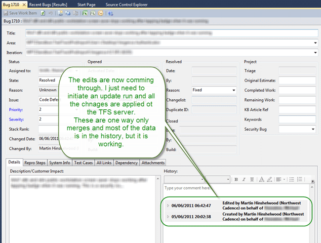

[](http://blog.hinshelwood.com/files/2011/06/ALMRangersLogo_Tiny.png)
{ .post-img }

Well, it has been a long road from [misery](http://blog.hinshelwood.com/creating-a-wit-adapter-for-the-tfs-integration-platform-for-a-source-with-no-history/) to [hope](http://blog.hinshelwood.com/what-do-you-do-with-a-work-item-history-not-found-conflict-type-details/) with a little [disbelief](http://blog.hinshelwood.com/test-track-pro-and-the-case-of-the-missing-data/) thrown in for good measure, but I finally have a working Adapter for the TFS Integration Platform.

### Acknowledgements

- [Jose Luis Soria Teruel](http://geeks.ms/blogs/jlsoria/ "http://geeks.ms/blogs/jlsoria/") – For his excellent advice and some sample code. I only used some of his code, but knowing that it can be done is the first step to achieving the goal.

### Updates

- 2011-06-06 11:00 – I found a last minute bug where by the adapter thinks that a work item that was created before the high water mark but was not in scope before it was edited was converted to an “Edit” Change Action instead of a “Add”. I updated lines 89 and 102 of the source. The result is a WorkItemHistoryNotFound conflict
  ```
  [06/06/2011 10:12:14] MigrationConsole.exe Information: 0 : WorkItemTracking: Processing ChangeGroup #3214, change 3143:2
  [06/06/2011 10:12:15] MigrationConsole.exe Information: 0 : WorkItemTracking: Unresolved conflict:
  [06/06/2011 10:12:15]   Session: adea805d-51df-489a-b2fd-9717b4af3703
  [06/06/2011 10:12:15]   Source: 6e3bdf70-f1ae-4cd5-8ee4-133c8aee0857
  [06/06/2011 10:12:15]   Message: Cannot find applicable resolution rule.
  [06/06/2011 10:12:15]   Conflict Type: TFS WIT history not found conflict type
  [06/06/2011 10:12:15]   Conflict Type Reference Name: 1722df87-ab61-4ad0-8b41-531d3d804089
  [06/06/2011 10:12:15]   Conflict Details: <?xml version="1.0"?>
  [06/06/2011 10:12:15] <WorkItemHistoryNotFoundConflictTypeDetails xmlns:xsi="http://www.w3.org/2001/XMLSchema-instance" xmlns:xsd="http://www.w3.org/2001/XMLSchema">
  [06/06/2011 10:12:15]   <SourceWorkItemID>3143</SourceWorkItemID>
  [06/06/2011 10:12:15]   <SourceWorkItemRevision>2</SourceWorkItemRevision>
  [06/06/2011 10:12:15]   <SourceMigrationSourceId>c513f930-2602-400d-a0bf-a2a3ab434df5</SourceMigrationSourceId>
  [06/06/2011 10:12:15]   <TargetMigrationSourceId>6e3bdf70-f1ae-4cd5-8ee4-133c8aee0857</TargetMigrationSourceId>
  [06/06/2011 10:12:15] </WorkItemHistoryNotFoundConflictTypeDetails>
  ```

---

With the new code, which has gone through many refactors for the sake of last ditch efforts to figure out the bug I am now able to update TFS from TTP in an incremental fashion.

[](http://blog.hinshelwood.com/files/2011/06/image8.png)
{ .post-img }

**Figure: Work Items are now being updated**

```
Imports Microsoft.TeamFoundation.Migration.Toolkit
Imports System.ComponentModel.Design
Imports System.Collections.ObjectModel
Imports Microsoft.TeamFoundation.Migration.Toolkit.Services
Imports Microsoft.TeamFoundation.Migration.BusinessModel
Imports Microsoft.TeamFoundation.Migration.Toolkit.ErrorManagement
Imports System.Globalization
Imports System.Xml
Imports Microsoft.TeamFoundation.Migration.Toolkit.SyncOrchestrator
Imports System.Net
Imports System.IO
Imports System.ServiceModel
Imports System.ServiceModel.Security
Imports NorthwestCadence.TtpTipAdapter.TtpSoapSdk
Imports NorthwestCadence.TtpTipAdapter.TtpSoapSdk.api

Public Class TtpAnalysisProvider
    Inherits AnalysisProviderBase

    ' Fields
    Private _analysisServiceContainer As IServiceContainer
    Private _changeGroupService As ChangeGroupService
    Private _configurationService As ConfigurationService
    Private _conflictManagerService As ConflictManager
    Private _highWaterMarkDelta As HighWaterMark(Of DateTime)
    Private _highWaterMarkChangeSet As HighWaterMark(Of Integer)
    Private _supportedChangeActions As Dictionary(Of Guid, ChangeActionHandler)
    Private _supportedContentTypes As Collection(Of ContentType)
    Private _dataSourceConfig As TtpMigrationDataSource
    Private _highWaterMarkRevisions As New Dictionary(Of String, HighWaterMark(Of Integer))
    Private _tstart As DateTime = Now

    ' Properties
    Public Overrides ReadOnly Property SupportedChangeActions As Dictionary(Of Guid, ChangeActionHandler)
        Get
            Return Me._supportedChangeActions
        End Get
    End Property

    Public Overrides ReadOnly Property SupportedContentTypes As Collection(Of ContentType)
        Get
            Return Me._supportedContentTypes
        End Get
    End Property

    Private Shared Function CreateFieldRevisionDescriptionDoc(row As TtpDefectMigrationItem) As XmlDocument
        Dim columns As New XElement("Columns", New Object() {New XElement("Column", New Object() {New XAttribute("DisplayName", "Author"), New XAttribute("ReferenceName", "Author"), New XAttribute("Type", "String"), New XElement("Value", row.AuthorId)}), New XElement("Column", New Object() {New XAttribute("DisplayName", "DisplayName"), New XAttribute("ReferenceName", "DisplayName"), New XAttribute("Type", "String"), New XElement("Value", row.DisplayName)}), New XElement("Column", New Object() {New XAttribute("DisplayName", "Id"), New XAttribute("ReferenceName", "Id"), New XAttribute("Type", "String"), New XElement("Value", row.Id.ToString)})})
        Dim column As KeyValuePair(Of String, Object)
        For Each column In row.Columns
            If Not String.IsNullOrEmpty(column.Value) Then
                columns.Add(New XElement("Column", New Object() {New XAttribute("DisplayName", column.Key), New XAttribute("ReferenceName", column.Key), New XAttribute("Type", "String"), New XElement("Value", column.Value)}))
            End If
        Next
        Dim descriptionDoc As New XElement("WorkItemChanges", New Object() {New XAttribute("Revision", row.Revision), New XAttribute("WorkItemType", row.WorItemType), New XAttribute("Author", IIf(String.IsNullOrEmpty(row.AuthorId), "", row.AuthorId)), New XAttribute("ChangeDate", row.ModifiedOn.ToString(CultureInfo.CurrentCulture)), New XAttribute("WorkItemID", row.Id.ToString), columns})
        Dim doc As New XmlDocument
        doc.LoadXml(descriptionDoc.ToString)
        Return doc
    End Function

    Private Shared Function CreateFieldColumn(migrationActionDetails As XmlDocument, displayName As String, referenceName As String, fieldType As String, value As Object, isSkippingField As Boolean) As XmlElement
        Dim c As XmlElement = migrationActionDetails.CreateElement("Column")
        c.SetAttribute("DisplayName", displayName)
        c.SetAttribute("ReferenceName", referenceName)
        c.SetAttribute("Type", fieldType)
        c.SetAttribute("IsSkippingField", isSkippingField.ToString())
        Dim v As XmlElement = migrationActionDetails.CreateElement("Value")
        'object translatedValue = TranslateFieldValue(f, fieldValue);
        Dim translatedValue As Object = value
        If translatedValue Is Nothing Then
            v.InnerText = String.Empty
        Else
            translatedValue.ToString()
        End If
        c.AppendChild(v)
        Return c
    End Function

    Public Overrides Sub GenerateDeltaTable()
        _tstart = Now
        Try
            Dim viewName As String = Me._configurationService.Filters.Item(0).Path
            TraceManager.TraceInformation("TtpWIT:AP:GenerateDeltaTable:View - {0}", New Object() {viewName})
            Me._highWaterMarkDelta.Reload()
            '------------------------------------------------------
            Dim context As TtpContext = GetTtpContext()
            Dim raw As List(Of TtpDefectMigrationItem) = GetTtpRawData(context, viewName)
            TraceManager.TraceInformation("Located {0} raw updates since {1} in {2} seconds", raw.Count, _highWaterMarkDelta.Value, Now.Subtract(_tstart).TotalSeconds)
            ' Find all of the data that needs to be added in this run
            Dim deltaNew = (From ri In raw Where ri.CreatedOn.CompareTo(_highWaterMarkDelta.Value) > 0 Or ri.Revision = 0).ToList
            ' Get any extra data and create the add changesets
            TraceManager.TraceInformation("Located {0} deltas as NEW in {1} seconds", deltaNew.Count, Now.Subtract(_tstart).TotalSeconds)
            deltaNew = GetDeltaWorkflow(context, deltaNew)
            TraceManager.TraceInformation("Updated {0} deltas with workflow in {1} seconds", deltaNew.Count, Now.Subtract(_tstart).TotalSeconds)
            Dim changesNew As List(Of ChangeGroup) = GetChangeGroupsForAdds(deltaNew)
            TraceManager.TraceInformation("Created {0} add change groups in {1} seconds", changesNew.Count, Now.Subtract(_tstart).TotalSeconds)
            ' Save the chnagesets to the backing store
            For Each c In changesNew
                c.Save()
            Next
            TraceManager.TraceInformation("Saved {0} add change groups in {1} seconds", changesNew.Count, Now.Subtract(_tstart).TotalSeconds)
            ' Find all of the data that needs to be edited in this run
            Dim deltaEdit = (From ri In raw Where (ri.ModifiedOn.CompareTo(_highWaterMarkDelta.Value) > 0 And Not ri.CreatedOn.CompareTo(_highWaterMarkDelta.Value) > 0) Or ri.Revision > 0).ToList
            ' Get any extra data and create the edit changesets
            TraceManager.TraceInformation("Located {0} deltas as EDIT in {1} seconds", deltaEdit.Count, Now.Subtract(_tstart).TotalSeconds)
            deltaEdit = GetDeltaWorkflow(context, deltaEdit)
            TraceManager.TraceInformation("Updated {0} deltas with workflow in {1} seconds", deltaEdit.Count, Now.Subtract(_tstart).TotalSeconds)
            Dim changesEdit As List(Of ChangeGroup) = GetChangeGroupsForEdits(deltaEdit)
            TraceManager.TraceInformation("Created {0} edit change groups in {1} seconds", changesEdit.Count, Now.Subtract(_tstart).TotalSeconds)
            ' Save the chnagesets to the backing store
            For Each c In changesEdit
                c.Save()
            Next
            TraceManager.TraceInformation("Saved {0} edit change groups in {1} seconds", changesEdit.Count, Now.Subtract(_tstart).TotalSeconds)
            '------------------------------------------------------
            ' Update the High water mark and send the changes through
            Me._highWaterMarkDelta.Update(DateTime.Now)
            Me._changeGroupService.PromoteDeltaToPending()
        Catch ex As Exception
            TraceManager.TraceException(ex)
        End Try
    End Sub

    Public Overrides Sub InitializeClient()
        TraceManager.TraceInformation("TtpWIT:AP:InitializeClient")
    End Sub

    Private Shared Function InitializeMigrationDataSource() As TtpMigrationDataSource
        Return New TtpMigrationDataSource
    End Function

    Public Overrides Sub InitializeServices(ByVal analysisService As IServiceContainer)
        TraceManager.TraceInformation("TtpWIT:AP:InitializeServices")
        If (analysisService Is Nothing) Then
            Throw New ArgumentNullException("analysisService")
        End If
        Me._analysisServiceContainer = analysisService
        Me._configurationService = DirectCast(analysisService.GetService(GetType(ConfigurationService)), ConfigurationService)
        Dim migrationSourceConfiguration As MigrationSource = Me._configurationService.MigrationSource
        _dataSourceConfig = TtpAnalysisProvider.InitializeMigrationDataSource
        Dim customSetting As CustomSetting
        Dim username As String = ""
        Dim password As String = ""
        Dim IsWorkflowIncluded As Boolean = True
        Dim hwmDateOveride As DateTime = DateTime.MinValue
        For Each customSetting In Me._configurationService.MigrationSource.CustomSettings.CustomSetting
            If customSetting.SettingKey.Equals("Username", StringComparison.OrdinalIgnoreCase) Then
                username = customSetting.SettingValue
            End If
            If customSetting.SettingKey.Equals("Password", StringComparison.OrdinalIgnoreCase) Then
                password = customSetting.SettingValue
            End If
            If customSetting.SettingKey.Equals("OverrideHWM", StringComparison.OrdinalIgnoreCase) Then
                If Not DateTime.TryParse(customSetting.SettingValue, hwmDateOveride) Then
                    Throw New InvalidCastException("Date is not in the correct format: OverrideHWM")
                End If
            End If
            If customSetting.SettingKey.Equals("IsWorkflowIncluded", StringComparison.OrdinalIgnoreCase) Then
                If Not Boolean.TryParse(customSetting.SettingValue, IsWorkflowIncluded) Then
                    Throw New InvalidCastException("Date is not in the correct format: IsWorkflowIncluded")
                End If
            End If
        Next

        _dataSourceConfig.Credentials = New NetworkCredential(username, password)
        _dataSourceConfig.DatabaseName = migrationSourceConfiguration.SourceIdentifier
        _dataSourceConfig.FilterName = IIf(migrationSourceConfiguration.ServerIdentifier = "[enterFiltername]", "", migrationSourceConfiguration.ServerIdentifier)
        _dataSourceConfig.Url = migrationSourceConfiguration.ServerUrl
        _dataSourceConfig.IsWorkflowIncluded = IsWorkflowIncluded


        Me._supportedContentTypes = New Collection(Of ContentType)
        Me.SupportedContentTypes.Add(WellKnownContentType.WorkItem)

        Dim handler As New TtpChangeActionHandlers(Me)

        Me._supportedChangeActions = New Dictionary(Of Guid, ChangeActionHandler)
        Me.SupportedChangeActions.Add(WellKnownChangeActionId.Add, New ChangeActionHandler(AddressOf handler.BasicActionHandler))
        Me.SupportedChangeActions.Add(WellKnownChangeActionId.Edit, New ChangeActionHandler(AddressOf handler.BasicActionHandler))
        Me.SupportedChangeActions.Add(WellKnownChangeActionId.Delete, New ChangeActionHandler(AddressOf handler.BasicActionHandler))
        Me._highWaterMarkDelta = New HighWaterMark(Of DateTime)("HWMDelta")
        Me._highWaterMarkChangeSet = New HighWaterMark(Of Integer)("LastChangeSet")
        Me._configurationService.RegisterHighWaterMarkWithSession(Me._highWaterMarkDelta)
        Me._configurationService.RegisterHighWaterMarkWithSession(Me._highWaterMarkChangeSet)

        If hwmDateOveride > DateTime.MinValue Then
            _highWaterMarkDelta.Update(hwmDateOveride)
        End If

        Me._changeGroupService = DirectCast(Me._analysisServiceContainer.GetService(GetType(ChangeGroupService)), ChangeGroupService)

        Me._changeGroupService.RegisterDefaultSourceSerializer(New TtpDefectMigrationItemSerializer)
    End Sub

    Public Overrides Sub RegisterConflictTypes(ByVal conflictManager As ConflictManager)
        TraceManager.TraceInformation("TtpWIT:AP:RegisterConflictTypes")
        Me._conflictManagerService = DirectCast(Me._analysisServiceContainer.GetService(GetType(ConflictManager)), ConflictManager)
        Me._conflictManagerService.RegisterConflictType(New GenericConflictType)
        Me._conflictManagerService.RegisterConflictType(New TtpGeneralConflictType, ConflictsSyncOrchOptions.Continue)
    End Sub

    Public Overrides Sub RegisterSupportedChangeActions(ByVal changeActionRegistrationService As ChangeActionRegistrationService)
        TraceManager.TraceInformation("TtpWIT:AP:RegisterSupportedChangeActions")
        changeActionRegistrationService = DirectCast(Me._analysisServiceContainer.GetService(GetType(ChangeActionRegistrationService)), ChangeActionRegistrationService)
        Dim supportedChangeAction As KeyValuePair(Of Guid, ChangeActionHandler)
        For Each supportedChangeAction In Me.SupportedChangeActions
            Dim contentType As ContentType
            For Each contentType In Me.SupportedContentTypes
                changeActionRegistrationService.RegisterChangeAction(supportedChangeAction.Key, contentType.ReferenceName, supportedChangeAction.Value)
            Next
        Next
    End Sub

    Public Overrides Sub RegisterSupportedContentTypes(contentTypeRegistrationService As Microsoft.TeamFoundation.Migration.Toolkit.Services.ContentTypeRegistrationService)

    End Sub

    Private Function GetTtpContext() As TtpContext
        TraceManager.TraceInformation("-GetTtpContext")
        Dim TtpServer As Uri = New Uri(String.Format("{0}/scripts/ttsoapcgi.exe", _dataSourceConfig.Url))
        TraceManager.TraceInformation(ChrW(9) & "-GetTtpContext Loading Ttp  {0}", New Object() {TtpServer})
        Dim context As TtpContext = Nothing
        Try
            context = TtpSoapSdkApi.CreateContext(TtpServer, _dataSourceConfig.DatabaseName, _dataSourceConfig.Credentials.UserName, _dataSourceConfig.Credentials.Password)
            TraceManager.TraceInformation("-GetTtpContext Connected to '{0}' on '{1}' in {2}", context.Project.database, TtpServer, Now.Subtract(_tstart).ToFriendly)
        Catch ex As Exception
            TraceManager.TraceException(ex)
        End Try
        Return context
    End Function

    Private Function GetTtpRawData(context As TtpContext, filter As String) As List(Of TtpDefectMigrationItem)
        Dim raw As New List(Of TtpDefectMigrationItem)
        Try
            Dim columns As List(Of CTableColumn) = context.GetColumns("Defect")
            TraceManager.TraceInformation("-GetTtpRawData '{0}' columns in {1}", columns.Count, Now.Subtract(_tstart).ToFriendly)
            TraceManager.TraceInformation("-GetTtpRawData Atempting get on all data")
            Dim rows As CRecordListSoap = context.GetRecords("Defect", filter, columns)
            TraceManager.TraceInformation("-GetTtpRawData Found {0} records in {1} seconds", rows.records.Count, Now.Subtract(_tstart).TotalSeconds)
            Dim currentRecord As Integer = 1
            Dim countRecords = rows.records.Count
            For Each record In rows.records
                ' item has been modified since HWM & before deltra table start time
                Try
                    Dim DefectMI As TtpDefectMigrationItem = TtpDefectMigrationItem.ConvertCDefectToTtpDefectMigrationItem(_configurationService, columns.ToArray, record)
                    '----------------
                    raw.Add(DefectMI)
                    TraceManager.TraceInformation("-GetTtpRawData  {0} of {1} - '{2}' Number '{3}' has loaded in {4} seconds", currentRecord, countRecords, DefectMI.WorItemType, DefectMI.Id, Now.Subtract(_tstart).TotalSeconds)
                Catch ex As Exception
                    TraceManager.TraceError("-GetTtpRawData  {0} of {1} - '{2}' Number '{3}' has {4} processing in {5} seconds", currentRecord, countRecords, "unknown", "unknown", "failed", Now.Subtract(_tstart).TotalSeconds)
                    TraceManager.TraceException(ex)
                End Try
                currentRecord = currentRecord + 1
            Next
        Catch ex As Exception
            TraceManager.TraceException(ex)
        End Try
        Return raw
    End Function

    Private Function GetDeltaWorkflow(context As TtpContext, ByVal deltas As List(Of TtpDefectMigrationItem)) As List(Of TtpDefectMigrationItem)
        Try
            Dim currentRecord As Integer = 1
            Dim countRecords = deltas.Count
            For Each di In deltas
                ' item has been modified since HWM & before deltra table start time
                If _dataSourceConfig.IsWorkflowIncluded Then
                    di.ImportDefectData(context)
                    TraceManager.TraceInformation("-GetDeltaWorkflow  {0} of {1} - '{2}' Number '{3}' has {4} processing revision {5} in {6} seconds", currentRecord, countRecords, di.WorItemType, di.Id, "UPDATED", di.Revision, Now.Subtract(_tstart).TotalSeconds)
                Else
                    TraceManager.TraceInformation("-GetDeltaWorkflow  {0} of {1} - '{2}' Number '{3}' has {4} processing revision {5} in {6} seconds", currentRecord, countRecords, di.WorItemType, di.Id, "SKIPPED", di.Revision, Now.Subtract(_tstart).TotalSeconds)
                End If
                currentRecord = currentRecord + 1
            Next
        Catch ex As Exception
            TraceManager.TraceException(ex)
        End Try
        Return deltas
    End Function

    Private Function GetChangeGroupsForAdds(ByVal deltas As List(Of TtpDefectMigrationItem)) As List(Of ChangeGroup)
        Dim changes As New List(Of ChangeGroup)
        Try
            Dim currentRecord As Integer = 1
            Dim countRecords = deltas.Count
            For Each delta In deltas
                ' item has been modified since HWM & before deltra table start time
                Try
                    ' Create and add acction group
                    delta.ResetRevision()
                    Dim changeGroup As ChangeGroup = Me._changeGroupService.CreateChangeGroupForDeltaTable(String.Format("{0}:{1}", delta.Id, delta.Revision))
                    changeGroup.Status = ChangeStatus.Delta
                    changeGroup.Owner = Nothing
                    changeGroup.Comment = String.Format(CultureInfo.CurrentCulture, "Changeset {0}", _highWaterMarkChangeSet.Value)
                    changeGroup.ChangeTimeUtc = DateTime.UtcNow
                    changeGroup.Status = ChangeStatus.Delta
                    changeGroup.ExecutionOrder = 0

                    changeGroup.CreateAction( _
                            WellKnownChangeActionId.Add, _
                            delta, _
                            delta.Id, _
                            _dataSourceConfig.DatabaseName, _
                            delta.Revision, _
                            " ", _
                            WellKnownContentType.WorkItem.ReferenceName, _
                            TtpAnalysisProvider.CreateFieldRevisionDescriptionDoc(delta) _
                            )
                    changes.Add(changeGroup)
                    _highWaterMarkChangeSet.Update((_highWaterMarkChangeSet.Value + 1))
                    ' DONE
                Catch ex As Exception
                    TraceManager.TraceError("-GetChangeGroups  {0} of {1} - '{2}' Number '{3}' has {4} processing in {5} seconds", currentRecord, countRecords, "unknown", "unknown", "failed", Now.Subtract(_tstart).TotalSeconds)
                    TraceManager.TraceException(ex)
                End Try
                currentRecord = currentRecord + 1
            Next
        Catch ex As Exception
            TraceManager.TraceException(ex)
        End Try
        Return changes
    End Function

    Private Function GetChangeGroupsForEdits(ByVal deltas As List(Of TtpDefectMigrationItem)) As List(Of ChangeGroup)
        Dim changes As New List(Of ChangeGroup)
        Try
            Dim currentRecord As Integer = 1
            Dim countRecords = deltas.Count
            For Each delta In deltas
                ' item has been modified since HWM & before deltra table start time
                Try
                    ' Create and add acction group
                    delta.IncrementRevision()
                    Dim changeGroup As ChangeGroup = Me._changeGroupService.CreateChangeGroupForDeltaTable(String.Format("{0}:{1}", delta.Id, delta.Revision))
                    changeGroup.Status = ChangeStatus.Delta
                    changeGroup.Owner = Nothing
                    changeGroup.Comment = String.Format(CultureInfo.CurrentCulture, "Changeset {0}", _highWaterMarkChangeSet.Value)
                    changeGroup.ChangeTimeUtc = DateTime.UtcNow
                    changeGroup.Status = ChangeStatus.Delta
                    changeGroup.ExecutionOrder = 0

                    changeGroup.CreateAction( _
                            WellKnownChangeActionId.Edit, _
                            delta, _
                            delta.Id, _
                            _dataSourceConfig.DatabaseName, _
                            delta.Revision, _
                            " ", _
                            WellKnownContentType.WorkItem.ReferenceName, _
                            TtpAnalysisProvider.CreateFieldRevisionDescriptionDoc(delta) _
                            )
                    changes.Add(changeGroup)
                    _highWaterMarkChangeSet.Update((_highWaterMarkChangeSet.Value + 1))
                    ' DONE
                Catch ex As Exception
                    TraceManager.TraceError("-GetChangeGroups  {0} of {1} - '{2}' Number '{3}' has {4} processing in {5} seconds", currentRecord, countRecords, "unknown", "unknown", "failed", Now.Subtract(_tstart).TotalSeconds)
                    TraceManager.TraceException(ex)
                End Try
                currentRecord = currentRecord + 1
            Next
        Catch ex As Exception
            TraceManager.TraceException(ex)
        End Try
        Return changes
    End Function

End Class
```

**Figure: Full source for the Analysis Provider**

```
Private Function GetChangeGroupsForEdits(ByVal deltas As List(Of TtpDefectMigrationItem)) As List(Of ChangeGroup)
    Dim changes As New List(Of ChangeGroup)
    Try
        Dim currentRecord As Integer = 1
        Dim countRecords = deltas.Count
        For Each delta In deltas
            ' item has been modified since HWM & before deltra table start time
            Try
                ' Create and add acction group
                delta.IncrementRevision()
                Dim changeGroup As ChangeGroup = Me._changeGroupService.CreateChangeGroupForDeltaTable(String.Format("{0}:{1}", delta.Id, delta.Revision))
                changeGroup.Status = ChangeStatus.Delta
                changeGroup.Owner = Nothing
                changeGroup.Comment = String.Format(CultureInfo.CurrentCulture, "Changeset {0}", _highWaterMarkChangeSet.Value)
                changeGroup.ChangeTimeUtc = DateTime.UtcNow
                changeGroup.Status = ChangeStatus.Delta
                changeGroup.ExecutionOrder = 0

                changeGroup.CreateAction( _
                        WellKnownChangeActionId.Edit, _
                        delta, _
                        delta.Id, _
                        _dataSourceConfig.DatabaseName, _
                        delta.Revision, _
                        " ", _
                        WellKnownContentType.WorkItem.ReferenceName, _
                        TtpAnalysisProvider.CreateFieldRevisionDescriptionDoc(delta) _
                        )
                changes.Add(changeGroup)
                _highWaterMarkChangeSet.Update((_highWaterMarkChangeSet.Value + 1))
                ' DONE
            Catch ex As Exception
                TraceManager.TraceError("-GetChangeGroups  {0} of {1} - '{2}' Number '{3}' has {4} processing in {5} seconds", currentRecord, countRecords, "unknown", "unknown", "failed", Now.Subtract(_tstart).TotalSeconds)
                TraceManager.TraceException(ex)
            End Try
            currentRecord = currentRecord + 1
        Next
    Catch ex As Exception
        TraceManager.TraceException(ex)
    End Try
    Return changes
End Function
```

**Figure: New code to get change groups**

I am not exactly positive what made the difference as much of my debugging efforts were hampered by the [nasty query bug in TTP](http://blog.hinshelwood.com/test-track-pro-and-the-case-of-the-missing-data/), but I am very glad that it is working. It looks like I do not need to have consecutive Revision's although as I have already implemented the code for it I am not going to change it at this stage in the game.

It is now a mater of configuration, but I am creating a table with all of the values of the 120+ fields as well as a neat table for the workflow and inserting it into the history.

[](http://blog.hinshelwood.com/files/2011/06/image10.png)
{ .post-img }

**Figure: Loooong history built from TTP Data**

This history shows all of the values for the fields at the point in time that the data was migrated.

All in, I am quite happy with the process and will be implementing in production really soon. Still some testing to do, but all looks good so far.

- **Can you share your experiences of creating a TFS Integration Platform Adapter?**
