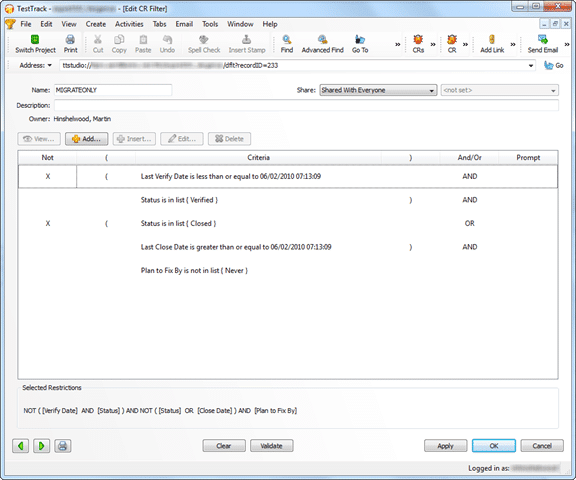
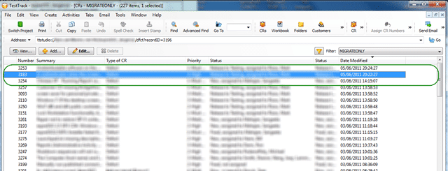
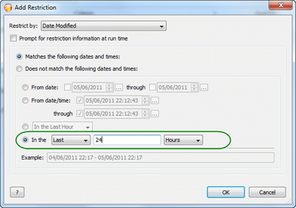

[](http://blog.hinshelwood.com/files/2011/06/ttp2011_1.gif)
{ .post-img }

As you may know, I have been having lots of problems with creating a Test Track Pro Adapter for the TFS Integration Platform. You may have been following my trials and tribulations in trying to get the data through.

---

It looks as if someone dropped the ball at Seapine when they wrote the query code for TTP. When you query the server to get a list of data the only control you have over the number of records that you get back is to use a “filter”. These filter are pre-setup and I have on on the production TTP system that will give me all of the data that I need to migrate. The problem is that it take around 15 minutes for the query to return the 3000+ records.

So, I first run the query as is and retrieve all of the records and suffer the long load.

[](http://blog.hinshelwood.com/files/2011/06/SNAGHTML2899f19.png)  
{ .post-img }
**Figure: Initial Query loads the entire data set**

[](http://blog.hinshelwood.com/files/2011/06/image6.png)  
{ .post-img }
**Figure: This produces a large data set, but check the top**

Once the initial run is done, there is really no need to load the entire data set, just to find the two or three or sum records that have changed since the last run. I decided, just to be safe, to load the data from the last day, some ~25 records, as that is almost the balance between load and loss.

So lets add an additional filter for data in the last month…

[](http://blog.hinshelwood.com/files/2011/06/SNAGHTML2979ebb.png)  
{ .post-img }
**Figure: Only get data in the last Day**

With my recent debugging efforts I was maybe looking more closely at things than I would normally, and I noticed that the most recent changes were not being displayed.

[](http://blog.hinshelwood.com/files/2011/06/image7.png)  
{ .post-img }
**Figure: Where has my data gone**

If you look closely you will see that the top two records have disappeared. What the heck!

If I change the query to be the last 24 hours instead of the last day then the data miraculously appears.

[](http://blog.hinshelwood.com/files/2011/06/SNAGHTML29b421b.png)  
{ .post-img }
**Figure: Last 24 hours works**

In fact I just checked again and the data is now there! Oh, it has just gone midnight in Boston (where the TTP server is) and the data now appears.

You may now ask, “What is the problem? The data will eventually get into the list?”… well, by that time it is too late. Let me explain.

As part of the TFS Integration Platform there is something called a “High Water Mark” and in this case it is a Date. This stores the date of the last run of data so we can check which records to add and which to edit.

```
Me._highWaterMarkDelta.Reload()
'------------------------------------------------------
Dim context As TtpContext = GetTtpContext()
Dim raw As List(Of TtpDefectMigrationItem) = GetTtpRawData(context, viewName)
TraceManager.TraceInformation("Located {0} raw updates since {1} in {2} seconds", raw.Count, _highWaterMarkDelta.Value, Now.Subtract(_tstart).TotalSeconds)
Dim deltaNew = (From ri In raw Where ri.CreatedOn.CompareTo(_highWaterMarkDelta.Value) > 0).ToList
TraceManager.TraceInformation("Located {0} deltas as NEW in {1} seconds", deltaNew.Count, Now.Subtract(_tstart).TotalSeconds)
deltaNew = GetDeltaWorkflow(context, deltaNew)
TraceManager.TraceInformation("Updated {0} deltas with workflow in {1} seconds", deltaNew.Count, Now.Subtract(_tstart).TotalSeconds)
Dim changesNew As List(Of ChangeGroup) = GetChangeGroupsForAdds(deltaNew)
TraceManager.TraceInformation("Created {0} add change groups in {1} seconds", changesNew.Count, Now.Subtract(_tstart).TotalSeconds)
For Each c In changesNew
    c.Save()
Next
TraceManager.TraceInformation("Saved {0} add change groups in {1} seconds", changesNew.Count, Now.Subtract(_tstart).TotalSeconds)
Dim deltaEdit = (From ri In raw Where ri.ModifiedOn.CompareTo(_highWaterMarkDelta.Value) > 0 And Not ri.CreatedOn.CompareTo(_highWaterMarkDelta.Value) > 0).ToList
TraceManager.TraceInformation("Located {0} deltas as EDIT in {1} seconds", deltaEdit.Count, Now.Subtract(_tstart).TotalSeconds)
deltaEdit = GetDeltaWorkflow(context, deltaEdit)
TraceManager.TraceInformation("Updated {0} deltas with workflow in {1} seconds", deltaEdit.Count, Now.Subtract(_tstart).TotalSeconds)
Dim changesEdit As List(Of ChangeGroup) = GetChangeGroupsForEdits(deltaEdit)
TraceManager.TraceInformation("Created {0} edit change groups in {1} seconds", changesEdit.Count, Now.Subtract(_tstart).TotalSeconds)
For Each c In changesEdit
    c.Save()
Next
TraceManager.TraceInformation("Saved {0} edit change groups in {1} seconds", changesEdit.Count, Now.Subtract(_tstart).TotalSeconds)
'------------------------------------------------------
Me._highWaterMarkDelta.Update(DateTime.Now)
Me._changeGroupService.PromoteDeltaToPending()
```

**Figure:**

As you can see on lines 6 and 16 we do a query based on the High Water Mark to make sure that we only import data once, and that we can tell the difference between add and update.

- If the date that the item was _created_ is after the last high water mark then it is an add

- If the date that the item was _modified_ is after the last high water mark, while also not being in the previous category then it is an _edit_

So, if you are using “last day” in your query then by the time the data is returned in the query then all the dates are before the high water mark. Not good as all of this data gets missed and you will not get any updates after the first run.

The solution is to use the number of “hours” since, rather than days…
