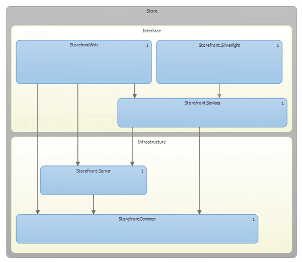
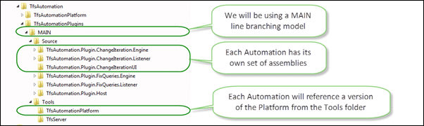
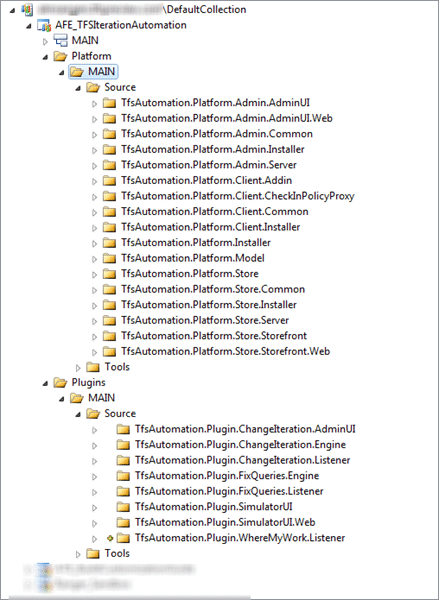

As Lead developer for the TFS Iteration Automation my goal this weekend is to provide a framework for the developers to give both architectural and development guidance for the tools and methods we are going to be using to construct the Platform.
{ .post-img }

---

I have been working on a framework that will allow the developers to get started building for the TFS Automation Platform and specifically to meet the goals for Release 1. I should note that I am not writing any code at this time I am putting together the jigsaw and selecting some technologies.

I have gone with two solutions. One to constrain all of the platform bits and another for the Automation that we will be building. The main reason for this is to dogfood the developer experience as we really want folks to start building Automations in the wild. If it is hard in any way then they will not.

This method also allows us to both version and release the Automations separately from the platform and reduces our dependency on code changes in the core. The idea is that, just as everyone else will be doing, we build the Automations against the latest “released” bits. In our case, that will mean the latest “alfa” at the start, but needs must.

## TfsAutomationPlatform

While I intend to keep the Automation Platform as simple as possible, that does not mean that it actually is simple. There are really three parts to the Platform that need to be installed separately, but Mike’s help we should be able to have a unified installer.

  
{ .post-img }
**Figure: The Platform needs to be very structured**

If you are eagle eyed you will see that we are going to be using WIX, Silverlight and the new Architectural tooling in Visual Studio 2010 Ultimate.

### Store

The Store is like a big database of assets. In this case the assets are the Plugins that are available for TFS Administrators to install on their servers. This will be written in Silverlight 5 and can be hosted in IIS or Azure. Hopefully we will be providing a hosted version on Azure, but those with extreme security concerns may install it locally in IIS.

  
{ .post-img }
**Figure: A simple model**

Hopefully as we move forward with new versions we can implement more to provide a culture and ecosystem around the store, but our initial goal is to deliver something that works. Lets worry about gold plating later.

### Admin

This handles all of the grunt work of downloading, installing, Deploying, retracting and configuring plugins. Must be installed on the Application Tier.

  
{ .post-img }
**Figure: Very Similar to the Store for now**

The Admin section handles all of the magic of configuring and auctioning all of the Plugins.

### **Client**

A hook to provide deep Visual Studio integration. Is optional, but lets you quickly link thorough to the Admin application. Will also provide dynamic Check-In Policies in the future. I am not really thinking a lot around this as it will probably not make R1.

## TfsAutomationPlugins

As we will be building a number of OOB (Out Of the Box) Automations it makes sense for us to build them as part of a single solution. This is just for ease of development and if we do have a separation of teams then we may end up with separate solutions. But for now it is easier with just one. We will however need to be careful not to reference between them as one could be deployed without the other.

  
{ .post-img }
**Figure: Where do the files go?**

I will be looking more at the Plugins layout later, and how you can start building Plugins now. I will be upgrading my [TFS Event Handler](http://tfseventhandler.codeplex.com) project code to this platform soon.

I am trying very hard to make it easy to develop for this platform. I don’t think it will be something that anyone can do as there will be a learning curve for what goes where, and especially how you can debug against TFS in process.

Now that everything is checked in, I will be encouraging my team mates to explore the solution.

  
{ .post-img }
**Figure: Lots of lovely places to put code**

Let me know what improvements you can observe as noting is perfect, especially not if it was done by me.
