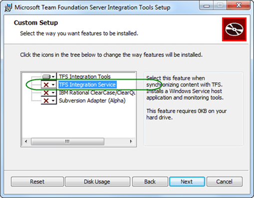
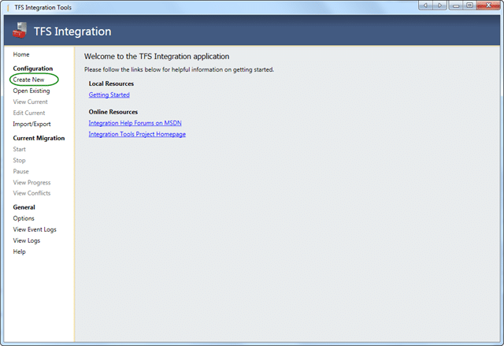
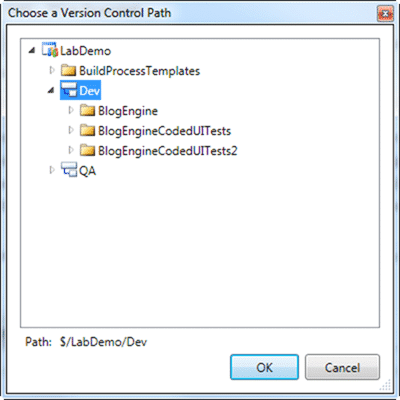
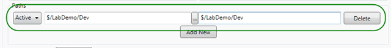

{ .post-img }

We have a customer who really, really want to ship source code from Team Foundation Server (TFS) to Perforce. Why you might ask… Well for many companies they can’t just migrate, they either need some sort of safety net, or have an external requirement that they MUST use a particular system as a matter of record.

But they really want to use TFS.

- **Perforce** - [Sync offline changes to a workspace into Perforce](http://stackoverflow.com/questions/6458927/sync-offline-changes-to-a-workspace-into-perforce) (StackOverflow.com)

Updates

- **2011-06-27** – I have added two new operating modes to increase the versatility (_RuleThemAll_ | _ForEachAction_). These new modes do not run any .NET code at all and you have to do everything in PowerShell. I expect that PowerShell user will love RuleThemAll as all you need is one PowerShell per ChangeSet.

---

We have to have some way of getting each of the check-ins out of TFS in order and writing them to the other system on a regular basis without having to write an Adapter for each new system. This will obviously not be a perfect scenario as it will not be tailored directly for the other system, but it should suffice for 90% of cases that I will encounter.

## The Theory

The TFS Integration Platform Adapter I have written is really simple, and focuses on adaptability not perfection. What is the best tool for this… well PowerShell of course , and with the Team Foundation Adapters already written and provided in the box, we only have to worry about the other side.
{ .post-img }

In the integration platform if you want to do the _writing_, rather than the _reading_ I recently [did for Test Track Pro](http://blog.hinshelwood.com/a-working-test-track-pro-adapter-for-the-tfs-integration-platform/), then you concentrate on the IMigrationProvider interface which allows you to implement the ProcessChangeGroup method.

```
Public Overrides Function ProcessChangeGroup(changeGroup As Microsoft.TeamFoundation.Migration.Toolkit.ChangeGroup) As Microsoft.TeamFoundation.Migration.Toolkit.ConversionResult
    Dim conversionResult As New ConversionResult(_configurationService.MigrationPeer, _configurationService.SourceId)
    conversionResult.ChangeId = changeGroup.ChangeGroupId
    Dim OutDirectory As String = Me._configurationService.MigrationSource.SourceIdentifier
    Dim SourceRoot As String = Me._configurationService.Filters(0).Path
    TraceManager.TraceInformation(String.Format("Processing {0} actions - {1}", changeGroup.Actions.Count, changeGroup.Comment))
    If Not RunPowershell("ImportChangeGroup_Initial", changeGroup, conversionResult, OutDirectory) Then
        conversionResult.ChangeId = String.Empty
    End If
    For Each action As MigrationAction In changeGroup.Actions
        Dim path As String = ConvertPath(OutDirectory, SourceRoot, action.Path)
        If BuildLocalCache(changeGroup, conversionResult, SourceRoot, OutDirectory, path, action) Then
            conversionResult.ItemConversionHistory.Add(New ItemConversionHistory(changeGroup.Name, action.Version, path, String.Empty))
        End If
    Next
    If Not RunPowershell("ImportChangeGroup_Final", changeGroup, conversionResult, OutDirectory) Then
        conversionResult.ChangeId = String.Empty
    End If
    Return conversionResult
End Function
```

For each change group that is found in TFS the Integration Platform calls this method. The Platform is going to keep track of which you have already done and what types of changes need to be done in what order. All we have to do is do something with them and pass back a ConversionResult object that details a ItemConversionHistory object for each of the Actions that were part of the change group.

You can see from the code above that I am calling a PowerShell script at both the beginning and end of the process. You can’t see it here, but a PowerShell is also called for each of the actions. During this process we build up a record of what we have done and pass back the completed ConversionResult to the TFS Integration Platform so it can check all of the items that we have processed off the list.

In order to add some amount of flexibility to the system I am allowing a different PowerShell to be called for each ContentType and ChangeAction combination:

<table border="0" cellspacing="0" cellpadding="2" width="457"><tbody><tr><td valign="top" width="277"><strong>Content Type</strong></td><td valign="top" width="140"><strong>Action</strong></td><td valign="top" width="137">&nbsp;</td></tr><tr><td valign="top" width="296">Version Controlled Folder</td><td valign="top" width="147">Add</td><td valign="top" width="142">&nbsp;</td></tr><tr><td valign="top" width="300">Version Controlled Folder</td><td valign="top" width="151">Edit</td><td valign="top" width="144">&nbsp;</td></tr><tr><td valign="top" width="299">Version Controlled Folder</td><td valign="top" width="153">Delete</td><td valign="top" width="145">&nbsp;</td></tr><tr><td valign="top" width="298">Version Controlled Folder</td><td valign="top" width="155">Rename</td><td valign="top" width="145">&nbsp;</td></tr><tr><td valign="top" width="297">Version Controlled File</td><td valign="top" width="156">Add</td><td valign="top" width="145">&nbsp;</td></tr><tr><td valign="top" width="296">Version Controlled File</td><td valign="top" width="157">Edit</td><td valign="top" width="144">&nbsp;</td></tr><tr><td valign="top" width="296">Version Controlled File</td><td valign="top" width="158">Delete</td><td valign="top" width="144">&nbsp;</td></tr><tr><td valign="top" width="295">Version Controlled File</td><td valign="top" width="159">Rename</td><td valign="top" width="144">&nbsp;</td></tr></tbody></table>

**Figure: Supported Actions**

In the configuration for the Adapter I have added a bunch of keys that translate to each of the entries above that will allow you to configure which scripts you want to use. You can use them all if you want or only use one.

```
<CustomSettings>
  <!--
    Powershell Arguments

    $IpChangeGroup = Microsoft.TeamFoundation.Migration.Toolkit.ChangeGroup
    $IpConversionResult = Microsoft.TeamFoundation.Migration.Toolkit.ConversionResult
    $IpMigrationAction = Microsoft.TeamFoundation.Migration.Toolkit.MigrationAction
    $IpNewPath = c:TempOutputFolderImportRun1{localpath}
    $IpLocalRoot = c:TempOutputFolderImportRun1

    PowerShell Execution Mode:

    RuleThemAll = Lets just have a single PowerShell that does everything. Don't forget to update the IpConversionResult with all of the results.
    ForEachAction = Calls a PowerShell script for each action as below
    WithLocalCache = Original mode that maintains a local copy of the files and calls powershell for each Action

  -->
  <CustomSetting SettingKey="PowerShellExecutionMove" SettingValue="WithLocalCache" />
  <CustomSetting SettingKey="ImportChangeGroup" SettingValue="" />
  <CustomSetting SettingKey="ImportChangeGroup_Initial" SettingValue="" />
  <CustomSetting SettingKey="ImportChangeGroupAction_VersionControlledFolder_Add" SettingValue="" />
  <CustomSetting SettingKey="ImportChangeGroupAction_VersionControlledFolder_Edit" SettingValue="" />
  <CustomSetting SettingKey="ImportChangeGroupAction_VersionControlledFolder_Delete" SettingValue="" />
  <CustomSetting SettingKey="ImportChangeGroupAction_VersionControlledFolder_Rename" SettingValue="" />
  <CustomSetting SettingKey="ImportChangeGroupAction_VersionControlledFile_Add" SettingValue="" />
  <CustomSetting SettingKey="ImportChangeGroupAction_VersionControlledFile_Edit" SettingValue="" />
  <CustomSetting SettingKey="ImportChangeGroupAction_VersionControlledFile_Rename" SettingValue="" />
  <CustomSetting SettingKey="ImportChangeGroup_Final" SettingValue="" />
</CustomSettings>
```

**Figure: Custom settings for configuring PowerShell files**

As might be eluded to by the list of arguments above I am passing a bunch of them into PowerShell that should be of use to the person configuring the options. One of the really nice things about using PowerShell is that you can pass in a complicated object graph and have it available for the PowerShell user. You can also get objects back out again, but in this case I only need in.

```
Public Function ExecutePowershell(powerShellKey As String, changeGroup As ChangeGroup, conversionResult As ConversionResult, localRoot As String, Optional action As MigrationAction = Nothing, Optional newPath As String = "") As List(Of PSObject)
    _pipeline = _runspace.CreatePipeline()
    Dim psFile As String = GetPowerShellFile(powerShellKey)
    Dim results As New List(Of PSObject)
    If File.Exists(psFile) Then
        Dim command As New Command(psFile)
        command.Parameters.Add(New CommandParameter("IpChangeGroup", changeGroup))
        command.Parameters.Add(New CommandParameter("IpConversionResult", conversionResult))
        If Not action Is Nothing Then
            command.Parameters.Add(New CommandParameter("IpMigrationAction", action))
            command.Parameters.Add(New CommandParameter("IpNewPath", action))
        End If
        command.Parameters.Add(New CommandParameter("IpLocalRoot", localRoot))
        command.MergeMyResults(PipelineResultTypes.Error, PipelineResultTypes.Output)
        _pipeline.Commands.Add(command)
        Dim dt As DateTime = Now
        results.AddRange(_pipeline.Invoke())
    Else
        TraceManager.TraceWarning(String.Format("PowerShell: DOES NOT EXIST for custom setting '{0}'", powerShellKey))
    End If
    Return results
End Function
```

**Figure: Calling PowerShell from VB.NET with Parameters**

This means that you can access things like the Comment from the original change group in TFS as well as the person that did the check-in.

```
p4 commit -d $IpChangeGroup.Comment
```

**Figure: PowerShell to check-in all outstanding files with the original comment**

## The Practice

In order to run this adapter you are going to need somewhere to install and run the [TFS Integration Platform](http://tfsintegration.codeplex.com/). I would suggest the the TFS server itself, but if you have a problem with that then find another server.

The [TFS Integration Platform](http://tfsintegration.codeplex.com/) can run with a UI so we will be using that to configure it, but it can also run off the command line. If you are going to want this tool to run in more than “One-Time” mode then you are going to want to install the service. This will run the sync even if no one is logged on.

[](http://blog.hinshelwood.com/files/2011/06/SNAGHTMLca8aa6.png)
{ .post-img }

**Figure: Install the Service if you will be syncing**

Once you have it installed you will need a configuration file as a template. This file can be pretty loose, or it can be really strict in what you can select. Depending on the Adapters that you install out of the box will depend on the templates that you get. You can have Work Item Tracking only, Version Control only or a combination.

In this case we will be using my magic config file:

```
<?xml version="1.0" encoding="utf-16"?>
<Configuration xmlns:xsi="http://www.w3.org/2001/XMLSchema-instance" xmlns:xsd="http://www.w3.org/2001/XMLSchema"
               UniqueId="8ecc79e4-b97c-4e78-a0c8-f20062ebdaa9" FriendlyName="NWC - TFS to Powershell">
  <Providers>
    <Provider ReferenceName="febc091f-82a2-449e-aed8-133e5896c47a" FriendlyName="TFS 2010 Migration VC Provider" />
    <Provider ReferenceName="566c001e-e476-4a07-8447-b2284c55a20e" FriendlyName="Powershell Adapter" />
  </Providers>
  <Addins>
    <Addin ReferenceName="cdde6b6b-72fc-43b6-bbd1-b8a89a788c6f" FriendlyName="TFS Active Directory User Id Lookup Service Addin">
      <CustomSettings />
    </Addin>
  </Addins>
  <SessionGroup CreationTime="2011-06-23T21:29:10.9738265Z" FriendlyName="NWC - TFS to Powershell"
                SessionGroupGUID="571b708d-c683-4540-adf9-f5843dea20f9" Creator="MrHinsh" SyncIntervalInSeconds="160" SyncDurationInMinutes="0">
    <MigrationSources>
      <MigrationSource InternalUniqueId="4199bde3-c26c-4b6d-86bb-8328e221e499" FriendlyName="mytfs.company.com(VC)" ServerIdentifier="40a26de8-a27e-4bef-9c9b-87cc64ad6cbc" ServerUrl="http://mytfs.company.com:8080/tfs/DefaultCollection" SourceIdentifier="TeamProject1" ProviderReferenceName="febc091f-82a2-449e-aed8-133e5896c47a" EndpointSystemName="TFS">
        <Settings>
          <Addins />
          <UserIdentityLookup>
            <LookupAddin Precedence="1" ReferenceName="cdde6b6b-72fc-43b6-bbd1-b8a89a788c6f" />
          </UserIdentityLookup>
          <DefaultUserIdProperty UserIdPropertyName="DisplayName" />
        </Settings>
        <CustomSettings>
          <CustomSetting SettingKey="EnableBypassRuleDataSubmission" SettingValue="True" />
          <CustomSetting SettingKey="DisableAreaPathAutoCreation" SettingValue="False" />
          <CustomSetting SettingKey="DisableIterationPathAutoCreation" SettingValue="False" />
        </CustomSettings>
        <StoredCredential />
      </MigrationSource>
      <MigrationSource InternalUniqueId="9163311f-9312-47e6-a635-cae1817a2488" FriendlyName="Powershell (vc)" ServerIdentifier="40d0185d-e576-409b-ad5f-9fae3ac3d73e" ServerUrl="fieldnotused" SourceIdentifier="C:tempTestRun1" ProviderReferenceName="566c001e-e476-4a07-8447-b2284c55a20e">
        <Settings>
          <Addins />
          <UserIdentityLookup>
            <LookupAddin Precedence="1" ReferenceName="cdde6b6b-72fc-43b6-bbd1-b8a89a788c6f" />
          </UserIdentityLookup>
          <DefaultUserIdProperty UserIdPropertyName="DisplayName" />
        </Settings>
        <CustomSettings>
          <CustomSetting SettingKey="PowerShellExecutionMove" SettingValue="WithLocalCache" />
          <CustomSetting SettingKey="ImportChangeGroup_Initial" SettingValue="C:Program Files (x86)Microsoft Team Foundation Server Integration ToolsConfigurationPowerShellSamplesPerforcePerforceInitilise.ps1" />
          <CustomSetting SettingKey="ImportChangeGroupAction_VersionControlledFolder_Add" SettingValue="" />
          <CustomSetting SettingKey="ImportChangeGroupAction_VersionControlledFolder_Edit" SettingValue="" />
          <CustomSetting SettingKey="ImportChangeGroupAction_VersionControlledFolder_Delete" SettingValue="" />
          <CustomSetting SettingKey="ImportChangeGroupAction_VersionControlledFolder_Rename" SettingValue="" />
          <CustomSetting SettingKey="ImportChangeGroupAction_VersionControlledFile_Add" SettingValue="C:Program Files (x86)Microsoft Team Foundation Server Integration ToolsConfigurationPowerShellSamplesPerforcePerforceFileAdd.ps1" />
          <CustomSetting SettingKey="ImportChangeGroupAction_VersionControlledFile_Edit" SettingValue="C:Program Files (x86)Microsoft Team Foundation Server Integration ToolsConfigurationPowerShellSamplesPerforcePerforceFileEdit.ps1" />
          <CustomSetting SettingKey="ImportChangeGroupAction_VersionControlledFile_Delete" SettingValue="" />
          <CustomSetting SettingKey="ImportChangeGroupAction_VersionControlledFile_Rename" SettingValue="" />
          <CustomSetting SettingKey="ImportChangeGroup_Final" SettingValue="C:Program Files (x86)Microsoft Team Foundation Server Integration ToolsConfigurationPowerShellSamplesPerforcePerforceCommit.ps1" />
        </CustomSettings>
        <StoredCredential />
      </MigrationSource>
    </MigrationSources>
    <Sessions>
      <Session CreationTime="2011-06-23T21:29:10.9188265Z" SessionUniqueId="548bb392-34f2-4fa4-8fe9-e824380f651f" FriendlyName="Version Control Session" LeftMigrationSourceUniqueId="4199bde3-c26c-4b6d-86bb-8328e221e499" RightMigrationSourceUniqueId="9163311f-9312-47e6-a635-cae1817a2488" SessionType="VersionControl">
        <EventSinks />
        <CustomSettings>
          <SettingXml />
          <SettingXmlSchema />
        </CustomSettings>
        <Filters>
          <FilterPair Neglect="false">
            <FilterItem MigrationSourceUniqueId="4199bde3-c26c-4b6d-86bb-8328e221e499" FilterString="$/TeamProject1/Folder1" />
            <FilterItem MigrationSourceUniqueId="9163311f-9312-47e6-a635-cae1817a2488" FilterString="$/TeamProject1/Folder1" />
          </FilterPair>
        </Filters>
      </Session>
    </Sessions>
    <Linking>
      <CustomSettings />
      <LinkTypeMappings />
    </Linking>
    <WorkFlowType Frequency="ContinuousAutomatic" DirectionOfFlow="Unidirectional" SyncContext="Disabled" />
    <CustomSettings />
    <UserIdentityMappings EnableValidation="false">
      <UserIdentityLookupAddins />
    </UserIdentityMappings>
    <ErrorManagement>
      <ErrorRouters />
      <ReportingSettings />
    </ErrorManagement>
  </SessionGroup>
</Configuration>
```

```
Figure: Configuration for the Powershell Adapter
```

I have highlighted the important parts above and we have already described some of the important bits above, but there are only really three important things to configure:

- **Tfs Source folder** \- (e.g. $/TeamProject1/Folder1)

  The TFS Source Folder defines where in TFS you want to get the data. The Adapter does not currently support branches so it would be best to pick a folder that does not contain any.

- **Local Output Folder** - (e.g. c:Enlistment1995Depot)

  This is the folder where the system will write out the files and folders before calling PowerShell. This would usually be the actual Workspace folder for the other system, or could be anywhere.

- **Power Shell File** - (e.g. c:Enlistment1995SyncPerforceEditsWithDepot.ps1)
  The PowerShell files are easily configured as described. Remember that for every change “Add”, “Edit” or “Delete” a respective PowerShell can be configured to be called.  
   note: You can call a single PowerShell or have it call the individuals, but not manage the file space.

Now that you are able to configure the config file, it is time to setup the run.

[](http://blog.hinshelwood.com/files/2011/06/SNAGHTMLe3e86f.png)
{ .post-img }

**Figure: Creating a new Configuration for the TFS Integration Platform**

We need to create a new configuration and select the config file template that we built. Don’t worry, we can change the individual settings later.

[](http://blog.hinshelwood.com/files/2011/06/SNAGHTMLe5b54e.png)
{ .post-img }

**Figure: Using the Sample PowerShell Configuration**

[](http://blog.hinshelwood.com/files/2011/06/SNAGHTMLe83fa3.png)
{ .post-img }

**Figure: You can reconfigure the TFS side to point at a valid TFS server and Project.**

[](http://blog.hinshelwood.com/files/2011/06/SNAGHTMLe8d29e.png)
{ .post-img }

**Figure: Make sure that your folder does not “contain” a branch**

For a very strange reason that probably spells from my laziness, you need to set both the left and the right hand side of the Paths to be the same thing. I am sure that this is just a temporary work around, _but you know how they are!_

[](http://blog.hinshelwood.com/files/2011/06/image17.png)
{ .post-img }

**Figure: Paths must be the same**

You can now “Save to Database” the configuration and click the “Start” button on the left to start the first run on the Adapter.

[](http://blog.hinshelwood.com/files/2011/06/SNAGHTMLed1f28.png)
{ .post-img }

**Figure: The Adapter then starts it run**

There is not much more to see, the files are populated by change set in the folder that was selected and the PowerShell scripts that were configured run.

[](http://blog.hinshelwood.com/files/2011/06/SNAGHTMLefcfb1.png)
{ .post-img }

**Figure: Some Changesets are bigger than others**

Once and a while there are some really big Changesets processed. This one is actually pretty small and only had 1846 change actions.

## Conclusion

Although this process can take a while, the fact that you can configure the PowerShell any way you like on the fly makes it a very versatile adapter. Although the down side is that you have to write in PowerShell 
{ .post-img }

If you need a copy of your TFS Version Control data somewhere other than TFS for posterity, or you need a migration from [Test Track Pro to TFS](http://blog.hinshelwood.com/a-working-test-track-pro-adapter-for-the-tfs-integration-platform/), then just ping me and see how we can help.

[Request for Services](http://nwcadence.com/#)
