[](http://blog.hinshelwood.com/files/2011/05/VS2008Upgrade.gif)
{ .post-img }

I have been working with a rather large customer that have over 150GB in Team Foundation Server with over 10GB in SharePoint. They are also using the Scrum for Team System v2 (SfTSv2) Process template that is not supported under TFS 2010 so I need to upgrade those process templates to Scrum for Team System v3 (SfTSv3).

#### Acknowledgements

- Jullian Fitzgibbons - Jullian managed to figure out the SharePoint authentication issues that we were having

---

I will be breaking this upgrade process into two parts:

- Upgrading the Applications
  1. **Windows SharePoint Services 2007** upgrade to **SharePoint Foundation 2010**
  2. **Team Foundation Server 2008** upgrade to **Visual Studio 2010 Team Foundation Server**
- Upgrading the Team Projects
  1. **Scrum for Team System v2** upgrade to **Scrum for Team System v3**

The Server upgrade only happens once, but we need to run the Team Project for each of the the Team Projects that we want to move to a new Process Template. Although EMC has stated that SfTSv3 will be the last version that they will build it is the easiest migration route. When we do get to the stage of upgrading Team Foundation Server to the v.Next there will undoubtedly be many people needing to move from SfTSv3 to another supported Process Template. I am confident that at that time there will be a path from SfTSv3 to one of the other templates, most likely the Visual Studio Scrum v1.

## Upgrading the Server (13 hours)

This common section represents all the work that relates

1.  ### Migrate Data (~4 hours)

    This would be the least painful part of the migration if it were not for the large size of the databases.

    1. Backup Team Foundation server 2008 and Windows SharePoint Services 2007 Databases (1 hour)
    2. Copy Team Foundation server 2008 and Windows SharePoint Services 2007 Databases to new server (3 hours)

2.  ### Upgrade Windows SharePoint Services 2007 to SharePoint Foundation 2010 (~2 hours)

        Although I approach any SharePoint upgrade or even tweak with not just trepidation but outright fear everything could  not have gone better. With the exception of needing to quickly get downtime to install Service Pack 2 for SharePoint 2007 there was very few issues.

        _Note: Make sure you have Service Pack 2 installed for SharePoint 2007_

        1. **Upgrade SharePoint 2007 –> 2010 (2 hours)**

            ```
            Mount-SPContentDatabase -Name Tfs2_WSS_Content -DatabaseServer [servername] -WebApplication http://[servername] -Updateuserexperience
            ```

            **Figure: Code to run from the SharePoint Foundation 2010 PowerShell prompt**

            [](http://blog.hinshelwood.com/files/2011/05/SNAGHTML5e35b1.png)

    { .post-img }

            **Figure: Completed with errors**

            ```
            [powershell] [SPContentDatabaseSequence] [INFO] [5/6/2011 9:55:12 AM]: SPContentDatabase Name=Tfs_WSS_Content
            [powershell] [SPContentDatabaseSequence] [ERROR] [5/6/2011 9:55:12 AM]: Found 14 web(s) using missing web template 11254 (lcid: 1033) in ContentDatabase Tfs_WSS_Content.
            [powershell] [SPContentDatabaseSequence] [INFO] [5/6/2011 9:55:12 AM]: SPContentDatabase Name=Tfs_WSS_Content
            [powershell] [SPContentDatabaseSequence] [ERROR] [5/6/2011 9:55:12 AM]: The site definitions with Id 11254 is referenced in the database [Tfs_WSS_Content], but is not installed on the current farm. The missing site definition may cause upgrade to fail. Please install any solution which contains the site definition and restart upgrade if necessary.
            [powershell] [SPContentDatabaseSequence] [INFO] [5/6/2011 9:55:12 AM]: SPContentDatabase Name=Tfs_WSS_Content
            [powershell] [SPContentDatabaseSequence] [ERROR] [5/6/2011 9:55:12 AM]: Found a missing feature Id = [367b94a9-4a15-42ba-b4a2-32420363e018]
            [powershell] [SPContentDatabaseSequence] [INFO] [5/6/2011 9:55:12 AM]: SPContentDatabase Name=Tfs_WSS_Content
            [powershell] [SPContentDatabaseSequence] [ERROR] [5/6/2011 9:55:12 AM]: The feature with Id 367b94a9-4a15-42ba-b4a2-32420363e018 is referenced in the database [Tfs_WSS_Content], but is not installed on the current farm. The missing feature may cause upgrade to fail. Please install any solution which contains the feature and restart upgrade if necessary.
            [powershell] [SPContentDatabaseSequence] [INFO] [5/6/2011 9:55:13 AM]: SPContentDatabase Name=Tfs_WSS_Content
            [powershell] [SPContentDatabaseSequence] [ERROR] [5/6/2011 9:55:13 AM]: Found a missing feature Id = [afce6e61-333a-475e-bc1f-b25a64dbc026]
            [powershell] [SPContentDatabaseSequence] [INFO] [5/6/2011 9:55:13 AM]: SPContentDatabase Name=Tfs_WSS_Content
            [powershell] [SPContentDatabaseSequence] [ERROR] [5/6/2011 9:55:13 AM]: The feature with Id afce6e61-333a-475e-bc1f-b25a64dbc026 is referenced in the database [Tfs_WSS_Content], but is not installed on the current farm. The missing feature may cause upgrade to fail. Please install any solution which contains the feature and restart upgrade if necessary.
            [powershell] [SPContentDatabaseSequence] [INFO] [5/6/2011 9:55:21 AM]: SPContentDatabase Name=Tfs_WSS_Content
            [powershell] [SPContentDatabaseSequence] [WARNING] [5/6/2011 9:55:21 AM]: File [SiteTemplatesSCRUMlistManager.aspx] is referenced [14] times in the database [Tfs_WSS_Content], but is not installed on the current farm. Please install any feature/solution which contains this file.
            [powershell] [SPContentDatabaseSequence] [INFO] [5/6/2011 9:55:21 AM]: SPContentDatabase Name=Tfs_WSS_Content
            [powershell] [SPContentDatabaseSequence] [WARNING] [5/6/2011 9:55:21 AM]: One or more setup files are referenced in the database [Tfs_WSS_Content], but are not installed on the current farm. Please install any feature or solution which contains these files.
            [powershell] [SPContentDatabaseSequence] [INFO] [5/6/2011 9:55:39 AM]: SPContentDatabase Name=Tfs_WSS_Content
            [powershell] [SPContentDatabaseSequence] [WARNING] [5/6/2011 9:55:39 AM]: WebPart class [44a6ed85-4b0d-5a64-dd04-daa9862c8293] is referenced [27] times in the database [Tfs_WSS_Content], but is not installed on the current farm. Please install any feature/solution which contains this web part.
            [powershell] [SPContentDatabaseSequence] [INFO] [5/6/2011 9:55:39 AM]: SPContentDatabase Name=Tfs_WSS_Content
            [powershell] [SPContentDatabaseSequence] [WARNING] [5/6/2011 9:55:39 AM]: One or more web parts are referenced in the database [Tfs_WSS_Content], but are not installed on the current farm. Please install any feature or solution which contains these web parts.
            [powershell] [SPContentDatabaseSequence] [INFO] [5/6/2011 9:55:39 AM]: SPContentDatabase Name=Tfs_WSS_Content
            [powershell] [SPContentDatabaseSequence] [WARNING] [5/6/2011 9:55:39 AM]: WebPart class [0b1269b1-e24e-690d-9a4f-1a6423a31303] is referenced [32] times in the database [Tfs_WSS_Content], but is not installed on the current farm. Please install any feature/solution which contains this web part.
            [powershell] [SPContentDatabaseSequence] [INFO] [5/6/2011 9:55:39 AM]: SPContentDatabase Name=Tfs_WSS_Content
            [powershell] [SPContentDatabaseSequence] [WARNING] [5/6/2011 9:55:39 AM]: One or more web parts are referenced in the database [Tfs_WSS_Content], but are not installed on the current farm. Please install any feature or solution which contains these web parts.
            [powershell] [SPContentDatabaseSequence] [INFO] [5/6/2011 9:55:39 AM]: SPContentDatabase Name=Tfs_WSS_Content
            [powershell] [SPContentDatabaseSequence] [WARNING] [5/6/2011 9:55:39 AM]: WebPart class [597af50c-a8a2-3001-353d-f1dbe7f37f95] is referenced [22] times in the database [Tfs_WSS_Content], but is not installed on the current farm. Please install any feature/solution which contains this web part.
            [powershell] [SPContentDatabaseSequence] [INFO] [5/6/2011 9:55:39 AM]: SPContentDatabase Name=Tfs_WSS_Content
            [powershell] [SPContentDatabaseSequence] [WARNING] [5/6/2011 9:55:39 AM]: One or more web parts are referenced in the database [Tfs_WSS_Content], but are not installed on the current farm. Please install any feature or solution which contains these web parts.
            [powershell] [SPContentDatabaseSequence] [INFO] [5/6/2011 9:55:39 AM]: SPContentDatabase Name=Tfs_WSS_Content
            [powershell] [SPContentDatabaseSequence] [WARNING] [5/6/2011 9:55:39 AM]: WebPart class [7e287d59-ae87-2432-e52a-6420e81ddc91] is referenced [3] times in the database [Tfs_WSS_Content], but is not installed on the current farm. Please install any feature/solution which contains this web part.
            [powershell] [SPContentDatabaseSequence] [INFO] [5/6/2011 9:55:39 AM]: SPContentDatabase Name=Tfs_WSS_Content
            [powershell] [SPContentDatabaseSequence] [WARNING] [5/6/2011 9:55:39 AM]: One or more web parts are referenced in the database [Tfs_WSS_Content], but are not installed on the current farm. Please install any feature or solution which contains these web parts.
            [powershell] [SPContentDatabaseSequence] [INFO] [5/6/2011 9:55:39 AM]: SPContentDatabase Name=Tfs_WSS_Content
            [powershell] [SPContentDatabaseSequence] [WARNING] [5/6/2011 9:55:39 AM]: WebPart class [530cf774-77de-679d-f9a3-de8e74999ba8] is referenced [11] times in the database [Tfs_WSS_Content], but is not installed on the current farm. Please install any feature/solution which contains this web part.
            [powershell] [SPContentDatabaseSequence] [INFO] [5/6/2011 9:55:39 AM]: SPContentDatabase Name=Tfs_WSS_Content
            [powershell] [SPContentDatabaseSequence] [WARNING] [5/6/2011 9:55:39 AM]: One or more web parts are referenced in the database [Tfs_WSS_Content], but are not installed on the current farm. Please install any feature or solution which contains these web parts.
            [powershell] [SPContentDatabaseSequence] [INFO] [5/6/2011 10:22:08 AM]: SPContentDatabase Name=Tfs_WSS_Content
            [powershell] [SPContentDatabaseSequence] [WARNING] [5/6/2011 10:22:08 AM]: WebTemplate ID 11254 (lcid: 1033), provisioned in ContentDatabase Tfs_WSS_Content, is missing.
            [powershell] [SPSiteWssSequence2] [INFO] [5/6/2011 10:22:24 AM]: SPSite Url=http://[servername]/Sites/[sitename]
            [powershell] [SPSiteWssSequence2] [WARNING] [5/6/2011 10:22:24 AM]: Feature could not be upgraded. Exception: Feature definition id 'afce6e61-333a-475e-bc1f-b25a64dbc026' could not be found.
            [powershell] [SPSiteWssSequence2] [INFO] [5/6/2011 10:23:24 AM]: SPSite Url=http://[servername]
            [powershell] [SPSiteWssSequence2] [WARNING] [5/6/2011 10:23:24 AM]: Feature could not be upgraded. Exception: Feature definition id '367b94a9-4a15-42ba-b4a2-32420363e018' could not be found.
            ```

            **Figure: The errors from SharePoint are immaterial**

            Although there were a lot of errors they are due to the TFS 2008 and SfTSv2 templates and components not being available. This is OK and we will be resetting all of the sites and removing all of the dead components.


        3. **Reset all imported sites to their site definitions**

            Note: refer to [Upgrade Team Foundation Server 2008 to TFS 2010 (and SharePoint Server 2010)](http://blogs.msdn.com/b/jjameson/archive/2010/05/04/upgrade-team-foundation-server-2008-to-tfs-2010-and-sharepoint-server-2010.aspx) for all your upgrade needs


        5. **Change SharePoint Foundation 2010 from Kerberos (Default) to NTLM**

            I was able to access the TFS / SharePoint sites from the server but not from another workstation. When I tried to access a SharePoint site I would get prompted for my credentials. After providing my credentials, I would get prompted again. Adding the server name to the intranet or trusted zones did not change the behaviour. It looks like by default SharePoint 2010 is set to use Kerberos authentication instead of NTLM. Changing to NTLM resolved the issue.

            #### Steps to Resolve

            1. Open SharePoint 2010 Central Administration > Security > Specify Authentication Providers > Default (zone).

            3. IIS Authentication Settings> Integrated Windows Authentication is checked > Select: NTLM .

            5. Reboot server.

        7. DONE - Upgrade Windows SharePoint Services 2007 to SharePoint Foundation 2010

3.  ### Try to install the SfTSv3 Solution

        You need to completely disregard any hope of being able to use the SharePoint site template that is provided for the SfTSv3 template. It does not and most likely will never support SharePoint 2010 so you are on your own. But if you do want to give it a go:

        1. #### **Install the Solution**

            ```
            stsadm –o addsolution –filename ScrumForteamSystem.SharePoint.Dashboards.wsp
            ```

            **Figure:  The command to install the custom site template**


        3. #### **Deploy the Solution**

            Because this solution is not designed for SharePoint 2010 it is not deployed by default and you need to do that manually.

            1. ##### **Select the solution that you want to deploy**

                [](http://blog.hinshelwood.com/files/2011/05/image13.png)

    { .post-img }

                **Figure: Once you get it in there it does not deploy by default**


            3. ##### **Click “Deploy Solution” to choose how it is deployed**

                [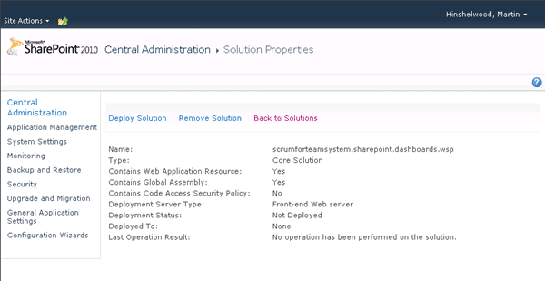](http://blog.hinshelwood.com/files/2011/05/image7.png)

    { .post-img }

                **Figure: You can manually deploy the solution**


            5. ##### **Choose the deployment options**

                I always choose to deploy it now, but I am rarely using a server that is actively in production.

                [](http://blog.hinshelwood.com/files/2011/05/image101.png)

    { .post-img }

                **Figure: Select a time to deploy it**


        5. #### **Give up and delete the site**

            On you create a site using this template you will see that things do not really work correctly. The layout of the site is broken and it makes it difficult to navigate.

            [](http://blog.hinshelwood.com/files/2011/05/SNAGHTML4da989.png)

    { .post-img }

            **Figure: The Site Template for SfTSv3 is just plain nasty**


        7. #### **Create a site using the TFS 2010 Agile definition**

            Luckily you can just delete this site and create a new site using the “TFS 2010 Agile Dashboard” instead of the “SCRUM” site template.

            [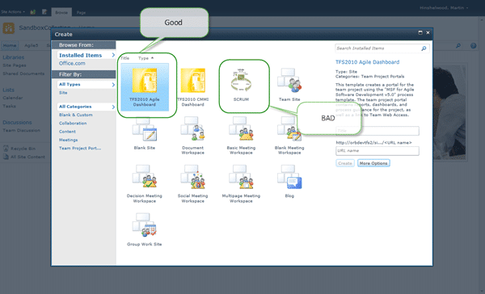](http://blog.hinshelwood.com/files/2011/05/image71.png)

    { .post-img }

            **Figure: Creating new blank sites is easy**

            _Note: Remember to configure the Team Project to point to this new SharePoint site_


        9. #### **Change the Team Project to reference the new Portal correctly**

            [](http://blog.hinshelwood.com/files/2011/05/image10.png)

    { .post-img }

            **Figure: Change the portal that the Team Project points to**


        11. #### **Verify that you have a pretty portal**

            [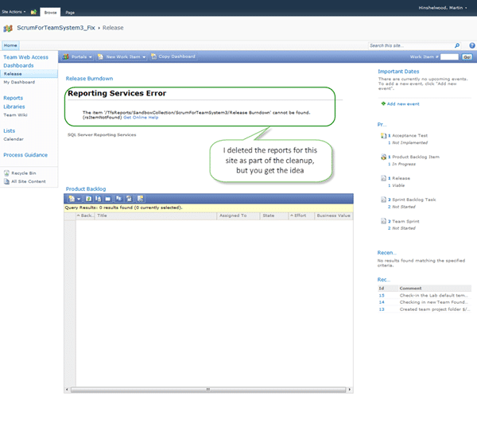](http://blog.hinshelwood.com/files/2011/05/image4.png)

    { .post-img }

            **Figure: Creating a portal with the default process is much preferable**


        13. DONE **\- Try to install the SfTSv3 Solution**

4.  ### Upgrade Team Foundation Server 2008 to Visual Studio 2010 Team Foundation Server (~6 hours)

        1. #### **Upgrade TFS 2008->2010 (7 hours for 150GB+)**

            ```
            tfsconfig import /sqlinstance:. /collectionName:MyNewCollection /confirmed
            ```

            **Figure: Importing the TFS 2008 databases is a simple command**

            [](http://blog.hinshelwood.com/files/2011/06/coffee-cup.jpg)This command takes a while to run. So get some sleep or just a coffee.

    { .post-img }

        3. #### **Enable SharePoint integration**

            Although SharePoint was automatically configured for use with the TFS server, there will be no integration configured for the newly created Team Project Collection.

            _Note: Follow [Integrate SharePoint 2010 with Team Foundation Server 2010](http://blog.hinshelwood.com/archive/2010/05/03/integrate-sharepoint-2010-with-team-foundation-server-2010.aspx) for full details_

            [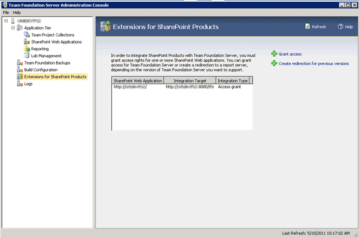](http://blog.hinshelwood.com/files/2011/05/image131.png)

    { .post-img }

            **Figure: SharePoint has already been configure for the server**

            [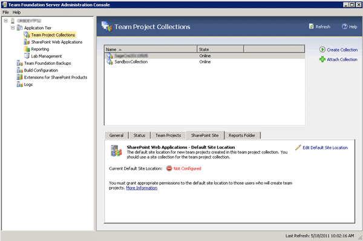](http://blog.hinshelwood.com/files/2011/05/image16.png)

    { .post-img }

            **Figure: There is no SharePoint location configured for the imported Team Project Collection**

            [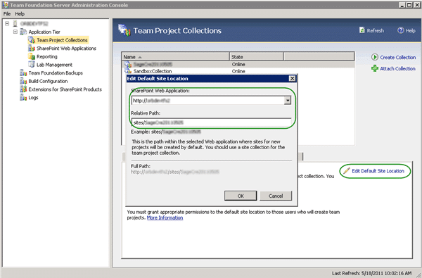](http://blog.hinshelwood.com/files/2011/05/image22.png)

    { .post-img }

            **Figure: Set the location and then click OK**

            You will be asked if you want to have a site created at this level and you should agree. This will create a new SharePoint site to hold all of the Team Project Portals that are created from now on. All of your old Portals will still be in the same location.


        5. #### **Enable Reporting Services Integration**

            Enabling Reporting Services is very similar to enabling SharePoint. Just follow the configuration options.

            [](http://blog.hinshelwood.com/files/2011/05/image25.png)

    { .post-img }

            **Figure: Configure the default reporting services location**


        7. #### **Fix and relink SharePoint sites (~30 minutes)**

            Because we are also upgrading WSS 3.0 to SharePoint Foundation 2010 and we ran the command line import we need to relink all of the Team Project to their respective upgraded projects. Although it would be ideal to create NEW portals with the 2010 functionality and migrate the existing SharePoint data across this is not being done at this time as the customer does not have time. That said, there is you are just using documents then there is not really a lot to a migration. Create a new site, copy the document library's using UNC paths and Windows Explorer, then repoint your Team Project to the new site.

            Note: I will be leaving it up to each team to upgrade as they like as while this is easy, it can be disruptive.

            [](http://blog.hinshelwood.com/files/2011/05/image31.png)

    { .post-img }

            **Figure: Change the portal that the Team Project points to**

            [](http://blog.hinshelwood.com/files/2011/05/image34.png)

    { .post-img }

            **Figure: Changing the connected portal is as easy as setting a new relative path**


        9. DONE - Upgrade Team Foundation Server 2008 to Visual Studio 2010 Team Foundation Server

5.  ### **House keeping**

        1. #### Tfs Customisations (1 hour)

            I always tend to create a team Project to hold all of the

            1. Create new team project using SfTS called “TfsCustomisations”

            3. Create folder “ScrumforTeamSystem/MAIN/Source/\*”

            5. Drop Process Template to folder and checkin

            7. Modify to support upgraded template and checkin

            [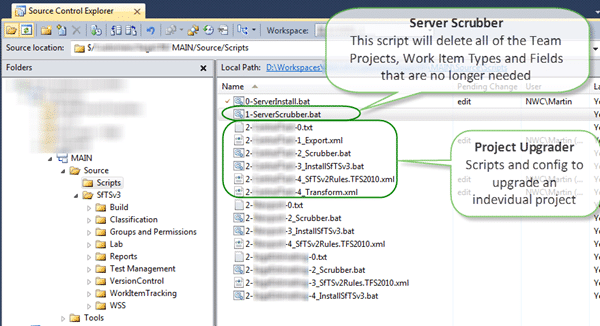](http://blog.hinshelwood.com/files/2011/05/image28.png)

    { .post-img }
    **Figure: TfsCustomisations has all of the Scripts and Process Template customisation for the upgrade and beyond**

        3. #### Clean unused customisations

            Before we begin with the upgrade of individual Team Projects there needs to be some clean up of the TFS server itself. You need to identify:

            1. ##### **Which Team Projects can be delete**

                You should be able to have the customer identify which Team Projects can immediately be deleted.

                ```
                TfsDeleteProject /q /excludewss /force /collection:%tpc%  "Team Project Name"
                ```

                **Figure: Command to delete a Team Project from TFS**

                _Warning: This process is not reversible_


            3. ##### **Which Work Item Type Definitions can be deleted**

                This is a little more difficult, but if you provide the customer with a list of Work Item Types for each Team Project along with the number of instances of each Work Item Type there is they should be able to make that call as well.

                ```
                witadmin destroywitd /collection:%tpc% /p:"e;Team Project Name"e; /n:"e;Sprint Backlog Item"e; /noprompt
                ```

                **Figure: Command to remove a Work Item Type from the TFS server**

                _Warning: This process is not reversible_

                There is not really any point in keeping a Work Item Type around if it is not going to be used. Remove any that you don't need.


            5. ##### **Which Work Item Fields can be deleted**

                This is even more difficult due to the quantity. We can immediately remove any that are unused:

                ```
                witadmin listfields /collection:%tpc% /unused
                ```

                **Figure: Find unused Fields**

                However figuring out which fields that you are going to migrate and which you are not is a very difficult task. Make sure that they customer understands the implications of not migrating a Field. i.,e. All the data will be lost.

                ```
                witadmin deletefield /collection:%tpc% /n:NorthwestCadence.CustomFieldName  /noprompt
                ```

                **Figure: You can only delete fields that are not in use**

## Upgrade each Team Project (~4 hours)

The Upgrade of the Team Projects is arguably the most difficult area of TFS. It is not only tedious, but it is also not supported out of the box. Once you have chosen your Process Template you are stuck with it for life. There are a number of options here for doing the upgrade:

1. **Stick with same template Not good as everyone wants to take advantage of the new features of TFS 2010.**

2. **Use the SfTSv3 Upgrade tool to move to a new Team Project.**This really sucks as you can never delete the old project. When you do a “move” of source code it actually does a “branch & delete” under the covers, thus your “history” is actually stored where is always was and never moves. If you delete the old team project you will loose the history.

   _Note: If you remove permissions to view the project you will also loose the history_

3. **Use the TFS Integration Platform to move Source and Work Item history to a new team project**This is an ideal solution, but it does result in “time dilation” on your source control. There is no way to fake a check-in date so all dates will be when the actual check-in happens. As the TFS Integration Platform does all of the check-ins concurrently it stores the original date in the comments. This was not possible with this customer as they use that date often in their internal tools and processes.

4. **Do an in place manual migration This is just plane nasty and take a lot of time. It can take over 8 hours to complete the migration once it has been planned out, and that time depends on the process template you are moving from, the one you are moving to, and the customisations you have made along the way. If all of your Team Projects have different customisations, then this is probably a non starter.**

5. **Do an in-place _export_ migration.** This gives us the best of both worlds, with an export of Work Item data to another location, destroying all the existing work item types along with all of the data, then install the new Work Item Types and reload the data. This is still a horrible process, but it keeps the Source Code history in tact, and allows for the process template to be completely upgraded.

My customer has to go with #5 and we should be able to use the SfTSv3 Migration tool that comes from EMC. It does an export to XML and then transforms the data from SfTSv2 to SfTSv3 before you import it back in. The tool was designed to work by migrating from one Team Project to another, but I am going to use it to achieve the in-place export migration I described above.

### SfTSv3 In-Place Export Migration (~4 hours per team project)

As the Export Migration is the chosen route of least friction we need to follow a lot of steps to get there. I would note that for a large project, one of mine was over 400MB of XML data to import, can take a really long time. My longest was 8 hours, and yes you have to babysit the process.

1.  #### **Export TeamProjectX to XML (20 minutes)**

        Exporting is probably the easiest part of this process but that will depend on the amount of data. If the project has been around for along time then you could end up with a rather large XML file. One of the Team Projects here produced a file larger than 500mb for under 20k of Work Items. It is really the revisions that detail the amount of data and time it will take.

        [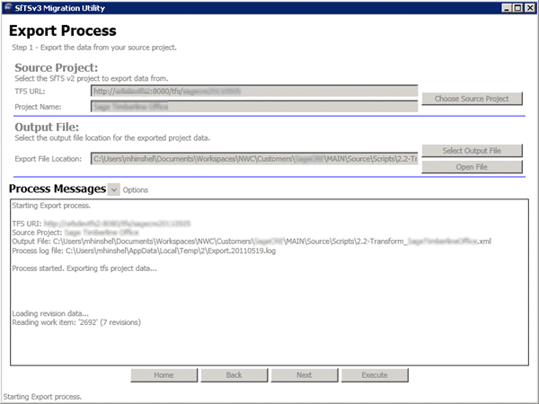](http://blog.hinshelwood.com/files/2011/05/image.png)

    { .post-img }

        **Figure: Exporting is easy**

        This is actually a process that i would contemplate using long term. Outputting all of the Work Item history behind your Team Project to an XML file is very desirable for a variety of migration scenarios. Although, if I was writing the import it would use the TFS Integration Platform which would give me the best of both worlds. In this case I do not have time to create an XML Adapter for it.

2.  #### **Transform TeamProjectX (Started 10:45) (3 hours 15 minutes for 19550 work item)**

        For the transform to work you must specify a “Rules” file that has all of the mapping in it. This file is a bit of a black box with sparse documentation, but I did manage to add the ~15  custom fields that are being kept. I also had to add a bunch of mappings to “fold” some custom Work Item Types into

        [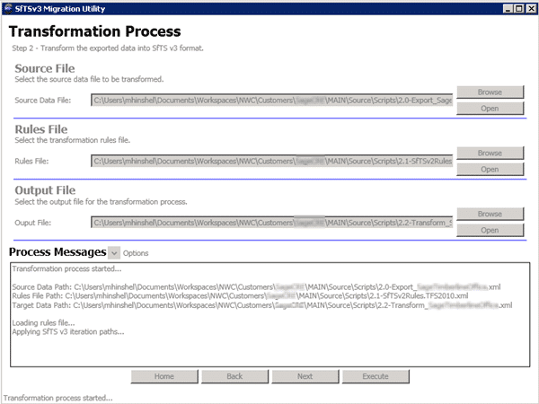](http://blog.hinshelwood.com/files/2011/05/image1.png)

    { .post-img }

        **Figure: Transforming can take some time if there are a lot of revisions**

        This is where I find the deficiencies come into the process and they have not tested the process with enough edge cases. Why do I say this? Well, lets take a look at the next step shall we…

3.  #### **Fix data before import**

        For a production ready tool the SfTSv3 Migration Tools leaves a lot to be desired. There are number of things that you need to do as part of a data validation and clean-up before you progress with the import

        1. ##### **Replace invalid characters**

            The tool completely fails to take into account that you can have characters in the old “Team” drop down that are no valid in the Iteration Path that the data has been moved to. In this case it is ‘<’ and ‘>’

            [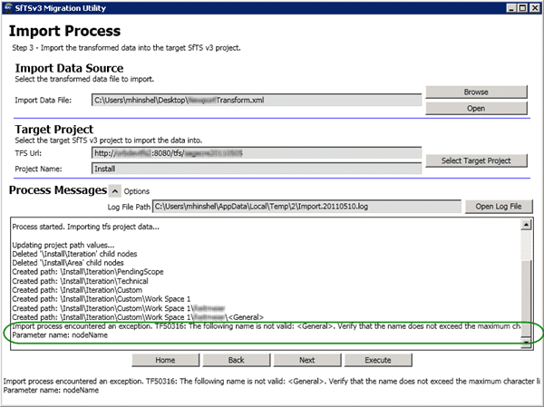](http://blog.hinshelwood.com/files/2011/05/image41.png)

    { .post-img }

            **Figure: It does not handle the ‘<’ or ‘>’**

            **[](http://blog.hinshelwood.com/files/2011/05/image2.png)**

    { .post-img }

            Figure: I just don’t understand why the tool does not fix tis itself.

            [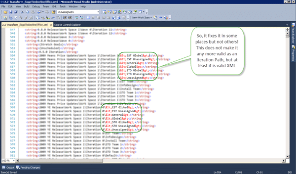](http://blog.hinshelwood.com/files/2011/05/image3.png)

    { .post-img }

            **Figure: Although valid XML this is still not good output**

        3. ##### **Remove users that have been deleted from Active Directory**

            If you do not remove these account you will spend hours trying to change the inline. In one project with only ~2000 work items there were over 300 invalid user instances specified. The best thing here is to do a search for “domain” and then replace “surname, forename (domainusername)” with a selected user. In this case I found an account that was in the system aptly called “**_\_GhostService_**” so I used that.

            [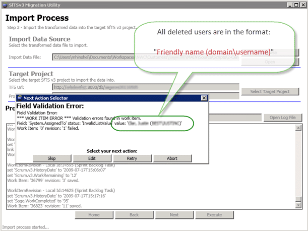](http://blog.hinshelwood.com/files/2011/05/image5.png)

    { .post-img }

            **Figure: All deleted users need to be fixed**

            **[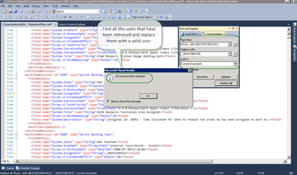](http://blog.hinshelwood.com/files/2011/05/image6.png)** **Figure: Visual Studio is pretty good at replacing in big files (100MB+)**

    { .post-img }

            It sucks very much that this is the case as the TFS Integration Platform will take care of this for you by inserting the user anyway. Thus preserving the history.


        5. ##### **Add in missing Area Paths**

            There are so many missing paths that it is impossible to manually add them so I have written some VB code to parse the output XML and build the correct list of nodes:

            ```
            Dim xmlDocument As New Xml.XmlDocument()
            xmlDocument.Load("TransformedXML.xml")

            Dim foundIP As New List(Of String)
            Dim nodes As XmlNodeList
            ' Find all used nodes
            nodes = xmlDocument.SelectNodes("//*[local-name()='Field']")
            For Each node As XmlNode In nodes
                If node.Attributes("name").Value = "System.IterationPath" And Not String.IsNullOrEmpty(node.InnerText) Then
                    foundIP.Add(node.InnerText)
                End If
            Next
            ' Find all specified nodes
            nodes = xmlDocument.SelectNodes("//*[local-name()='IterationPaths']/*[local-name()='string']")
            For Each node As XmlNode In nodes
                foundIP.Add(node.InnerText)
            Next
            ' Create Distinct list of nodes
            Dim iterations As New System.Text.StringBuilder
            iterations.AppendLine("<IterationPaths>")
            For Each ip In foundIP.Distinct
                iterations.AppendLine(String.Format("   <string>{0}</string>", ip))
            Next
            iterations.AppendLine("</IterationPaths>")
            Console.Write(iterations.ToString)
            Console.ReadLine
            ```

            **Figure: The SfTSv3 Migration tool needs a little help**

            I really should not have to do this and I can only think that it is some bug in the SfTSv3 Migration tool that is stopping it creating these for me.

4.  #### **Fix Queries**

        Because we want to keep the old queries around, and you can do nothing but delete them once you delete the Work item Types we need to move them before we do anything to the Team Project. it may be that some of the teams spent a long time getting their queries “just right” and we don’t just want to delete that hard work.

        1. ##### **Create a folder called “\_2008Archive”**

            TFS 2010 added the ability to have Query folders. Here is hoping that we get them on Builds as well in the future.

            [](http://blog.hinshelwood.com/files/2011/05/image8.png)

    { .post-img }

            **Figure: The folder will store all of the old queries**


        3. ##### **Move all of the existing Queries into this folder**

            Luckily we can drag and drop Queries within the same Team Project.

            [](http://blog.hinshelwood.com/files/2011/05/image9.png)

    { .post-img }

            **Figure: All of your queries are now saved**


        5. ##### **Copy all of the new queries into the team project**

            We have at least one Team Project that was created with the new template (TfsCustomisations), and even more luckily we can drag and drop Queries between Team Projects.

            [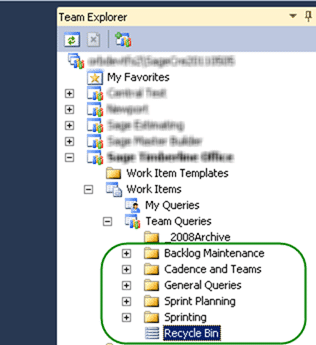](http://blog.hinshelwood.com/files/2011/05/image11.png)

    { .post-img }

            **Figure: Shiny new Queries are now waiting for the team**

5.  #### **Fix Reports**

        You will need to add the new reports to TFS, but unfortunately while there is drag and drop support for moving reports within a Team Project there is no way to drag them _into_ a Team Project, but there his a command line tool to support this. However, prior to running it you should again create a “\_2008Archive” folder to load all of the existing reports into. Again there may be a bunch of custom reports in there that the team does not want to loose. Once you have done that you can call the command line option to install the new templates

        [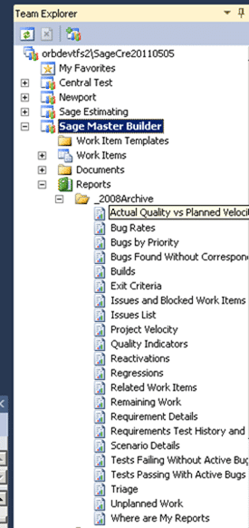](http://blog.hinshelwood.com/files/2011/05/image12.png)

    { .post-img }

        **Figure: Put all existing reports under “\_2008Archive”**

        ```
        tfpt addprojectreports /collection:%tpc% /teamproject:%tp% /processtemplate:"Scrum for Team System v3.0.3784.03" /force
        ```

        **Figure: Command to add all of the Reports for a Process Template to TFS**

6.  #### **Tare down old SfTSv2 Process Template**

    This is where the demolition expert in you gets to have a little fun. It is very complicated to build things, and not so much to destroy them. Now that we have all of our data exported and transformed we can go ahead and destroy all of the Work Item Type Definitions (WITD) that are in that Team Project.

    Because I am running a whole lot of command against multiple Team Projects and I do not want to have to change out the Team Project Collection every time, here is a little hint for the command line.

    ```
    set tpc=http://tfsServerName:8080/tfs/teamProjectCollectionName
    ```

    **Figure: Set a variable so you don't have to add things to every command**

    ```
    witadmin listwitd /collection:%tpc% /p:"[Team Project Name]"
    ```

    **Figure: Get a list of all the Work Item Types**

    ```
    witadmin destroywitd /collection:%tpc% /p:"[Team Project Name]" /n:"Bug" /noprompt
    witadmin destroywitd /collection:%tpc% /p:"[Team Project Name]" /n:"Product Backlog Item" /noprompt
    witadmin destroywitd /collection:%tpc% /p:"[Team Project Name]" /n:"Sprint Backlog Item" /noprompt
    witadmin destroywitd /collection:%tpc% /p:"[Team Project Name]" /n:"Impediment" /noprompt
    witadmin destroywitd /collection:%tpc% /p:"[Team Project Name]" /n:"Sprint Retrospective" /noprompt
    witadmin destroywitd /collection:%tpc% /p:"[Team Project Name]" /n:"Sprint" /noprompt
    ```

    **Figure: Delete the default Work Items, but don’t forget any custom ones**

    _note: Because this was a Team Project that was upgraded from TFS 2008 there are no links or categories to update. You will also need to make sure that you do something with all of the custom fields and Work Item Types that have been added._

7.  #### **Build up new SfTSv3 Process Template**

    Building up the Work Item Types is not quite as much fun as tearing them down, but it does give you more of a sense of achievement. In order to “install” the SfTSv3 Process Template you need to:

    1. ##### **Install the SfTSv3 Work Item Type Definitions**

       These new work item types can be easily added to make it look as if the Project always had this process template. There are still more things that we will need to do later to make this a workable solution.

       ```
       witadmin importwitd /collection:%tpc% /p:"[Team Project Name]" /f:".WorkItemTrackingTypeDefinitionsAcceptanceTest.xml"
       witadmin importwitd /collection:%tpc% /p:"[Team Project Name]" /f:".WorkItemTrackingTypeDefinitionsBug.xml"
       witadmin importwitd /collection:%tpc% /p:"[Team Project Name]" /f:".WorkItemTrackingTypeDefinitionsImpediment.xml"
       witadmin importwitd /collection:%tpc% /p:"[Team Project Name]" /f:".WorkItemTrackingTypeDefinitionsProductBacklogItem.xml"
       witadmin importwitd /collection:%tpc% /p:"[Team Project Name]" /f:".WorkItemTrackingTypeDefinitionsRelease.xml"
       witadmin importwitd /collection:%tpc% /p:"[Team Project Name]" /f:".WorkItemTrackingTypeDefinitionsSharedStep.xml"
       witadmin importwitd /collection:%tpc% /p:"[Team Project Name]" /f:".WorkItemTrackingTypeDefinitionsSprint.xml"
       witadmin importwitd /collection:%tpc% /p:"[Team Project Name]" /f:".WorkItemTrackingTypeDefinitionsSprintBacklogTask.xml"
       witadmin importwitd /collection:%tpc% /p:"[Team Project Name]" /f:".WorkItemTrackingTypeDefinitionsSprintRetrospective.xml"
       witadmin importwitd /collection:%tpc% /p:"[Team Project Name]" /f:".WorkItemTrackingTypeDefinitionsTeamSprint.xml"
       ```

       **Figure: Add the Work Items that you put under version control in the TfsCustomisations Team Project**

    2. ##### **Install the SfTSv3 Categories**

       Categories as new in TFS 2010 and all reports to load Categories rather that be hard coded to particular Work Item Types. The only stipulation / limitation is that a Work Item can only be in one Category.

       ```
       witadmin importcategories /collection:%tpc% /p:"[Team Project Name]" /f:".WorkItemTrackingcategories.xml"
       ```

       **Figure: Add categories to enable some of the TFS 2010 functionality**

    3. ##### **Install the SfTSv3 Link Types**

       Link Types enable one of the core features of TFS 2010. The ability to have nested work items. It is worth noting that there are some built in Link Types that are not listed here that will support MS Project and other tools. These will already have been added by the upgrade process.

       ```
       witadmin importLinktype /collection:%tpc% /f:".WorkItemTrackingLinkTypesFailedBy.xml"
       witadmin importLinktype /collection:%tpc% /f:".WorkItemTrackingLinkTypesImpededBy.xml"
       witadmin importLinktype /collection:%tpc% /f:".WorkItemTrackingLinkTypesImplementedBy.xml"
       witadmin importLinktype /collection:%tpc% /f:".WorkItemTrackingLinkTypesSharedStep.xml"
       witadmin importLinktype /collection:%tpc% /f:".WorkItemTrackingLinkTypesTestedBy.xml"
       ```

       **Figure: Link Types only need to be added once**

8.  #### **Import Data back into new SfTSv3 Work Items**

        1. ##### **Stop the SfTS Process Template Services**

            So that you do not get duplicate items or any rollup going on prior to the upgrade completing you need to “Retract” the deployment from the Team Project Collection that you will be importing the data to.

            [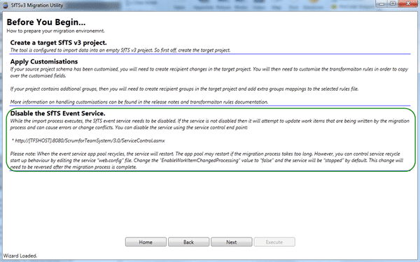](http://blog.hinshelwood.com/files/2011/05/image14.png)

    { .post-img }

            **Figure: You MUST stop the service from running**

            [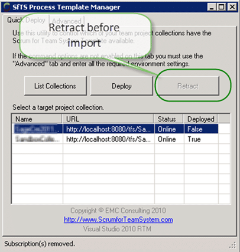](http://blog.hinshelwood.com/files/2011/05/image15.png)

    { .post-img }

            **Figure: Retract before import**


        3. ##### **Run the import**

            This can take quite a long time, but in my experience does not take quite as long as the transformation process.

            [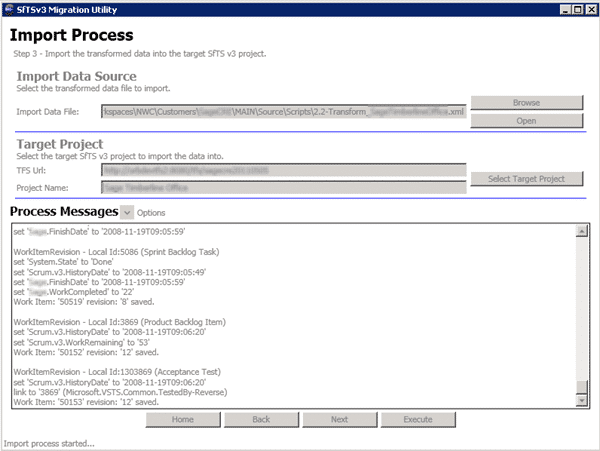](http://blog.hinshelwood.com/files/2011/05/image17.png)

    { .post-img }

            **Figure: The import runs one change at a time**


        5. ##### **Fix any errors that crop up**

            During the process there will be errors. I can guarantee this. Although I have done my very best to make sure that there are as few as possible, I still end up having to babysit the process to completion.

            [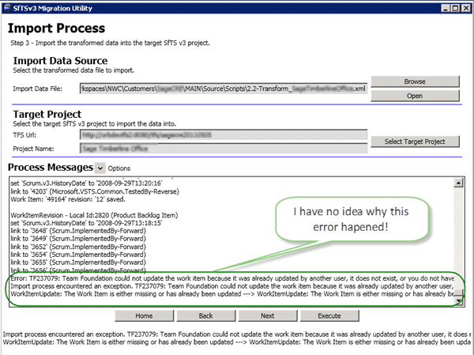](http://blog.hinshelwood.com/files/2011/05/image18.png)

    { .post-img }

        7. ##### **Start the SfTS Processes**

            [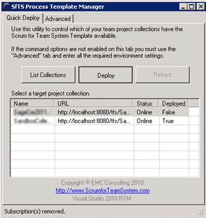](http://blog.hinshelwood.com/files/2011/05/image19.png)

    { .post-img }

            **Figure: Redeploy the processes**


        9. ##### **Implement Release dates rollup fix**

            ```
            UPDATE [Tfs_SageCre20110505].[dbo].[tbl_EventSubscription]
            SET [Expression] =
                REPLACE
                (
                    [Expression],
                    '|Product Backlog Item|Sprint Backlog Task|',
                    '|Product Backlog Item|Sprint|Sprint Backlog Task|'
                )
            WHERE
            [Expression] LIKE '%|Product Backlog Item|Sprint Backlog Task|%'
            ```

            Figure: You need to fix the data after


        11. ##### **Run all calculations**

            [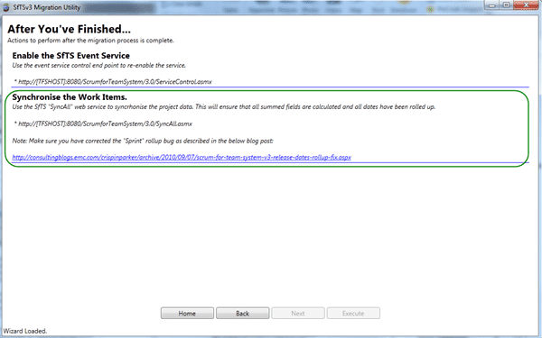](http://blog.hinshelwood.com/files/2011/05/image20.png)

    { .post-img }

            **Figure: You need to run a recalculation on all of the work items**

9.  #### **Rebuild the Warehouse**

        [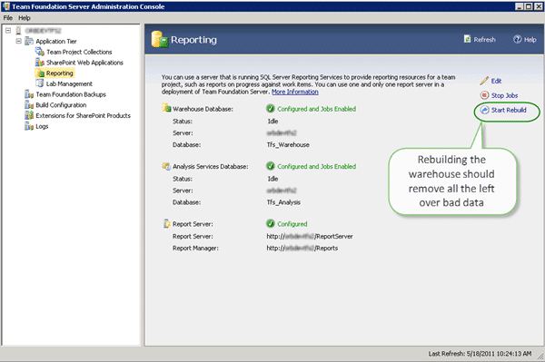](http://blog.hinshelwood.com/files/2011/05/image21.png)

    { .post-img }

        **Figure: You can rebuild the warehouse through the TFS Admin Console**

10. #### **DONE**

    Now that we have completed the upgrade of one Team Project we can complete the process on everyone

    How did your upgrade go?

## REFERNECES

- [Upgrade Team Foundation Server 2008 to TFS 2010 (and SharePoint Server 2010) - Random Musings of Jeremy Jameson - Site Home - MSDN Blogs](http://blogs.msdn.com/b/jjameson/archive/2010/05/04/upgrade-team-foundation-server-2008-to-tfs-2010-and-sharepoint-server-2010.aspx)

- [How do I build a 3.5 solution with MSBuild 4.0?](http://stackoverflow.com/questions/1687420/how-do-i-build-a-3-5-solution-with-msbuild-4-0)

- [New in FinalBuilder 7](http://www.finalbuilder.com/new-in-finalbuilder-7.aspx)

- [Breaking Change in VS 2010 SP1: using key file for signing C++/CLR assemblies](http://connect.microsoft.com/VisualStudio/feedback/details/652991/breaking-change-in-vs-2010-sp1-using-key-file-for-signing-c-clr-assemblies)

- [List Fields That Are Not Being Used](<http://msdn.microsoft.com/en-us/library/ms404864(v=VS.100).aspx>)

- [TFS 2010 Compatibility with Older Clients - bharry's WebLog - Site Home - MSDN Blogs](http://www.google.co.uk/search?sourceid=chrome&ie=UTF-8&q=compatability+tfs+2010+vs2008#hl=en&safe=off&sa=X&ei=J7DJTfCAC861twfnoOzbBw&ved=0CBcQBSgA&q=compatibility+tfs+2010+vs+2008&spell=1&fp=edc1e8e99e75b7df&biw=1321&bih=850)

- [Download details: Visual Studio Team System 2008 Service Pack 1 Forward Compatibility Update for Team Foundation Server 2010 (Installer)](http://www.microsoft.com/downloads/en/details.aspx?FamilyID=cf13ea45-d17b-4edc-8e6c-6c5b208ec54d)

- [Compatibility Matrix for 2010 Beta 2 Team Foundation Server to Team Explorer 2008 and 2005 - Teams WIT Tools - Site Home - MSDN Blogs](http://blogs.msdn.com/b/teams_wit_tools/archive/2009/10/19/compatibility-matrix-for-2010-beta-2-team-foundation-server-to-team-explorer-2008-and-2005.aspx)

- [Report Services Automation With PowerShell « Code Assassin](http://blog.codeassassin.com/2007/10/14/report-services-automation-with-powershell/)

- [PsTFS - Cmdlet for Team Foundation Server – Home](http://pstfs.codeplex.com/)

- [Delete / Remove TFS Work Item Type](http://geekswithblogs.net/juang/archive/2008/09/03/delete--remove-tfs-work-item-type.aspx)

- [FAQ #5: How do I destroy work items or work item types? - Teams WIT Tools - Site Home - MSDN Blogs](http://blogs.msdn.com/b/teams_wit_tools/archive/2008/02/06/faq-5-how-do-i-destroy-work-items-or-work-item-types.aspx)

- [Scrum for Team System v3 – Release dates rollup fix](http://consultingblogs.emc.com/crispinparker/archive/2010/09/07/scrum-for-team-system-v3-release-dates-rollup-fix.aspx "http://consultingblogs.emc.com/crispinparker/archive/2010/09/07/scrum-for-team-system-v3-release-dates-rollup-fix.aspx")

- [XPath + Namespace Driving me crazy](http://stackoverflow.com/questions/536441/xpath-namespace-driving-me-crazy)

- [XPath Examples](https://www.w3schools.com/xml/xpath_examples.asp)
