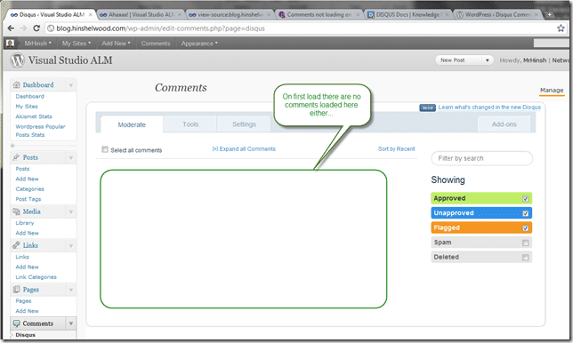
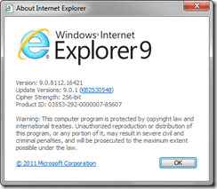

{ .post-img }

I am having a problem on my blog with comments. Namely that you cant see any! This is the downside of relying on a third party tool, but do the problems out weight the benefits?

-  [Comments not loading](http://getsatisfaction.com/disqus/topics/comments_not_loading_on_wordpress)

  

* * *

I am having problems with Disqus on Wordpress in Chrome; My comments don't load, and they do not load the first time in the admin system either. In the Admin system a reload of the page fixes the issue, but on the site, nada.

  
{ .post-img }
**Figure: Even on short posts there are no comments**

  
{ .post-img }
**Figure: No comment in admin until a reload**  
[http://blog.hinshelwood.com](http://blog.hinshelwood.com/)

- **What could be the problem?**
- **How do I fix it?**

**_<RANT>_**

Above s the exact information that I put in an email to help@disqus.com,  and do you know the response I got!

> _Hi Martin,  
> Sorry to hear you're having trouble. To help us get to the bottom of this, kindly forward us the following information:  
> \- a link to a page experiencing this issue;  
> \- a step-by-step process to reproduce the issue on our end;  
> \- screenshots of any errors or irregularities in this process -- for more information on how to take a screenshot, visit_ [_http://take-a-screenshot.org/_](http://take-a-screenshot.org/)  
> _\- web browser and version being used, e.g. Internet Explorer 9 or Firefox 4 -- to determine this information, visit_ [_http://www.whatbrowseramiusing.co/_](http://www.whatbrowseramiusing.co/)
> 
> _Kind Regards,  
> Ryan_

Now I do not know who Ryan is or even if he exists, but all of those questions are already answered by looking at the original email.

- Why is it that they never read that first email?

Come on guys, you can do better!

**_<RANT>_**

_So I still need to reply:_

_**<RESPONCE>**_

##### Ryan,

If you had taken a movement to read my first email, you would have seen all of the answers that you requested. In the future I will remember to send you a blank email with only a subject first so you can provide the reply you did without looking foolish. Anyhoo, here is the information that you requested extracted from the email you already have:

> _\>>a link to a page experiencing this issue;_

All pages as describes. Go to any single blog post page, but the one depicted in the screenshot would be you best bet ([_http://blog.hinshelwood.com/ahaaaa/_](http://blog.hinshelwood.com/ahaaaa/)) its an old post, but short so loads quickly.

> _\>>a step-by-step process to reproduce the issue on our end;_

1. Go to individual post page on site  
      
    _e.g._ [_http://blog.hinshelwood.com/ahaaaa/_](http://blog.hinshelwood.com/ahaaaa/) _(as depicted in the screenshot)_  
    
2. See problem that is demonstrated in this screenshot  
      
      
{ .post-img }
    **Figure: Same problem exists in this screenshot**

> _\>>screenshots of any errors or irregularities in this process -- for more information on how to take a screenshot, visit [http://take-a-screenshot.org/](http://take-a-screenshot.org/)_

Original email bellow contained screenshots. See “Figure: Even on short posts there are no comments” and “Figure: No comment in admin until a reload” below (\*note your email tool has stripped them out but you can clearly see where they were provided). I have provided them here again as well as a link to a blog posts with all of the information available.

> \>>web browser and version being used, e.g. Internet Explorer 9 or Firefox 4 -- to determine this information, visit [http://www.whatbrowseramiusing.co/](http://www.whatbrowseramiusing.co/)

As you can see from the screenshots provided I am using Chrome. The problem does not resent itself in IE9.

  
{ .post-img }
**Figure: The version of Chrome I currently use**

  
{ .post-img }
**Figure: The version of IE that I use**

Please do not hesitate to contact me if you have any further problems extracting information from an email or even new ones that are not answered here.

**<RESPONCE>**

Let see if I get any help… I can’t think I am the only one who's blog does not work with Chrome.

