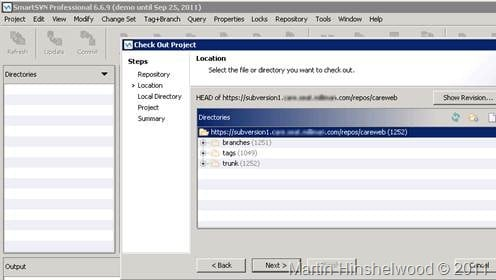
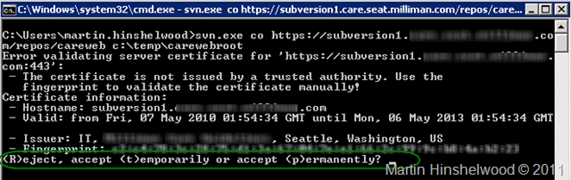

{ .post-img }

Migrating data from SVN to TFS can be both a timely and a costly business. I was trying out the two tools [TFS Integration Platform](http://tfsintegration.codeplex.com/) & [Timely Migration](http://www.timelymigration.com/) but I ran into what looked like the same problem in both if them.

- Acknowledgement: Thorsten Dralle - Thorsten helped me figure out what the heck was going on when I could not connect

---

Although I do have permission I can’t get the tools to talk and load from Subversion with the following effect / error messages:

- **TFS Integration Platform  
   **  
     
  { .post-img }
  **Figure: Unable to validate the URL  
   **
- **Timely Migration  
   **  
   And I am now very confused as I have tried Timely Migrations tool as well and it has an error that is similar enough to not be coincidence.
  
  { .post-img }
  **Figure: Also unable to validate the repository URL  
   **
- **Internet Explorer  
   **  
   I will go back to the admins and make sure that everything is correct, but I am not sure if they are going to have any other advice.  
     
  { .post-img }
  **Figure: Unable to validate the certificate. (From an internal server)  
   **  
   I have even looked at making sure that the url is correct and putting it into the browser results in a list of the folders which looks right to me.
  
  { .post-img }
  **Figure: This is expected  
   **
- **SmartSVN**
  This is very odd and I am having some trouble figuring it out. I can access SVN through SmartSVN.

      

  { .post-img }
  **Figure: SmartSVN worked just fine after I accepted the fingerprint**

So, what is the problem?

Well, Thorsten figured it out that the invalid digital certificate used for Subversion is blocking the ability for the tool to access it and throwing up very misleading error messages. If you run the standard SVN tool against that repository and try to access any of the files you will be asked what to do about the problem:

```
svn.exe co https://host/PathToYourRepo c:somethinglocalfolder
```

This command will download the latest sources locally if you let it run but it will also, If there is a certificate mismatch / error the command line tool will ask you what to do.


{ .post-img }

**Figure: Options for accepting certificate**

Typically you have three options:

- Accept Temporarily

- **Accept forever**

- Reject

If you select “**_(p)ermenantly_**” you will then be able to run the migration tools successfully. You will need to do this for every Subversion Repository you want to migrate from. Or, you can fix the certificate or just remove it.
