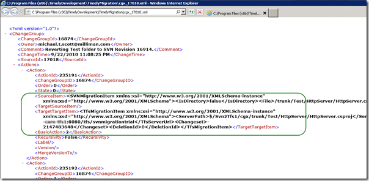
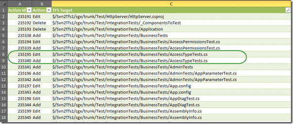

[](http://blog.hinshelwood.com/files/2011/08/subversion1.png)
{ .post-img }

[](http://blog.hinshelwood.com/files/2011/08/image4.png)Running into problems when migrating a Subversion Repository to Team Foundation Server is what to so with conflicts resulting from SVN being Case Sensitive and TFS not.
{ .post-img }

note: Case Sensitivity is mostly a bad idea for files, url’s and code.

---

On of the problems with Subversion is that it treats “/trunk/a.txt” and “/trunk/A.txt” as two different files. This can cause conflicts during the migration that need to be resolved.

[](http://blog.hinshelwood.com/files/2011/08/image5.png) **Figure: The migration runs smoothly for a while.**
{ .post-img }

For the smaller sets that I migrated to test this tool it worked just fine, but the larger the data set, the more likely you are to encounter errors. The first set was 1700+ changes, but this one is 24000+ which mean that it is more than 10 times more likely to encounter a conflict.

[](http://blog.hinshelwood.com/files/2011/08/image6.png) **Figure: Unable to resolve conflict where two changes have the same target item**
{ .post-img }

Dam, but conflicts suck. This particular conflict is due to two changes from Subversion are being applied to the same file in a single changes. We need to be able to resolve this as you will not be able to make changes to what is migrated and then rerun that portion.

```
LogicalOperationStack=Migrate, Main
DateTime=2011-08-26T16:21:57.8098771Z
[8, 4532, 8/26/2011 9:21:57 AM, Migrate] Stopping (overall: 00:00:01.1687929)
MigrationConsole.exe Warning: 0 : The migration engine is unable to resolve a conflict where two changes have the same target item:
LogicalOperationStack=Main
DateTime=2011-08-26T16:21:57.8108537Z
MigrationConsole.exe Information: 0 : Microsoft.TeamFoundation.Migration.Toolkit.UnresolvableConflictException: The migration engine is unable to resolve a conflict where two changes have the same target item:
   at Microsoft.TeamFoundation.Migration.Toolkit.ChangeOptimizer.detectConflicts()
   at Microsoft.TeamFoundation.Migration.Toolkit.ChangeOptimizer.Resolve()
   at Microsoft.TeamFoundation.Migration.Toolkit.BatchingContext.Flush()
   at Microsoft.TeamFoundation.Migration.Toolkit.VC.SourceToTfsMigrationEngine.Flush(BatchingContext context)
   at rlEDq7v0Ex0lXcB8eF.3RBgRNXCby0G0kR3Z1.Flush(BatchingContext context)
   at Microsoft.TeamFoundation.Migration.Toolkit.VC.SourceToTfsMigrationEngine.ProcessChangeGroup(ChangeGrouping group)
   at rlEDq7v0Ex0lXcB8eF.3RBgRNXCby0G0kR3Z1.ProcessChangeGroup(ChangeGrouping )
   at kKnILa3qW3UW4h2H4L.f8pB0cQoQnxV42wuir.ProcessChangeGroup(ChangeGrouping )
   at Microsoft.TeamFoundation.Migration.Toolkit.VC.VCMigrationEngine.MigrateEach()
   at Microsoft.TeamFoundation.Migration.Toolkit.VC.VCMigrationEngine.Run()
   at Microsoft.TeamFoundation.Migration.Toolkit.VC.SourceToTfsMigrationEngine.Run()
   at rlEDq7v0Ex0lXcB8eF.3RBgRNXCby0G0kR3Z1.Run()
   at OjkZA5fW18B01Gf9op.bKFnHGSRxN5AAInIof.vonZTPjT0()
LogicalOperationStack=Main
DateTime=2011-08-26T16:21:57.8118303Z
MigrationConsole.exe Information: 0 : Svn2TFS_cgx: The migration engine is unable to resolve a conflict where two changes have the same target item:
LogicalOperationStack=Main
DateTime=2011-08-26T16:21:57.8118303Z
MigrationConsole.exe Warning: 0 : Thread was being aborted.
LogicalOperationStack=Main
DateTime=2011-08-26T16:21:57.8235495Z
MigrationConsole.exe Information: 0 : System.Threading.ThreadAbortException: Thread was being aborted.
   at System.Threading.Thread.AbortInternal()
   at System.Threading.Thread.Abort()
   at OjkZA5fW18B01Gf9op.bKFnHGSRxN5AAInIof.eY3TcUpOH(Thread )
LogicalOperationStack=Main
DateTime=2011-08-26T16:21:57.8264793Z
```

**Figure: Well, this is going to be fun**

Luckily Timely Migration have a little Support tools to help us. Fire up “Migration Support”, which is in the install folder, and have a bunch of tools to make things easier.

[****](http://blog.hinshelwood.com/files/2011/08/image7.png)
{ .post-img }

**Figure: Which support tool would you like to use**

Most migration tools forget about this bit and I have only really seen it in Timely and in the Integration Platform. What I need to be able to do is open the Session Analysis and make a couple of changes to fix the issue. Luckily there is a “Session Viewer” which will open the TfsTimelyMigration database that you created as part of your configuration.

[](http://blog.hinshelwood.com/files/2011/08/image8.png)
{ .post-img }

**Figure: There are a bunch of features to edit the “Session” data**

The first thing we need to do is find out where we are. Clicking the “Get Pending Change Group” will load up that pesky 17018 item that is causing the block.

[](http://blog.hinshelwood.com/files/2011/08/image9.png)
{ .post-img }

**Figure: You can edit the change group to bypass the problem**

It is now a case of figuring out what the problem actually is. There are no “Rename”’s so it is not a case of a Rename causing a conflict, but what is the problem…

I could not figure it out from just scrolling through this list so I though to use the “Save Actions As”, but the output from that provided to be NASTY. Real nasty:

[](http://blog.hinshelwood.com/files/2011/08/image10.png)
{ .post-img }

**Figure: What the heck use is this!**

So what I decided to do was install the Snagit 10 trial and use the “Capture Text” function.

[](http://blog.hinshelwood.com/files/2011/08/image11.png)
{ .post-img }

**Figure: Snagit Capture text function gives you grab the entire vertical area in one go**

[](http://blog.hinshelwood.com/files/2011/08/image12.png)
{ .post-img }

**Figure: Now I have it as a kind of notepad format**

Taking this output, pasting it into Excel, creating the data as a table and ordering by “TFS Source” produces an interesting result.

[](http://blog.hinshelwood.com/files/2011/08/image13.png)
{ .post-img }

**Figure: You can see the dups**

Where you might ask, did these come from. Well, in the settings file there was an option for “ItemExistshandler” that for most cases can be set to “ChangeTpEdit”, the only problem is if the file is already an “Add” then you are going to get a conflict like this one.

[](http://blog.hinshelwood.com/files/2011/08/image14.png)
{ .post-img }

**Figure: Item Exists Handler default to Change to Edit**

While this is indeed desired behaviour, it can case this sort of issue when there are files that have slightly different casing when they are added.

- \*\*Change the option to “Ignore”
  \*\*

While this would remove the conflicts, it would poise the real risk of loosing data.

[](http://blog.hinshelwood.com/files/2011/08/image15.png)
{ .post-img }

**Figure: Risky option, change setting to ignore Existing Items**
{ .post-img }

- **Remove each conflict (Recommended)**

For each item in the list, determine which one is in conflict and remove it manually. This is likely to happen ever time a large number of changes is checked in or reorgs of code happen.

[](http://blog.hinshelwood.com/files/2011/08/image16.png)
{ .post-img }

**Figure: Safe option, remove each bad change**
{ .post-img }

It would be really nice if Timely could add the ability to view the conflicts only and be able to bulk apply the resolution as I am looking at 300+ conflicts in a single check-in. At least we are 68% of the way through this particular migration and the chances are (fingers crossed) that there will only be a few conflicts.

**Let me know how you get on with your own migrations!**
