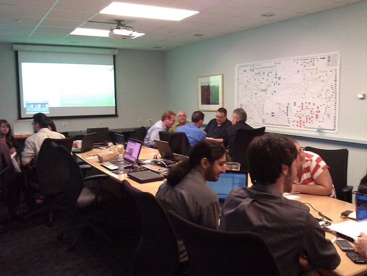
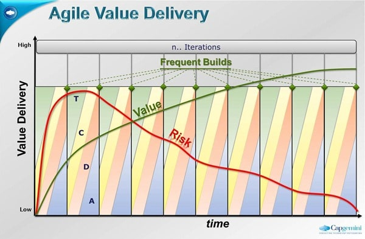

Before the "[Professional Scrum Foundations](http://www.scrum.org/professionalscrumfoundations/)" course ever existed I was tasked with delivering a practical Scrum foundation course for our customers. I came up with a 2 day “Scrum Foundation” course that included lots of practical exercises and leveraged the existing [Scrum Open](http://www.scrum.org/scrumopen/) exam. But why would you want it and is that all you need?

---

It is hard to adopt Scrum. You just have to read Ken’s “Scrum is hard and Disruptive” to understand just how hard!

## But is that bad?

The reason that more organisations start looking hard at Agile and Scrum adoption is that we, as an industry, have lost the trust of business. The reason that we have lost the trust of business is that we (the IT industry) have proven time and again that we are:

- unable to deliver on time
- unable to deliver on budget
- unable to deliver what the business need

Is it any wonder that business does not trust us?

> 1. Scrum is a framework for iterative, incremental development using cross-functional, self-managing teams. It is built on industry best practices, lean thinking, and empirical process control.
> 2. Scrum is optimized for high yield product management and product development. Scrum is particularly appropriate for high risk, complex, large projects and can be used when other parts of the endeavour are hardware or even waterfall development.
> 3. If waterfall suits current needs, continue using it.
> 4. An enterprise can use Scrum as a tool to become the best product development and management organization in its market. Scrum will highlight every deficiency and impediment that the enterprise has so the enterprise can fix them and change into such an organization.
> 5. Whenever an enterprise modifies or only partially implements Scrum, it is hiding or  
>    obscuring one or more dysfunctionalities that restrict its competence in product  
>    development and management.
> 6. The iterative, incremental nature of Scrum puts stress on the product development organization to improve its engineering skills and on the product management organization to optimize the return on investment of every release and project. The phrase, “That can’t be done here” really means that it will be very difficult to do so. The gap between current practices and target practices is a measure of incompetence and  
>    competitive risk.
> 7. The use of Scrum to become an optimized product development and management organization is a change process that must be led from the top and requires change by everyone within the enterprise. Change is extremely difficult and fraught with conflict, and may take many years of sustained effort. Turnover of staff and management can be expected.
> 8. The most serious impediments to using Scrum are habits of waterfall, predictive thinking over the last twenty to thirty years; these have pawned command and control management, belief that demanding something will make it happen, and the willingness of development to cut quality to meet dates. These are inbred habits that we aren’t even aware of anymore.
> 9. The focus of using Scrum is the change from old habits to new ways of doing business. Scrum is not implemented or rolled-out as a process; it is used to foment change.
> 10. Scrum is not a methodology that needs enhancing. That is how we got into trouble in the first place, thinking that the problem was not having a perfect methodology. Effort centres on the changes in the enterprise that is needed.
> 11. Iterative, incremental development is much harder than waterfall development; everything that was hard in waterfall engineering practices now has to be done every iteration, and this is incredibly hard. It is not impossible, but has to be worked toward over time.
> 12. Managing a release or project to deliver only the highest value functionality and not deliver the rest optimizes value \[and\] is the job of product management and customers.
> 13. Self-managing teams are extremely productive. When they work closely with the customer to derive the best solution to a need, they and the customer are even more productive.
> 14. A team consists of people under pressure to do their best. Conflict is natural and the team needs to know how to deal with the conflict and have resources to draw on when needed.
> 15. The role of an enterprises management changes from telling people what to do to leading and helping everyone do their best to achieve goals. People aren’t resources and managers aren’t bosses
>
> \-Scrum is Hard and Disruptive, [Ken Schwaber](http://kenschwaber.wordpress.com/), 2006.

An interesting point to note is #3. If what you are doing works, then keep doing it, but usually if you are reading something like this, or thinking of any sort of Agile training then everything is not going well with Waterfall 
{ .post-img }

In order to help a Development Team adopt Scrum there are three things that they will need:

## Training

Wither this is formal training or in-house adoptive training it is crucial that everyone attain the same level of understanding of the target operating model and they can then understand what it means to them.

This is the reason that I created the Scrum Foundation course. It is a level setting course that is designed to put the team on the right track from the start.

  
{ .post-img }
**Figure: My First Team (BI) in Chicago this week**

## Mentoring

Once a team starts implementing Scrum they need a little extra help. While teams that have no on-going Scrum Mentoring do succeed at Scrum, more often they fail, or take a really long time to adopt. With a Mentor that is able to answer questions and attend the Sprint Review and Retrospective team are more easily able to adapt. This mentor does not need to be full time, but available to answer questions when the team has them.

  
{ .post-img }
**Figure: My Second Team (ASP.NET) getting stuck into one of my activities**

## Dedication

As Ken has said, Scrum is hard to adopt and disruptive to your organisation. It will shake things up and you need the dedication and commitment to follow through. Things will get harder before they get better and it will be hard for the organisation to change on many levels.

- There will be clashes between the business and IT as the Business asserts control over what is built and when. This is a critical process and as the Development Team builds trust with the Business the rest of the IT hierarchy will feel more and more isolated until it adapts and gets stuck into the process as well.
- Individuals will worry about their job security as things change around them until they begin to understand the niches available and which ones fit them.
- Individuals will be challenged and upset by the mixed messages they get as the understanding of the scope of change takes place within an organisation.
- Metrics will change as trust is built up between Business, IT and the Team. Certain metrics, measures and gates will start to change and often disappear as the reason that they existed (distrust) starts to be eroded.

  
{ .post-img }
**Figure: Not all early sprints will be successful**

During a Scrum adoption **expect to fail early and often**. No, its more than that. I WANT to fail early and often as it is far less costly than the Waterfall (and and long iterative approach) where the risk is at the end and you **fail late**.

- **Would you rather fail 4 agile projects at Sprint 4 or would you rather fail one waterfall in its 3rd year?**  
   note: one is circa 20 times more expensive than the other… can you guess which?

  
{ .post-img }
**Figure: Agile risk is all up front**

Remember it is HARD to do Scrum, your teams are not used to this process and your business is only beginning to understand the benefits. This is usually when IT management get cold feet and try to pull out. Remember that it is the Business that pays the bills and that they are usually on-board by now. The team may not have had a successful sprint but they will have been able to show "something" and the Product Owner will have been able to give feedback.

- **How do you think the business will react if you suddenly take that feedback loop away from them?**
