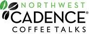

Northwest Cadence has decided that while online events are good, nothing beats in-person. If you’re in the area and available, we would love to have you attend our inaugural event at the Microsoft Store in Bellevue in a few weeks!
{ .post-img }

---

[Cheryl](http://blog.bsktcase.com/) noticed that MSFT has a presentation room at its Bellevue Store, and we decided to make use of it for our Coffee Talks. Because of the success of the Test Tools in-person that we did only a few months ago we have been talking internally about two things:

- **Attending more User Groups**  
   This is a little more difficult as it will require us to have knowledge of all of the UG’s available wherever our consultant happen to be.
- **Coffee talks In-Person**  
   In-person events have far more impact than remote, and it is a lot easier to illicit the in session interaction that coffee talks warrant.

We are starting with the Coffee Talks, and did I say… they are early! You can come and still make it to work before 9am 
{ .post-img }

> 
> { .post-img }
>
> What are Coffee Talks, you ask? As the name suggests, these are morning ALM discussions that are sure to wake you up and get your day off to a great start! For our LIVE Coffee Talk events, hosted at The Microsoft Store, we will serve coffee (and some tasty coffee cakes!) and provide live demonstrations of Visual Studio features on the theatre’s big screen. We will have special giveaways and door prizes to make it even more fun! When we’re finished, you will have plenty of time to get to the office – or stay a little longer and play in the Store before it opens!
>
> **Join Northwest Cadence for fresh brewed coffee, a variety of specialty coffee cakes, and some morning** **ALM discussions that are sure to wake you up and get your day off to a great start!**
>
> **Caffeinate Your Development Lifecycle**
>
> In this kick-off session, we’ll get everybody wired with live demos of Microsoft Visual Studio 2010, hearty conversation about Agile, and practical advice you can start using today.
>
> Focus your processes and energize your teams with help from Northwest Cadence and the latest Microsoft tools.  Learn how robust Application Lifecycle Management practices support your entire organization, from CEO to UAT.  Accelerate delivery and process improvement with a full-bodied blend of agility, transparency and quality.

**You will need to [register](http://nwccoffeetalk20111013.eventbrite.com/) for** **$10.00 (just to make sure you go) and there are only 50 places, so get your skates on. It is an early session so that you can still make it to work and it starts at 7am.**

> **When: Thursday morning, October 13th, 2011**
>
> 7:00 AM Welcome
>
> **7:30 AM Event Start Time**
>
> 8:30 AM Event End Time
>
> **Where**: The Microsoft Store Bellevue Square
>
> 116 Bellevue Square, Bellevue, WA, 98004
>
> [See it on Bing Maps!](http://www.bing.com/maps/?ss=ypid.YN925x182844282&vm=BingMapsTeam-BellevueSquare&i=1)
>
> **To Register\*\***:\*\* Register online at [http://nwccoffeetalk20111013.eventbrite.com/](http://nwccoffeetalk20111013.eventbrite.com/)
>
> **Questions\*\***?\*\* Email [Amanda.Jaworski@nwcadence.com](mailto:Amanda.Jaworski@nwcadence.com)

I look forward to helping _Caffeinate Your Development Lifecycle_ on October 13th! I am hoping to actually be there myself along with [Cheryl Hammond](http://blog.bsktcase.com/) & [Steven Borg](http://blog.nwcadence.com/author/stevenborg/) who will actually be presenting.
