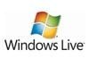
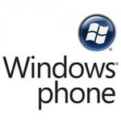
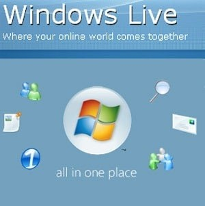

Recently I was burned rather heavily be Microsoft Billing due to their inability to change the region (country) of an account. Yes, you heard me right, there is NO way to change your billing region and the ONLY solution Microsoft can offer is to create a new account.
{ .post-img }

- **Update 2013-01-16 - Microsoft opens international barriers to Xbox Live account migration.**  
   "Microsoft's throwing open the doors on Xbox Live account migration worldwide for its Xbox 360 consoles, today announcing that XBL accounts are now transferable from region-to-region. That includes everything in your Gold level account"  
   \-[Engadget](http://www.engadget.com/2013/01/16/xbox-live-region-locking-unlocked/)
- **Update 2012-10-14 - Microsoft has experimental region changing capability.**  
   "At Microsoft, we understand our customers move from one country to another and we continue to evaluate region migration solutions to help Xbox LIVE members access content from their current country location. We have been piloting an account migration process, but it can take several weeks and some content is confined by location due to licensing restrictions and cannot be transferred. We strongly encourage members who do not have an immediate need for account migration to hold tight while we continue to work on an automated tool, or create a new account in the new country location.  
   \-Microsoft Support"
- **Update 2012-10-11** **- Looks like there might be a huge and profound breakthrough on this topic. Check out [Migrating account Chile to Usa](http://forums.xbox.com/xbox_forums/xbox_support/f/9/p/353657/1834363.aspx#1834363)**
- **Update 2012-01-06** - One of the folks from the product team looked me up at the last bash and they are aware of the issue as it would relate to TFS Service. To that end they will not be using Live billing.

---

This would not be so bad if it was not for the plethora of services that have recently started using Live ID and I brought this issue up at the last MVP summit. My primary live id will always be the one I have had for ~10 years, but I now have to have another live id for every country I end up living in.

If you are already sold then you can vote on either of these user voice sites, but make sure that your opinion of this is heard:
{ .post-img }

- **User Voice (Visual Studio):** [**Allow user to change the region for Windows Live ID billing**](http://visualstudio.uservoice.com/forums/121579-visual-studio/suggestions/2289385-allow-user-to-change-the-region-for-windows-live-i)
- **User Voice (Windows Phone):** [**Allow changing your windows id location**](http://windowsphone.uservoice.com/forums/101801-feature-suggestions/suggestions/2280332-allow-changing-your-windows-id-location-and-no "http://windowsphone.uservoice.com/forums/101801-feature-suggestions/suggestions/2280332-allow-changing-your-windows-id-location-and-no")

Still not sure how this will affect you? Read on…

### First Burn – Xbox

Anyone that knows me would have heard me rant on this one. If you spend 7 years using Xbox Live building up 15000+ gamer score and spending £2000+ (~$3000) on content and subscriptions only to loose EVERYTHING because I took a job in another country!
{ .post-img }

The result is that I (any this affects my family of 4) have two Live ID’s to manage. Both with content and neither with the full story.

For more you can read detailed Xbox shenanigans both on  [Xbox Live Accounts – Great But Don’t Move to Another Country!](http://tf.erzz.com/2007/03/14/xbox-live-accounts-great-but-dont-move-to-another-country/) and [Letter to Major Nelson](http://tf.erzz.com/2009/02/18/letter-to-major-nelson/).

### Second Burn – Windows Phone 7

{ .post-img }

You would think for the Windows Phone launch that they would have solved this problem, at least for it. But after logging into my brand new T-Mobile US HD7 I was encouraged to download the “Tesco” application and I could only use my UK Credit cards!

This is not good… it is not a good experience, and I had to figure out how to hard reset my phone on the first day that I had it in order to change out the Live ID from [martin@hins\*\*\*ood.com](mailto:martin@hins***ood.com) to my new xbox [martin-us@hins\*\*\*\*ood.com](mailto:martin-us@hins****ood.com) address.

What if I go back to the UK and take my phone with me. Granted some of the apps are US specific, like a Walmart app, but most of the ones that I have bought would not have a problem. And what about the crap excuse of “tax” legal issues. What a load of tripe…. My Google phone and apps do not have this problem! I was barely off the plane when I saw US apps in $ and could buy them with either my US credit card or my UK one.

Not only that, but my phone is tightly integrated to Windows Live… SkyDrive, Facebook, Twitter among other things… it is just a pity that it is using the wrong Live ID.

What the heak Microsoft! Why are you driving me away!

### Future Burn – Holy mother of….

Do you even realise what you loose when you create a new live ID? Can you name all of the services that use Live Billing that you will loose continuity on when you change country?

Here is the small list that affects me:

- **Xbox Live** – Achievements, Gamer Score, Content (thousands of dollars worth), Membership
- **SkyDrive Storage** – Photos, Files
- **Zune** – I have some movies bought in the UK and some in the US
- **Office 360** – Documents
- **Windows Phone** – Integration
- **MSDN Subscriptions**
- **Azure Services** – Online services, Servers, etc..
- **TFS Azure** – Source Control, Work Item Tracking … etc.  
   _**NOTE:** One of the folks from the product team looked me up at the last bash and they are aware of the issue as it would relate to TFS Service. To that end they will not be using Live billing._
- **Windows 8 Login** – Settings, Wallpapers and Tight integration on all levels

With Xbox, Windows Phone and Windows 8 all using your Live ID for login into the system the problem hits ALL of Microsoft's services.

- You cant use your new countries payment methods
- You can’t access any features that are country specific

  
{ .post-img }
**Figure: I am trying to decide if this is a joke**

Yes, our online world comes together a long as you stay in the one country for the rest of your life!

### Bottom Line

Like me, are screwed! For now…

The only possible solution that MUST be in place for Hosted Services & Windows 8 requires two things:

- The ability to change your billing region
- The ability for exiting screwed users to merge all of there content, data, services and profile data into a single profile

**_What do you think is going to be the response from Enterprise when their employees start having issues with signing into their laptops, desktops and phones!_**

> _“I am sorry, you may have bought that app from the US store and then moved to the US, but you can no longer buy it let alone use it. And that is just tough!”  
> \-Fictitious Live Rep._

### What can I do?

The only way to even attempt to fix this is to make sure that Microsoft realises how big this problem is now, and how it will affect users in the future.

- **User Voice (Visual Studio):** [**Allow user to change the region for Windows Live ID billing**](http://visualstudio.uservoice.com/forums/121579-visual-studio/suggestions/2289385-allow-user-to-change-the-region-for-windows-live-i)
- **User Voice (Windows Phone):** [**Allow changing your windows id location**](http://windowsphone.uservoice.com/forums/101801-feature-suggestions/suggestions/2280332-allow-changing-your-windows-id-location-and-no "http://windowsphone.uservoice.com/forums/101801-feature-suggestions/suggestions/2280332-allow-changing-your-windows-id-location-and-no")

While your vote here, or rants on your own blog may not help, it is the best we can do….
