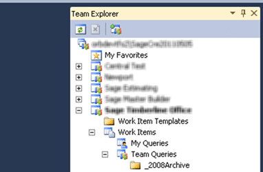
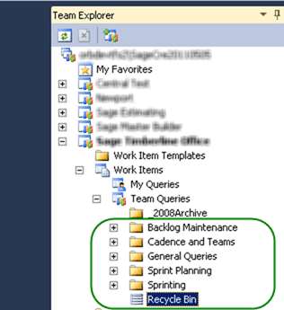

{ .post-img }

A little while ago I was looking into the best options for [upgrading a process template but still keep your data intact](http://blog.hinshelwood.com/do-you-know-how-to-upgrade-a-process-template-but-still-keep-your-data-intact/), but there is still a little bit of ambiguity on how that is achieved.  Lets look at the #3 option from that set in a little more detail.

---

This solution assumes that you do not care about any of the work items that you currently have. We are effectively going to clean out the old process template along with all of the data and import a new one.

**WARNING: You will loose all of the Work Items that you currently have in your Team Project if you follow this process (See [Do you know how to upgrade a process template but still keep your data intact?](http://blog.hinshelwood.com/do-you-know-how-to-upgrade-a-process-template-but-still-keep-your-data-intact/) for more options)**

We have a couple of things to do, and yes, the order does matter:

1. Fix Queries
2. Fix Reports
3. Tare down old Process Template
4. Build up new Process Template

This will allow you to move from one process template to another, but there are other things that might be of importance. Maybe you want to upgrade your SharePoint site as well. That however if outside the scope of this post.

1.  #### **Fix Queries**

        Because we want to keep the old queries around, and you can do nothing but delete them once you delete the Work item Types we need to move them before we do anything to the Team Project. it may be that some of the teams spent a long time getting their queries “just right” and we don’t just want to delete that hard work.

        1. ##### **Create a folder called “\_2008Archive”**

            TFS 2010 added the ability to have Query folders. Here is hoping that we get them on Builds as well in the future.

            [](http://blog.hinshelwood.com/files/2011/05/image8.png)

    { .post-img }
    **Figure: The folder will store all of the old queries**

        2. ##### **Move all of the existing Queries into this folder**

            Luckily we can drag and drop Queries within the same Team Project.

            [](http://blog.hinshelwood.com/files/2011/05/image9.png)

    { .post-img }
    **Figure: All of your queries are now saved**

        3. ##### **Copy all of the new queries into the team project**

            We have at least one Team Project that was created with the new template (TfsCustomisations), and even more luckily we can drag and drop Queries between Team Projects.

            [](http://blog.hinshelwood.com/files/2011/05/image11.png)

    { .post-img }
    **Figure: Shiny new Queries are now waiting for the team**

2.  #### **Fix Reports**

        You will need to add the new reports to TFS, but unfortunately while there is drag and drop support for moving reports within a Team Project there is no way to drag them _into_ a Team Project, but there his a command line tool to support this. However, prior to running it you should again create a “\_2008Archive” folder to load all of the existing reports into. Again there may be a bunch of custom reports in there that the team does not want to loose. Once you have done that you can call the command line option to install the new templates

        

    { .post-img }
    **Figure: Put all existing reports under “\_2008Archive”**

        ```
        tfpt addprojectreports /collection:%tpc% /teamproject:%tp% /processtemplate:"Scrum for Team System v3.0.3784.03" /force
        ```

        **Figure: Command to add all of the Reports for a Process Template to TFS

        **

        note: You will need to have permission to add reports to Reporting Services. Make sure that you are in the Team Foundation Content Manger” role.

3.  #### **Tare down old Process Template**

    This is where the demolition expert in you gets to have a little fun. It is very complicated to build things, and not so much to destroy them. Now that we have all of our data exported and transformed we can go ahead and destroy all of the Work Item Type Definitions (WITD) that are in that Team Project.

    Because I am running a whole lot of command against multiple Team Projects and I do not want to have to change out the Team Project Collection every time, here is a little hint for the command line.

    ```
    set tpc=http://tfsServerName:8080/tfs/teamProjectCollectionName
    ```

    **Figure: Set a variable so you don't have to add things to every command**

    ```
    witadmin listwitd /collection:%tpc% /p:"[Team Project Name]"
    ```

    **Figure: Get a list of all the Work Item Types**

    This will give you a list of all of the Work Item Type’s that are used in your Team Project. You will need to “destroy” each one using the “destroywitd” command that is part of “witadmin”. In this case the current project is the “Scrum for Team System v2” template so the below command would remove them.

    ```
    witadmin destroywitd /collection:%tpc% /p:"[Team Project Name]" /n:"Bug" /noprompt
    witadmin destroywitd /collection:%tpc% /p:"[Team Project Name]" /n:"Product Backlog Item" /noprompt
    witadmin destroywitd /collection:%tpc% /p:"[Team Project Name]" /n:"Sprint Backlog Item" /noprompt
    witadmin destroywitd /collection:%tpc% /p:"[Team Project Name]" /n:"Impediment" /noprompt
    witadmin destroywitd /collection:%tpc% /p:"[Team Project Name]" /n:"Sprint Retrospective" /noprompt
    witadmin destroywitd /collection:%tpc% /p:"[Team Project Name]" /n:"Sprint" /noprompt
    ```

    **Figure: Delete the default Work Items, but don’t forget any custom ones**

    _note: Because this was a Team Project that was upgraded from TFS 2008 there are no links or categories to update. You will also need to make sure that you do something with all of the custom fields and Work Item Types that have been added._

    **Build up new Process Template**

4.  Building up the Work Item Types is not quite as much fun as tearing them down, but it does give you more of a sense of achievement. In order to “install” the SfTSv3 Process Template you need to:

    1. ##### **Install the SfTSv3 Work Item Type Definitions**

       These new work item types can be easily added to make it look as if the Project always had this process template. There are still more things that we will need to do later to make this a workable solution.

       ```
       witadmin importwitd /collection:%tpc% /p:"[Team Project Name]" /f:".WorkItemTrackingTypeDefinitionsAcceptanceTest.xml"
       witadmin importwitd /collection:%tpc% /p:"[Team Project Name]" /f:".WorkItemTrackingTypeDefinitionsBug.xml"
       witadmin importwitd /collection:%tpc% /p:"[Team Project Name]" /f:".WorkItemTrackingTypeDefinitionsImpediment.xml"
       witadmin importwitd /collection:%tpc% /p:"[Team Project Name]" /f:".WorkItemTrackingTypeDefinitionsProductBacklogItem.xml"
       witadmin importwitd /collection:%tpc% /p:"[Team Project Name]" /f:".WorkItemTrackingTypeDefinitionsRelease.xml"
       witadmin importwitd /collection:%tpc% /p:"[Team Project Name]" /f:".WorkItemTrackingTypeDefinitionsSharedStep.xml"
       witadmin importwitd /collection:%tpc% /p:"[Team Project Name]" /f:".WorkItemTrackingTypeDefinitionsSprint.xml"
       witadmin importwitd /collection:%tpc% /p:"[Team Project Name]" /f:".WorkItemTrackingTypeDefinitionsSprintBacklogTask.xml"
       witadmin importwitd /collection:%tpc% /p:"[Team Project Name]" /f:".WorkItemTrackingTypeDefinitionsSprintRetrospective.xml"
       witadmin importwitd /collection:%tpc% /p:"[Team Project Name]" /f:".WorkItemTrackingTypeDefinitionsTeamSprint.xml"
       ```

       \*\*Figure: Add the Work Items that you put under version control in the TfsCustomisations Team Project

       \*\*

       _note: You may also get a TF212018 error if you are doing this on an upgraded Team Project Collection. This is because one of the fields in the Work Item Type Definition Xml is different than the one on the server. There are a number of fields that will require the spaces to be removed from their names in order to import the work item. This is just fine and if you make the changes you will be able to import._

       > TF212018: Work item tracking schema validation error: TF26177: The field System.AreaId cannot be renamed from “AreaID” to “Area ID”. If you remove the spaces you will be able to import it.

       **Figure: This is an example message**

    2. ##### **Install the Categories**

       Categories as new in TFS 2010 and all reports to load Categories rather that be hard coded to particular Work Item Types. The only stipulation / limitation is that a Work Item can only be in one Category.

       ```
       witadmin importcategories /collection:%tpc% /p:"[Team Project Name]" /f:".WorkItemTrackingcategories.xml"
       ```

       **Figure: Add categories to enable some of the TFS 2010 functionality**

    3. ##### **Install the Link Types**

       Link Types enable one of the core features of TFS 2010. The ability to have nested work items. It is worth noting that there are some built in Link Types that are not listed here that will support MS Project and other tools. These will already have been added by the upgrade process.

       ```
       witadmin importLinktype /collection:%tpc% /f:".WorkItemTrackingLinkTypesFailedBy.xml"
       witadmin importLinktype /collection:%tpc% /f:".WorkItemTrackingLinkTypesImpededBy.xml"
       witadmin importLinktype /collection:%tpc% /f:".WorkItemTrackingLinkTypesImplementedBy.xml"
       witadmin importLinktype /collection:%tpc% /f:".WorkItemTrackingLinkTypesSharedStep.xml"
       witadmin importLinktype /collection:%tpc% /f:".WorkItemTrackingLinkTypesTestedBy.xml"
       ```

       **Figure: Link Types only need to be added once**

And you are done.
