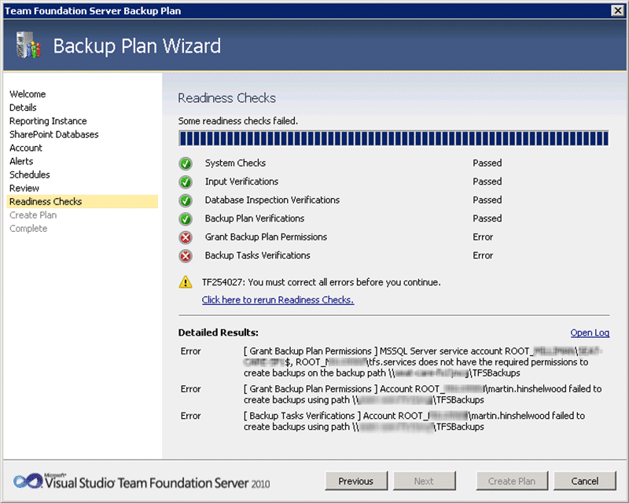
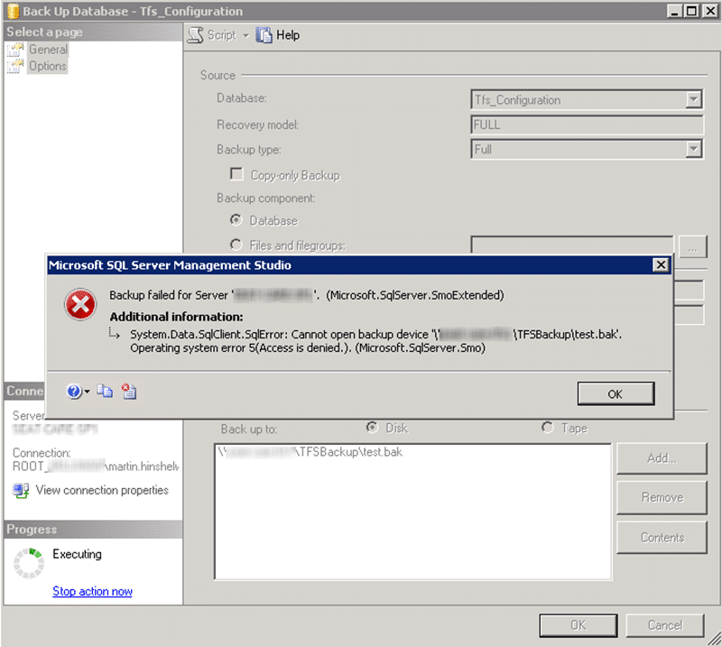

Over the last few years the product team has been putting their finishing touches on a backup module for the Team Foundation Server Administration Console. Why you might ask do you need another way to backup? Surely you can just backup the bits?

Well, you could, but as TFS has a lot of moving parts it can get very complicated to [creating a backup](http://msdn.microsoft.com/en-us/library/ms253070.aspx).

> 1. Required Permissions
> 2. [Identify Databases](http://msdn.microsoft.com/en-us/library/ms253070.aspx#TableDB)
> 3. [Create Tables in Databases](http://msdn.microsoft.com/en-us/library/ms253070.aspx#CreateTbl)
> 4. [Create a Stored Procedure for Marking Tables](http://msdn.microsoft.com/en-us/library/ms253070.aspx#MarkTbl)
> 5. [Create a Stored Procedure for Marking All Tables At Once](http://msdn.microsoft.com/en-us/library/ms253070.aspx#MarkAll)
> 6. [Create a Stored Procedure to Automatically Mark Tables](http://msdn.microsoft.com/en-us/library/ms253070.aspx#RunMark)
> 7. [Create a Scheduled Job to Run the Table-Marking Procedure](http://msdn.microsoft.com/en-us/library/ms253070.aspx#ScheduleMark)
> 8. [Create a Maintenance Plan For Full Backups](http://msdn.microsoft.com/en-us/library/ms253070.aspx#CreateMPFull)
> 9. [Create a Maintenance Plan For Differential Backups](http://msdn.microsoft.com/en-us/library/ms253070.aspx#CreateMPDiff)
> 10. [Create a Maintenance Plan For Transaction Backups](http://msdn.microsoft.com/en-us/library/ms253070.aspx#CreateMP)
> 11. [Back Up Additional Lab Management Components](http://msdn.microsoft.com/en-us/library/ms253070.aspx#LabComponents)
>
> **\-From "Back Up Team Foundation Server" on MSDN**

There are a heck of a lot of databases that, depending on your environment, might be spread over your entire network.

 **Figure: Deployment Topologies (Where is my data?) from MSDN**
{ .post-img }

So, how is this problem solved. Well the TFS team have create a tool to create all of the backups and all of the job as well as managing the backup location for you. This sounds fantastic, but how about in practice.

\[screencast url="http://www.screencast.com/t/PaBBcWZXn" width="640" height="360"\]

**Screencast: Administering TFS 2010: Team Foundation Backup**

Was it really that easy? Well….not really…here is the extra stuff I found out:

- **Your account must OWN the share** Owning the folder does not cut it (see Error #1- TF254027).
- **SQL Must be running under a domain account or Network Service** SQL must also have permission to the share, and the validation will get confused if you use “LocalSystem” instead of Network Service or a Domain Account (See Error #2- TF254027)
- **The account running SQL must have permission to create SPN’s** The account that is used for SQL must be able to both see and create Service Principal Names in active directory (see Error #3: Terminating your TFS server).

Once you learn how to Google without keywords and read your servers mind you will have a nice backup system going…

### Error #1- TF254027

I initially got an error because the accounts did not really have full control over the target location. This is a problem with the share. Although I have full permission for [fileserver1ShareTFSBackups](file://fileserver1ShareTFSBackups) it is just a folder under the [fileserver1Share](file://fileserver1folder" data-mce-href=) location and I DO NOT have permission to change the sharing settings there.

 **Figure: TF254027 is caused by permission issues**
{ .post-img }

```
[Info   @16:36:34.342] Granting account ROOT_COMPANYtfssqlbox$ permission on folder <a href="file://fileserver1folderTFSBackups[Info">fileserver1ShareTFSBackups [Info</a>   @16:36:34.348] System.UnauthorizedAccessException: Attempted to perform an unauthorized operation.
   at System.Security.AccessControl.Win32.SetSecurityInfo(ResourceType type, String name, SafeHandle handle, SecurityInfos securityInformation, SecurityIdentifier owner, SecurityIdentifier group, GenericAcl sacl, GenericAcl dacl)
   at System.Security.AccessControl.NativeObjectSecurity.Persist(String name, SafeHandle handle, AccessControlSections includeSections, Object exceptionContext)
   at System.Security.AccessControl.FileSystemSecurity.Persist(String fullPath)
   at Microsoft.TeamFoundation.PowerTools.Admin.Helpers.FileHelper.GrantFolderPermission(String account, String path)
[Info   @16:36:34.350] Granting account ROOT_COMPANYtfs.services permission on folder <a href="file://fileserver1TFSBackups[Info">fileserver1ShareTFSBackups [Info</a>   @16:36:34.352] System.UnauthorizedAccessException: Attempted to perform an unauthorized operation.
   at System.Security.AccessControl.Win32.SetSecurityInfo(ResourceType type, String name, SafeHandle handle, SecurityInfos securityInformation, SecurityIdentifier owner, SecurityIdentifier group, GenericAcl sacl, GenericAcl dacl)
   at System.Security.AccessControl.NativeObjectSecurity.Persist(String name, SafeHandle handle, AccessControlSections includeSections, Object exceptionContext)
   at System.Security.AccessControl.FileSystemSecurity.Persist(String fullPath)
   at Microsoft.TeamFoundation.PowerTools.Admin.Helpers.FileHelper.GrantFolderPermission(String account, String path)
[Error  @16:36:34.352] Granting permission to account ROOT_COMPANYtfssqlbox$ on path <a href="file://fileserver1folderTFSBackups">fileserver1ShareTFSBackups</a> failed
```

**Figure: The log files get to the root of the problem, but not the reason**

After much messing around I have found that you can’t use a sub-folder of a share that you do not have permission for. You require permission to the Share itself to apply permissions.

### Error #2- TF254027

Lets try this again with a share that we control. I will create a backup share on the TFS server and at least then I control then permissions.

 **Figure: The next Error looks the same, but it is subtly different**
{ .post-img }

```
[Info   @18:12:05.813] "Verify: Grant Backup Plan PermissionsRootVerifyBackupPathPermissionsGrantedSuccessfully(VerifyBackupPathPermissionsGrantedSuccessfully): Exiting Verification with state Completed and result Success"
[Info   @18:12:05.813] Verify: Grant Backup Plan PermissionsRootVerifyDummyBackupCreation(VerifyTestBackupCreatedSuccessfully): Starting Verification
[Info   @18:12:05.813] Verify Test Backup Created Successfully
[Info   @18:12:05.813] Starting creating backup test validation
[Error  @18:12:06.132] Microsoft.SqlServer.Management.Smo.FailedOperationException: Backup failed for Server 'sqlserver1'.  ---&gt; Microsoft.SqlServer.Management.Common.ExecutionFailureException: An exception occurred while executing a Transact-SQL statement or batch. ---&gt; System.Data.SqlClient.SqlException: Cannot open backup device 'tfsserver1TFSBackuptemp_20111104111205.bak'. Operating system error 5(Access is denied.).
BACKUP DATABASE is terminating abnormally.
at Microsoft.SqlServer.Management.Common.ConnectionManager.ExecuteTSql(ExecuteTSqlAction action, Object execObject, DataSet fillDataSet, Boolean catchException)
at Microsoft.SqlServer.Management.Common.ServerConnection.ExecuteNonQuery(String sqlCommand, ExecutionTypes executionType)
--- End of inner exception stack trace ---
at Microsoft.SqlServer.Management.Common.ServerConnection.ExecuteNonQuery(String sqlCommand, ExecutionTypes executionType)
at Microsoft.SqlServer.Management.Common.ServerConnection.ExecuteNonQuery(StringCollection sqlCommands, ExecutionTypes executionType)
at Microsoft.SqlServer.Management.Smo.ExecutionManager.ExecuteNonQuery(StringCollection queries)
at Microsoft.SqlServer.Management.Smo.BackupRestoreBase.ExecuteSql(Server server, StringCollection queries)
at Microsoft.SqlServer.Management.Smo.Backup.SqlBackup(Server srv)
--- End of inner exception stack trace ---
at Microsoft.SqlServer.Management.Smo.Backup.SqlBackup(Server srv)
at Microsoft.TeamFoundation.PowerTools.Admin.Helpers.BackupFactory.TestBackupCreation(String path)
[Error  @18:12:06.184] !Verify Error!: Account ROOT_COMAPNYmartin.hinshelwood failed to create backups using path <a href="file://tfsserver1TFSBackup[Info">tfsserver1TFSBackup [Info</a>   @18:12:06.184] "Verify: Grant Backup Plan PermissionsRootVerifyDummyBackupCreation(VerifyTestBackupCreatedSuccessfully): Exiting Verification with state Completed and result Error"
[Info   @18:12:06.184] !Verify Result!: 5 Completed, 0 Skipped: 4 Success, 1 Errors, 0 Warnings
[Info   @18:12:06.197] Verify: Backup Tasks Verifications(VCONTAINER): Starting Verification
[Info   @18:12:06.197] A generic container node that does not contribute to results
[Info   @18:12:06.197] "Verify: Backup Tasks Verifications(VCONTAINER): Exiting Verification with state Ignore and result Ignore"
[Info   @18:12:06.197] Verify: Backup Tasks VerificationsRoot(VCONTAINER): Starting Verification
[Info   @18:12:06.197] A generic container node that does not contribute to results
[Info   @18:12:06.197] "Verify: Backup Tasks VerificationsRoot(VCONTAINER): Exiting Verification with state Ignore and result Ignore"
[Info   @18:12:06.197] Verify: Backup Tasks VerificationsRootVerifyDummyBackupCreation(VerifyTestBackupCreatedSuccessfully): Starting Verification
[Info   @18:12:06.197] Verify Test Backup Created Successfully
[Info   @18:12:06.197] Starting creating backup test validation
[Error  @18:12:06.389] Microsoft.SqlServer.Management.Smo.FailedOperationException: Backup failed for Server sqlserver1'.  ---&gt; Microsoft.SqlServer.Management.Common.ExecutionFailureException: An exception occurred while executing a Transact-SQL statement or batch. ---&gt; System.Data.SqlClient.SqlException: Cannot open backup device 'tfsserver1TFSBackuptemp_20111104111206.bak'. Operating system error 5(Access is denied.).
BACKUP DATABASE is terminating abnormally.
at Microsoft.SqlServer.Management.Common.ConnectionManager.ExecuteTSql(ExecuteTSqlAction action, Object execObject, DataSet fillDataSet, Boolean catchException)
at Microsoft.SqlServer.Management.Common.ServerConnection.ExecuteNonQuery(String sqlCommand, ExecutionTypes executionType)
--- End of inner exception stack trace ---
at Microsoft.SqlServer.Management.Common.ServerConnection.ExecuteNonQuery(String sqlCommand, ExecutionTypes executionType)
at Microsoft.SqlServer.Management.Common.ServerConnection.ExecuteNonQuery(StringCollection sqlCommands, ExecutionTypes executionType)
at Microsoft.SqlServer.Management.Smo.ExecutionManager.ExecuteNonQuery(StringCollection queries)
at Microsoft.SqlServer.Management.Smo.BackupRestoreBase.ExecuteSql(Server server, StringCollection queries)
at Microsoft.SqlServer.Management.Smo.Backup.SqlBackup(Server srv)
--- End of inner exception stack trace ---
at Microsoft.SqlServer.Management.Smo.Backup.SqlBackup(Server srv)
at Microsoft.TeamFoundation.PowerTools.Admin.Helpers.BackupFactory.TestBackupCreation(String path)
```

**Figure: This time the error is lying and is from SQL not locally as it implies**

It looks like the problem is that SQL Server can’t write to that folder, but I can and the machine account can. Lets try this from the SQL Server itself, and with a native backup.

 **Figure: SQL Server can’t write to that location**
{ .post-img }

Dam… So even a native SQL backup can’t write to this location.

```
TITLE: Microsoft SQL Server Management Studio
------------------------------

Backup failed for Server 'sqlserver1'.  (Microsoft.SqlServer.SmoExtended)

For help, click: http://go.microsoft.com/fwlink?ProdName=Microsoft+SQL+Server&ProdVer=10.50.2500.0+((KJ_PCU_Main).110617-0038+)&EvtSrc=Microsoft.SqlServer.Management.Smo.ExceptionTemplates.FailedOperationExceptionText&EvtID=Backup+Server&LinkId=20476

------------------------------
ADDITIONAL INFORMATION:

System.Data.SqlClient.SqlError: Cannot open backup device 'tfsserver1TFSBackupmoo.bak'. Operating system error 5(Access is denied.). (Microsoft.SqlServer.Smo)

For help, click: http://go.microsoft.com/fwlink?ProdName=Microsoft+SQL+Server&ProdVer=10.50.2500.0+((KJ_PCU_Main).110617-0038+)&LinkId=20476

------------------------------
BUTTONS:

OK
------------------------------
```

**Figure: SQL Server errors suck even more**

As it turns out, SQL Server is running under “LocalSerivce” which is not authenticating against our share. So we need to change the service that TFS runs under.

### Error #3: Terminating your TFS server

As we should always use the SQL Server Configuration Manager to change these things I fired it up and since i already have a Domain account for running TFS under I decided to use that one.

 **Figure: This is easy**
{ .post-img }

When you apply it will ask you to restart SQL, but it should be all complete. Lets check TFS and make sure that everything is running…

 **Figure: OMG! What just happened!**
{ .post-img }

Oh Shit: I think I just broke TFS. Why can’t TFS connect? Lets try the SQL Management Studio and see.

 **Figure: What is a SSPI?**
{ .post-img }

This does not look good…

After I have hastily changed the service account back to the original value and made use that his fixed TFS I wanted to also figure out why it broke. Usually I would just ask Shad (one of my extremely technical colleagues) but alas he is on his honeymoon. Some googling turned up an SPN issue. The account that SQL runs under MUST be able to both read and write Service Principal names for itself in Active Directory. This can be set, but only be a domain admin.

- [Dynamically Set SPN's for SQL Service Accounts](http://clintboessen.blogspot.com/2010/02/dynamically-set-spns-for-sql-service.html)

So lets go with Network Service instead. If we change the account that SQL Server runs under to “Network Service” then I can add permission for “root_companysqlserver1$” to my share and get it working. Yes, servers have AD accounts as well.
