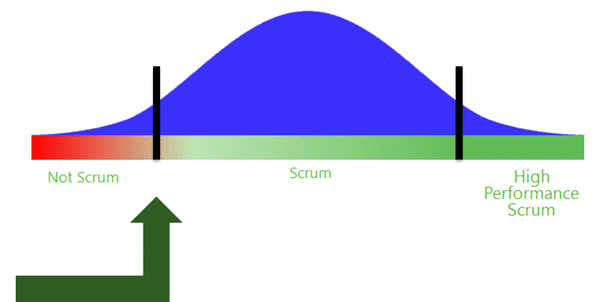

This week I was at the ALM Summit in Redmond. There was a very interesting talk from David Starr of Scrum.org going over the recent changes in Scrum. These changes are, I think, designed to battle the things that have made Scrum unpalatable to many people.
{ .post-img }

---

The reality is that many people and organisation are failing at and being turned away from Scrum by the fanaticism that surrounds it. Scrum.org is taking these issues and tackling them head on.

At Northwest Cadence we worked with one team whose Scrum Coach told them that they were not doing Scrum. Why? Well, the Development Team had a disabled person who was unable to stand and they decided, as a team,  not to stand up during the Daily Scrum. Shocked? Well you should be, we are in the era of intolerance and fanaticism and we all need a kick up the ass for that. Scrum.org is doing its part of that kicking and thus there are changes to the body of knowledge that is Scrum to make it more tolerant, adaptable and palatable for a wider group of people while not changing its core tenants.

The first change we saw was the publication of the new [Scrum Guide by Ken and Jeff](http://www.scrum.org/scrumguides/) that saw the removal of all of those things that are not part of core Scrum. If you were to buy "Scrum the Board Game" you would not expect the getting started guide to include all of the strategies for playing the game, but instead it would contain the "rules" of how to play.

{ .post-img }

**Figure: The rules of the game, not the strategy of how to play**

The [Scrum Guide](http://www.scrum.org/scrumguides/) is just such a distillation of the core principals upon which the Scrum Framework is based. Once you have these core principals under your belt you can move forward with instituted all of those "practices" that will help you do Scrum well. There are many books, blogs and forums to help formulate Strategy and many consultants that will help you with adopting Scrum effectively. (Hint: [http://nwcadence.com](http://nwcadence.com))

{ .post-img }

**Figure: You are here!**

So if there is this line between “not Scrum” and “Scrum” I want to know definitively if I am at this line. To do that I need a **simple measurable checklist** that lets me know that I am there. A minimal "Definition of Doing" or "Scrum Fitness test", if you will, that tells us that we are at the first milestone and can then start to look at more advanced concepts to improve our performance.

> A simple measurable checklist:
>
> 1. … an ordered Product Backlog
> 2. … Development Teams of 6+-3
> 3. … have a Product Owner who owns the backlog
> 4. … a Scrum Master who is responsible for process
> 5. … have Sprints of 1 month or less
> 6. … Sprints are of a fixed length
> 7. … a Sprint Backlog that shows Remaining Work
> 8. … a Sprint Backlog created at Sprint Planning
> 9. … Review & Retrospective at the end of each sprint
> 10. … working software each Sprint
> 11. … stakeholders who inspect the software increment

**Figure: A simple measurable checklist of Scrum**

If you can say yes to each of these things then you are doing Scrum. Are you doing good Scrum? Well, probably not… but you are doing it.

Then what else do you need?

Well, you will find it hard to continue to deliver working software each sprint (#10) without things like Automated Testing and Automated Build. You will also find it hard to start climbing that hill towards High Performing Scrum without visualising your work (Kanban), limiting work in progress, and concentrating on optimising Flow both at the micro (inside of the Sprint) and at the macro (wrapping Scrum).

There are many more things that will help and many of them will become Scrum Extensions on Scrum.org as they are submitted and approved. This results in the replacement of the phrase "I am doing Scrum but...<shame>" with "I am doing Scrum and...<happiness>" and hopefully a wider and more positive adoption profile for Scrum.
