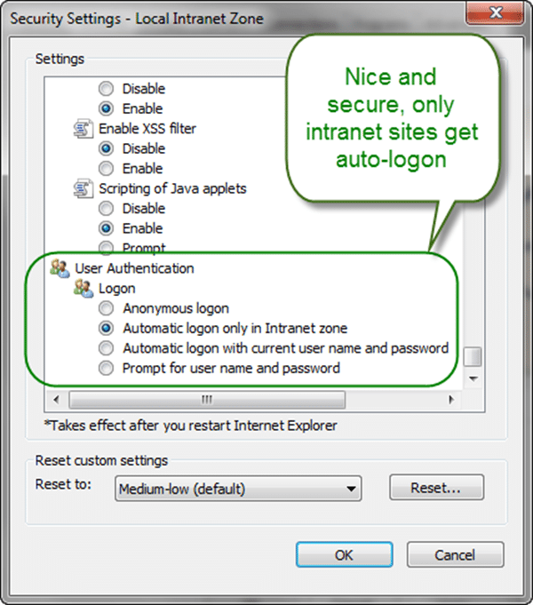
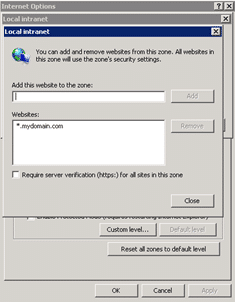
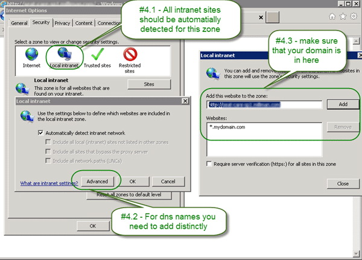

{ .post-img }

Sometimes when you setup TFS you find that your users, or just some of them, are being prompted for credentials. While manageable this is annoying and is not really related to TFS. This is an Active Directory thing and yes, there is a workaround…

---

The best way to fix this is to have your Active Directory administrator add your OWN domain to the list detected as internal and thus intranet. By default using just the server NETBIOS name will work anyway, but in this world of domain names [http://tfs.company.com](http://tfs.company.com) looks a lot better and is easier to remember than [http://tfs](http://tfs). Its a brain thing… and it is a Kerberos thing, but don’t worry about that.

So, first, why is this happening?

 **Figure: User Authentication on the Internet / Intranet**
{ .post-img }

Its the default and it should be this way!

If you accidentally change this to allow authentication in all zones you may be exposing your username and password beyond the bounds of your internal network. This is not good.

So, if you want to fix this send this email to your Active Directory administrator or support desk:

> Dear Admin,
>
> Can you please make it so that all things that I access thorough the network as “\*.mydomain.com” are classed as “intranet” so that I can authenticate correctly without having to enter my username and password every time. Can you also make sure that everyone i work with has the same setting applied automatically.
>
>  **\*\***Figure: Bad example, I should not have to do this locally\*\*
> { .post-img }
>
> Hint: you can do this by adding “\*.mydomain.com” to the list of websites that are automatically in Internet Explorers “Intranet” list
>
>  [****](http://blog.hinshelwood.com/files/2011/11/o_Tick-icon.png)**Figure: Good example, now i can authenticate**
> { .post-img }
>
> - **Please can you change the domain policy to add this automatically to Internet Explorer**
>
> Thanks,
>
> Frustrated local user

But, sometimes you get a less than prompt response. How can I solve this in the mean time, knowing that my Support team is working hard of fixing it permanently?

\[screencast url="http://www.screencast.com/t/PAx7VWfa3jn" width="640" height="360"\] **Screencast: Administering TFS 2010 - Always prompted for credentials?**

### But I just want the simple steps!

1. Open IE
2. Click "**Tools | Internet Option...**" **Figure: Internet Options is well hidden**
   { .post-img }
3. Go to "**Security**" tab. **Figure: These settings apply to all internet access, not just IE**
   { .post-img }
4. Select "**Local Intranet | Sites | Advanced**" **Figure: All useful options are hidden away**
   { .post-img }
5. Confirm that “**\*.mydomain.com**” is in the list and add it if it is not.
6. Close all instances of Internet Explorer

Now when you open IE and go to any address that contains your company domain it will automatically pass through your Active Directory identity.

