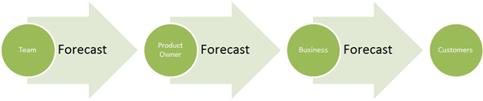

 There has been a subtle but targeted change in the wording used as part of Scrum. There has bee a move away from commitment towards forecasting what will be completed. Why is this happening and what does it mean to my team?
{ .post-img }

---

There has long been a subtle lack of transparency between the Product Owner and the Development Team that has largely gone unnoticed. In the empirical world that is Software Development it is **not possible to commit to delivering anything**! This is reminiscence of the institutional fiction that we can indeed give someone a guaranteed delivery date for something that exists in the complex world and thus is impossible for us to estimate. We have been doing it for years and we are still doing it even in Agile. The only saving grace is that our commitment has been for such a small amount of work that we are routinely forgiven and indeed any good Product Owner quickly learns that **Commitment** is really a **guess** and can often be a **WAG (Wild Assed Guess)** at best.

  
{ .post-img }
**Figure: The meaning of commitment**

Where are these points in Scrum where **commitment** has been applied:

- **Daily Scrum**
  During the daily Scrum the Development Team get together to review each others previous days commitment and then commit to each other to completing work.
- **Sprint Planning**
  During Sprint Planning the Development Team commit to delivering work to the Product Owner at the end of the Sprint.

There are also a number of other commitment points that are implied in Scrum. The Product Owner is probably committing to delivering functionality to the Stakeholders (The Business) and often the Business will then commit to delivering functionality to their Customer.

And this is where the major problem lies as there are escalating cycles of impact at all levels.

- An Individual fails in their commitment to the Development Team
- A Development Team fails in its commitment to the Product Owner
- A Product Owner fails in their commitment to the Business
- The Business fails in its commitment to its Customers

If you have "commitment" then others will read that as something that can be relied on and potentiality take a dependency on the timely completion of that work. Once a dependency is taken then it can be a BIG problem if things go south. What if your Sales teams have made commitments to old customers to get them to say and to new customers to get them to change to you?

This is the result of **_committing_** to delivering work, so I say again:

### Can you really commit to delivering work?

The word "Commitment" smacks too much of the **Prescriptive** world and not enough of the **Predictive**. Can we stop diluting a perfectly prescriptive word? Is there a better choice that lives in the Predictive world?

  
{ .post-img }
**Figure: Would you hold a weather presenter to a 10 day forecast?**

The new Scrum Guide talks about **Forecast** instead of the **Commitment**. This is a subtle and carefully chosen contrast that is intended to result in a more positive open and transparent communication between the key actors in the pantomime that has been Software Development.

  
{ .post-img }
**Figure: Bad example, "Commitment" implies that we know for sure**
{ .post-img }

  
{ .post-img }
**Figure: Good example, "Forecast" implies that we don't know for sure**
{ .post-img }

The result should be higher levels of trust between all parties that should result in less (or at least more well known and specific) dependencies that are of much lower risk. If we make that change we really start thinking in the Agile / Predictive space and some of the old ways will drop by the wayside. Those old ways are the things that get in the way of an Agile adoption, that make us want to drop back into our old comfortable bad habits of Waterfall.

**Are you going to make the change from Commitment to Forecast?**

If not, let me know why this will not make sense in your organisation!
