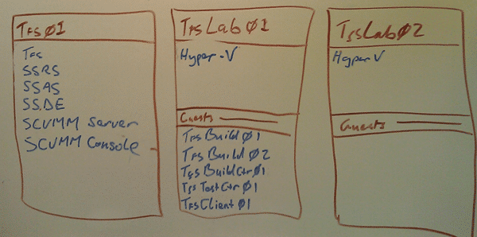

I have been  working with one of my colleagues, Bryon, over the holidays in order to install both TFS and Lab management at a customer. Now that customer has some awesome hardware, but insisted on a physical TFS server. The DL320 with 18 cores, 42GB RAM and 2TB of storage make a pretty fast TFS server, but we did run into a couple of problems. The solution to the first problem caused the second problem.

> **Conclusion: Never put the SCVMM Server on the same box as RS if you are using Domain Accounts**

We initially configured TFS in a single server configuration as well as the two Lab Management servers for Hyper-V. The Hyper-V boxes were so big (2\* 24 cores, 98GB RAM and 6TB) that we stole a little from the first one to run 5 extra computers.

- Tfs Build Agents – 2 servers running TFB configured to run two agents each
- Tfs Build Controller – Single server configured as a Build Controller only
- Tfs Test Controller  - Single server configured as a Test Controller and joined to TFS
- Tfs Client – Single client running VS2010 Ultimate for config and testing

 **Figure: What is installed where**
{ .post-img }

We had the SVCVMM server installed on the TFS box a this was thought to be a good place to stick it as out TFS server is enormously over muscled. So we have the SCVMM Server on the TFS server and a single host configured and all is well. We dutifully follow the instructions to configure Lab Management and have it talk to our single Host and we had everything up and running.

### The First Problem - Reporting Services Authentication Issues

If you have ever setup RS you will know that the best way to run it is either under Network Service, or (as in our case) if security concerns dictate then under Active Directory credentials. There is however a requirement for those AD credentials to have certain abilities that are documented in the [How to: Register a Service Principal Name (SPN) for a Report Server](http://msdn.microsoft.com/en-us/library/cc281382.aspx) document and a quick read usually gets your service account endowed with Domain Admin as very few small Infrastructure teams have the skills necessary to really grok the subtle nuances of Active Directory.

In this case, the TFSService account that we are using was not allowed to be Domain Admin (unsurprisingly as this a little bit of a dumb idea), but it was chosen over the defined SQL Server Service Account as, rightly, the organisation did not want to give us the password: Now, if you are installing TFS you will know that it is important for you to install SQL according to the documentation for TFS as 90% of failed installs are due to SQL configuration, however I have never been given the SQL password on any network and always have relied on an over-the-shoulder-typer to enter it. I digress, but the result is that both SSDE, SSAS and SSRS all run under the TFSService account. This being the case we ran into the aforementioned age old "Reporting Services needs an SPN" error.

This error manifests as users always being asked for credentials when logging in from a server other than the local RS box, and no matter how slowly they type them in or what privileges they have on the Server or RS they always get a denied. This is due to that pesky "SPN" part, and I often hear "What the hell is that SPN thing anyway?".

SPN's are an integral part of Active Directory and allows things to be authenticated by Kerberos. Kerberos is AD's secure token exchange protocol that is the bedrock of secure networks. They a re kind of like "allowed permissions" for communication. You have to say that a server is allows to respond securely on a particular URLprotocal.

> HTTP/tfs01.domain.com tfs01# HTTP/tfs01 tfs01#

**Figure: SPN for Reporting Services under Network Service**

So if you use "Network Service" or "Local Service" then an SPN must be added with the name of the computer to its own domain account (yes, computers have domain accounts too) and this is set up by default so that a serve can authenticate under its own account. If you have a SQL service account with the proper permission in AD then SQL Server will add its owe SPN's automatically as part of the installation and you don't need to worry about it. However if you are running under for example "domaintfsservice" that does not have this permission then you will need to add custom SPN's manually.

> setspn -a HTTP/tfs01.domain.com domaintfsservice setspn -a HTTP/tfs01 domaintfsservice

**Figure: SPN for Reporting Services under Domain Account**

Now you have this added (and yes, you have to do this if you are running on a custom domain as well)  your users will almost be able to authenticate :)

They will still need to follow "[Always prompted for credentials in TFS 2010?](http://blog.hinshelwood.com/always-prompted-for-credentials-in-tfs-2010/)" to make sure that your users can get their kerberos ticket now that the server will allow them.

### The Second Problem - System Centre Virtual Machine Manager stops working

Then, after solving the SSRS issue we went to add the second Hyper-V host to SCVMM and the Job erred out. I looked at the error and as usual it was no help, so after a few tries I rebooted all of the servers and tried again. This time I got a nasty Kerberos error that there were duplicate entries competing for tokens.

> The Kerberos client received a KRB_AP_ERR_MODIFIED error from the server tfs01. The target name used was HTTP/tfs01. This indicates that the target server failed to decrypt the ticket provided by the client. This can occur when the target server principal name (SPN) is registered on an account other than the account the target service is using. Please ensure that the target SPN is registered on, and only registered on, the account used by the server. This error can also happen when the target service is using a different password for the target service account than what the Kerberos Key Distribution Center (KDC) has for the target service account. Please ensure that the service on the server and the KDC are both updated to use the current password. If the server name is not fully qualified, and the target domain (DOMAIN.COM) is different from the client domain (DOMAIN.COM), check if there are identically named server accounts in these two domains, or use the fully-qualified name to identify the server.

Figure: [http://support.microsoft.com/kb/970923](http://support.microsoft.com/kb/970923)

When you have duplicated Kerberos effectively throws in the towel until it is resolved to prevent security breaches and, more specifically to prevent consultants keeping their hair.

I ran the [spnquery.vbs tool](http://technet.microsoft.com/en-us/library/ee176972.aspx) to output the tokens for both the TFS Server and the TFS Service Account and could not find any duplicates. After quite some amount of frustration and hair pulling I realised that SCVMM was trying to communicate with itself (the TFS Server) with an http connection. So I investigated all of the services and the accounts that they were running under in order to identify the issue.  While the Reporting Services service was running under TFSService the Virtual Machine Manager Service was running under the TFSHyperVManager (don't ask)  service account.

**Did your light bulb go on?**

Let me explain.

- **SCVMM**: The SCVMM was trying to communicate with itself and its hosts were trying to communicate with it using the http protocol to a service running within the TFSHyperVManager security context.
- **SSRS**: The users were trying to communicate with the RS server using the http protocol to a service running with the TFSService security context
- **AD SPN**: We have an SPN set for the http protocol to the server name with the TFSService security context

**KO** for SSRS! Kerberos flakes out and will not decrypt tokens for SCVMM where it would before because the TFSHyperVManager had permission to set SPN's. Sigh... I hate infrastructure work.

There is NO way that you can have SCVMM and RS running under AD Credentials to coexist unless they are running under the same account and this was explicitly denied by the installer as the TFSService is used as part of the VM setups for Lab Management.

As my mother used to do with my brother and I: i separated them.

Simples!

