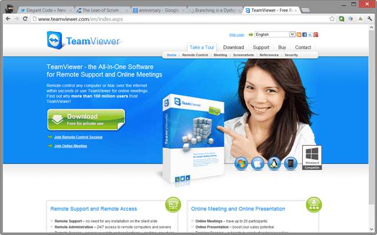
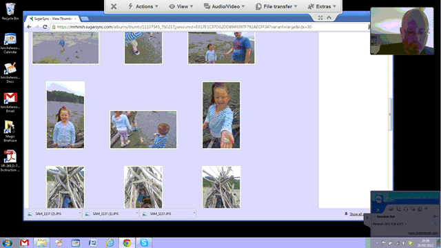
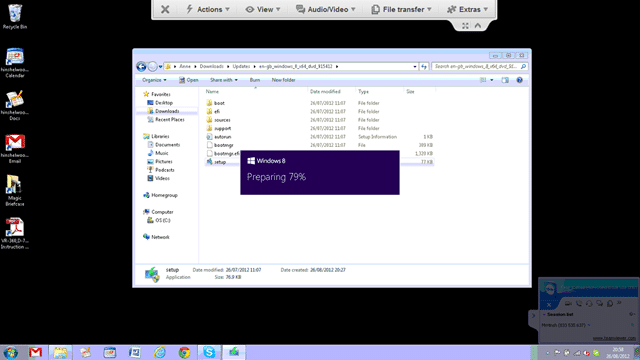
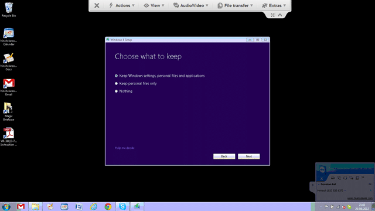
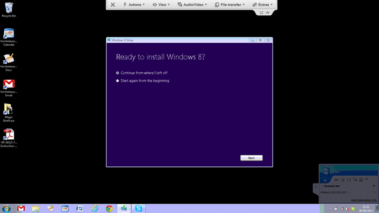
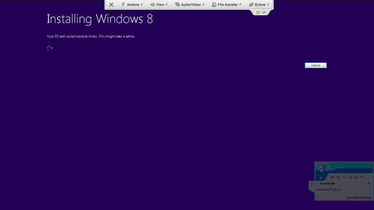
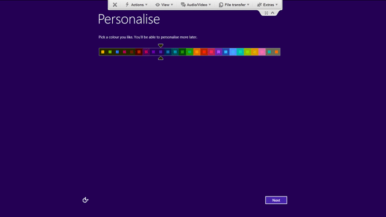
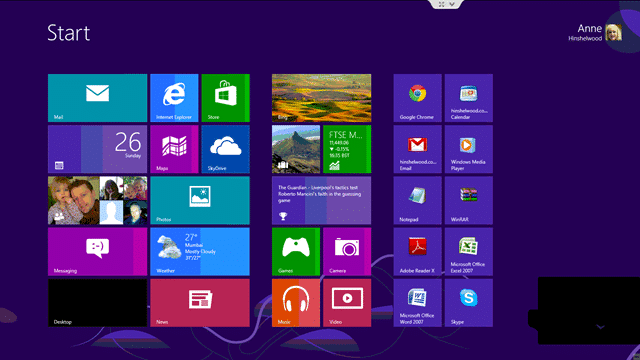

Do you have parents that could not install an application let alone and operating system? Do they live in a country other than the one that you are currently in? Well mine do and the thing that helps me most in helping them is a little app called Team Viewer.

  
**Figure: Team Viewer is the best remote software**

It works over very high latency allows me to have video and whatever running so I can , for example, help my parents view a slideshow in Sugar Sync (another must have tool) while video conferencing with them over Skype. And best of all it is free for home use…

  
**Figure: Me helping parents**

The other thing that I help them with is that crazy technical stuff… you know… installing applications, adding users, closing windows… and there is nothing more technical than upgrading an Operating System! I have read a lot about Windows 8 upgrades and everything I have seen is that it is a painless experience and just works. So I firmly believe that if my father could put his fear he could have handled this with no problems.

  
**Figure: Running the Windows 8 install over Team Viewer**

I started by unpacking the Windows 8 ISO to their local disk using WinRAR. I could have mounted and then copied the files, but this gets it done in one go. This will allow me to run the installer from within windows rather than booting of a USB. As I don't have physical access to the computer this makes sense, but we shall see if physical interaction during the upgrade is required. I am kicking this off at 13:30 and we will see how long it will take…

  
**Figure: I will be keeping everything**

The Windows 8 installer presents you with three options:

- Keep Windows settings, personal files and applications (recommended)
- Keep personal files only
- Nothing

As my parents don't use that many applications and likely most of them will just work I will keep everything. This may mean that some of the application will need reinstalled, but se la vie.

  
**Figure: Verification of stuff**

After you select the option that you want the installer will do a bunch of checks to make sure that your system is ready for Windows 8. This will check all of the installed applications and drivers for compatibility so it may take a while depending on how fast your computer hardware is and how many applications you have installed.

  
**Figure: You need to uninstall Microsoft Security Essentials**

Although my parents have a fair number of apps installed including all that crap-ware that comes with a new computer (no they have never reinstalled) there was only one issue detected…

AS Windows 8 has its own security built in you need to remove the “Windows Security Essentials” install that you had. Effectively Windows 8 has a newer version built-in. Security is no longer an afterthought…

Now I can click that “Restart” button and hope for the best. Remember that I am remote required interaction with the desktop before we are back in Windows will require a painful trans-Atlantic phone call…

…waiting…

And we are back, but still in Windows 7. So lets login and…

  
**Figure: Continue from where I left off**

I am not sure why I had to reboot, but I am not really bothered… whatever gets the job done in the best most stable and consistent way is just fine with me…

  
**Figure: Ready to install Windows 8 Pro**

As soon as you click the “Install” button you are handing control over to the Windows 8 installation procedures.

  
**Figure: Windows 8 Installation**

My hope is that once the install and reboots have completed that Team Viewer will just come back up and I will be able to log striate in. I have the latest version Team Viewer that support Windows 8 so it is not a forlorn hope, but I do think that I am being overly hopeful.

I should at this point point out that this is the first ever upgrade of one version of Windows that I have ever done for another. I got out of the habit in the Windows 95/98/ME and Windows 2000/XP days and never looked back until now. If this just works it will be a perfect experience for updating remote computers of family members…

  
**Figure: About 20 minutes in**

I would expect an upgrade to take substantially longer to facilitate than a pure install. I am about 20 minutes into the install and we are 85% into the current process. Hopefully it will get all the way through before my parents go to bed  (its 21:50 GMT back home).

… So just checked in and the computer in Scotland is rebooting… crunch time (14:00 PST)!

  
**Figure: Parents online**

… and at 14:21 PST…

  
**Figure: Up and Running just fine…**

Answer a few questions and then we enter the usual waiting pattern for the first account to be configured….

  
**Figure: Pity my parents will not see this useful stuff..**

There are a few screen that help folks get used to Windows 8, but that will be no help for my parents… I wonder how long it will take for my Mum to find the Start button?

  
**Figure: Windows 8 takes care of a few things for you**

And there you go.. .a Windows 8 deployment remotely with no local access from Seattle, USA to Glasgow, Scotland (4447 miles away).

  
**Figure: Mum’s default start screen**

The first thing that you need to do is check for updates and validate that all of your hardware is still working…

… Now to get her some apps, uninstall office 2007 in favour of Office 365 Preview…

**How did you get on updating your remote family members?**

