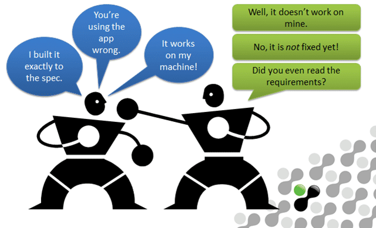
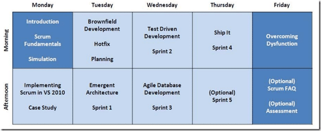

Its hard for developers to work with testers and its hard for testers to work with developers. There are many tools out there to help teams break down those barriers between them and I really like both the features and workflow of Microsoft Test Manager (MTM). While I am not a tester, I am a developer and the rich bugs that are produced by MTM help me reproduce that evasive bug and improves my relationship with what should be my teammates.

  
{ .post-img }
**Figure: An all too common scenario!**

> “Every tester should have the heart of a developer…  
>                …in a jar on their desk!”

So, what do you need for a well rounded experience with the Visual Studio test tools?

If you just want an overview of the tool I have a bunch of [Visual Studio 2010 Overview Webcasts](http://blog.hinshelwood.com/an-index-to-all-visual-studio-2010-overview-sessions/) that can help, however to get a real feel for the tools you need to get your hands dirty and for that we have the [Testing with Test Professional 2010 and Visual Studio 2010 Ultimate](http://www.eventbrite.com/event/2754206907) hands on lab that we can do both remote and onsite. The current instance is delivered remotely over 3 half days.

This course is designed to give folks the knowledge necessary to not only use the tools and understand the features, but also to implement those features in the real world. With the rich data reporting capabilities of TFS absorbing all facets of data produced as part of the test cycles, there are many things that will put a smile on with a tester and a test managers face.

But what if you already have that knowledge (you have taken our course) and you want to add those agile practices that can make a good team great and a successful company… well… very successful…

Adding those agile practices is easy with [Professional Scrum Developer](http://nwcadence.com/PSDTraining) training that we offer. As well as being one of the most respected agile developer courses around it is the ONLY [official user training for Visual Studio ALM](http://msdn.microsoft.com/en-us/vstudio/ff433643). This course brings all of you Team Members together and starts them down the road of working together in an attempt to jump start their adoption. Don’t think that this is just for Scrum teams either as Scrum is really just a tool that helps you adopt agile practices, and while popular (80%+), you can use these taught practices with any agile method.

  
{ .post-img }
**Figure: 5 day PSD at a glance and there is also a 3 day**

So if you are looking for an adoption strategy for Microsoft Test Manager then:

1. **Overview:** [**Visual Studio 2010 Overview Webcasts**](http://blog.hinshelwood.com/an-index-to-all-visual-studio-2010-overview-sessions/)  
   If you want a custom set of sessions as part of [Microsoft's ALM Catalyst](http://sharepoint.microsoft.com/almcatalyst/Pages/partnerdetails.aspx?PartnerID=2) program you can request them through this site.
2. **Hands-on Lab:** [**Testing with Test Professional 2010 and Visual Studio 2010 Ultimate**](http://www.eventbrite.com/event/2754206907)  
    note: You can get a **25% discount** through Feb. 24th for those who register using the **discount code “MrHinsh**”  
    note: You also get a copy of Jeff Levinson’s [Software Testing with Visual Studio 2010](http://www.amazon.com/gp/product/0321734483/ref=as_li_ss_tl?ie=UTF8&tag=mrhinsh-20&linkCode=as2&camp=1789&creative=390957&creativeASIN=0321734483) when you attend.
   { .post-img }
3. **Training:** [**Professional Scrum Developer**](http://nwcadence.com/PSDTraining)  
   Although we don’t have any public PSD’s scheduled, which is why you will not find it on our site, we do provide it as part of private engagements.
4. **Start building awesome software…**
