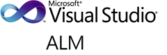

{ .post-img }

Over the last year I have delivered a variety of high-level overviews of Visual Studio ALM and the features that are available within it. These are all high level overviews even when talking about specific topics, and I have occasionally had to hand wave where things did not go well (Cough… Sharepoint Dev… cough) but these sessions make up the core features of Visual Studio 2010 and Team Foundation Server 2010.

As we are getting closer to a better understanding of Dev11 and with an overriding need to clean up my hard drive I wanted to post one of each of the public webcast that I delivered. This does not always represent the best session, but the ones with the least technical hickups along the way 
{ .post-img }

_If you want a custom set of webcasts just for your company so that you can ask the hard questions you can as part of the [Microsoft’s ALM Catalyst](http://sharepoint.microsoft.com/almcatalyst/Pages/partnerdetails.aspx?PartnerID=2) program._

### Visual Studio 2010 Overview webcast

- [**Visual Studio 2010 Overview - Introduction**](http://blog.hinshelwood.com/visual-studio-2010-overview-introduction/ "Visual Studio 2010 Overview – Introduction")The introductory session gives a 1000 foot view of some of the features of Visual Studio 2010 and the interfaces that are available.
- [Visual Studio 2010 Overview - IntelliTrace & Test Impact](http://blog.hinshelwood.com/visual-studio-2010-overview-intellitrace-and-test-impact-analysis/ "Visual Studio 2010 Overview – IntelliTrace and Test Impact Analysis")
- [Visual Studio 2010 Overview - Code Management & Build](http://blog.hinshelwood.com/visual-studio-2010-overview-code-management-build/ "Visual Studio 2010 Overview – Code Management & Build")
- [Visual Studio 2010 Overview - Microsoft Test Manager](http://blog.hinshelwood.com/visual-studio-2010-overview-microsoft-test-manager/ "Visual Studio 2010 Overview – Microsoft Test Manager")
- [Visual Studio 2010 Overview - Architecture](http://blog.hinshelwood.com/visual-studio-2010-overview-architecture/ "Visual Studio 2010 Overview – Architecture")
- [Visual Studio 2010 Overview - Reporting & Process](http://blog.hinshelwood.com/visual-studio-2010-overview-reporting-process/ "Visual Studio 2010 Overview – Reporting & Process")
- Visual Studio 2010 Overview - Upgrade & Migration **(Not available)**
- Visual Studio 2010 Overview - SQL Development **(Not available)**
- Visual Studio 2010 Overview - SharePoint Development **(Not available)**
- Visual Studio 2010 Overview - Azure Development **(Not available)**

**_If you want a custom set of webcasts or to get the unavailable ones just for your company so that you can ask the hard questions; Then you can as part of the [Microsoft’s ALM Catalyst](http://sharepoint.microsoft.com/almcatalyst/Pages/partnerdetails.aspx?PartnerID=2) program._**

### Bonus webcasts

While not part of the original series of webcast there was need for a 2 hours session that showed customers, still at a hight level, how their users would interact with the tools on a daily basis.

- **[Visual Studio 2010 Overview – A day in the life of...Plan, Code & Test](http://blog.hinshelwood.com/visual-studio-2010-overview-a-day-in-the-life-of/ "Visual Studio 2010 Overview – A day in the life of")**The "Day in the life of" session was put together to show how users work interact with Visual Studio ALM on a daily basis. It shows planning, coding (not TDD) to fix a bug and a testers verification of that bug.

_If you want a custom set of webcasts just for your company so that you can ask the hard questions you can as part of the [Microsoft’s ALM Catalyst](http://sharepoint.microsoft.com/almcatalyst/Pages/partnerdetails.aspx?PartnerID=2) program._
