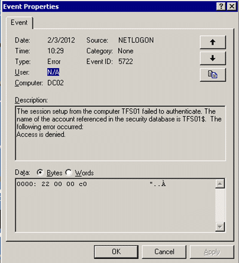
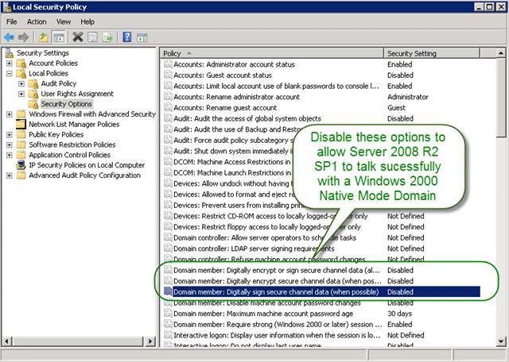
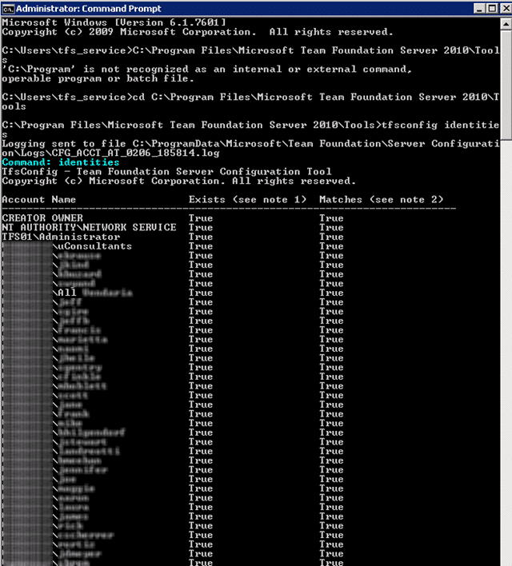

I recently ran into an odd problem at a customer where the local computer accounts of a computer joined to a domain started showing the SID periodically. For those not in the know, this is BAD.

WARNING: I did not find a solution to my problem, but this should server as a documentation of what I tried, what did not work, and possible resolutions that were unachievable in the time frame. In fact, all of this could be nothing to do with the problem at all… just saying...

### The Problem

I first notices that even when I added "Domain Users" to a security group in TFS my "Assigned To" list was empty of all users except those specifically added. It looks like when I name a user my local credentials are used and it is successful, but when I add a group it fails.

[](http://blog.hinshelwood.com/files/2012/02/Image.png)
{ .post-img }

**Figure: Holy service accounts, batman**

So I checked the event log and found an error in the TFS Job Service:

```
Log Name:      Application
Source:        TFS Services
Date:          2/3/2012 10:01:27 AM
Event ID:      3071
Task Category: None
Level:         Warning
Keywords:      Classic
User:          N/A
Computer:      TFS01.company.com
Description:
TF53010: The following error has occurred in a Team Foundation component or extension:
Date (UTC): 2/3/2012 6:01:27 PM
Machine: TFS01
Application Domain: TfsJobAgent.exe
Assembly: Microsoft.TeamFoundation.Framework.Server, Version=10.0.0.0, Culture=neutral, PublicKeyToken=b03f5f7f11d50a3a; v2.0.50727
Service Host:
Process Details:
  Process Name: TFSJobAgent
  Process Id: 2128
  Thread Id: 4028
  Account name: companytfs_service

Detailed Message: TF200035: One or more errors occurred when Team Foundation Server attempted to synchronize the following identity: Domain Admins. Number of errors that occurred: 1.
++++++++++++++++++++++
Sync error for identity: Domain Admins
The server does not support the requested critical extension.

   at System.DirectoryServices.SearchResultCollection.ResultsEnumerator.MoveNext()
   at System.DirectoryServices.DirectorySearcher.FindOne()
   at Microsoft.TeamFoundation.Framework.Server.WindowsProvider.GetMembersDirect(Boolean getProperties, DirectoryEntry groupEntry, String groupDomainName, Dictionary`2 members, IIdentitySyncHelper syncHelper, SyncErrors syncErrors, TeamFoundationRequestContext requestContext)
   at Microsoft.TeamFoundation.Framework.Server.WindowsProvider.SyncADIdentity(TeamFoundationIdentity identity, Boolean includeMembers, TeamFoundationRequestContext requestContext, SyncErrors syncErrors)
   at Microsoft.TeamFoundation.Framework.Server.WindowsProvider.SyncIdentity(IdentityDescriptor descriptor, Boolean includeMembership, String providerInfo, TeamFoundationRequestContext requestContext, SyncErrors syncErrors)
   at Microsoft.TeamFoundation.Framework.Server.IdentitySynchronizer.SyncOneGroupMembership(TeamFoundationRequestContext requestContext, TeamFoundationIdentity groupToSync, IdentityComponent myComponent)

Event Xml:
<Event xmlns="http://schemas.microsoft.com/win/2004/08/events/event">
  <System>
    <Provider Name="TFS Services" />
    <EventID Qualifiers="0">3071</EventID>
    <Level>3</Level>
    <Task>0</Task>
    <Keywords>0x80000000000000</Keywords>
    <TimeCreated SystemTime="2012-02-03T18:01:27.000000000Z" />
    <EventRecordID>16464</EventRecordID>
    <Channel>Application</Channel>
    <Computer>TFS01.company.com</Computer>
    <Security />
  </System>
  <EventData>
    <Data>TF53010: The following error has occurred in a Team Foundation component or extension:
Date (UTC): 2/3/2012 6:01:27 PM
Machine: TFS01
Application Domain: TfsJobAgent.exe
Assembly: Microsoft.TeamFoundation.Framework.Server, Version=10.0.0.0, Culture=neutral, PublicKeyToken=b03f5f7f11d50a3a; v2.0.50727
Service Host:
Process Details:
  Process Name: TFSJobAgent
  Process Id: 2128
  Thread Id: 4028
  Account name: companytfs_service

Detailed Message: TF200035: One or more errors occurred when Team Foundation Server attempted to synchronize the following identity: Domain Admins. Number of errors that occurred: 1.
++++++++++++++++++++++
Sync error for identity: Domain Admins
The server does not support the requested critical extension.

   at System.DirectoryServices.SearchResultCollection.ResultsEnumerator.MoveNext()
   at System.DirectoryServices.DirectorySearcher.FindOne()
   at Microsoft.TeamFoundation.Framework.Server.WindowsProvider.GetMembersDirect(Boolean getProperties, DirectoryEntry groupEntry, String groupDomainName, Dictionary`2 members, IIdentitySyncHelper syncHelper, SyncErrors syncErrors, TeamFoundationRequestContext requestContext)
   at Microsoft.TeamFoundation.Framework.Server.WindowsProvider.SyncADIdentity(TeamFoundationIdentity identity, Boolean includeMembers, TeamFoundationRequestContext requestContext, SyncErrors syncErrors)
   at Microsoft.TeamFoundation.Framework.Server.WindowsProvider.SyncIdentity(IdentityDescriptor descriptor, Boolean includeMembership, String providerInfo, TeamFoundationRequestContext requestContext, SyncErrors syncErrors)
   at Microsoft.TeamFoundation.Framework.Server.IdentitySynchronizer.SyncOneGroupMembership(TeamFoundationRequestContext requestContext, TeamFoundationIdentity groupToSync, IdentityComponent myComponent)
</Data>
  </EventData>
</Event>

```

**Figure:  TF200035: One or more errors occurred when Team Foundation Server attempted to synchronize the following identity**

Lets take a look....

### The Investigation

So I went spelunking and found some interesting things. First was that SQL, running under Network Service was not able to contact the domain properly to query information.

```
Log Name:      Security
Source:        Microsoft-Windows-Security-Auditing
Date:          2/3/2012 9:55:38 AM
Event ID:      4625
Task Category: Logon
Level:         Information
Keywords:      Audit Failure
User:          N/A
Computer:      TFS01.companydomain.com
Description:
An account failed to log on.

Subject:
    Security ID:        S-1-5-20
    Account Name:        TFS01$
    Account Domain:        COMPANYDOMAIN
    Logon ID:        0x3e4

Logon Type:            3

Account For Which Logon Failed:
    Security ID:        S-1-0-0
    Account Name:
    Account Domain:

Failure Information:
    Failure Reason:        An Error occured during Logon.
    Status:            0xc000040a
    Sub Status:        0x0

Process Information:
    Caller Process ID:    0x51c
    Caller Process Name:    C:Program FilesMicrosoft SQL ServerMSSQL10_50.MSSQLSERVERMSSQLBinnsqlservr.exe

Network Information:
    Workstation Name:    TFS01
    Source Network Address:    -
    Source Port:        -

Detailed Authentication Information:
    Logon Process:        Authz
    Authentication Package:    Kerberos
    Transited Services:    -
    Package Name (NTLM only):    -
    Key Length:        0

This event is generated when a logon request fails. It is generated on the computer where access was attempted.

The Subject fields indicate the account on the local system which requested the logon. This is most commonly a service such as the Server service, or a local process such as Winlogon.exe or Services.exe.

The Logon Type field indicates the kind of logon that was requested. The most common types are 2 (interactive) and 3 (network).

The Process Information fields indicate which account and process on the system requested the logon.

The Network Information fields indicate where a remote logon request originated. Workstation name is not always available and may be left blank in some cases.

The authentication information fields provide detailed information about this specific logon request.
    - Transited services indicate which intermediate services have participated in this logon request.
    - Package name indicates which sub-protocol was used among the NTLM protocols.
    - Key length indicates the length of the generated session key. This will be 0 if no session key was requested.
Event Xml:
<Event xmlns="http://schemas.microsoft.com/win/2004/08/events/event">
  <System>
    <Provider Name="Microsoft-Windows-Security-Auditing" Guid="{54849625-5478-4994-A5BA-3E3B0328C30D}" />
    <EventID>4625</EventID>
    <Version>0</Version>
    <Level>0</Level>
    <Task>12544</Task>
    <Opcode>0</Opcode>
    <Keywords>0x8010000000000000</Keywords>
    <TimeCreated SystemTime="2012-02-03T17:55:38.958188500Z" />
    <EventRecordID>590839</EventRecordID>
    <Correlation />
    <Execution ProcessID="532" ThreadID="5544" />
    <Channel>Security</Channel>
    <Computer>TFS01.companydomain.com</Computer>
    <Security />
  </System>
  <EventData>
    <Data Name="SubjectUserSid">S-1-5-20</Data>
    <Data Name="SubjectUserName">TFS01$</Data>
    <Data Name="SubjectDomainName">COMPANYDOMAIN</Data>
    <Data Name="SubjectLogonId">0x3e4</Data>
    <Data Name="TargetUserSid">S-1-0-0</Data>
    <Data Name="TargetUserName">
    </Data>
    <Data Name="TargetDomainName">
    </Data>
    <Data Name="Status">0xc000040a</Data>
    <Data Name="FailureReason">%%2304</Data>
    <Data Name="SubStatus">0x0</Data>
    <Data Name="LogonType">3</Data>
    <Data Name="LogonProcessName">Authz   </Data>
    <Data Name="AuthenticationPackageName">Kerberos</Data>
    <Data Name="WorkstationName">TFS01</Data>
    <Data Name="TransmittedServices">-</Data>
    <Data Name="LmPackageName">-</Data>
    <Data Name="KeyLength">0</Data>
    <Data Name="ProcessId">0x51c</Data>
    <Data Name="ProcessName">C:Program FilesMicrosoft SQL ServerMSSQL10_50.MSSQLSERVERMSSQLBinnsqlservr.exe</Data>
    <Data Name="IpAddress">-</Data>
    <Data Name="IpPort">-</Data>
  </EventData>
</Event>

```

**Figure: This implies that the Machine account does not have permission to AD**

Now, when you join a computer to a domain it actually gets an account on the domain and a password just like a user. The account is always the computer name appended with a $ which looks like "tfs01$". The password for that account is set every 30 days by request of the client, and there can rarely be any problems.

[](http://blog.hinshelwood.com/files/2012/02/Hint-4.png)  
{ .post-img }
**Figure: Domain Controller error in Event Log**

But in this case it looks for  it looks as if the machine account has become out of sync, so lets try [resetting the computer account](http://support.microsoft.com/kb/216393).

```
C:Userstfs_service>netdom reset "tfs01" /domain:companydomain
The secure channel from TFS01 to the domain COMPANYDOMAIN has
been reset.  The connection is with the
machine DC01.COMPANYDOMAIN.COM.

The command completed successfully.

```

**Figure: Using netdom to reset the secure channel**

This should update AD with a new password set by the client, so lets test it out:

```
C:Userstfs_service>Nltest /SC_Verify:companydomain  /SERVER:tfs01
Flags: b0 HAS_IP  HAS_TIMESERV
Trusted DC Name dc01.companydomain.com
Trusted DC Connection Status Status = 0 0x0 NERR_Success
Trust Verification Status = 0 0x0 NERR_Success

The command completed successfully
```

**Figure: Using nltest to check the secure channel**

After resetting the account I rebooted the server and checked again for the error messages, and dam but they were still there. My next approach was to reset the computer account in Active Directory Users and Computers. After you do this you will need to re-join the computer to the domain as you will get an error on login that states "[The trust relationship between this workstation and the primary domain failed](http://social.msdn.microsoft.com/Forums/en-US/tfssetup/thread/d261abe1-3008-4e8a-bf8a-ef249ee7d341)” for which it it worth investigating. In this case however it is a problem of our own making with the reset, and can be fixed by following:

1. Join computer to any workgroup
2. Reboot
3. Login as local Administrator account
4. Join computer to domain
5. Reboot
6. Login as domain account

Even this is not you done. When you do a remove, re-join certain services do not like it and you will have to do the following:

- **Fix Reporting Services** - Re-add the "key" to reporting services through the configuration console as it got confused
- **Fix SharePoint** - Re-run the SharePoint Configuration without changing anything as it thinks that the machine name has changed

While this should solve most problems with authentication, it did not solve this one. You may also see a [Event ID 5722 is logged on your domain controller](http://support.microsoft.com/kb/810977) which should also be fixed, but is a result of the things that I have tried so far.

So where next?

Well, one thing to make sure of is that the [TFS 2010 service account has permission to read from the domain](http://billwg.blogspot.com/2008/12/tfs-service-account-requires-read.html), but it unusual to have this problem as this is the default for accounts in AD. If you have a more locked down configuration it may be something you need to look at.

One of my colleagues (Rennie) thought that if the Active Directory Domain Services have not been maintained properly (this is a very small company with no real AD skills in-house) then they may have lost one or more of their domain roles. Specifically the PDC Emulation role.

[](http://blog.hinshelwood.com/files/2012/02/image.png)  
{ .post-img }
**Figure: It looks like the PDC Emulation role is OK**

This was definitely worth a check, and while it was OK, I did notice something that confused and then shocked me. You now those moments when you find out something that just does not compute, and you just stare at it!

> This is a Windows 2000 Domain Controller!

Now that I know that a whole host more potential issues rear their ugly heads.

So, now to check that Windows 2000 Service Pack 4 is installed but who knows which hotfix level if any, and what about bugs that were only fixed in later versions of the OS!

Pha! (throws up hands in disgust)  Is Windows 2000 domains even supported in TFS?

> Team Foundation Server is supported in the following Active Directory modes and functional levels:
>
> - Windows 2000 Active Directory in native mode.
> - Windows Server 2003 Active Directory in Windows 2000 native mode.
> - Windows Server 2003 Active Directory in Windows Server 2003 functional level.
> - Windows Server 2003 R2 in Windows Server 2003 R2 Active Directory forest functional level.
>
> \-[Trusts and Forests Considerations for Team Foundation Server](http://msdn.microsoft.com/en-us/library/ms253081.aspx), MSDN

What do you know, it is supported (somewhat)

Windows 2000 domains are only supported in Native mode and will not work in mixed mode (does anyone still have Windows NT4 in prodution?) so lets take a look.

[](http://blog.hinshelwood.com/files/2012/02/Hint-2.png)
{ .post-img }

**Figure: Will I am a monkeys uncle, it is!**

While this may be true, I still hold some reservation for the notion that a Domain upgrade may be necessary! To be honest, if it is a miss configuration of the domain somewhere in the mists of time, then a domain replacement may be a better option and creating a brand new "Windows 2008 R2 Domain" would have at least he benefit of modern defaults.

While on the Domain Controller I also noticed Event ID 1789 in the event log that got me looking into another article on [Error 1789 when you use the LookupAccountName function on a computer that is running Windows Server 2008 R2](http://support.microsoft.com/?id=976494) that while technically is included in the last service pack was not working of me. I could not even apply the Hotfix as it game me the "this update is not valid for your computer" message that is no help. There are manual steps for [Local Groups not resolving domain group name](http://social.technet.microsoft.com/Forums/en/windowsserver2008r2general/thread/846afed4-f3cc-47df-abd0-d111b7d3476a) which stopped that error from being listed, which is one more step closer to a stable working system.

[](http://blog.hinshelwood.com/files/2012/02/Hint-6.png)  
{ .post-img }
**Figure: These manual steps are needed on old domains**

After all of those steps and spelunking I only have one error message left. The one that started it all… the TF200035… and I can’t seam to get it to talk to Active Directory.

One thing you may want to try is using TfsSecurity.exe to check wither the accounts are in sync. This can be done easily and there are two things I want to check. First the TFS_Service account:

```
C:Program FilesMicrosoft Team Foundation Server 2010Tools>TfsSecurity /server
:http://tfs01:8080/tfs /imx companydomaintfs_service
TFSSecurity - Team Foundation Server Security Tool
Copyright (c) Microsoft Corporation.  All rights reserved.
The target Team Foundation Server is http://tfs01:8080/tfs.
Resolving identity "companydomaintfs_service"...

SID: S-1-5-21-448539723-789336058-1957994488-1766

DN: CN=TFS_Service,OU=Resource,DC=companydomain,DC=com

Identity type: Windows user
   Logon name: COMPANYDOMAINtfs_service
 Display name: TFS_Service

Member of 18 group(s):
e [A] [NwcSandbox]Project Collection Valid Users
a [A] [CUSTOMER1]Project Administrators
a [A] [CUSTOMER1-0-2-1]Project Administrators
s [A] [NwcSandbox]Project Collection Service Accounts
e [A] [COMPANY]Project Collection Valid Users
  [A] [TEAM FOUNDATION]SharePoint Web Application Services
s [A] [TEAM FOUNDATION]Team Foundation Service Accounts
e [A] [DefaultCollection]Project Collection Valid Users
a [A] [TEAM FOUNDATION]Team Foundation Administrators
s [A] [DefaultCollection]Project Collection Service Accounts
e [A] [TEAM FOUNDATION]Team Foundation Valid Users
a [A] [DefaultCollection]Project Collection Administrators
a [A] [COMPANY]Project Collection Administrators
a [A] [TfsAdmin]Project Administrators
s [A] [COMPANY]Project Collection Service Accounts
a [A] [CUSTOMER2]Project Administrators
  [G] BUILTINAdministrators
a [A] [NwcSandbox]Project Collection Administrators

Done.

```

**Figure: TfsSecurity /server :http://tfs01:8080/tfs /imx companydomaintfs_service**

And second is the machine account:

```
C:Program FilesMicrosoft Team Foundation Server 2010Tools>TfsSecurity /server
:http://tfs01:8080/tfs /imx compnaydomaintfs01$
TFSSecurity - Team Foundation Server Security Tool
Copyright (c) Microsoft Corporation.  All rights reserved.
The target Team Foundation Server is http://tfs01:8080/tfs.
Resolving identity "companydomaintfs01$"...

SID: S-1-5-21-448539723-789336058-1957994488-1761

DN: CN=TFS01,CN=Computers,DC=companydomain,DC=com

Identity type: Windows user
   Logon name: COMPANYDOMAINTFS01$
 Display name: TFS01$

Member of 12 group(s):
e [A] [NwcSandbox]Project Collection Valid Users
s [A] [NwcSandbox]Project Collection Service Accounts
e [A] [COMPANY]Project Collection Valid Users
s [A] [TEAM FOUNDATION]Team Foundation Service Accounts
e [A] [DefaultCollection]Project Collection Valid Users
a [A] [TEAM FOUNDATION]Team Foundation Administrators
s [A] [DefaultCollection]Project Collection Service Accounts
e [A] [TEAM FOUNDATION]Team Foundation Valid Users
a [A] [DefaultCollection]Project Collection Administrators
a [A] [COMPANY]Project Collection Administrators
s [A] [COMPANY]Project Collection Service Accounts
a [A] [NwcSandbox]Project Collection Administrators

Done.

```

**Figure: TfsSecurity /server :http://tfs01:8080/tfs /imx compnaydomaintfs01$**

Dag-namit, but I was hoping for some sort of help here! Everything looks just fine except for not being able ot query AD. This is looking more and more like a… “someone ticked a box 7 years ago in AD and no one remembers where or why problem”.

For those that have encountered them before, there are almost impossible to debug. This is why small companies tend to use the out-of-the-box config and bug companies buy auditing software.

The very last thing that I can check is that the accounts that have been added to TFS are in deed syncing, even if the groups are not:

[](http://blog.hinshelwood.com/files/2012/02/image1.png)  
{ .post-img }
**Figure: making sure the identities in TFS are up to date**

Well, that was my last option and I have no further insights. I am sure that I will need to return to this in the future, but for now I have implemented a workaround for the customer. they can use the system, but without AD groups.

While this sucks…sometimes an internal network configuration beats you…. Humph….

### The Work Around

As I have no real solution for this problem that I chased around I have to come up with a workaround that will provide the customer with at least the ability to use TFS. So I created the following local groups at the Server level:

- Company Developers
- Company Management
- Company Project Managers
- Company Project Admins

I added them with permission onto the individual team projects and added user accounts directly into these TFS Groups. This lets us secure some work item types, states and have users listed in the drop downs.

Symptom treated....

Solving the problem looks to be something that the customer is unwilling ot pay me to do, but I left them with some advice:

- Try an upgrade to Windows Sever 2008 R2 domain controllers
- If the problem still exists then create a new Windows Server 2008 R2 domain and move everyone accross

In saying that this may not even be the problem!

**Additional Useful Links:**

- [Service Accounts and Dependencies in Team Foundation Server](http://msdn.microsoft.com/en-us/library/ms253149.aspx)
- [Trusts and Forests Considerations for Team Foundation Server](http://msdn.microsoft.com/en-us/library/ms253081.aspx)
- [TFS Install Guide](http://www.microsoft.com/download/en/details.aspx?displaylang=en&id=24337)

Have fun….
