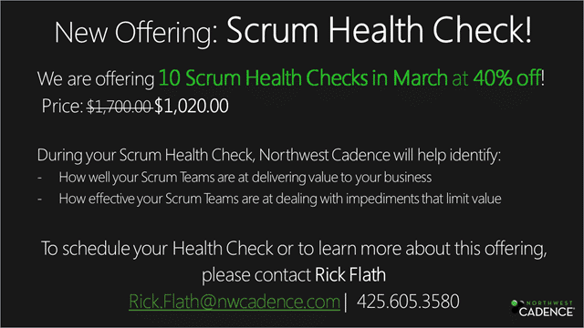

I posted before about [how you know that you are doing Scrum, or not](http://blog.hinshelwood.com/are-you-doing-scrum-really/), but how do you! This is something that has been banded about both in the Scrum.org community and within Northwest Cadence for a while and we have come to the conclusion that we need to check!

There are many reasons for a team to not do something they need:

- We can’t do that here, it would not work
- We don’t do that coz Scrum “says” not to by omission

Well, I am proud to announce that we put our heads together and came up with a 6 hour “[Scrum Health Check](http://www.nwcadence.com/HealthCheckScrum.pdf)”.

  
{ .post-img }
**Figure: Not in-depth, but an indicator**

To get the ball rolling we are offering our first 10 Health Checks in March at 40% off. Although 6 hours is not enough to investigate you entire Scrum implementation (we will also do that ) it is enough to do a quick check to make sure that:
{ .post-img }

- You are on the right road!
- Travelling in the right direction!
- You are using the right sort of gas!

We will identify a bunch of “Opportunities” for improvement and highlight where you would be best to spend your effort. If you come back for more we will also check your progress and be able to better predict how close you are to your goals.

