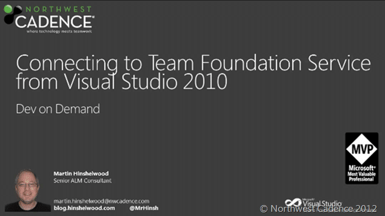

Over on the Northwest Cadence blog we are doing a big push on Visual Studio 11 (dev11) content.  I and my colleagues will be delivering content on Visual Studio 11,  Visual Studio 11 Team Foundation Server & Visual Studio Team Foundation Service (AKA TFS Preview).
{ .post-img }

I have been concentrating on the hosted (azure) version of TFS and my first blog post has just gone up on [http://blog.nwcadence.com](http://blog.nwcadence.com) that includes both screenshots, opinions and video demos of TFS preview in action.

 **Figure: Lots of awesome video demos**
{ .post-img }

Some of the highlights are:

- Live ID login
- Web UI that works on more than IE
- Dates on Iterations
- Built in support for Team’s
- Project & Team profiles with images and identity
- Default areas and Iterations for teams
- Support for configuring Alerts for others and teams
- The ability to see effective permissions
- Options to see where those effective permissions came from

I only have one post today, but I have more tomorrow:

\[feedlist listurl="http://blog.nwcadence.com/author/mrhinsh/feed/rss/" limit=20 more=no\]

And this just the beginning…

- **Follow** [**http://blog.nwcadence.com**](http://blog.nwcadence.com) **for more posts…**

There will be plenty more this month and after the [2012 MVP Global Summit](http://www.2012mvpsummit.com/) in a couple of weeks...
