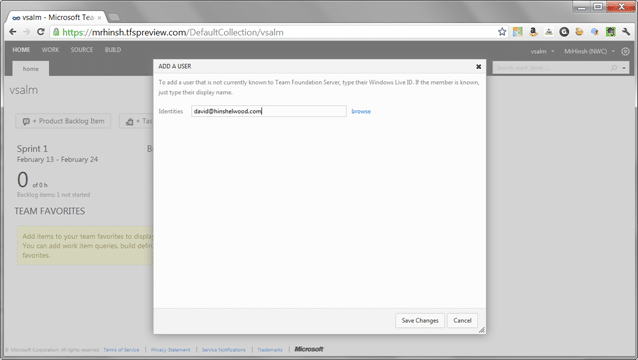
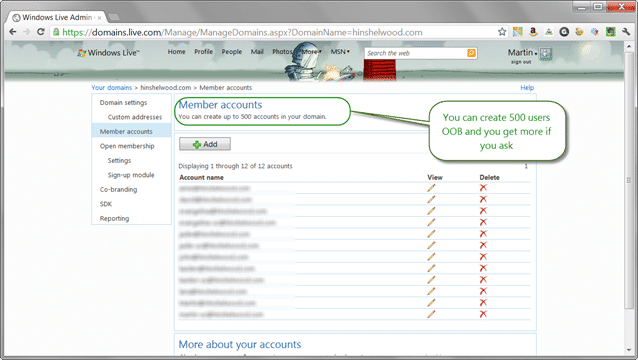
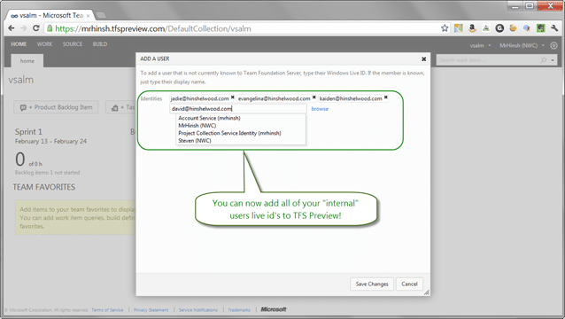

It has been noted by a few that there is currently no way to corporately control Live ID's and their use with Visual Studio 2012 Team Foundation Service. These folks are only partially right as there is a work around, which I use myself. I have had a custom Live ID for the last 10 years and for the last few I have used the Live Custom Domain service to provide a little consistency and to make sure that I do not get any… erroneous users entering the fray.
{ .post-img }

I even have Google Apps setup on the same domain that I use for Live Custom Domain’s…. I just prefer Gmail…. but I digress. The goal here is to be able to manage and maintain all of the Live ID’s on my domain (mycompany.com) so that I can use those Live ID’s to authenticate users.

  
{ .post-img }
**Figure: Adding Live ID’s for a custom domain**

Go ahead and try to sign up for \[youname\]@hinshelwood.com on [http://passport.com](http://passport.com) ! I’ll wait!

  
{ .post-img }
**Figure: No Windows Live ID for you on my domain sir!**

You will find that you can't and in fact only I as an admin for a domain specifically setup on Live can. You need to wander off to  [http://domains.live.com/](http://domains.live.com/) and log in there with an administrator account.

[")](http://blog.hinshelwood.com/files/2012/02/Image2.png)  
{ .post-img }
**Figure: Its mine... all mine!**

You can even do this in retrospect if you "own" the domain you own all of the accounts created on it, the current owner just does not know it yet. This is not like Google that pushed the pre-created accounts off back onto its original @gmail.com domain, it sooks up all of existing accounts like a vacuum.

  
{ .post-img }
**Figure: Start with picking your domain**

Setting up the custom Live domain is easy and quick. Just click “Add a Domain” and enter a domain name. You still need to prove that you OWN that domain, but that is in essence all of the configuration that you need to provide on the Live side.

[")](http://blog.hinshelwood.com/files/2012/02/Image3.png)  
{ .post-img }
**Figure: Proving that you own the domain with a TXT DNS reference**

Once you have added the records required by Live Custom Domains/Admin Center you can then setup accounts to use with any live enabled services, but specifically Visual Studio 2012 Team Foundation Service!

  
{ .post-img }
**Figure: You only get 500 users to start with, but you can get more for free**

Once you have you users setup they can then be added to Team Foundation Service and authenticate correctly. There is no reason as well that you can't set this up on mass as there is a reasonable API that would allow you to integrate this with your domain.

  
{ .post-img }
**Figure: API integration for LDAP or Active Directory**

For me it is easy as hinshelwood.com is a family domain and I only have a few accounts to administer. And really there is no administering as once created, they just exists and the user themselves can change passwords and owns the content.

  
{ .post-img }
**Figure: My custom Live ID’s added to Visual Studio 2012 Team Foundation Service**

With only a few clicks you can now add your corporate emails to Visual Studio 2012 Team Foundation Service and give users Live credentials. Is this a good idea… well, not if your users already have a Live ID.

It is very frustrating to have to log into more than one Live ID as it requires much strife with logging out. But if you have users that don’t have live ID’s or have rudely named or cryptic live ID’s then it can be a solution.

Simples...
