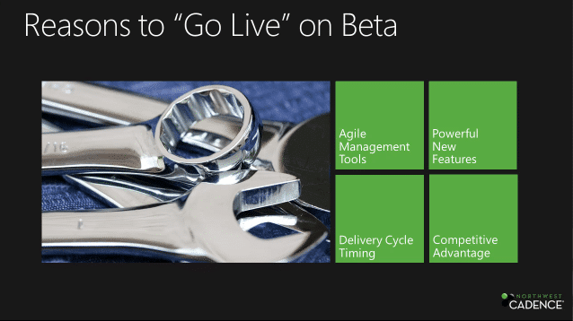
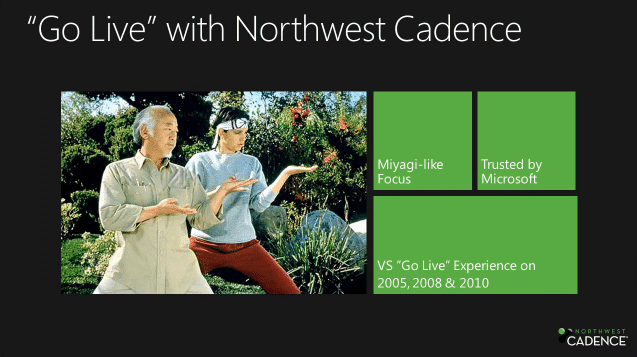

Its that time again where the Visual Studio and team Foundation Server teams are pushing out their next version of their tools, Visual Studio 11. [Steven & Lori Borg](http://nwcadence.com) teamed up to present a video on [why you would want to Go-Live with Visual Studio 11](http://blog.nwcadence.com/go-live-with-visual-studio-11-beta-3/). I used the Go-Live with many companies with the Visual Studio 2010 launch with no problems. Its as safe as a “RTM” product from most other teams.

  
{ .post-img }
**Figure: Why would you go live**

Not only should you Go-Live, but it is safe to do so as it is fully supported by Microsoft for production use. That said, you will probably still need some help and Northwest Cadence can help.

  
{ .post-img }
**Figure: “Go Live” with Northwest Cadence**

We have a proven track record of delivering high value consulting that targets the specific areas of Application Lifecycle management. Still not sure?

Go and listen to [Steve and Lori talking about Go-Live with Visual Studio 11 and Northwest Cadence](http://blog.nwcadence.com/go-live-with-visual-studio-11-beta-3/) and then sign up for my [Introduction to Visual Studio 11](http://blog.hinshelwood.com/events/) session I will be delivering Live from the MVP summit next Friday…

