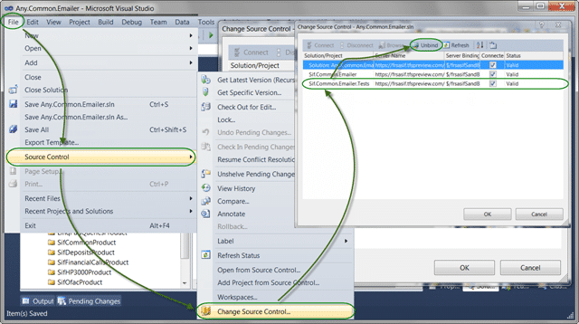
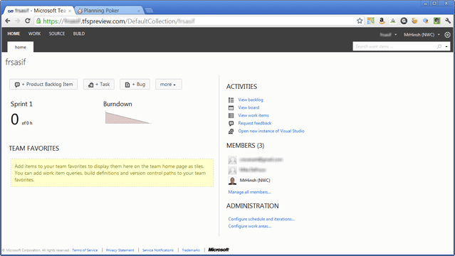

Jason Zander has just announced that the Visual Studio 11 & Visual Studio 11 Team Foundation Server Beta **will be available on the 29th February 2012**. I am really looking forward to this launch as it embodies the phrase “spit & polish” and really lowers the bar for entry into the Team Foundation Server world.

Unless you have been living under a rock you should also be aware of [http://tfspreview.com](http://tfspreview.com), the cloud based version of Visual Studio 11 Team Foundation Server that has been running in beta for a while. As well as the on-premises version of TFS offering Go-Live with Visual Studio 11 Beta, the cloud version has been offering Go-Live for a while now.

Microsoft themselves use it for many projects including the Visual Studio 11 ALM team themselves so it is kind of like them giving us access to their own dog-fooding server as well. Bu the reality of it is that they are fully supporting it.

So why should you NOT go to the cloud?

- **No Legacy Support** - You can’t use Visual Studio 2008 or 2005 to access it.  
   Note: This support is not there yet and no promises have been made as to when, if ever, it will be available.
- **No Custom Work Item Types** – You can only use the process templates that come out-of-the-box.  
   Note: Again, no news yet on when this might be coming
- **No Lab Management** – And don’t expect to see this soon, its hard.

Now that is out of the way – Why should you move to the cloud?

- **No Server to support** – Microsoft will do all of the management for you
- **Automatic Team Project Upgrades** – As Microsoft update the product your process template will be upgraded gracefully  
   note: Hence why there are no changes allowed
- **Awesome UI improvements** – There are no words to describe how fantastic the new UI is. And not just compared to the 2010 version, I think the competition is a little worried.
- **More to Come** – The cloud team has managed to get its update frequency down for one every 3 months to about once a month so expect to see the features as soon as they are ready.  
   Note: [Jason Zander](http://blogs.msdn.com/b/jasonz/) has committed (see his [ALM Summit talk](http://channel9.msdn.com/Events/ALM-Summit/2011)) to get this down to one a week!

And on that note, I just completed my first customer transition to the cloud. I have had a few customers with interest in moving, and most of those are currently playing with it, but it is a big decision. This customer did not yet have Source Control and was still stuck on a file share with work item tracking done of paper!

So I said “You guys need a cloud solution?” and they said “Yipee! Lets go!”

- **Rearrange your Source  
   **  
   Importing source into any source control system is hard as you want to be sure of your layout. So we had a couple of session on [how to layout your source code](http://blog.hinshelwood.com/guidance-how-to-layout-you-files-for-an-ideal-solution/) (note: I need to update that) and settled on a model that worked. They studiously went away and mapped some of their projects into that format and imported it into a Trial project in TFS.
  
  { .post-img }
  **Figure: Have a common folder layout to make builds easy**
  
  { .post-img }
  \*\*Figure: Visual Studio 2010 Connected to Team Foundation Service
  \*\*Note: If you have existing code and history you can use the [TFS Integration Platform](http://tfsintegration.codeplex.com/) to move all of your Source and Work Items to the cloud.
- **Adding source control bindings**
  You can easily import whole folders full of source by setting a mapping in TFS and dropping the folders to import under it. Then when you open the solution in Visual Studio 2010 you will first have to Upgrade it then manage the Bindings to source control so that the files know that they should be talking toTFS.

      

  { .post-img }
  **Figure: manage the bindings to put the Solution under source control**

- **Figure out Work Items**
  Work Items are a little easier as all the have to do is enter them as they don’t currently have any . I did an overview of Agile Product Planning the features of the tool to get them started, but it will take time before they are fully up to speed.
  { .post-img }
  
  { .post-img }
  **Figure: New UI provides a low barrier for entry**

Well, that's it.

My first customer has moved Source Control & Work Item Tracking to Visual Studio 11 Team Foundation **Service**. Granted it was an easy one, and not all are. But I just wanted to show how easy it can be. The barrier for entry on this one was practically nil and it was an awesome and painless experience for both the customer and me.

In a couple of weeks I will loop back with that customer to see how they are getting on and to setup Automated Build for them…
