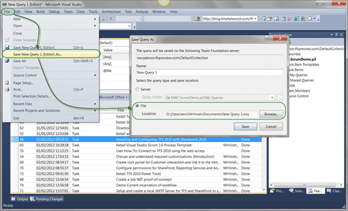
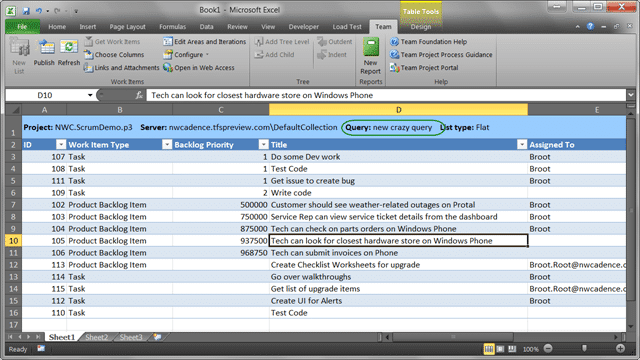
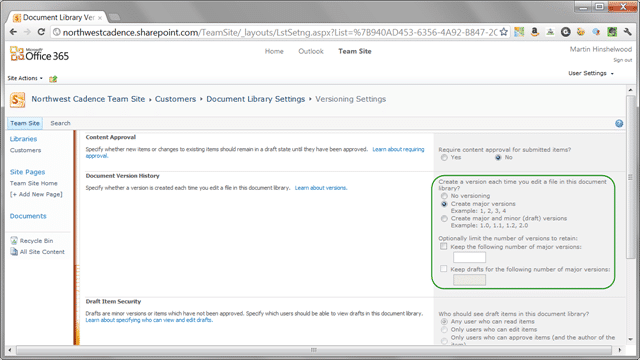

When you do a lot of editing in Excel you will sometimes make mistakes. If you are in the unfortunate situation that ended up publishing back changes to 100+ work items that you did not want to change then you can be in a world of hurt. I have a customer who has done just that and I thought some guidance on how to fix (mitigate) this situation will help everyone.

- **UPDATE 2012-02-26: There is some "undocumented features" described bellow that limit the ability to run time based queries in anything but the API (see WARNINGS below)**
- **UPDATE 2012-02-28: This solution no longer works with Visual Studio. You can only [run this when calling the API](http://msdn.microsoft.com/en-us/library/bb130306.aspx). This means that the ONLY way to back out changes made to Work Items is by writing code. So "Solution 2" will not want.**

My customer is understandably worried and wants to get this resolved, but lets get something out in the open first.

This will not be easy to fix and may require to be fixed manually. TFS is an auditable system and as such it, unlike many other tools, records the value of every field at every point in time. This means that our data in in there, it is just under the layer of crap that we dumped on top of it. the problem lies in that TFS does not know that it was crap, and it needs to keep the auditors happy, so there is no way to revert changes to work items.

This is the same for Source Code as well and what a “revert” really means is “get the version we want and overwrite the latest with that version”. In the Source Control world with atomic check-ins there is a tool for that, but in the work item world where all of the work items are being changed independently there is not.

### Problem 1

> There was an error when I published my spreadsheet to TFS forcing multiple field to be changed erroneously.  I need to effectively revert such changes (in items below).   Please provide me guidance as the most efficient way to do this.   For the most part, it looks like I changed all those fields that were in the query I used, making a disalignment of the TFS ID and the data therein.  Here are the fields from the spreadsheet that supposedly is causing this issue:
>
> - ID
> - Customer
> - Keywords
> - Title 1
> - Title 2
> - Title 3
> - State
> - Priority
> - Assigned To
> - Original Estimate
> - Completed Work
> - Iteration Path
> - Discipline
> - Work Item Type
>
> \-From my Customer

Now, I don’t know how much of a misalignment has occurred on the data, but I do see one thing that complicates things. You can see the “Title 1”, “Title 2” and “Title 3“. This allows Excel to understand hierarchical items and also allows you to add items as children of a parent.

If you add a row with the title in “Title 2” after a row that has its title in “Title 1” then that row will be a child of the preceding row. Convoluted I know, but it is the best that Excel can do. back to the problem. If these fields have been jumbled then we will have to manually check and fix every work item. We may have to find and fix all of the changes manually anyway, but it is far easier to fix fields than hierarchy.

I would also note that the state transitions have also been changed and as we can’t turn back the clock (we mentioned that pesky auditability above) then we will need to understand that **we have done irreparable damage to our historical reporting for the affected data**.

### Problem 2

> Secondly, in the process I seem to have overwritten some fields stopping me from finding items.  I assume this anyhow as I can no longer find them with my current queries.  My understanding is that TFS never deletes items…  Please advise.
>
> Here are the things that I know changed at that time and were ‘state changed’.  Others also changed at that time, but the changes were perhaps something other than a state change.
>
> <table border="0" cellspacing="0" cellpadding="0"><tbody><tr><td valign="top"><strong>Team Project Collection:</strong></td><td valign="top">tfs01.domain.comProducts</td></tr><tr><td valign="top"><strong>Query:</strong></td><td valign="top">Changed items 2-24 noon</td></tr></tbody></table>
>
> <table border="0" cellspacing="0" cellpadding="0"><tbody><tr><td valign="top"><strong>ID</strong><strong></strong></td><td valign="top"><strong>Title</strong><strong></strong></td><td valign="top"><strong>Work Item Type</strong><strong></strong></td><td valign="top"><strong>Assigned To</strong><strong></strong></td><td valign="top"><strong>State</strong><strong></strong></td><td valign="top"><strong>State Change Date</strong><strong></strong></td></tr><tr><td valign="top">19648</td><td valign="top">RPM 2 – title 1</td><td valign="top">Task</td><td valign="top">User 1</td><td valign="top">Closed</td><td valign="top">2/24/2012 11:41:15 AM</td></tr><tr><td valign="top">19650</td><td valign="top">Dev 6 – title 2</td><td valign="top">Task</td><td valign="top">User 2</td><td valign="top">Closed</td><td valign="top">2/24/2012 11:41:15 AM</td></tr><tr><td valign="top">21340</td><td valign="top">Dev 1 – title 3</td><td valign="top">Task</td><td valign="top">User 2</td><td valign="top">Active</td><td valign="top">2/24/2012 11:41:15 AM</td></tr><tr><td valign="top">21341</td><td valign="top">Dev 2 - title 4</td><td valign="top">Task</td><td valign="top">User 3</td><td valign="top">Active</td><td valign="top">2/24/2012 11:41:15 AM</td></tr><tr><td valign="top">21338</td><td valign="top">title 5</td><td valign="top">Deliverable</td><td valign="top">User 1</td><td valign="top">Closed</td><td valign="top">2/24/2012 11:54:34 AM</td></tr><tr><td valign="top">21339</td><td valign="top">Dev – title 6</td><td valign="top">Task</td><td valign="top">User 2</td><td valign="top">Closed</td><td valign="top">2/24/2012 12:04:06 PM</td></tr><tr><td valign="top">20051</td><td valign="top">title 7</td><td valign="top">Task</td><td valign="top">User 4</td><td valign="top">Closed</td><td valign="top">2/24/2012 12:04:06 PM</td></tr><tr><td valign="top">18787</td><td valign="top">title 8</td><td valign="top">Issue</td><td valign="top">User 1</td><td valign="top">Active</td><td valign="top">2/24/2012 12:04:06 PM</td></tr><tr><td valign="top">19633</td><td valign="top">Doc 2 – title 9</td><td valign="top">Task</td><td valign="top">User 5</td><td valign="top">Active</td><td valign="top">2/24/2012 12:04:06 PM</td></tr><tr><td valign="top">19634</td><td valign="top">Doc 1 – title 10</td><td valign="top">Task</td><td valign="top">User 5</td><td valign="top">Active</td><td valign="top">2/24/2012 12:04:06 PM</td></tr></tbody></table>
>
> \-From my Customer (but sanitised)

When the fields were changed it removes things from your queries that are relying on those fields. This is easy to solve, and looking at the state changed date does get us part of the way there.

### Solution 1 – Find those missing work items

This is the easiest thing to do. Father than looking at the “State Changed” field we can look at the “Changed Date” field instead. On top of that, if you have a system with many users making changes and your problem timeframe is quite large (the above data in Problem 2 is over 30 minutes) then we need to also add a “Changed By” coefficient that can be an individual user, or you can use “@Me” keyword to allow anyone to run this query.

1.  **Copy Original Query**

    Create a copy of the original query from “Problem 1” so we get the same columns. We will use this later to fix the data.

2.  **Add Changed By**

    Add the “Changed By” column and use the “Was Ever” operator in conjunction with the “@Me” keyword to your query

    Note: This will pick up all of the changes even if they have since been changed by someone else.

3.  **Change sort order**
    Add the “Changed Date” column and order by Descending

        Note: This will make sure that all of the most recent changes are at the top

        

    { .post-img }
    **Figure: Add the first two fields to find the right data**

4.  **Add date range**
    Add a clause to the “Changed Date”  field to show changes between “2/24/2012 11:30:00 AM” and “2/24/2012 12:10:00 PM”

        Note: If you know the date/time range of the erroneous changes then you can add a filter to reduce your data set, of you don’t you can use the work item history to find it. Just look on the history tab to see when the changes in question occurred.

        

    { .post-img }
    **Figure: You will see all of the history values**

You can use this to figure out the scope of the carnage. You should see both “Link” changes (i.e. changes to the hierarchy) and field changes in the list.

You should now be able to see all of the current values of the data with the same columns as wen the problem occurred, but it will now include all of the data.

At this point we have all of the information that we need to fix all of the data one work item at a time. This however would be a little time consuming depending on the number of changes that have been made…

…hold on… I have an idea…

### Solution 2 – Bulk fix on the data

There is a little known and little used feature of Work Item Query Language (WIQL) that may be able to help us out called “As of” querying.

_WARNING: This will NOT fix any hierarchy issues as it is not supported on a “tree query”. They will need to be fixed manually!_

Lets look at the general query syntax.

> **select** **from** WorkItems \[**where** \] \[**order by** \] \[**asof**\]

You can see the “asof” addition at the end of the options, well we need to add “asof ‘2/24/2012 11:30:00 AM’” to the end of the query so we can get the Excel sheet to show us what we want our fields to be.

_**WARNING: TFS does not understand time as part of a query as it runs them in [some thing called "date precision" mode](http://social.msdn.microsoft.com/forums/en-US/tfsworkitemtracking/thread/2ab986ac-fbf6-4b61-8221-ec336c7bff4a/). This sucks and is not documented well. You will therefore only be able to enter the previous days date and see the data asof the previous day.**_

But we have a little problem. You can’t add as of to a query in Visual Studio, so we need to edit it manually.

1.  **Save the new query to disk**
    Open the query in edit mode and select “**File | Save \[query\] As…**”

        

    { .post-img }
    **Figure: Save the query locally**

2.  **Open the Query in notepad**
    Right click on the saved query and “**Open with… | Select notepad | Un-tick the Always open | Ok**”

        

    { .post-img }
    **Figure: Open the query in notepad**

3.  **Edit the query**
    Once you have the query open, find the end and add “asof ‘2/24/2012 11:30:00 AM’”. the end of the query is “” so just add it just before that.

        

    { .post-img }
    **Figure: add the Asof to the end of the query and save**

4.  **Open the Query in Visual Studio**
    
    { .post-img }
    **Figure: New Query is a window into the past**
    Note: You will see things in here that are not from the past. It will show visible field data for all work items as they were at that point in time. You may see stuff that was added after that matched the criteria and obviously it cant go back in time as it di not exist. Think of it as an anti-paradox check so you can’t edit a work item before it even existed.
5.  **Save the query to your My Queries**
    
    { .post-img }
    **Figure: Save the query to your My Queries  
     **
6.  **Open the query in Excel**
    Open both your new query that shows the old values and the original query that shows the current values in Excel. Make sure that you have the same columns and the same number of rows. If you don’t then you will need to tweak both queries to show the same data.

        

    { .post-img }
    **Figure: Excel now shows your old data  
     **

7.  **Order by ID**
    Order both of your Excel sheets by the Work Item ID so that they are in the same order.

        

    { .post-img }
    **Figure: You MUST have the same order and columns**

8.  **Past “old” over “new” data**
    Copy the “Old” data from the “new” query over the top of the “new” data from the “old” query and then thoroughly check the data to make sure that it is what you expect.

        

    { .post-img }
    **Figure: Copy the data you want and past over the data you don't**

9.  **Check your data**
10. **Check it again!**
11. **Make really sure and the Publish back to TFS**
    
    { .post-img }
    **Figure: Overwrite the new data with the old in TFS**

If all has gone well then you are back to the data that you wanted. However, please remember that we did not fix any hierarchy so if you overwrote that while editing with a “tree query” then you will need to fix that manually.

### Solution 3 – How do I make sure that this never happens again

Well, you can’t… that kind of how databases work. if you bulk edit then really make sure of your changes. However if you want to have a little bit of protection you can save your Excel documents to SharePoint and open and edit them from there. You can enable versioning on the Document library and you would have been able to just open the old version of the Excel sheet and overwrite the data in a couple of minutes.

1.  **Open your document library settings**
    Once you have it open select “Library | Library Settings” coz we need to enable versioning.
    
    { .post-img }
    **Figure: Enabling is easy  
     **
2.  **Select the “versioning Settings”**
    
    { .post-img }
    **Figure: Versioning is a fantastic feature  
     **
3.  **Setup versioning**
    I would suggest to solve this issue we only really need one or two versions back, but you may want more for posterity

        

    { .post-img }
    **Figure: Setup versioning to be a little safer**

If you now save your Excel documents back to SharePoint you will be able to easily get back to older version of your data for whatever reasons you want.

### Conclusion

This is I guess of of the dangers of bulk editing in Excel and I really only use Excel for build editing of work items. As such I don’t get complacent and I always check multiple times before saving back when changing more then one or two fields at a time.

Oh, and I never use “Tree View”, and I have even more reason not to now.

I hope this helps my customer and others who might end up in the same situation.
