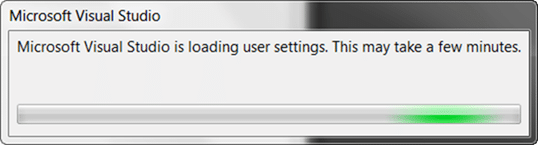
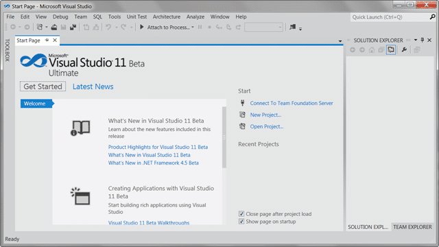

With the launch of Visual Studio 11 beta and that it is [fully supported in production](http://blog.nwcadence.com/go-live-with-visual-studio-11-beta-3/) I wanted to update my laptop with the bits. I have a presentation on Friday of [what's new in Visual Studio 11](http://blog.hinshelwood.com/events/) and I will show some of the new features there.

  
{ .post-img }
**Figure: The new installer is clean**

There has been some comment on the colours, or lack there of, in the new UI, but to be honest it works. It may be a little drab for the first wee while, but once you get used to it you begin to love it. It a user interface for every day use, not occasional use.

  
{ .post-img }
**Figure: Installation is painless with no configuration**

lets face it, you don’t need to configure the install and now that the team has paired it down to only 1.6GB we can have it all and not worry about space.

  
{ .post-img }
**Figure: All components get on there but it may take a while**

It took a little while, perhaps 30 minutes.

  
{ .post-img }
**Figure: Shucks, another re-boot!**

I don’t know why, but it did not have any extra bits to do so hopefully they will be able to install without a reboot if you already have .NET 4.5 as I did.

  
{ .post-img }
Figure: Pick your layout

You get a bunch of first run layouts with Visual Studio 11 and you even get a “code only” minimal one for web development. But I like the “Visual Basic” layout. Note that this is not picking a language it is just picking a layout of Visual Studio IDE. You can customise everything later.

  
{ .post-img }
**Figure: Sigh, and another progress bar**

While Visual Studio configures itself you need to wait, but only for a few minutes…and then…

  
{ .post-img }
**Figure: The new UI**

I really like the clean new UI. Colour is now for accent and not just for splashing around the place (although that is a running joke at the MVP Summit) and almost all things that have colour you can click!

  
{ .post-img }
**Figure: Connecting to Team Foundation Server**

I LOVE the new team Explorer, but it will take a little getting used to…

Remember that there is [Go-Live for Visual Studio 11](http://blog.nwcadence.com/go-live-with-visual-studio-11-beta-3/)!

Go on… be a kid again!
