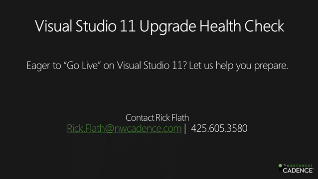

With the launch of [Visual Studio 11 Team Foundation Server Beta](http://blog.hinshelwood.com/announcing-visual-studio-11-beta-will-launch-on-february-29th/) and the Go-Live licencing model you can go into production now. But what if you are not quite ready?

  
{ .post-img }
**Figure: Go-Live with Visual Studio 11 with our help**

With the success of the [Scrum Health Check](http://blog.hinshelwood.com/are-you-doing-scrum-find-out-with-a-scrum-health-check/) we are expanding the family of Health Check offerings. We will come in and help your teams understand what they need to do to move to both Visual Studio 11 & Visual Studio 11 Team Foundation Server.

This will be a short half day  engagement to get you ready. So get yours now, wither you are moving to 11 now or just wan to make sure that you have not done something that will be a problem later.

We can help you make sure that you will be able to:

- Upgrade your server from TFS 2010 to TFS 11
- Enable new features in your Team Projects
- Take advantage of Team support
- e.t.c.

Let us help you get the most out of the tools…
