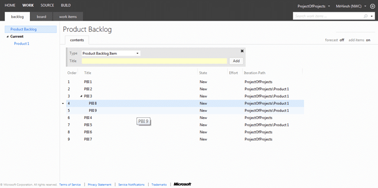
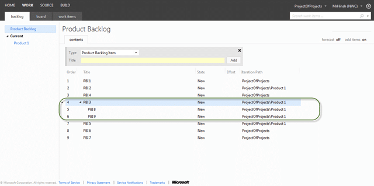
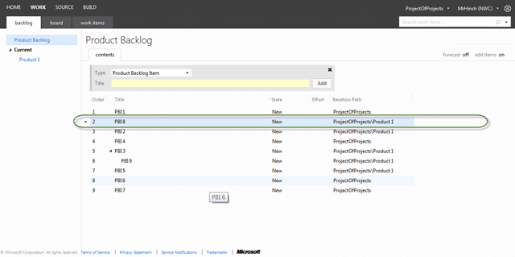
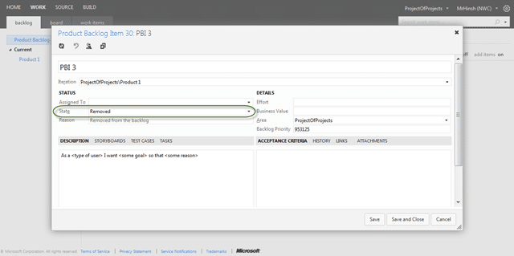
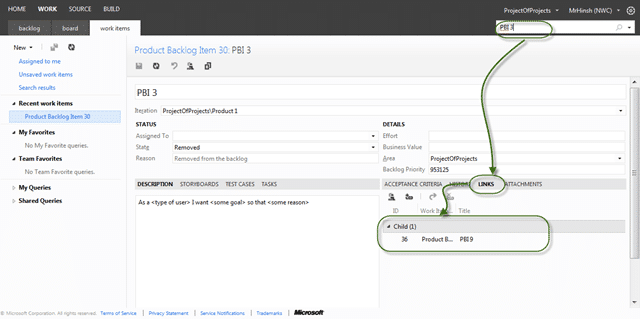

At the MVP Summit I was appalled by the number of people who asked questions about new features for supporting hierarchical _tasks_! I shared a disgusted look with [Peter Provost](https://www.linkedin.com/in/peterprovost/) and we had a quick (and I mean really quick) conversation that resulted in this post. it really comes down to one thing:

> You can't stack rank hierarchical work items?

If you want to continue to be competitive in the world of modern software development you need to be able to effectively order (stack rank) a list of well understood items. This could be at the PBI (or Product Backlog) level or it could be at the Task (or Sprint Backlog) level but I need to be able to do that ordering by moving things about... how do I do that with a tree?

  
{ .post-img }
**Figure: How do you order a tree?**

No really! Lets look at a couple of specific questions:

- **What do you expect to happen when you reorder “PBI 3” above?**
  
  { .post-img }
  **Figure: If you said they all move then you get a prize**

This has to be the expected out come because of that pesky parent / child relationship.

- **What would you expect to happen when you drag “PBI 8” to be between “PBI 1”  and “PBI 2”?**
  
  { .post-img }
  **Figure: Was that what you expected?  
   **  
   If you said that it would move to the right location then you also get a prise, but what do you think happened to the parent relationship with “PBI 3”? Thats right, it was removed as that item can no longer exist as a child or “PBI 3”…
  _Note: You can keep the relationship by creating it as a “related” relationship, or you could add a custom one._

So what is the expected behaviour when you discover a PBI that is too large (for whatever reason) and you want to break it down into two smaller ones. Once you have broken a PBI down into two smaller ones that encompass all of the things we need to make the larger one what purpous does it solve… have we not just replaced it? Well then, lets remove it.

  
{ .post-img }
**Figure:  Good example, Mark the parent story as removed**
{ .post-img }

This only makes sense as I have all of the relevant information in the two new PBI's.

  
{ .post-img }
**Figure: Now I have no “PBI 3”**

If I look at the history for that “removed” PBI I can, and I will, be able to see all of the history including that the links to the children still exist. This means that you can still query and see what those relationships were without them interfering with the backlog any more.

  
{ .post-img }
**Figure: I can still have my tractability**

Let me jus say that I am not suggesting that you do not use linking, there are many links that are and should be available. Which of those links are good to use,  provide value and make sense  for both the team and your product owners:

1.  **Tasks with a Parent / Child relationship with a PBI  
     **  
     You need for your team to be able to keep track of the work that they are doing to achieve a single PBI and this is that. There are other options, but this is the best one.
    
    { .post-img }
    **Figure:  Good example, You can have Task as a child of  
    { .post-img }
    **  
       
    { .post-img }
    **Figure:  Bad example, do not use PBI’s as children of other PBI’s**
    { .post-img }

- **Test Cases with a Tests / Tested By relationship with a PBI**

      You want to be able to trace from code to requirements to bugs all with the relevant tests that make sure that we built the correct thing.

      

  { .post-img }
  **Figure:  Good example, You can show what your PBI is Tested By**
  { .post-img }

- **Bugs that have a Tests / Tested By**
  I would expect this to be a no-brainer as you can’t have a bug unless you can prove that it exists. Bugs have “steps to reproduce2 after all and in the post MTM world this is the result of a failing Test Case.

      

  { .post-img }
  **Figure:  Good example, Bugs have test Cases too**
  { .post-img }

I a using the Visual Studio Scrum 2.0 template (default) so while you can make things more complicated, this is about as complex and the expected common cause use cases go with Work Items. There are other artefacts links to support things like Test Results, Code Reviews, Feedback Results and others, but they are tool bits not really that user configurable.

  
{ .post-img }
**Figure:  Bad example, nesting Work Items is very unwieldy**
{ .post-img }

I am always interested in finding out what other scenarios there are out there:

Do you agree?

What reasons do you have for using hierarchy's?
