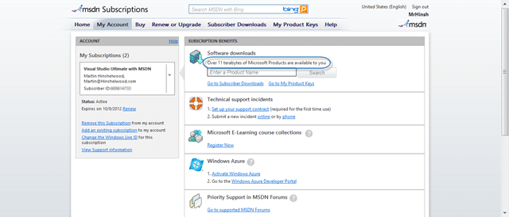
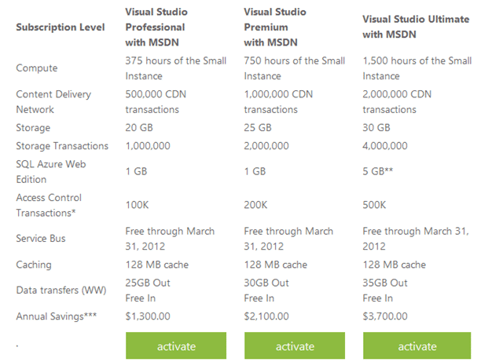

Are you a professional developer? Do you get an MSDN from your organisation? Did you know that you can use it at home on both commercial and open source projects of your own!

> MSDN subscriptions are licensed on a **per-user basis**.  One person can use the software to design, develop, test, or demonstrate his or her programs on **any number of devices**.  Each person who uses the software this way needs a license.  
> \-[MSDN Licencing](http://msdn.microsoft.com/en-us/subscriptions/cc150618.aspx)

That's right, the MSDN that you company bought you entitles you to run Windows, Office & Visual Studio in production at home. Its a licence for YOU and not just for them.

  
{ .post-img }
**Figure: Over 11 terabytes of data on MSDN**

I was talking to [Mark Groves](https://twitter.com/mgroves84) at the MVP Summit and I had a double-take when he mentioned that most developers don’t know that you get a take-home licence with you MSDN. I was surprise because I have know and taken advantage of this for the better part of 8 years, and I was even more surprised when he mentioned that [Scott Hanselman](http://www.hanselman.com/blog/) was also unaware of this. This is an awesome benefit to being a Microsoft developer and I can’t believe that it is not more well known.

  
{ .post-img }
**Figure: You get Azure time as well**

On top of that you get a number of other benefits. You get the Azure time above and you also get the ability to run an almost limitless number of development boxes as well. Basically for a developer with MSDN you can almost run “whatever” at home and be fully licenced and I have never encountered anyone who has maxed out their instances.

The thing that I tend to find that is not done is the assignment of MSDN licences that a company has bough to the individuals that are using it. What companies really don’t understand is that no matter how many MSDN licences that they own, they are not licenced to use any of it unless they are assigned to individual Live ID’s.

> MSDN subscriptions are **only offered per individual**, there are no “team” subscriptions or sharing of subscription benefits.  
> \-[MSDN Licencing](http://msdn.microsoft.com/en-us/subscriptions/cc150618.aspx)

In most companies that I do work for the operations team hoards the MSDN’s so those pesky developers can’t download on the network. But this, my dear ops guys means that you are using software illegally within your company, so get over it and assign those  MSDN subscription to those that they were bought for!

Did you EVER have an MSDN? Another of those little known things about an MSDN is that it is perpetual. That is that you can use forever the software that became available when you received your MSDN.

> In most cases, MSDN subscriptions come with **“perpetual” use rights**—the ability to continue using the software after the subscription has expired, even though the ability to download software and product keys ends when the subscription expires.  
> \-[MSDN Licencing](http://msdn.microsoft.com/en-us/subscriptions/cc150618.aspx)

You just don’t get anything new 
{ .post-img }

And just in case you were worries about buying licences for your business acceptance testing (BAT) then:

> When software development projects are nearing completion, an MSDN subscription license also **allows your end users to access the software to perform acceptance tests** on your programs.  
> \-[MSDN Licencing](http://msdn.microsoft.com/en-us/subscriptions/cc150618.aspx)

MSDN has one of the most flexible licencing terms in the industry and you should be using it to its full potential and not leaving it on a shelf! It will make some of your developers more valuable if they can exercise the tools in their spare time and the others just will not take advantage of it.
