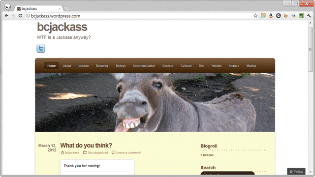
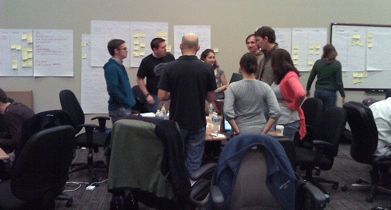

This week I have been filling in for [David Starr](http://elegantcode.com/author/dstarr/) at a customer and it has been an experience. David had a family emergency and tapped me of all people to take the gig from him. So not only did [Northwest Cadence](http://blog.hinshelwood.com) have to rearrange my schedule to make sure that I could do this, but I had to brave Salt Lake City and Utah…

  
{ .post-img }
**Figure: Warm sunny Park City, Utah**

Little did I realise that the Big Yin (Mr Starr) had a few surprises for me. The first surprise was that this was a team of Java developers and that I would be leading an [Agile Engineering Practices Workshop](http://elegantcode.com/author/dstarr/ "Agile Engineering Practices Workshop") as part of the engagement. But that was not all…no, David left the best one until I was well and truly committed…

I knew that I would have to spin up on the [Professional Scrum Foundations course](http://blog.hinshelwood.com/training/ "Professional Scrum Foundations (PSF)") but that was just a mater of course, but the real sledge hammer came in the form of 68 students… um…no, that is not a type, it was 68 students over two runs of the two day course. Phew, but this is going to be fun…

  
{ .post-img }
**Figure: 32 people make a crowded room**

I had not taught the [Professional Scrum Foundations (PSF)](http://blog.hinshelwood.com/training/ "Professional Scrum Foundations (PSF)") course from Scrum.org before but David did a walkthrough at the last Face-2-Face and I had spun up on the course before. I was really excited as I think that this is a fantastic course. I had only the beginnings of an understanding of how good this course is before I taught it, but now this is the [one course I would recommend](http://blog.hinshelwood.com/training/) for any agile or Scrum adoption.

It is by far the most well thought out course that it has been my pleasure to teach. It may just have been the awesome students, but I think that David has excelled himself here and whomever gets custodianship of the course next has large boots to fill.

On of the main goals of this course is to give teams practical knowledge of what they can achieve when they work as a team using Scrum. Thus there is a backlog of work that we actually ask students to work though and produce product by the end.

They initially don’t think that they can build anything in 30 minutes, but as they go through the sprints they suddenly find that not only can they build something in 30 minutes, but that if they work together they can do anything. I don’t tell them anything about “how” I want them to complete the backlog and I leave them to figure it out.

  
{ .post-img }
**Figure: What can you build in four 30 minute Sprints?**

At first all but one team was building a home grown solution and finding difficulty in dealing with the bottleneck of having one or two programmers to a team. By the end of the second Sprint all but one team were using Wordpress… Why?

**The power of the Review & Retrospective!**

Some of the power in these events is the understanding and cross pollination of good ideas. If you hear about a good experience that another team has encountered then you are likely to at least consider replicating it. Conversely, if you hear about a Sprint peppered by pain and suffering you are likely to want to know what not to try and do!

  
{ .post-img }
**Figure: Don’t be a Jackass**

So, don’t be a jackass and learn not just from your own mistakes, but the shared mistakes of your organisation.

All in I think I had 13 teams so you can imagine the differences of skills and knowledge that were involved. Some teams has Scrum boards.

  
{ .post-img }
**Figure: The wonderful board of Team Jack@$$**

Some teams stood up during their Daily Scrum.

  
{ .post-img }
**Figure: One team decided to Stand up during the Daily Scrum**

Other teams were always asking the Product Owner for more information and some Product Owners spent all of their time grooming the backlog. Only one team had both.

  
{ .post-img }
**Figure: Ask the Oracle…ehm… Product Owner**

At the end of the course, for the last sprint I had two curve balls to throw. The first was an integration exercise that really makes them sweat, the other was to introduce some common team dysfunctions. During Lunch I solicited a few moles to play the roll of the “hero” or the “absentee product owner” among other. All of these dysfunctions were not only noticed, but we spent some time looking at how this impacted the teams and what they did about it. All of them self-organised around it and non of them failed to deliver.

  
{ .post-img }
**Figure: Working together to achieve the goals**

I thoroughly enjoyed my time in Utah and I look forward to going back and helping these fine folks out again. It was an eye-opening experience teaching so many, and I cheated a little for the TDD demonstration of the Engineering practices workshop and I did all of the demos in c#. While it felt a little bit like cheating, I did have 7 or 8 people following along, even one in Perl.

  
{ .post-img }
**Figure: Utah was nice, but it is good to be home**

Well it is so long to Utah, another state ticked of my list, and I hope to be back soon…
