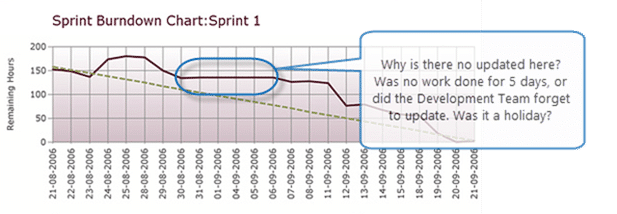
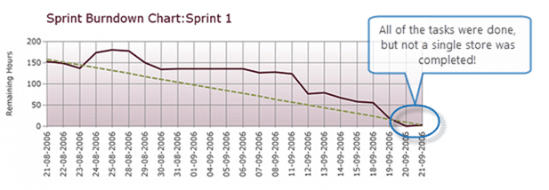
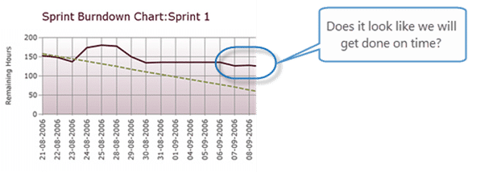

I was recently in [Park City, Utah to teach](http://blog.hinshelwood.com/professional-scrum-foundations-in-salt-lake-city-utah/) the [Professional Scrum Foundations](http://blog.hinshelwood.com/training/) course and i just got an email from one of the students. As I want to help everyone I will answer here:

> If I recall from our training, you suggested teams could burn down their sprints using points or hours.  In your view is there a “better” answer in your opinion (pros/cons)?  
> \-Pete

The first thing that we want to do is define explicitly what a burndown represents and the reason that we are creating one; i.e. what actions might we want to take. Only then can we decide what we want to measure and which is best for us.

## What is a burndown?

During Sprint Planning the Development Team forecast what work it thinks it could do (selected a number of PBI's from the Product Backlog) and created a Plan to complete them. This is known as the Sprint Backlog and it should have some measure of Remaining Work that allows the Development Team to see what they have left to do. As the Sprint Backlog (the Plan to complete the forecast PBI's) evolves as more is known over the course of the Sprint the Remaining Work can vary and we need a way of visualizing trends so that the Development Team can take the necessary action.

> A burndown is a visual representation of the Remaining Work in the Sprint Backlog as it varies over time.

## What might we find?

So in order to identify actions we need to look at some things we might identify as a problem.

- **We get a flat burndown**  
     
  { .post-img }
  **Figure: What does a flat burndown mean?**
  This might be because we just forgot, or it might be representative of a tooling issue or even a team issue that exists.

      - Action: Update our Remaining Work

      - Action: Get better at filling it out in time for the Daily Scrum

      - Action: Raise an impediment to the Scrum Master to improve the tools

      - Action: Raise an impediment to the Scrum Master to help the Development Team improve

- **We get a perfect burndown, but delivered nothing**  
     
  { .post-img }
  **Figure: All of the Tasks were complete**
  This is likely to be because we have too much work in progress at any one time. We have 10 Stories in progress and get to the end of the Sprint with all of our Stories 90% complete.

      - Action: Raise an impediment with the Scrum Master for review at the Retrospective

      - Action: Limit work in progress

          _"Given an ordered list of user stories, **you’re either working on the top item, or else you’d better have a good reason not to**. You don’t proceed with another story until your current story is done."
          _\-[The Task Burn Down Trap: everything finished, nothing done](http://blog.xebia.com/2008/09/19/the-task-burn-down-trap-everything-finished-nothing-done/)

- We will not get done on time  
     
  { .post-img }
  **Figure: When will we be done?**
  This can be because we do not know everything at the start of the Sprint. Can a lawyer tell you exactly how long your case will take and what it will cost? No, so why would you expect something like software to?

      - Action: Speak to the Product Owner and decide what can be removed from the Sprint Backlog to still allow the team to be done.

These are just some ideas of what might be found and are not indicative of all possible options and there are other lists of [Bad Smells of the Sprint Backlog](http://scrumcrazy.wordpress.com/2010/10/07/bad-smells-of-the-sprint-backlog/) that you can find online.

Let me reiterate, that along with the Three Questions that are part of the Daily Scrum a Burndown is just a tool to help elicit communication and understanding within the Development Team. It is not a whip for a Project Manager to crack.

## What burndown is right?

So to answer the question of wither to burn down Story Points, Hours or even Test Cases I would argue that we need them all! I want to see if my tasks are on track, but I also want to make sure that I am delivering Stories as well.

**The Hours Burndown**

This burndown is good for helping the Development Team identify how much work is remaining in the Sprint and if they are likely to still be able to meet their Sprint Goal.

**The Story Point Burndown**

Good for allowing the Development Team to see if they are actually getting things Done, verses completing all of the Tasks.

**The Acceptance Tests Burndown**

Also a good indicator of what is going on from a delivery perspective. If you are on track for Hours, and Story Points but you have only completed 50% of your Acceptance Tests and you have 2 days left on your Sprint, what does that tell you about your quality.

## Conclusion

You will need to experiment with your Scrum Teams to see which burndown is right for you, but I would suggest that you want to be able to plot all of them so that your Development Team’s have all of the relevant information for their Daily Scrum to  help them identify any issues as early as possible.
