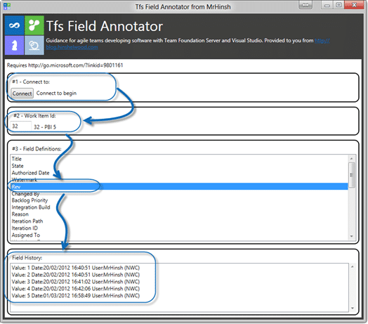
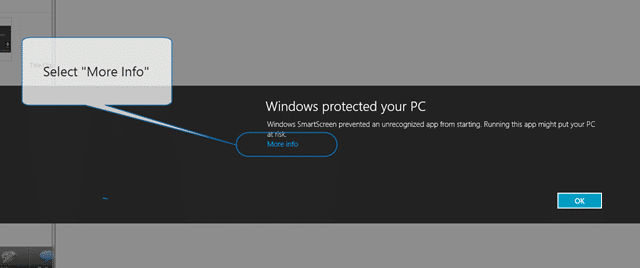

Do you make lots of edits to your TFS Work Items? Do you ever look at a field in the UI and think…

> last time I looked that was a 4? Why is it a 6? Who changed it?

if you have, then the TFS Field Annotate is for you. Connect to TFS, select a Work Item and see the history on a single field.

- Update 2013-01-16 - Now with added [James Tupper](http://blog.nwcadence.com/author/jamestupper/) features. James updated my code to include the ability to select multiple fields from TFS.

---

{ .post-img }

The TFS Field Annotator shows you just the changes to a particular field. So like the Source Code Annotate it gives you line level tractability with ease.

### Download TFS Field Annotator

The following prerequisites are required:

- Visual Studio 2015 (any version)
- .NET 4.5

If these components are already installed, you can [launch](https://nkdalm.blob.core.windows.net/clickonce/TfsWitAnnotateField/TfsWitAnnotateField.UI.application) the application now. Otherwise, click install below to install the prerequisites and run the application.

#### [install](https://nkdalm.blob.core.windows.net/clickonce/TfsWitAnnotateField/setup.exe) or [launch via clickonce](https://nkdalm.blob.core.windows.net/clickonce/TfsWitAnnotateField/TfsWitAnnotateField.UI.application)

### How it works

Once you have connected to Your TFS 2010 or TFS 11 Collection you enter a Work Item Id to load all of the available fields and

  
{ .post-img }
**Figure: See who changed what more easily**

### Troubleshooting

If you are using Windows 8 Consumer Preview you will not get an automatic launch of the application due to an extra security check for applications that come from the internet.

1.  Click or Press “Start” and Scroll all the way to the right
2.  Select the TFS Field Annotator
3.  When the security dialog pops up click “More Info”
        
    { .post-img }
    **Figure: Select More Info  
     **
4.  Click “Run anyway” to launch the application and add it to the safe list
        
    { .post-img }
    Figure: Just run it anyway… no sweat…
5.  Done
