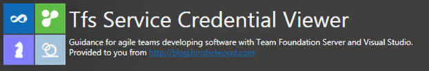

If you want to connect to the Team Foundation Service (TFS Preview) API you are going to need some credentials in order to connect. That's right, where do you expect to store your Live ID for connecting? Do you expect to add it to the windows credentials store? What about having the user manually add it? Both these options suck… so introducing the TFS Service Credential Viewer.

{ .post-img }

The TFS Service Credential Viewer connects to your Team Foundation Service account on [http://tfspreview.com](http://tfspreview.com) and using your credentials it retrieves credentials that you can use for an automated service to connect and authenticate correctly.

### Download TFS Service Credential Viewer

The following prerequisites are required:

- Team Explorer 2012 Visual Studio 11 (any version)
- .NET 4.5

If these components are already installed, you can [launch](http://nkdagility.com/downloads/tools/tfs2012/TfsServiceCredentialViewer/TfsServiceCredentialsUI.application) the application now. Otherwise, click install below to install the prerequisites and run the application.

#### [install](http://nkdagility.com/downloads/tools/tfs2012/TfsServiceCredentialViewer/setup.exe) or [launch via clickonce](http://nkdagility.com/downloads/tools/tfs2012/TfsServiceCredentialViewer/TfsServiceCredentialsUI.application)

### How it works

Once you have authenticated as a TFS Collection Administrator to your hosted TFS Collection we use the Access Control Service to provision a service identity that you can use for unattended connections to Team Foundation Service (TFS Preview).

  
{ .post-img }
**Figure: A quick #1, #2 to get your credentials**

http://youtu.be/Fkn6V0\_zz28  
**Video: How to get your credentials**

### Troubleshooting

If you are using Windows 8 Consumer Preview you will not get an automatic launch of the application due to an extra security check for applications that come from the internet.

1.  Click or Press “Start” and Scroll all the way to the right
2.  Select the TFS Service Credential Viewer
3.  When the security dialog pops up click “More Info”
    
    { .post-img }
    **Figure: Select More Info  
     **
4.  Click “Run anyway” to launch the application and add it to the safe list
    
    { .post-img }
    Figure;
5.  Done

If you encounter an exception when clicking "Connect" the most likely cause if that you do not have Team Explorer 2012 installed
