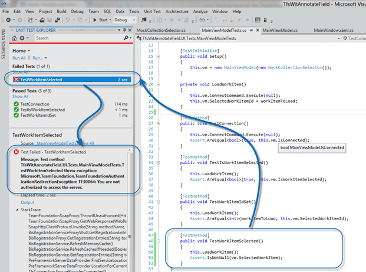

I have been working a lot recently with the new Team Foundation Service (TFS Preview) that Microsoft is providing in Azure. I was building an application called TFS Field Annotate that allows you to spelunk a fields changes. One of the problems I ran into is how to Unit Test this. I have been doing a lot of work in Test Driven Development (TDD) recently and after running a Bowling Kata (thanks David Starr) for the last month I don’t want to work any other way.

**Updated 2012-04-02 - [Patrick Carnahan](http://blogs.msdn.com/b/patcarna/) fixed my code below to work with TFS 11 on both local and build server environments.**

This brings us back to the purpose here. Lets take a standard API call to TFS:

```
TfsTeamProjectCollection collection =new TfsTeamProjectCollection(new Uri("https://mrhinsh.tfspreview.com/DefaultCollection"));
collection.Authenticate();

```

**Figure: Simply connect to TFS**

Before the cloud we had 3 options for authentication:

1. Run the code/application as a user with permission
2. Add the credentials to the credential store
3. Pass in explicit credentials to use

While this was just fine, what do you do in the cloud world where authentication was done using Windows Live ID. What do you do if you want to run a service, like the TFS Integration Platform, unattended? Well, up until now we had to log onto that unattended server and re-jig our Live credentials every two days when it expired.

Now while this is OK, but not ideal, for a while what about things like Build Servers running locally and connecting to the cloud or even just something as simple as writing Unit Tests that test an application you are building against TFS Service.

This happened to me the other day while I was working on the [TFS Field Annotator](http://blog.hinshelwood.com/tfs-field-annotator/) that I was building.  I was trying to add some Unit Tests and I was running into authentication issues.

note: I know I am supped to ad my Tests first, but I am not quire there yet.

note: I am also aware that these are “Integration Tests” and not pure “Unit Test”

The authentication issues stemmed from the code above in the automated running scenario and resulted in and error…

[](http://blog.hinshelwood.com/files/2012/04/image.png)  
{ .post-img }
**Figure: TF30064: You are not authorized to access the server**

So, why do I get this error when I am in a Unit Test and not connecting through the custom UI.  Well, in the UI the user is specifically selecting the Collection using the TeamProjectPicker dialog. This dialog does all of the Live ID authentication for us so if the user ticks the “remember me” box they don’t have to log in next time.

[](http://blog.hinshelwood.com/files/2012/04/SNAGHTML1718e02a.png)  
{ .post-img }
**Figure: the UI authenticated us**

That bring us back to the problem at hand. The UI is not involved with the Unit Tests. In fact I have abstracted the logic for the TeamProjectPicker into a collection selector interface so that I can run the Unit Tests without having the UI popup ever time I run them…

```
namespace TfsWitAnnotateField.UI.Infra
{
    public interface ICollectionSelector
    {
        TfsTeamProjectCollection SelectCollection();
    }
}

```

**Figure: An Interface to abstract the UI work**

Having this interface lets me have two implementation of a concrete class.

1. CollectionSelector – With the call to TeamProjectPicker UI

   ```
   namespace TfsWitAnnotateField.UI.Infra
   {
       class CollectionSelector : ICollectionSelector
       {
           public TfsTeamProjectCollection SelectCollection()
           {
               using (TeamProjectPicker tpp = new TeamProjectPicker(TeamProjectPickerMode.NoProject, false))
               {
                   DialogResult result = tpp.ShowDialog();
                   if (result == DialogResult.OK)
                   {
                       return tpp.SelectedTeamProjectCollection;
                   }
                   return null;
               }
           }
       }
   }
   ```

   **Figure: Calling the TeamProjectPicker  
   **

2. MockCollectionSelector – With an explicit Collection to tests against and no UI

   ```
   namespace TfsWitAnnotateField.UI.Tests
   {
       class MockCollectionSelector : ICollectionSelector
       {
           public TfsTeamProjectCollection SelectCollection()
           {
               return new TfsTeamProjectCollection(new Uri("https://mrhinsh.tfspreview.com/"));
           }
       }
   }

   ```

   **Figure: Calling TfsTeamProjectCollection explicitly**

Now here in #2 we have a problem. How do we authenticate?

The only way to do so up until now was to save your Live ID credentials in the Windows Credential Store, but they would only last for 2 days before they expired.

So what happens on the build server?

I would have to log onto the build serve every 2 days and reset the credentials, and my only notification would be that my tests started failing, and thus my builds. Not a good thing.

In a self-hosted TFS instance I can just create some AD credentials and hard code (or put them in a config) them. But in the Hosted Build Service world I have no such option. I don’t even know where my build server is, let alone logging onto it. So the lovely folks on the product team, encountering the same problem themselves, came up with a solution.

You can connect to your TFS Preview instance as an Administrator and load a set of service credentials that you can use to connect unattended.

```
IAccessControlService acs = _SelectedTeamProjectCollection.GetService();
ServiceIdentity defaultServiceIdentity = acs.ProvisionServiceIdentity();
// Save these values off to use for non-interactive login
Username = defaultServiceIdentity.IdentityInfo.Name;
Password = defaultServiceIdentity.IdentityInfo.Password;

```

**Figure: Retrieving a non-interactive login for your TFS Preview service**

Now, it would be a pain in the ass to have to spin up this code all of the time, so I created the [TFS Service Credential Viewer](http://blog.hinshelwood.com/tfs-service-credential-viewer/) that will do the heavy lifting for you.

[](http://blog.hinshelwood.com/files/2012/04/SNAGHTML172e4063.png)  
{ .post-img }
**Figure: We can load out credentials from the remote instance**

Now I can copy and past them into my MockCollectionSelector to allow it to connect unattended.

```
namespace TfsWitAnnotateField.UI.Tests
{
    class MockCollectionSelector : ICollectionSelector
    {
        public TfsTeamProjectCollection SelectCollection()
        {
            // This is constructed with the userName and password from the previous code block
            ServiceIdentityCredentialsProvider provider = new ServiceIdentityCredentialsProvider("Account Service (XXXXXX)", "XXXXXXXXXXXXXXXXXXXXXXXXXXXXXXXX");
            return new TfsTeamProjectCollection(new Uri("https://mrhinsh.tfspreview.com/DefaultCollection"), provider);
        }
    }
}

```

**Figure: CollectionSelector for TFS 2010**

```
namespace TfsWitAnnotateField.UI.Tests
{
    class MockCollectionSelector : ICollectionSelector
    {
        public TfsTeamProjectCollection SelectCollection()
        {
            return new TfsTeamProjectCollection(new Uri("https://mrhinsh.tfspreview.com/"), new TfsClientCredentials(new SimpleWebTokenCredential("", "")));
        }
    }
}

```

**Figure: CollectionSelector for TFS 2012**

Now that I have my credentials I can run my tests again…

[](http://blog.hinshelwood.com/files/2012/04/image1.png)  
{ .post-img }
**Figure: Green, all of my tests are now passing**

Woot, they all pass… now to write some more.

### Conclusion

If you are using a Behaviour Driven Development (BDD) framework to tests your scenarios (SpecFlow works well with Visual Studio 2012) then you will need to load your service credentials so that we can test without having a user enter credentials…
