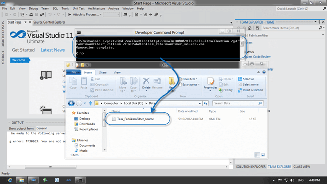
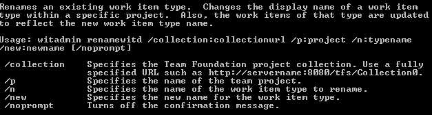
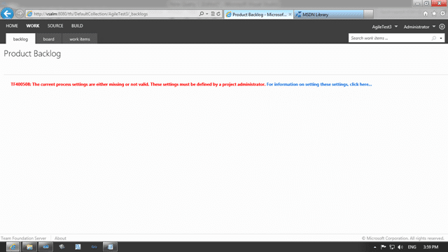

A little while ago I was looking into the best options for [upgrading a process template but still keep your data intact](http://blog.hinshelwood.com/do-you-know-how-to-upgrade-a-process-template-but-still-keep-your-data-intact/), but there is still a little bit of ambiguity on how that is achieved. Although the original list had only #6 options lets look at the #7 option…

- Update 2013-06-18 [Neno](www.tfsblog.com/) pointed out that the code looks all squirrelly. Unfortunately I have tried a bunch of times to fix this one with no result. To see the code in readable form you can double-click the code blocks.

In option #7 we basically overwrite our old work items with the new ones. There is a little jiggery-pockery to get everything to align, but it allows us to keep the continuity of both history, field data and work item ID’s.

## The Main Event: Upgrading Process Templates (TFS 2005 + TFS 2008 + TFS 2010 + TFS11)

I have created these instruction for doping the upgrade on “any” Team Foundation Server environment and there will be extra “fiddly” bits depending on the version and what third-party tools you are using.

WARNING: Always test the process against in a test environment before you move forward with production. Make sure that everyone (and I do mean everyone) logs in a performs a few of their normal tasks against the upgraded process before you go ahead with a production migration. If in doubt then get in touch at [http://www.nwcadence.com](http://www.nwcadence.com) before you get yourself into a mess!

1.  **Export old work item types**
    The first thing I need to do is list out all of the work items that I have available so that I know which ones I might have to change. In this case I have the Agile 6.0 Process Template, so I have User Story as the main requirement item.

        ```
        witadmin listwitd /collection:http://localhost:8080/tfs/defaultcollection /p:"FabrikamFiber"
        ```

        With the following result:

        - Task
        - Bug
        - Code Review Request
        - Code Review Response
        - Feedback Request
        - Feedback Response
        - Impediment
        - User Story
        - Shared Steps
        - Test Case

        For each of these work item types that exist in the new template you will need to do a little bit of work, but not much. If you are moving from Agile 4.1, Agile 4.2 or Agile 5.0 you will not have the Feedback & Code Review items to worry about. However if you have customised any of the Work item Types, there will be some tinkering that you need to do.

        For each Work Item Type:

        ```
        witadmin exportwitd /collection:http://localhost:8080/tfs/defaultcollection /p:"FabrikamFiber" /n:Task /f:c:tempTask_FabrikamFiber_source.xml
        ```

        Save them somewhere you can find them and not get them confused with the new ones.

        [](http://blog.hinshelwood.com/files/2012/05/image.png)

    { .post-img }
    **Figure: Save out the Work Item Type Definition**

2.  **Identify fields that do not exist in the new template**

    In this case I am moving from the Task Work Item Type in the MSF Agile 6.0 Template to the Visual Studio Scrum 2.0 Template. There are a number of fields that do not appear on the Scrum template that we will likely at least want to keep the data for:

    ```


        Importance to business


        Initial value for Remaining Work - set once, when work begins


        The number of units of work that have been spent on this task


        The date to start the task


        The date to finish the task


    ```

    For every field that has a different “refname” from that which exists in the new Work item Type you will need to add it to the list of fields. This will guarantee that you will still be able to see the history from the old work item type.

3.  **Add old fields to the new Work Item Type**

    This is very simple and entails adding the fields identified above to the new Work Item Type. This will allow TFS to continue to understand these fields even though you will not be displaying them.

    _note: But do not add them to the UI_

    _note: Even if you forget to add the fields you will NOT loose the data, it will just be hidden until you add the fields._

4.  **Rename the Work Item Type**
    If the new  work item type has a different name from the new one you will need to perform a rename first.

        [](http://blog.hinshelwood.com/files/2012/05/image1.png)

    { .post-img }
    **Figure: witadmin renamewitd /?**

    ````
    witadmin renamewitd /collection:http://vsalm:8080/tfs/defaultcollection /p:Agile3 /n:"User Story" /new:"Product Backlog Item"

        ```

        This is the point at which you will start to break things. Queries, Reports, Dashboards and the new Agile Planning tools all rely on the Work Item Type name.

        WARNING: Always do this on a test server first before you ever touch production

    ````

5.  **Update to the new Work Item Types**

    This is real easy, perhaps too easy, and you should make sure that you have all of the fields and that you know all of the impacts.

    ```
    witadmin importwitd /collection:http://vsalm:8080/tfs/defaultcollection /p:Agile3 /f:"c:dataProduct Backlog Item.xml"

    ```

    note: Document everything in a Script so that you make this a repeatable experience

    WARNING: Always do this on a test server first before you ever touch production

6.  **Update Catagories.xml (TFS 2010+ only)**

    If you are using TFS 2010 or above Microsoft added the idea of categories to make reporting easier to customise.

    ```
    witadmin exportcategories /collection:http://vsalm:8080/tfs/defaultcollection /p:AgileTest3 /f:c:datacats.xml
    ```

    Calling this will dump out the existing categories so that you can edit and import them. For any of the work item types that you rename you will need to update the name in this configuration file.

    ```
    < ?xml version="1.0" encoding="utf-8"?>


    ```

    You can see where User Story is listed in the Requirement Category and you can easily chnage and upload this. It is worth noting that using the “witadmin renamewitd” command will automatically make this change for you. Once we have make any changes necessary we can import it back into TFS and close that loop.

    ```
    witadmin importcategories /collection:http://vsalm:8080/tfs/defaultcollection /p:AgileTest3 /f:c:datacats.xml

    ```

    Note: This is done automatically if you use the “witadmin renamewitd”

    Note: You can export the correct listing from a new clean template if you wish

7.  **Update the Configuration files (TFS 11+ only)**

    The Agile Configuration is what makes the new Agile Planning features in Team Foundation Server 11 come to life. There is also a Common configuration that will also need to b e set. In this case, because we are moving to a vanilla template we can just export both of them from an existing project and import them into the new project as is.

    - **Agile Process Configuration**

      ```
      witadmin exportagileprocessconfig /collection:http://vsalm:8080/tfs/defaultcollection /p:FabrikamFiber /f:c:dataagileprocess.xml
      ```

      This produces a file that defines what is available on a couple of the agile pages including the Product and Sprint backlog pages.

      ```
      < ?xml version="1.0" encoding="utf-8"?>


      ```

    - **Common Processing Configuration**

      ```
      witadmin exportcommonprocessconfig /collection:http://vsalm:8080/tfs/defaultcollection /p:FabrikamFiber /f:c:datacommonprocess.xml
      ```

      Which produces a file that defines what the states and names are for each of the work item types as well as formats for how things are displayed. If you want to work weekends, then this is the place to look as well.

      ```
      < ?xml version="1.0" encoding="utf-8"?>


          Sunday
          Saturday


      ```

    And as I mentioned we are moving directly from one to another so we don’t need to make any changes, just import.

8.  **Update Reports in Reporting Services (TFS 2010 Power Tools+ only)**

    There is a command available from the power tools that will allow you to call one command to upload the new reports. I like to drop all of the old reports into a “\_20XX-\[process\]-reports” folder so that I can always see what we had before. You don’t want to delete any customisation, bot they will likely not work anyway until updated.

    ```
    tfpt addprojectreports  /collection:http://vsalm:8080/tfs/defaultcollection /teamproject:AgileTest3 /processtemplate:"Visual Studio Scrum 2.0"

    ```

    WARNING: All out-of-the-box reports and any customisation will be inoperable until they are updated to take advantage of the new data

9.  **Migrating Data to new Fields:**
    At this point you have one of two choices. There will be data in field that have just had the reference name changed, like “System.Description” changing to “System.DescriptionHTML”, and we need to decide how to migrate it. Luckily the main fields, like “System.Title” have not changed so the work item will still be identifiable as it was before.

        1. **Automated Migration**

            You can create an application or a script to move data from one field to another. If you are using the API you can even head back in time to pull data from the past.

            ```
            Dim tpc as TfsTeamProjectCollection = New TfsTeamProjectCollection("https://localhost:8080/tfs/defaultcollection")
            Dim store as WorkItemStore = tpc.GetService(of WorkItemStore)
            Dim wi as WorkItem = store.GetWorkItem(21)
            Dim wiAtDate WorkItem = store.GetWorkItem(21, Date.Parse("2012-03-02 08:00"))
            Dim wiRevision as WorkItem = store.GetWorkItem(21, wi.Rev -1)

            ```

            Either of these options will allow you to repopulate data auto-magically and almost transparently to your users.

        2. **Self service migration**

            In the self-service option we let the first user to edit a work item manually do the migration.

            [](http://blog.hinshelwood.com/files/2012/05/image2.png)

    { .post-img }
    **Figure: You can select text from the history**
    You can have user peruse t6he history at their leisure and copy any data that they need back into the main work item. This allows for some really complex translations and stops you getting caught up in arguments with users as to what data they want and how it will be converted. Even two teams working in the same project can do it in slightly different ways using the MK1 Eyeball and MK1 Logic System to interpret the results much more effectively than you can.

        And that's almost it! If this is TFS 2010 then you are done, but if it is TFS 11 then there are a couple of other things that you may need to do depending on the breadth of the changes. In my case I am mainly going to be moving from \[insert out-of-the-box template\] or \[insert-frankin-template\] to the Visual Studio Scrum 2.0 template so I need to tell the rest of TFS how I am going to be using the data.

10. DONE – You are now on a new Process Template with minimal baggage

### Troubleshooting

I will try to catalogue any problems here, so add them in the comments and I will update!

1.  **TF400508: The current process settings are either missing or not valid.**
    If you are on Visual Studio 11 Team Foundation Server (dev11 | TFS11) then you will need to reconfigure the Planning Boards to work with the new work item types. In this case I have renamed the “User Story” work item type to “Product Backlog Item” and it results in an error.

        [](http://blog.hinshelwood.com/files/2012/05/image3.png)

    { .post-img }
    **Figure: TF400508 is about Agile Planning boards**
    You forgot to update #7 above. Go back and do it now!

2.  **\[TBA\] Let me know what errors you find…**
